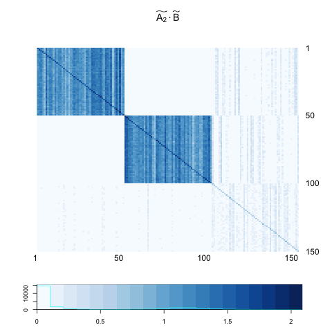
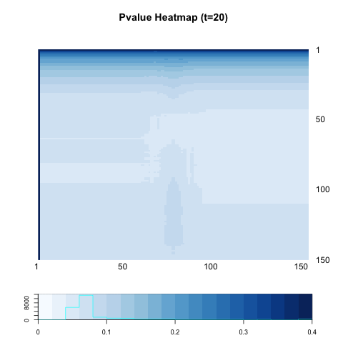

```{r echo=FALSE, message =FALSE, warning = FALSE}
library(igraph)
library(RefManageR)
library(xtable)
library(grid)
library(ggplot2)
library(png)
library(grid)
library(knitr)
bib <- ReadBib(system.file("Bib", "biblatexExamples.bib", 
                           package = "RefManageR"), check = FALSE)
BibOptions(check.entries = FALSE, style = "markdown", bib.style = "alphabetic", cite.style = 'alphabetic')
```


- [Graph Generation](# Graph Generation)

- [Flow Chart](# Flow Chart)

- [Power Heatmap](# Power Heatmap)

- [Interpretation](# Interpretation)

## Graph Generation
<a name=" Graph Generation"/>

Set $n=150$ ; $p = 0.30$ ; $q = s =  r = 0.05; \omega= 0.15.$

$$X_{i} = \left\{ \begin{array}{ll}  Bern(0.35) & i \in \mbox{ block 1 } \\ Bern(0.65) & i \in \mbox{ block 2} \\ Bern(0.50) &   i \in \mbox{ block 3} \end{array} \right.$$


$$Adj_{G} = \left[  \begin{array}{c|c|c} 0.30 & 0.05  & 0.05 \\ \hline 0.05 & 0.30 & 0.05 \\ \hline 0.05 & 0.05 & 0.30 \end{array} \right]$$


```{r, out.width = 400, out.height = 400, echo = FALSE, fig.align='center', fig.show='hold', out.extra='style="float:left"'}

```
```{r, out.width = 400, out.height = 400, echo = FALSE, fig.align='center', fig.show='hold'}
knitr::include_graphics("../figure/local28_att.png")
```


## Flow Chart
<a name=" Flow Chart"/>

### t = 1

```{r, out.width = 200, out.height = 200, echo = FALSE, fig.align='center', fig.show='hold', out.extra='style="float:left"'}

```
```{r, out.width = 200, out.height = 200, echo = FALSE, fig.align='center', fig.show='hold', out.extra='style="float:left"'}

```
```{r, out.width = 200, out.height = 200, echo = FALSE, fig.align='center', fig.show='hold', out.extra='style="float:left"'}
knitr::include_graphics("../figure/local28_B.png")
```
```{r, out.width = 200, out.height = 200, echo = FALSE, fig.align='center', fig.show='hold', out.extra='style="float:left"'}

```


```{r, out.width = 300, out.height = 300, echo = FALSE, fig.align='center', fig.show='hold', out.extra='style="float:left"'}

```
```{r, out.width = 300, out.height = 300, echo = FALSE, fig.align='center', fig.show='hold'}

```

<hr />

```{r, out.width = 300, out.height = 300, echo = FALSE, fig.align='center', fig.show='hold', out.extra='style="float:left"'}

```
```{r, out.width = 300, out.height = 300, echo = FALSE, fig.align='center', fig.show='hold'}

```


### t = 2

```{r, out.width = 200, out.height = 200, echo = FALSE, fig.align='center', fig.show='hold', out.extra='style="float:left"'}

```
```{r, out.width = 200, out.height = 200, echo = FALSE, fig.align='center', fig.show='hold', out.extra='style="float:left"'}

```

```{r, out.width = 200, out.height = 200, echo = FALSE, fig.align='center', fig.show='hold', out.extra='style="float:left"'}
knitr::include_graphics("../figure/local28_B.png")
```
```{r, out.width = 200, out.height = 200, echo = FALSE, fig.align='center', fig.show='hold', out.extra='style="float:left"'}

```


<hr />

```{r, out.width = 300, out.height = 300, echo = FALSE, fig.align='center', fig.show='hold', out.extra='style="float:left"'}

```
```{r, out.width = 300, out.height = 300, echo = FALSE, fig.align='center', fig.show='hold'}

```

<hr />

```{r, out.width = 300, out.height = 300, echo = FALSE, fig.align='center', fig.show='hold', out.extra='style="float:left"'}

```
```{r, out.width = 300, out.height = 300, echo = FALSE, fig.align='center', fig.show='hold'}

```


### t = 5

```{r, out.width = 200, out.height = 200, echo = FALSE, fig.align='center', fig.show='hold', out.extra='style="float:left"'}

```
```{r, out.width = 200, out.height = 200, echo = FALSE, fig.align='center', fig.show='hold', out.extra='style="float:left"'}

```

```{r, out.width = 200, out.height = 200, echo = FALSE, fig.align='center', fig.show='hold', out.extra='style="float:left"'}
knitr::include_graphics("../figure/local28_B.png")
```
```{r, out.width = 200, out.height = 200, echo = FALSE, fig.align='center', fig.show='hold', out.extra='style="float:left"'}

```


<hr />

```{r, out.width = 300, out.height = 300, echo = FALSE, fig.align='center', fig.show='hold', out.extra='style="float:left"'}

```
```{r, out.width = 300, out.height = 300, echo = FALSE, fig.align='center', fig.show='hold'}

```

<hr />

```{r, out.width = 300, out.height = 300, echo = FALSE, fig.align='center', fig.show='hold', out.extra='style="float:left"'}

```
```{r, out.width = 300, out.height = 300, echo = FALSE, fig.align='center', fig.show='hold'}

```


### t = 10

```{r, out.width = 200, out.height = 200, echo = FALSE, fig.align='center', fig.show='hold', out.extra='style="float:left"'}

```
```{r, out.width = 200, out.height = 200, echo = FALSE, fig.align='center', fig.show='hold', out.extra='style="float:left"'}

```

```{r, out.width = 200, out.height = 200, echo = FALSE, fig.align='center', fig.show='hold', out.extra='style="float:left"'}
knitr::include_graphics("../figure/local28_B.png")
```
```{r, out.width = 200, out.height = 200, echo = FALSE, fig.align='center', fig.show='hold', out.extra='style="float:left"'}

```


<hr />

```{r, out.width = 300, out.height = 300, echo = FALSE, fig.align='center', fig.show='hold', out.extra='style="float:left"'}

```
```{r, out.width = 300, out.height = 300, echo = FALSE, fig.align='center', fig.show='hold'}

```

<hr />

```{r, out.width = 300, out.height = 300, echo = FALSE, fig.align='center', fig.show='hold', out.extra='style="float:left"'}

```
```{r, out.width = 300, out.height = 300, echo = FALSE, fig.align='center', fig.show='hold'}

```


### t = 20

```{r, out.width = 200, out.height = 200, echo = FALSE, fig.align='center', fig.show='hold', out.extra='style="float:left"'}

```
```{r, out.width = 200, out.height = 200, echo = FALSE, fig.align='center', fig.show='hold', out.extra='style="float:left"'}

```

```{r, out.width = 200, out.height = 200, echo = FALSE, fig.align='center', fig.show='hold', out.extra='style="float:left"'}
knitr::include_graphics("../figure/local28_B.png")
```
```{r, out.width = 200, out.height = 200, echo = FALSE, fig.align='center', fig.show='hold', out.extra='style="float:left"'}

```


<hr />

```{r, out.width = 300, out.height = 300, echo = FALSE, fig.align='center', fig.show='hold', out.extra='style="float:left"'}

```
```{r, out.width = 300, out.height = 300, echo = FALSE, fig.align='center', fig.show='hold'}

```

<hr />

```{r, out.width = 300, out.height = 300, echo = FALSE, fig.align='center', fig.show='hold', out.extra='style="float:left"'}

```
```{r, out.width = 300, out.height = 300, echo = FALSE, fig.align='center', fig.show='hold'}

```


## Power Heatmap
<a name=" Power Heatmap"/>


```{r, out.width = 300, out.height = 300, echo = FALSE, fig.align='center', fig.show='hold', out.extra='style="float:left"'}

```
```{r, out.width = 300, out.height = 300, echo = FALSE, fig.align='center', fig.show='hold', out.extra='style="float:left"'}

```
```{r, out.width = 300, out.height = 300, echo = FALSE, fig.align='center', fig.show='hold'}

```

```{r, out.width = 300, out.height = 300, echo = FALSE, fig.align='center', fig.show='hold', out.extra='style="float:left"'}

```
```{r, out.width = 300, out.height = 300, echo = FALSE, fig.align='center', fig.show='hold'}

```


```{r echo = FALSE, results='asis'}
a <- c(0.6833333, 0.7433333, 0.7666667, 0.7266667, 0.6533333)
b <- c(0.7033333, 0.7833333, 0.7666667, 0.7866667, 0.7400000)

table <- matrix(0, nrow = 2, ncol = 5)
rownames(table) <- c("global test", "local optimal")
colnames(table) <- c("t=1", "t=2", "t=5", "t=10", "t=20")
table[1,] <- a
table[2,] <- b
table <- as.data.frame(table)
kable(table, align = 'c', digits = 2)
```

## Interpretation
<a name=" Interpretation"/>

