- [Sparse Network](# sparse)
- [Two Block 1](# two1)
- [Two Block 2](# two2)
- [Three Block Model](# three)


## Concerns about Sparse Network with attributes
<a name=" sparse"/>


  Under SBM, we assume that all nodes within the same block have the same expected degree. However, the block model is limited by this assumption and provides a poor fit to networks with hubs or highly varying node degrees within blocks or communities, which are common in practice. On the other hand, the Degree-Corrected Stochastic Blockmodel (CD- SBM) adds an additional set of parameter to control the node degrees. This model allows variation in node degrees within a block while preserving the overall block community structure. 
  
  
  
  For example, in our Two Block Simulation 2, let $\boldsymbol{B}$ be a 2 $\times$ 2 matrix, where 
  
  $$\boldsymbol{B} = \begin{bmatrix} p & q \\ q & p  \end{bmatrix}$$

Under DC-SBM, we add a parameter $\boldsymbol{\theta}$  : $\theta_{i}\theta_{j} \boldsymbol{B}_{ij} \in [0,1],$ with the constraint that within each block, the summation of $\theta_{i}$'s is 1. Karrer and Newman suggest imposing the constraint that, within each block, the summation of $\theta_{i}$'s is 1. However, If I set such constraint, the network is so sparse and in some simulations, there exists no edges in a network. Thus, for the first try, I set so no constraint on $\theta$ except for $\theta_{i} \overset{i.i.d}{\sim} Unif(0 , 1)$.


## Two Block 1
<a name=" two1"/>

### Two Block Model 1


$$X_{i} \overset{i.i.d}{\sim} Bern(0.5), i = 1,... , 100$$ 

$$\theta_{i} \overset{i.i.d}{\sim} Unif(0 , 1) $$


$$Z_{i}  \sim  \left\{  \begin{array}{cc} Bern(0.6) & X_{i} = 0 \\ Bern(0.4) & X_{i} = 1  \end{array} \right.$$


$$A_{z_{i}, z_{j}} \sim Bern \left[  \begin{array}{cc}   \color{red}{0.4} & 0.1  \\ 0.1 & \color{red}{0.4} \end{array}  \right]$$ 


$$\tilde{A}_{z_{i}, z_{j}} \sim Bern \left[  \begin{array}{cc}  \color{blue}{\theta_{z_{i}}\theta_{z_{j}} } \color{red}{0.4} & \color{blue}{\theta_{z_{i}}\theta_{z_{j}} }0.1  \\ \color{blue}{\theta_{z_{i}}\theta_{z_{j}} }0.1 & \color{blue}{\theta_{z_{i}}\theta_{z_{j}} } \color{red}{0.4} \end{array}  \right]$$


#### Degree Distribution of $G(A)$ vs. $H(\tilde{A})$


```{r, out.width = 400, out.height = 400, echo = FALSE, fig.align='center', fig.show='hold'}
knitr::include_graphics("../figure/dc441_degree.png")
```


#### Diffusion Distance of $G(A)$ vs. $H(\tilde{A})$

```{r, out.width = 300, out.height = 300, echo = FALSE, fig.align='center', fig.show='hold', out.extra='style="float:left"'}
knitr::include_graphics("../figure/T441_A1.png")
```
```{r, out.width = 300, out.height = 300, echo = FALSE, fig.align='center', fig.show='hold'}
knitr::include_graphics("../figure/dc441_A1.png")
```


```{r, out.width = 300, out.height = 300, echo = FALSE, fig.align='center', fig.show='hold', out.extra='style="float:left"'}
knitr::include_graphics("../figure/T441_A5.png")
```
```{r, out.width = 300, out.height = 300, echo = FALSE, fig.align='center', fig.show='hold'}
knitr::include_graphics("../figure/dc441_A5.png")
```


```{r, out.width = 300, out.height = 300, echo = FALSE, fig.align='center', fig.show='hold', out.extra='style="float:left"'}
knitr::include_graphics("../figure/T441_A20.png")
```
```{r, out.width = 300, out.height = 300, echo = FALSE, fig.align='center', fig.show='hold'}
knitr::include_graphics("../figure/dc441_A20.png")
```

#### Power Heatmap of $G(A)$ vs. $H(\tilde{A})$

Optimal Power drops approximately from 60$\%$ to 30$\%$.


```{r, out.width = 300, out.height = 300, echo = FALSE, fig.align='center', fig.show='hold', out.extra='style="float:left"'}
knitr::include_graphics("../figure/T441_power1.png")
```
```{r, out.width = 300, out.height = 300, echo = FALSE, fig.align='center', fig.show='hold'}
knitr::include_graphics("../figure/dc441_power1.png")
```


```{r, out.width = 300, out.height = 300, echo = FALSE, fig.align='center', fig.show='hold', out.extra='style="float:left"'}
knitr::include_graphics("../figure/T441_power5.png")
```
```{r, out.width = 300, out.height = 300, echo = FALSE, fig.align='center', fig.show='hold'}
knitr::include_graphics("../figure/dc441_power5.png")
```


```{r, out.width = 300, out.height = 300, echo = FALSE, fig.align='center', fig.show='hold', out.extra='style="float:left"'}
knitr::include_graphics("../figure/T441_power20.png")
```
```{r, out.width = 300, out.height = 300, echo = FALSE, fig.align='center', fig.show='hold'}
knitr::include_graphics("../figure/dc441_power20.png")
```


### Two Block Model 2

$$X_{i} \overset{i.i.d}{\sim} Bern(0.5), i = 1,... , 100$$ 

$$\theta_{i} \overset{i.i.d}{\sim} Unif(0 , 1) $$


$$Z_{i}  \sim  \left\{  \begin{array}{cc} Bern(0.6) & X_{i} = 0 \\ Bern(0.4) & X_{i} = 1  \end{array} \right.$$


$$A_{z_{i}, z_{j}} \sim Bern \left[  \begin{array}{cc}   \color{red}{0.4} & 0.1  \\ 0.1 & 0.1 \end{array}  \right]$$ 


$$\tilde{A}_{z_{i}, z_{j}} \sim Bern \left[  \begin{array}{cc}  \color{blue}{\theta_{z_{i}}\theta_{z_{j}} } \color{red}{0.4} & \color{blue}{\theta_{z_{i}}\theta_{z_{j}} }0.1  \\ \color{blue}{\theta_{z_{i}}\theta_{z_{j}} }0.1 & \color{blue}{\theta_{z_{i}}\theta_{z_{j}} } 0.1 \end{array}  \right]$$


#### Degree Distribution of $G(A)$ vs. $H(\tilde{A})$


```{r, out.width = 400, out.height = 400, echo = FALSE, fig.align='center', fig.show='hold'}
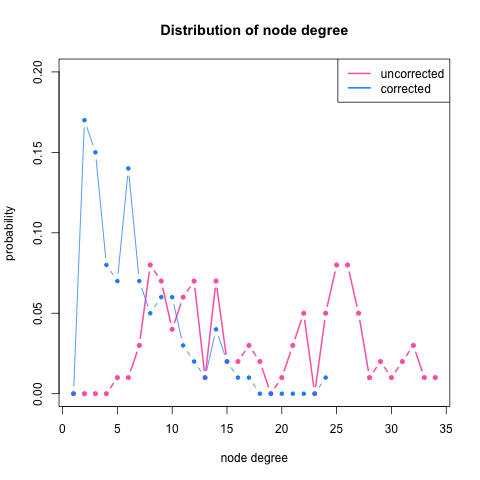
```


#### Diffusion Distance of $G(A)$ vs. $H(\tilde{A})$

```{r, out.width = 300, out.height = 300, echo = FALSE, fig.align='center', fig.show='hold', out.extra='style="float:left"'}
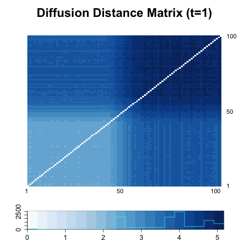
```
```{r, out.width = 300, out.height = 300, echo = FALSE, fig.align='center', fig.show='hold'}
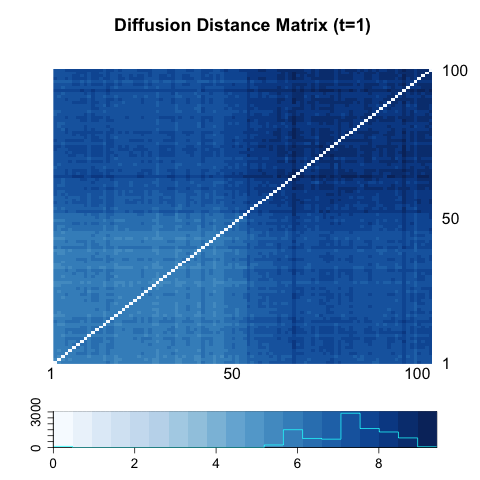
```


```{r, out.width = 300, out.height = 300, echo = FALSE, fig.align='center', fig.show='hold', out.extra='style="float:left"'}
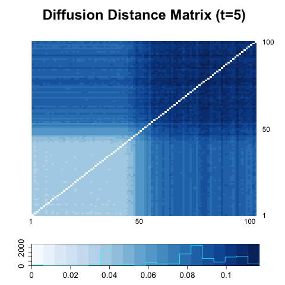
```
```{r, out.width = 300, out.height = 300, echo = FALSE, fig.align='center', fig.show='hold'}
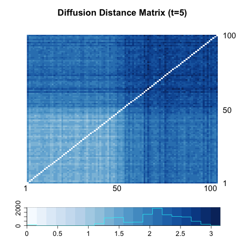
```


```{r, out.width = 300, out.height = 300, echo = FALSE, fig.align='center', fig.show='hold', out.extra='style="float:left"'}
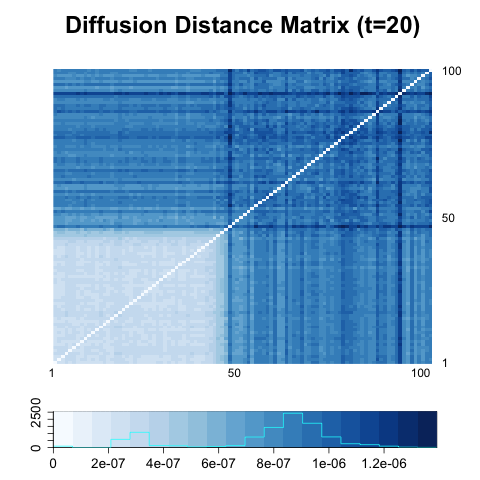
```
```{r, out.width = 300, out.height = 300, echo = FALSE, fig.align='center', fig.show='hold'}
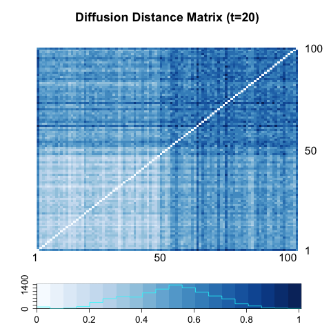
```

#### Power Heatmap of $G(A)$ vs. $H(\tilde{A})$

Optimal Power drops approximately from 45$\%$ to 15$\%$.


```{r, out.width = 300, out.height = 300, echo = FALSE, fig.align='center', fig.show='hold', out.extra='style="float:left"'}
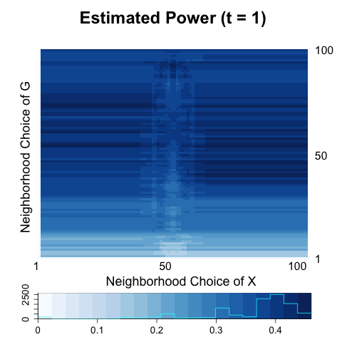
```
```{r, out.width = 300, out.height = 300, echo = FALSE, fig.align='center', fig.show='hold'}
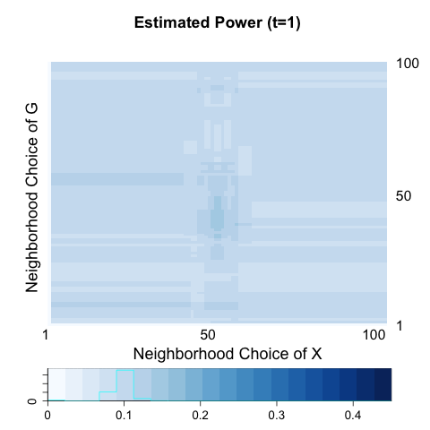
```


```{r, out.width = 300, out.height = 300, echo = FALSE, fig.align='center', fig.show='hold', out.extra='style="float:left"'}
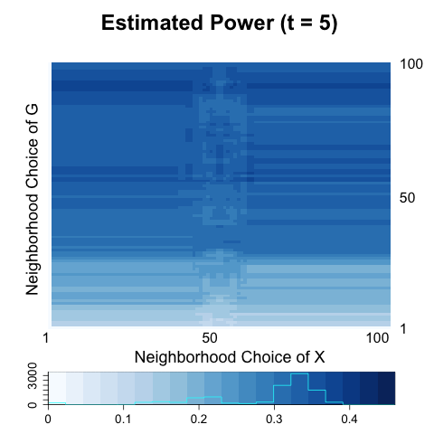
```
```{r, out.width = 300, out.height = 300, echo = FALSE, fig.align='center', fig.show='hold'}
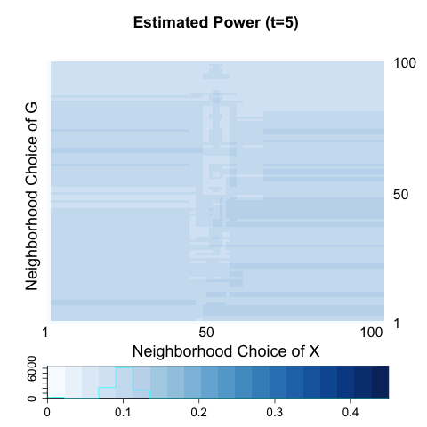
```


```{r, out.width = 300, out.height = 300, echo = FALSE, fig.align='center', fig.show='hold', out.extra='style="float:left"'}

```
```{r, out.width = 300, out.height = 300, echo = FALSE, fig.align='center', fig.show='hold'}
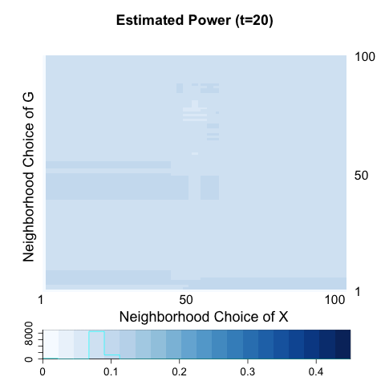
```


In the corresponding three block model, the esimated power across diffusion process was almost 0.05. The plot of degree distribution tells us that using $\tilde{A}$ instead of $A$ does not give variability of vertex degree but just decreases the density of network at about 1/4.

[X Yan et al.](http://iopscience.iop.org/article/10.1088/1742-5468/2014/05/P05007/meta) suggest using another constraint in constructing CD-SBM. The likelihood hold stays the same if we increase $\theta_{i}$ by the same factor $c$ for all nodes in each block. In their paper, they put the constraint of $\sum\limits_{u : z_{u} = r} \theta_{u} = \sum\limits_{u : z_{u} = r} d_{u},$ which indicates that sum of $\theta_{u}$ within block is the total degree within each block. However, in this case the average number of number of edges increases as well as the variability of edge distributions increases. 

I propose generating degree-corrected graph using $\theta_{i} \overset{i.i.d}{\sim} Unif(0 , 2)$, so that $E(\theta_{i} \theta_{j} a_{ij}) = E(\theta_{i})E(\theta_{j})E(a_{ij}) = E(a_{ij})$. Since $\theta_{i}$ could be greater than 1, it is also possible that $\theta_{i} \theta_{j} a_{ij} > 1$. In the previous, degree-corrected model, $\tilde{A}_{z_{i}, z_{j}} \sim Bern(\theta_{z_{i}} \theta_{z_{j}} p(z_{i}, z_{j}))$ so that $G(\tilde{A})$ is an unweighted graph. Now I am considering a weighted graph of which weight for each edge is generated from a Poisson distribution with a mean of $\theta_{z_{i}} \theta_{z_{j}} p(z_{i}, z_{j})$.

Note that in that case, the variance of an adjacency matrix is ALWAYS higher than the uncorrected ones. Edge weights can be taken account in testing through a differently defined transition matrix:

$$P[i,j] = \frac{\mbox{Number of edges between i and j}}{\mbox{Degree of node i}}$$


## Two Block 2
<a name=" two2"/>


### Two Block Model 1


$$X_{i} \overset{i.i.d}{\sim} Bern(0.5), i = 1,... , 100$$ 

$$\theta_{i} \overset{i.i.d}{\sim} Unif(0 , \color{red}{2}) $$


$$Z_{i}  \sim  \left\{  \begin{array}{cc} Bern(0.6) & X_{i} = 0 \\ Bern(0.4) & X_{i} = 1  \end{array} \right.$$


$$A_{z_{i}, z_{j}} \sim Bern \left[  \begin{array}{cc}   \color{red}{0.4} & 0.1  \\ 0.1 & \color{red}{0.4} \end{array}  \right]$$ 


$$\tilde{A}_{z_{i}, z_{j}} \sim \color{red}{Poisson} \left[  \begin{array}{cc}  \color{blue}{\theta_{z_{i}}\theta_{z_{j}} } \color{red}{0.4} & \color{blue}{\theta_{z_{i}}\theta_{z_{j}} }0.1  \\ \color{blue}{\theta_{z_{i}}\theta_{z_{j}} }0.1 & \color{blue}{\theta_{z_{i}}\theta_{z_{j}} } \color{red}{0.4} \end{array}  \right]$$

#### Degree Distribution of $G(A)$ vs. $H(\tilde{A})$


```{r, out.width = 400, out.height = 400, echo = FALSE, fig.align='center', fig.show='hold'}
knitr::include_graphics("../figure/dc441_degree.png")
```


#### Diffusion Distance of $G(A)$ vs. $H(\tilde{A})$

```{r, out.width = 300, out.height = 300, echo = FALSE, fig.align='center', fig.show='hold', out.extra='style="float:left"'}
knitr::include_graphics("../figure/T441_A1.png")
```
```{r, out.width = 300, out.height = 300, echo = FALSE, fig.align='center', fig.show='hold'}
knitr::include_graphics("../figure/redc441_A1.png")
```


```{r, out.width = 300, out.height = 300, echo = FALSE, fig.align='center', fig.show='hold', out.extra='style="float:left"'}
knitr::include_graphics("../figure/T441_A5.png")
```
```{r, out.width = 300, out.height = 300, echo = FALSE, fig.align='center', fig.show='hold'}
knitr::include_graphics("../figure/redc441_A5.png")
```


```{r, out.width = 300, out.height = 300, echo = FALSE, fig.align='center', fig.show='hold', out.extra='style="float:left"'}
knitr::include_graphics("../figure/T441_A20.png")
```
```{r, out.width = 300, out.height = 300, echo = FALSE, fig.align='center', fig.show='hold'}
knitr::include_graphics("../figure/redc441_A20.png")
```


#### Power Heatmap of $G(A)$ vs. $H(\tilde{A})$


```{r, out.width = 300, out.height = 300, echo = FALSE, fig.align='center', fig.show='hold', out.extra='style="float:left"'}
knitr::include_graphics("../figure/T441_power1.png")
```
```{r, out.width = 300, out.height = 300, echo = FALSE, fig.align='center', fig.show='hold'}
knitr::include_graphics("../figure/redc441_power1.png")
```


```{r, out.width = 300, out.height = 300, echo = FALSE, fig.align='center', fig.show='hold', out.extra='style="float:left"'}
knitr::include_graphics("../figure/T441_power5.png")
```
```{r, out.width = 300, out.height = 300, echo = FALSE, fig.align='center', fig.show='hold'}
knitr::include_graphics("../figure/redc441_power5.png")
```


```{r, out.width = 300, out.height = 300, echo = FALSE, fig.align='center', fig.show='hold', out.extra='style="float:left"'}
knitr::include_graphics("../figure/T441_power20.png")
```
```{r, out.width = 300, out.height = 300, echo = FALSE, fig.align='center', fig.show='hold'}
knitr::include_graphics("../figure/redc441_power20.png")
```


### Two Block Model 2

$$X_{i} \overset{i.i.d}{\sim} Bern(0.5), i = 1,... , 100$$ 

$$\theta_{i} \overset{i.i.d}{\sim} Unif(0 , \color{red}{2}) $$


$$Z_{i}  \sim  \left\{  \begin{array}{cc} Bern(0.6) & X_{i} = 0 \\ Bern(0.4) & X_{i} = 1  \end{array} \right.$$


$$A_{z_{i}, z_{j}} \sim Bern \left[  \begin{array}{cc}   \color{red}{0.4} & 0.1  \\ 0.1 & 0.1 \end{array}  \right]$$ 


$$\tilde{A}_{z_{i}, z_{j}} \sim \color{red}{Poisson} \left[  \begin{array}{cc}  \color{blue}{\theta_{z_{i}}\theta_{z_{j}} } \color{red}{0.4} & \color{blue}{\theta_{z_{i}}\theta_{z_{j}} }0.1  \\ \color{blue}{\theta_{z_{i}}\theta_{z_{j}} }0.1 & \color{blue}{\theta_{z_{i}}\theta_{z_{j}} } 0.1 \end{array}  \right]$$


#### Degree Distribution of $G(A)$ vs. $H(\tilde{A})$


```{r, out.width = 400, out.height = 400, echo = FALSE, fig.align='center', fig.show='hold'}
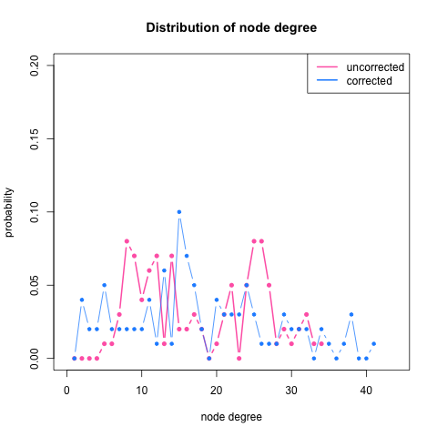
```


#### Diffusion Distance of $G(A)$ vs. $H(\tilde{A})$

```{r, out.width = 300, out.height = 300, echo = FALSE, fig.align='center', fig.show='hold', out.extra='style="float:left"'}

```
```{r, out.width = 300, out.height = 300, echo = FALSE, fig.align='center', fig.show='hold'}
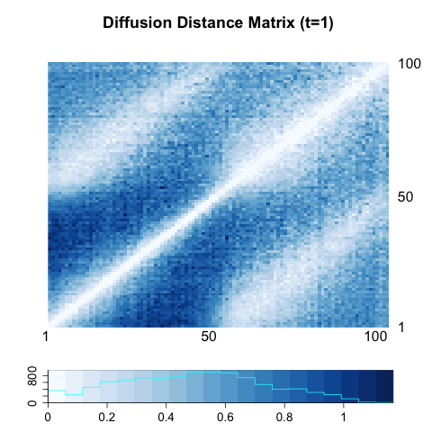
```


```{r, out.width = 300, out.height = 300, echo = FALSE, fig.align='center', fig.show='hold', out.extra='style="float:left"'}

```
```{r, out.width = 300, out.height = 300, echo = FALSE, fig.align='center', fig.show='hold'}
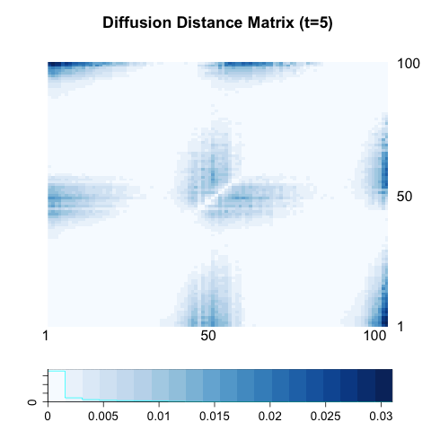
```


```{r, out.width = 300, out.height = 300, echo = FALSE, fig.align='center', fig.show='hold', out.extra='style="float:left"'}

```
```{r, out.width = 300, out.height = 300, echo = FALSE, fig.align='center', fig.show='hold'}
knitr::include_graphics("../figure/redc441_A20.png")
```

#### Power Heatmap of $G(A)$ vs. $H(\tilde{A})$


```{r, out.width = 300, out.height = 300, echo = FALSE, fig.align='center', fig.show='hold', out.extra='style="float:left"'}

```
```{r, out.width = 300, out.height = 300, echo = FALSE, fig.align='center', fig.show='hold'}
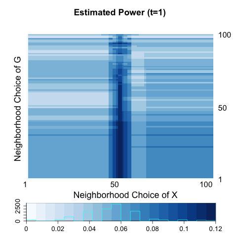
```


```{r, out.width = 300, out.height = 300, echo = FALSE, fig.align='center', fig.show='hold', out.extra='style="float:left"'}

```
```{r, out.width = 300, out.height = 300, echo = FALSE, fig.align='center', fig.show='hold'}
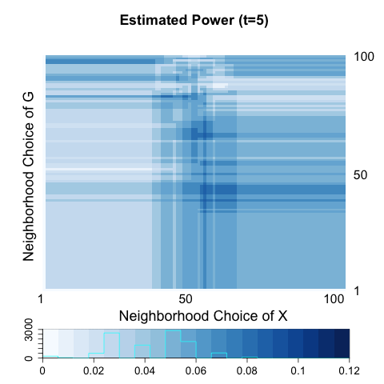
```


```{r, out.width = 300, out.height = 300, echo = FALSE, fig.align='center', fig.show='hold', out.extra='style="float:left"'}

```
```{r, out.width = 300, out.height = 300, echo = FALSE, fig.align='center', fig.show='hold'}
knitr::include_graphics("../figure/redc441_power20.png")
```


## Three Block Model
<a name=" three"/>

### Three Block Model 1


$$X_{i} \overset{i.i.d}{\sim} Multi(1/3, 1/3, 1/3), i = 1,... , 150$$ 

$$\theta_{i} \overset{i.i.d}{\sim} Unif(0 , 1) $$


$$Z_{i}  \sim   \left\{  \begin{array}{cc} Multi(\color{red}{0.5}, 0.25, 0.25 ) & X = 1 \\ Multi(0.25, \color{red}{0.5}, 0.25  ) & X = 2 \\ Multi(0.25, 0.25, \color{red}{0.5} ) & X = 3 \end{array} \right.$$


$$A_{z_{i}, z_{j}} \sim Bern \left[ \begin{array}{cc} \color{red}{0.5} & 0.3 & 0.3  \\ 0.3 & \color{red}{0.5} & 0.3  \\ 0.3 & 0.3 & 0.3  \end{array}  \right]$$ 


$$\tilde{A}_{z_{i}, z_{j}} \sim Bern \left[  \begin{array}{cc}  \color{blue}{\theta_{z_{i}}\theta_{z_{j}} } \color{red}{0.5} & \color{blue}{\theta_{z_{i}}\theta_{z_{j}} }0.3 & \color{blue}{\theta_{z_{i}}\theta_{z_{j}} }0.3   \\ \color{blue}{\theta_{z_{i}}\theta_{z_{j}} }0.3 & \color{blue}{\theta_{z_{i}}\theta_{z_{j}} } \color{red}{0.5} & \color{blue}{\theta_{z_{i}}\theta_{z_{j}} }0.3 \\  \color{blue}{\theta_{z_{i}}\theta_{z_{j}} }0.3 & \color{blue}{\theta_{z_{i}}\theta_{z_{j}} }0.3 & \color{blue}{\theta_{z_{i}}\theta_{z_{j}} }\color{red}{0.5} \end{array}  \right]$$

#### Degree Distribution of $G(A)$ vs. $H(\tilde{A})$

averaged over 100 independent networks.


#### Diffusion Distance of $G(A)$ vs. $H(\tilde{A})$


#### Power Heatmap of $G(A)$ vs. $H(\tilde{A})$

80 $\%$ to 10 $\%$


