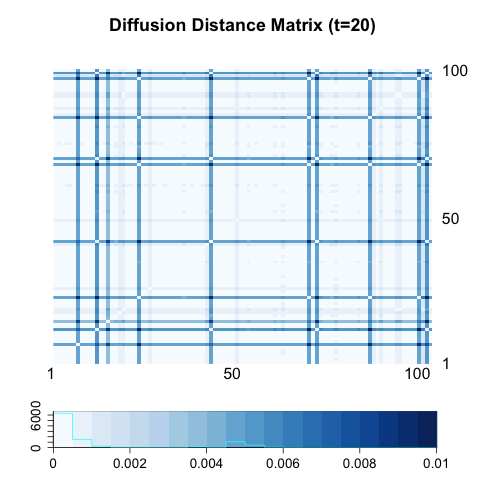
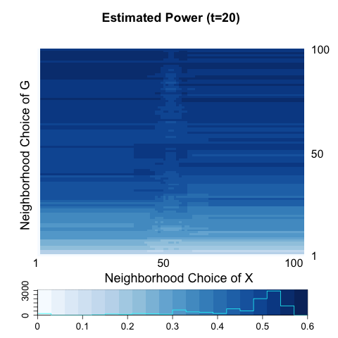
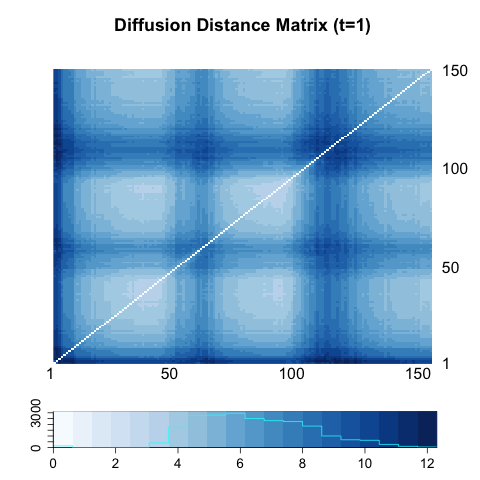

- [Sparse Network](# sparse)
- [Two Block 1](# two1)
- [Two Block 2](# two2)
- [Two Block 3](# two3)
- [Three Block Model](# three)


## Concerns about Sparse Network with attributes
<a name=" sparse"/>


  Under SBM, we assume that all nodes within the same block have the same expected degree. However, this block model is limited by homogeneous distribution within block and provides a poor fit to networks with hubs or highly varying node degrees within blocks or communities, which are common in practice. On the other hand, the Degree-Corrected Stochastic Blockmodel (CD- SBM) adds an additional set of parameter, often denoted by $\theta$, to control the node degrees. This model allows variation in node degrees within a block while preserving the overall block community structure. 
  
  
  
  For example, in our Two Block Simulation 2, let $\boldsymbol{A}$ be a block matrix, where 
  
  $$\boldsymbol{A} = \begin{bmatrix} p & q \\ q & p  \end{bmatrix}$$

Under DC-SBM, we add a parameter $\boldsymbol{\theta}$  : $\theta_{i}\theta_{j} \boldsymbol{A}_{ij} \in [0,1],$ with the constraint that within each block, the summation of $\theta_{i}$'s is 1 (Karrer and Newman). However, If I set such constraint, the network is so sparse and in some simulations, there exists no edges in a network. Thus, for the first try, I set so no constraint on $\theta$ except for $\theta_{i} \overset{i.i.d}{\sim} Unif(0 , 1)$.


## Two Block 1
<a name=" two1"/>

### Two Block Model 1


$$X_{i} \overset{i.i.d}{\sim} Bern(0.5), i = 1,... , 100$$ 

$$\theta_{i} \overset{i.i.d}{\sim} Unif(0 , 1) $$


$$Z_{i}  \sim  \left\{  \begin{array}{cc} Bern(0.6) & X_{i} = 0 \\ Bern(0.4) & X_{i} = 1  \end{array} \right.$$


$$A_{z_{i}, z_{j}} \sim Bern \left[  \begin{array}{cc}   \color{red}{0.4} & 0.1  \\ 0.1 & \color{red}{0.4} \end{array}  \right]$$ 


$$\tilde{A}_{z_{i}, z_{j}} \sim Bern \left[  \begin{array}{cc}  \color{blue}{\theta_{z_{i}}\theta_{z_{j}} } \color{red}{0.4} & \color{blue}{\theta_{z_{i}}\theta_{z_{j}} }0.1  \\ \color{blue}{\theta_{z_{i}}\theta_{z_{j}} }0.1 & \color{blue}{\theta_{z_{i}}\theta_{z_{j}} } \color{red}{0.4} \end{array}  \right]$$


#### Degree Distribution of $G(A)$ vs. $H(\tilde{A})$


```{r, out.width = 400, out.height = 400, echo = FALSE, fig.align='center', fig.show='hold'}

```


#### Diffusion Distance of $G(A)$ vs. $H(\tilde{A})$

```{r, out.width = 300, out.height = 300, echo = FALSE, fig.align='center', fig.show='hold', out.extra='style="float:left"'}
knitr::include_graphics("../figure/T441_A1.png")
```
```{r, out.width = 300, out.height = 300, echo = FALSE, fig.align='center', fig.show='hold'}

```


```{r, out.width = 300, out.height = 300, echo = FALSE, fig.align='center', fig.show='hold', out.extra='style="float:left"'}
knitr::include_graphics("../figure/T441_A5.png")
```
```{r, out.width = 300, out.height = 300, echo = FALSE, fig.align='center', fig.show='hold'}
knitr::include_graphics("../figure/dc441_A5.png")
```


```{r, out.width = 300, out.height = 300, echo = FALSE, fig.align='center', fig.show='hold', out.extra='style="float:left"'}

```
```{r, out.width = 300, out.height = 300, echo = FALSE, fig.align='center', fig.show='hold'}
knitr::include_graphics("../figure/dc441_A20.png")
```

#### Power Heatmap of $G(A)$ vs. $H(\tilde{A})$

Optimal Power drops approximately from 60$\%$ to 30$\%$.


```{r, out.width = 300, out.height = 300, echo = FALSE, fig.align='center', fig.show='hold', out.extra='style="float:left"'}
knitr::include_graphics("../figure/T441_power1.png")
```
```{r, out.width = 300, out.height = 300, echo = FALSE, fig.align='center', fig.show='hold'}
knitr::include_graphics("../figure/dc441_power1.png")
```


```{r, out.width = 300, out.height = 300, echo = FALSE, fig.align='center', fig.show='hold', out.extra='style="float:left"'}
knitr::include_graphics("../figure/T441_power5.png")
```
```{r, out.width = 300, out.height = 300, echo = FALSE, fig.align='center', fig.show='hold'}
knitr::include_graphics("../figure/dc441_power5.png")
```


```{r, out.width = 300, out.height = 300, echo = FALSE, fig.align='center', fig.show='hold', out.extra='style="float:left"'}

```
```{r, out.width = 300, out.height = 300, echo = FALSE, fig.align='center', fig.show='hold'}

```


<hr />

The plot of degree distribution tells us that using $\tilde{A}$ instead of $A$ does not give variability in vertex degree but just decreases the density of network at about 1/4.

[X Yan et al.](http://iopscience.iop.org/article/10.1088/1742-5468/2014/05/P05007/meta) suggest using another constraint in constructing CD-SBM. The likelihood hold stays the same if we increase $\theta_{i}$ by the same factor $c$ for all nodes in each block. In their paper, they put the constraint of $\sum\limits_{u : z_{u} = r} \theta_{u} = \sum\limits_{u : z_{u} = r} d_{u},$ which indicates that sum of $\theta_{u}$ within block is the total degree within each block. However, in this case the average number of edges increases as well as the variability of edge distributions increases. 

I propose generating degree-corrected graph using $\theta_{i} \overset{i.i.d}{\sim} Unif(0 , 2)$, so that $E(\theta_{i} \theta_{j} a_{ij}) = E(\theta_{i})E(\theta_{j})E(a_{ij}) = E(a_{ij})$. Since $\theta_{i}$ could be greater than 1, it is also possible that $\theta_{i} \theta_{j} a_{ij} > 1$. 

In [Two Block 2](# two2), $\tilde{A}_{z_{i},z_{j}} \sim Bern \left( min(1, \theta_{z_{i}} \theta_{z_{j}} a(z_{i}, z_{j}) ) \right)$

In [Two Block 3](# two3),  $\tilde{A}_{z_{i},z_{j}} \sim Poisson \left( \theta_{z_{i}} \theta_{z_{j}} a(z_{i}, z_{j}) \right)$ and generate a weighted network. However, in transition matrix I use a binary adjacency matrix instead of taking into account edge weights. 


## Two Block 2
<a name=" two2"/>


$$X_{i} \overset{i.i.d}{\sim} Bern(0.5), i = 1,... , 100$$ 

$$\theta_{i} \overset{i.i.d}{\sim} Unif(0 , \color{red}{2}) $$


$$Z_{i}  \sim  \left\{  \begin{array}{cc} Bern(0.6) & X_{i} = 0 \\ Bern(0.4) & X_{i} = 1  \end{array} \right.$$


$$A_{z_{i}, z_{j}} \sim Bern \left[  \begin{array}{cc}   \color{red}{0.4} & 0.1  \\ 0.1 & \color{red}{0.4} \end{array}  \right]$$ 


$$\tilde{A}_{z_{i}, z_{j}} \sim Bern \left\{ min \left(  \left[  \begin{array}{cc}  \color{blue}{\theta_{z_{i}}\theta_{z_{j}} } \color{red}{0.4} & \color{blue}{\theta_{z_{i}}\theta_{z_{j}} }0.1  \\ \color{blue}{\theta_{z_{i}}\theta_{z_{j}} }0.1 & \color{blue}{\theta_{z_{i}}\theta_{z_{j}} } \color{red}{0.4} \end{array}  \right] , \left[ \begin{array}{cc} 1 & 1 \\ 1 & 1 \end{array}  \right]   \right) \right\}$$

#### Degree Distribution of $G(A)$ vs. $H(\tilde{A})$


```{r, out.width = 400, out.height = 400, echo = FALSE, fig.align='center', fig.show='hold'}

```


#### Diffusion Distance of $G(A)$ vs. $H(\tilde{A})$

```{r, out.width = 300, out.height = 300, echo = FALSE, fig.align='center', fig.show='hold', out.extra='style="float:left"'}
knitr::include_graphics("../figure/T441_A1.png")
```
```{r, out.width = 300, out.height = 300, echo = FALSE, fig.align='center', fig.show='hold'}

```


```{r, out.width = 300, out.height = 300, echo = FALSE, fig.align='center', fig.show='hold', out.extra='style="float:left"'}
knitr::include_graphics("../figure/T441_A5.png")
```
```{r, out.width = 300, out.height = 300, echo = FALSE, fig.align='center', fig.show='hold'}

```


```{r, out.width = 300, out.height = 300, echo = FALSE, fig.align='center', fig.show='hold', out.extra='style="float:left"'}

```
```{r, out.width = 300, out.height = 300, echo = FALSE, fig.align='center', fig.show='hold'}

```


#### Power Heatmap of $G(A)$ vs. $H(\tilde{A})$


```{r, out.width = 300, out.height = 300, echo = FALSE, fig.align='center', fig.show='hold', out.extra='style="float:left"'}
knitr::include_graphics("../figure/T441_power1.png")
```
```{r, out.width = 300, out.height = 300, echo = FALSE, fig.align='center', fig.show='hold'}

```


```{r, out.width = 300, out.height = 300, echo = FALSE, fig.align='center', fig.show='hold', out.extra='style="float:left"'}
knitr::include_graphics("../figure/T441_power5.png")
```
```{r, out.width = 300, out.height = 300, echo = FALSE, fig.align='center', fig.show='hold'}

```


```{r, out.width = 300, out.height = 300, echo = FALSE, fig.align='center', fig.show='hold', out.extra='style="float:left"'}

```
```{r, out.width = 300, out.height = 300, echo = FALSE, fig.align='center', fig.show='hold'}

```


## Two Block 3
<a name=" two2"/>


$$X_{i} \overset{i.i.d}{\sim} Bern(0.5), i = 1,... , 100$$ 

$$\theta_{i} \overset{i.i.d}{\sim} Unif(0 , \color{red}{2}) $$


$$Z_{i}  \sim  \left\{  \begin{array}{cc} Bern(0.6) & X_{i} = 0 \\ Bern(0.4) & X_{i} = 1  \end{array} \right.$$


$$A_{z_{i}, z_{j}} \sim Bern \left[  \begin{array}{cc}   \color{red}{0.4} & 0.1  \\ 0.1 & \color{red}{0.4} \end{array}  \right]$$ 


$$\tilde{A}_{z_{i}, z_{j}} \sim \color{red}{Poisson} \left[  \begin{array}{cc}  \color{blue}{\theta_{z_{i}}\theta_{z_{j}} } \color{red}{0.4} & \color{blue}{\theta_{z_{i}}\theta_{z_{j}} }0.1  \\ \color{blue}{\theta_{z_{i}}\theta_{z_{j}} }0.1 & \color{blue}{\theta_{z_{i}}\theta_{z_{j}} } \color{red}{0.4} \end{array}  \right]$$

#### Degree Distribution of $G(A)$ vs. $H(\tilde{A})$


```{r, out.width = 400, out.height = 400, echo = FALSE, fig.align='center', fig.show='hold'}

```


#### Diffusion Distance of $G(A)$ vs. $H(\tilde{A})$

```{r, out.width = 300, out.height = 300, echo = FALSE, fig.align='center', fig.show='hold', out.extra='style="float:left"'}
knitr::include_graphics("../figure/T441_A1.png")
```
```{r, out.width = 300, out.height = 300, echo = FALSE, fig.align='center', fig.show='hold'}

```


```{r, out.width = 300, out.height = 300, echo = FALSE, fig.align='center', fig.show='hold', out.extra='style="float:left"'}
knitr::include_graphics("../figure/T441_A5.png")
```
```{r, out.width = 300, out.height = 300, echo = FALSE, fig.align='center', fig.show='hold'}

```


```{r, out.width = 300, out.height = 300, echo = FALSE, fig.align='center', fig.show='hold', out.extra='style="float:left"'}

```
```{r, out.width = 300, out.height = 300, echo = FALSE, fig.align='center', fig.show='hold'}

```


#### Power Heatmap of $G(A)$ vs. $H(\tilde{A})$


```{r, out.width = 300, out.height = 300, echo = FALSE, fig.align='center', fig.show='hold', out.extra='style="float:left"'}
knitr::include_graphics("../figure/T441_power1.png")
```
```{r, out.width = 300, out.height = 300, echo = FALSE, fig.align='center', fig.show='hold'}

```


```{r, out.width = 300, out.height = 300, echo = FALSE, fig.align='center', fig.show='hold', out.extra='style="float:left"'}
knitr::include_graphics("../figure/T441_power5.png")
```
```{r, out.width = 300, out.height = 300, echo = FALSE, fig.align='center', fig.show='hold'}

```


```{r, out.width = 300, out.height = 300, echo = FALSE, fig.align='center', fig.show='hold', out.extra='style="float:left"'}

```
```{r, out.width = 300, out.height = 300, echo = FALSE, fig.align='center', fig.show='hold'}

```


For both [Two Block 2](# two2) and [Two Block 3](# two3), averaged diffusion distance matrix over 100 independent networks lost distinct block patterns. This might be due to the increased variability between networks. Estimated power at t=1 for both cases, does not work as good as uncorrected SBM, but beyond diffusion time t=5, optimal power in corrected SBM works pretty well (about 5 $\%$ behind than uncorrected SBM). 

\bigskip

However, that is not all the cases. In three block case below, when between-block and within-block probabilities are similar and both are relatively high, degree-corrected one performs bad. Maybe that might be due to the increased number of nodes($n=100$ to $n=150$), which increases variability in degree distribution. 


## Three Block
<a name=" three"/>


$$X_{i}  \overset{i.i.d}{\sim} Multi(1/3, 1/3, 1/3), i = 1,..., 150$$

$$\theta_{i} \overset{i.i.d}{\sim} Unif(0 , \color{red}{2})$$

$$Z_{i} \overset{i.i.d}{\sim}   \left\{  \begin{array}{cc} Multi(\color{red}{0.5}, 0.25, 0.25 ) & X_{i} = 1 \\ Multi(0.25, \color{red}{0.5}, 0.25  ) & X_{i} = 2 \\ Multi(0.25, 0.25, \color{red}{0.5} ) & X_{i} = 3 \end{array} \right.$$

 $$A_{z_{i}, z_{j}} \sim Bern \left[  \begin{array}{cc} \color{red}{0.5} & 0.3 & 0.3  \\ 0.3 & \color{red}{0.5} & 0.3  \\ 0.3 & 0.3 & \color{red}{0.5}   \end{array}  \right]$$


$$\tilde{A}_{z_{i}, z_{j}} \sim Bern \left\{ min \left(  \left[  \begin{array}{cc}  \color{blue}{\theta_{z_{i}}\theta_{z_{j}} } \color{red}{0.5} & \color{blue}{\theta_{z_{i}}\theta_{z_{j}} }0.3 & \color{blue}{\theta_{z_{i}}\theta_{z_{j}} }0.3  \\ \color{blue}{\theta_{z_{i}}\theta_{z_{j}} }0.3 & \color{blue}{\theta_{z_{i}}\theta_{z_{j}} } \color{red}{0.5} & \color{blue}{\theta_{z_{i}}\theta_{z_{j}} }0.3  \\ \color{blue}{\theta_{z_{i}}\theta_{z_{j}} }0.3 & \color{blue}{\theta_{z_{i}}\theta_{z_{j}} }0.3 & \color{blue}{\theta_{z_{i}}\theta_{z_{j}} }\color{red}{0.5} \end{array}  \right] , \left[ \begin{array}{cc} 1 & 1 & 1 \\ 1 & 1 & 1 \\ 1 & 1 & 1 \end{array}  \right]   \right) \right\}$$

#### Degree Distribution of $G(A)$ vs. $H(\tilde{A})$


```{r, out.width = 400, out.height = 400, echo = FALSE, fig.align='center', fig.show='hold'}

```


#### Diffusion Distance of $G(A)$ vs. $H(\tilde{A})$

```{r, out.width = 300, out.height = 300, echo = FALSE, fig.align='center', fig.show='hold', out.extra='style="float:left"'}

```
```{r, out.width = 300, out.height = 300, echo = FALSE, fig.align='center', fig.show='hold'}

```


```{r, out.width = 300, out.height = 300, echo = FALSE, fig.align='center', fig.show='hold', out.extra='style="float:left"'}

```
```{r, out.width = 300, out.height = 300, echo = FALSE, fig.align='center', fig.show='hold'}

```


```{r, out.width = 300, out.height = 300, echo = FALSE, fig.align='center', fig.show='hold', out.extra='style="float:left"'}

```
```{r, out.width = 300, out.height = 300, echo = FALSE, fig.align='center', fig.show='hold'}

```


#### Power Heatmap of $G(A)$ vs. $H(\tilde{A})$


```{r, out.width = 300, out.height = 300, echo = FALSE, fig.align='center', fig.show='hold', out.extra='style="float:left"'}

```
```{r, out.width = 300, out.height = 300, echo = FALSE, fig.align='center', fig.show='hold'}

```


```{r, out.width = 300, out.height = 300, echo = FALSE, fig.align='center', fig.show='hold', out.extra='style="float:left"'}

```
```{r, out.width = 300, out.height = 300, echo = FALSE, fig.align='center', fig.show='hold'}

```


```{r, out.width = 300, out.height = 300, echo = FALSE, fig.align='center', fig.show='hold', out.extra='style="float:left"'}

```
```{r, out.width = 300, out.height = 300, echo = FALSE, fig.align='center', fig.show='hold'}

```


## Adjusting probabilities

### Two Block

$$X_{i} \overset{i.i.d}{\sim} Bern(0.5), i = 1,... , 100$$ 

$$\theta_{i} \overset{i.i.d}{\sim} Unif(0 , \color{red}{2}) $$


$$Z_{i}  \sim  \left\{  \begin{array}{cc} Bern(0.6) & X_{i} = 0 \\ Bern(0.4) & X_{i} = 1  \end{array} \right.$$


$$A_{z_{i}, z_{j}} \sim Bern \left[  \begin{array}{cc}   \color{red}{0.20} & 0.05  \\ 0.05 & \color{red}{0.20} \end{array}  \right]$$ 


$$\tilde{A}_{z_{i}, z_{j}} \sim \color{red}{Poisson} \left[  \begin{array}{cc}  \color{blue}{\theta_{z_{i}}\theta_{z_{j}} } \color{red}{0.20} & \color{blue}{\theta_{z_{i}}\theta_{z_{j}} }0.05  \\ \color{blue}{\theta_{z_{i}}\theta_{z_{j}} }0.05 & \color{blue}{\theta_{z_{i}}\theta_{z_{j}} } \color{red}{0.20} \end{array}  \right]$$


Note that $0 < A_{ij} < 1$ for all $i,j=1,..., 100.$


#### Degree Distribution of $G(A)$ vs. $H(\tilde{A})$


```{r, out.width = 400, out.height = 400, echo = FALSE, fig.align='center', fig.show='hold'}

```


#### Diffusion Distance of $G(A)$ vs. $H(\tilde{A})$

```{r, out.width = 300, out.height = 300, echo = FALSE, fig.align='center', fig.show='hold', out.extra='style="float:left"'}

```
```{r, out.width = 300, out.height = 300, echo = FALSE, fig.align='center', fig.show='hold'}

```


```{r, out.width = 300, out.height = 300, echo = FALSE, fig.align='center', fig.show='hold', out.extra='style="float:left"'}

```
```{r, out.width = 300, out.height = 300, echo = FALSE, fig.align='center', fig.show='hold'}
knitr::include_graphics("../figure/DC1_A3.png")
```


```{r, out.width = 300, out.height = 300, echo = FALSE, fig.align='center', fig.show='hold', out.extra='style="float:left"'}

```
```{r, out.width = 300, out.height = 300, echo = FALSE, fig.align='center', fig.show='hold'}

```


#### Power Heatmap of $G(A)$ vs. $H(\tilde{A})$

```{r, out.width = 400, out.height = 400, echo = FALSE, fig.align='center', fig.show='hold'}

```


```{r, out.width = 300, out.height = 300, echo = FALSE, fig.align='center', fig.show='hold', out.extra='style="float:left"'}

```
```{r, out.width = 300, out.height = 300, echo = FALSE, fig.align='center', fig.show='hold'}

```

```{r, out.width = 300, out.height = 300, echo = FALSE, fig.align='center', fig.show='hold', out.extra='style="float:left"'}

```
```{r, out.width = 300, out.height = 300, echo = FALSE, fig.align='center', fig.show='hold'}

```


```{r, out.width = 300, out.height = 300, echo = FALSE, fig.align='center', fig.show='hold', out.extra='style="float:left"'}

```
```{r, out.width = 300, out.height = 300, echo = FALSE, fig.align='center', fig.show='hold'}

```


### Three Block 1

$$X_{i}  \overset{i.i.d}{\sim} Multi(1/3, 1/3, 1/3), i = 1,..., 150$$

$$\theta_{i} \overset{i.i.d}{\sim} Unif(0 , \color{red}{2})$$

$$Z_{i} \overset{i.i.d}{\sim}   \left\{  \begin{array}{cc} Multi(\color{red}{0.5}, 0.25, 0.25 ) & X_{i} = 1 \\ Multi(0.25, \color{red}{0.5}, 0.25  ) & X_{i} = 2 \\ Multi(0.25, 0.25, \color{red}{0.5} ) & X_{i} = 3 \end{array} \right.$$

 $$A_{z_{i}, z_{j}} \sim Bern \left[  \begin{array}{cc} \color{red}{0.20} & 0.05 & 0.05  \\ 0.05 & \color{red}{0.20} & 0.05  \\ 0.05 & 0.05 & \color{red}{0.20}   \end{array}  \right]$$


$$\tilde{A}_{z_{i}, z_{j}} \sim Bern \left\{   \left[  \begin{array}{cc}  \color{blue}{\theta_{z_{i}}\theta_{z_{j}} } \color{red}{0.20} & \color{blue}{\theta_{z_{i}}\theta_{z_{j}} }0.05 & \color{blue}{\theta_{z_{i}}\theta_{z_{j}} }0.05  \\ \color{blue}{\theta_{z_{i}}\theta_{z_{j}} }0.05 & \color{blue}{\theta_{z_{i}}\theta_{z_{j}} } \color{red}{0.20} & \color{blue}{\theta_{z_{i}}\theta_{z_{j}} }0.05  \\ \color{blue}{\theta_{z_{i}}\theta_{z_{j}} }0.05 & \color{blue}{\theta_{z_{i}}\theta_{z_{j}} }0.05 & \color{blue}{\theta_{z_{i}}\theta_{z_{j}} }\color{red}{0.20} \end{array}  \right]  \right\}$$


#### Degree Distribution of $G(A)$ vs. $H(\tilde{A})$


```{r, out.width = 400, out.height = 400, echo = FALSE, fig.align='center', fig.show='hold'}

```


#### Diffusion Distance of $G(A)$ vs. $H(\tilde{A})$

```{r, out.width = 300, out.height = 300, echo = FALSE, fig.align='center', fig.show='hold', out.extra='style="float:left"'}

```
```{r, out.width = 300, out.height = 300, echo = FALSE, fig.align='center', fig.show='hold'}

```


```{r, out.width = 300, out.height = 300, echo = FALSE, fig.align='center', fig.show='hold', out.extra='style="float:left"'}

```
```{r, out.width = 300, out.height = 300, echo = FALSE, fig.align='center', fig.show='hold'}
knitr::include_graphics("../figure/DC2_A3.png")
```


```{r, out.width = 300, out.height = 300, echo = FALSE, fig.align='center', fig.show='hold', out.extra='style="float:left"'}

```
```{r, out.width = 300, out.height = 300, echo = FALSE, fig.align='center', fig.show='hold'}

```


#### Power Heatmap of $G(A)$ vs. $H(\tilde{A})$

```{r, out.width = 400, out.height = 400, echo = FALSE, fig.align='center', fig.show='hold'}

```


```{r, out.width = 300, out.height = 300, echo = FALSE, fig.align='center', fig.show='hold', out.extra='style="float:left"'}

```
```{r, out.width = 300, out.height = 300, echo = FALSE, fig.align='center', fig.show='hold'}

```

```{r, out.width = 300, out.height = 300, echo = FALSE, fig.align='center', fig.show='hold', out.extra='style="float:left"'}

```
```{r, out.width = 300, out.height = 300, echo = FALSE, fig.align='center', fig.show='hold'}

```


```{r, out.width = 300, out.height = 300, echo = FALSE, fig.align='center', fig.show='hold', out.extra='style="float:left"'}

```
```{r, out.width = 300, out.height = 300, echo = FALSE, fig.align='center', fig.show='hold'}

```


<hr />

Next I add one more three block simulation to examine whether multiscale distance correlation statistics works well when the local optimal is noticeably better than the gloal scale statistics, under DC-SBM.  

### Three Block 2

$$X_{i}  \overset{i.i.d}{\sim} Multi(1/3, 1/3, 1/3), i = 1,..., 150$$

$$\theta_{i} \overset{i.i.d}{\sim} Unif(0 , \color{red}{2})$$

$$Z_{i} \overset{i.i.d}{\sim}   \left\{  \begin{array}{cc} Multi(\color{red}{0.5}, 0.25, 0.25 ) & X_{i} = 1 \\ Multi(0.25, \color{red}{0.5}, 0.25  ) & X_{i} = 2 \\ Multi(0.25, 0.25, \color{red}{0.5} ) & X_{i} = 3 \end{array} \right.$$

 $$A_{z_{i}, z_{j}} \sim Bern \left[  \begin{array}{cc} \color{red}{0.20} & 0.05 & 0.05  \\ 0.05 & \color{red}{0.20} & 0.05  \\ 0.05 & 0.05 & 0.05   \end{array}  \right]$$


$$\tilde{A}_{z_{i}, z_{j}} \sim Bern \left\{   \left[  \begin{array}{cc}  \color{blue}{\theta_{z_{i}}\theta_{z_{j}} } \color{red}{0.20} & \color{blue}{\theta_{z_{i}}\theta_{z_{j}} }0.05 & \color{blue}{\theta_{z_{i}}\theta_{z_{j}} }0.05  \\ \color{blue}{\theta_{z_{i}}\theta_{z_{j}} }0.05 & \color{blue}{\theta_{z_{i}}\theta_{z_{j}} } \color{red}{0.20} & \color{blue}{\theta_{z_{i}}\theta_{z_{j}} }0.05  \\ \color{blue}{\theta_{z_{i}}\theta_{z_{j}} }0.05 & \color{blue}{\theta_{z_{i}}\theta_{z_{j}} }0.05 & \color{blue}{\theta_{z_{i}}\theta_{z_{j}} }0.05 \end{array}  \right]  \right\}$$


#### Degree Distribution of $G(A)$ vs. $H(\tilde{A})$


```{r, out.width = 400, out.height = 400, echo = FALSE, fig.align='center', fig.show='hold'}

```


#### Diffusion Distance of $G(A)$ vs. $H(\tilde{A})$

```{r, out.width = 300, out.height = 300, echo = FALSE, fig.align='center', fig.show='hold', out.extra='style="float:left"'}

```
```{r, out.width = 300, out.height = 300, echo = FALSE, fig.align='center', fig.show='hold'}

```


```{r, out.width = 300, out.height = 300, echo = FALSE, fig.align='center', fig.show='hold', out.extra='style="float:left"'}
knitr::include_graphics("../figure/UC3_A3.png")
```
```{r, out.width = 300, out.height = 300, echo = FALSE, fig.align='center', fig.show='hold'}

```


```{r, out.width = 300, out.height = 300, echo = FALSE, fig.align='center', fig.show='hold', out.extra='style="float:left"'}

```
```{r, out.width = 300, out.height = 300, echo = FALSE, fig.align='center', fig.show='hold'}

```


#### Power Heatmap of $G(A)$ vs. $H(\tilde{A})$

```{r, out.width = 400, out.height = 400, echo = FALSE, fig.align='center', fig.show='hold'}

```


```{r, out.width = 300, out.height = 300, echo = FALSE, fig.align='center', fig.show='hold', out.extra='style="float:left"'}

```
```{r, out.width = 300, out.height = 300, echo = FALSE, fig.align='center', fig.show='hold'}

```

```{r, out.width = 300, out.height = 300, echo = FALSE, fig.align='center', fig.show='hold', out.extra='style="float:left"'}

```
```{r, out.width = 300, out.height = 300, echo = FALSE, fig.align='center', fig.show='hold'}

```


```{r, out.width = 300, out.height = 300, echo = FALSE, fig.align='center', fig.show='hold', out.extra='style="float:left"'}

```
```{r, out.width = 300, out.height = 300, echo = FALSE, fig.align='center', fig.show='hold'}

```
