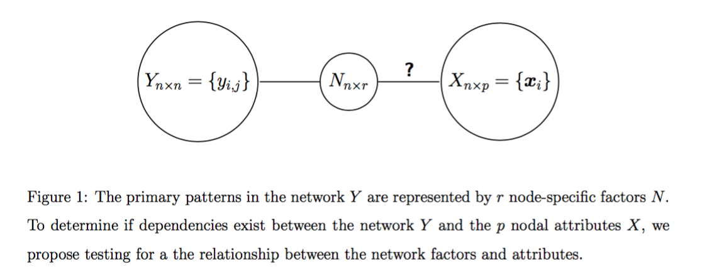

- [Random Dot Product Graph](# RDPG)
- [Relationship to SBM](# SBM)
- [Comparison to Existing Method](# Fosdick)

```{r echo=FALSE, message =FALSE, warning = FALSE}
library(igraph)
library(RefManageR)
library(xtable)
library(grid)
library(ggplot2)
library(png)
library(grid)
library(knitr)
bib <- ReadBib(system.file("Bib", "biblatexExamples.bib", 
                           package = "RefManageR"), check = FALSE)
BibOptions(check.entries = FALSE, style = "markdown", bib.style = "alphabetic", cite.style = 'alphabetic')
```


## Random Dot Product Graph
<a name=" RDPG"/>

[Young & Scheinerman](http://download.springer.com/static/pdf/614/chp%253A10.1007%252F978-3-540-77004-6_11.pdf?originUrl=http%3A%2F%2Flink.springer.com%2Fchapter%2F10.1007%2F978-3-540-77004-6_11&token2=exp=1467043286~acl=%2Fstatic%2Fpdf%2F614%2Fchp%25253A10.1007%25252F978-3-540-77004-6_11.pdf%3ForiginUrl%3Dhttp%253A%252F%252Flink.springer.com%252Fchapter%252F10.1007%252F978-3-540-77004-6_11*~hmac=2cb000be3cb9cef6653cb94c4200e0336a39a00cd10f78dcea48c89478651fdc)

In the work by Kraetzl, Nickel, Scheinerman, and Tucker, they assign a vector in $R^{d}$ to each vertex and then any edge is present with probability equal to dot product of the endpoints. With each vertex $v \in V(G)$ we associate an interest vector $x_{v}$ and the probability that vertices $u$ and $v$ are adjacent is dependent on $x_{u} \cdot x_{v},$ i.e. $\forall u, v \in V(G),$ $P_{X}(u ~ v) = f(x_{u} \cdot x_{v})$


Now let's go back to our simplest model, where 

### Two Block Simulation 1

 $$X \sim Bern(0.5)$$
  
 $$Z  \sim  \left\{  \begin{array}{cc} Bern(0.6) & X = 0 \\ Bern(0.4) & X = 1  \end{array} \right.$$
  
 $$A \sim Bern \left[  \begin{array}{cc} \color{red}{p} & q  \\ q & \color{red}{p} \end{array}  \right]$$

If you integrate the joint model of $(A, X, Z)$ by $Z$, 

$$P(A_{ij} = 1 | X_{i}, X_{j}) = \left\{ \begin{array}{cc} \{(0.4)^2 + (0.6)^2\} p + 2 (0.6 \times 0.4) q & (X_{i}, X_{j}) = (0,0) \mbox{ or } (1,1)   \\ \{(0.4)^2 + (0.6)^2\} q + 2 (0.6 \times 0.4) p & (X_{i}, X_{j}) = (0,1) \mbox{ or } (1,0)   \end{array} \right.$$.


### Two Block Simulation 2

$$X \sim Bern(0.5)$$
  
 $$Z  \sim  \left\{  \begin{array}{cc} Bern(0.6) & X = 0 \\ Bern(0.4) & X = 1  \end{array} \right.$$
  
 $$A \sim Bern \left[  \begin{array}{cc} \color{red}{p} & r  \\ r & r \end{array}  \right]$$
 
If you integrate the joint model of $(A, X, Z)$ by $Z$, 

$$P(A_{ij} = 1 | X_{i}, X_{j}) = \left\{  \begin{array}{cc} \big\{ (0.4)^2 + 2(0.6 \cdot 0.4)\cdot r   \big\} + (0.6)^2 \cdot p    & (X_{i}, X_{j}) = (0,0)  \\ \big\{ (0.4)^2 + (0.6)^2 + (0.6 \cdot 0.4)\cdot r   \big\} + (0.6 \cdot 0.4)^2 \cdot p  & (X_{i}, X_{j}) =  (1,0) \mbox{ or } (0,1)  \\ \big\{ (0.6)^2 + 2(0.6 \cdot 0.4)\cdot r   \big\} + (0.4)^2 \cdot p  & (X_{i}, X_{j}) = (1,1) \end{array} \right.$$


Both two block cases, we cannot find any function $f$ of $(x_{u} \cdot x_{v})$ which specifies $P(A_{uv} = 1).$ On the other hand, if we shift each of $X$ by +1, representation the probability as a dot product of a pair of $X$s is not impossible. For instance, if we define $\tilde{X_{i}} = x_{i} + 1$ for all $i=1,... , n,$ we can find a function $f$ of $\tilde{X_{i}} \cdot \tilde{X_{j}}$, which would be a sum of indicators functions. 

- Two Block Simulation 1:

$$P(A_{ij} = 1 | \tilde{X}_{i}, \tilde{X}_{j}) = \left\{ \begin{array}{cc} \{(0.4)^2 + (0.6)^2\} p + 2 (0.6 \times 0.4) q & \tilde{X_{i}} \cdot \tilde{X_{j}} = 1 \mbox{ or } 4   \\ \{(0.4)^2 + (0.6)^2\} q + 2 (0.6 \times 0.4) p & \tilde{X_{i}} \cdot \tilde{X_{j}} = 2   \end{array} \right.$$.


- Two Block Simulation 2:


$$P(A_{ij} = 1 | \tilde{X}_{i}, \tilde{X}_{j}) = \left\{  \begin{array}{cc} \big\{ (0.4)^2 + 2(0.6 \cdot 0.4)\cdot r   \big\} + (0.6)^2 \cdot p    & \tilde{X_{i}} \cdot \tilde{X_{j}} = 1  \\ \big\{ (0.4)^2 + (0.6)^2 + (0.6 \cdot 0.4)\cdot r   \big\} + (0.6 \cdot 0.4)^2 \cdot p  & \tilde{X_{i}} \cdot \tilde{X_{j}} = 2  \\ \big\{ (0.6)^2 + 2(0.6 \cdot 0.4)\cdot r   \big\} + (0.4)^2 \cdot p  & \tilde{X_{i}} \cdot  X_{j} = 4 \end{array} \right.$$


## Relationship to SBM
<a name=" SBM" />

(Most of Notations are borrowed from [Sussman, Tang, Fishkind $\&$ Carey's paper](http://amstat.tandfonline.com/doi/abs/10.1080/01621459.2012.699795))

In a Stochastic BlockModel (SBM), each node is a member of exactly one block and the probability of an edge from node $u$ to node $v$ is determined by their block memberships. The block memberships of all nodes are determined by the random block membership function $\tau$


Note that covariate matrices $\boldsymbol{X}$ and $\boldsymbol{Y}$ should be random which satisfy $P\big[<\boldsymbol{X}_{u}, \boldsymbol{Y}_{v}> \in [0,1]   \big] = 1$

Suppose we have a stochastic block model with rank($\boldsymbol{P}$) = $d.$ Then there exist $C,D \in R^{K \times d}$ such that $\boldsymbol{P} = \boldsymbol{C D^{T}}.$ Let $\boldsymbol{X} \in R^{n \times d}$ and $\boldsymbol{Y} \in R^{n \times d}$ have row $u$ given by $\boldsymbol{X}^{T}_{u} = \boldsymbol{C}^{T}_{\tau(u)}$ and $\boldsymbol{Y}^{T}_{u} = \boldsymbol{D}^{T}_{\tau(u)},$ respectively, for all $u$. Then we are able to present parameterize a SBM corresponding to the RDPG model: 

$$P\big[ A_{u,v} = 1   \big] =  \boldsymbol{P}_{\tau(u), \tau(v)} = <\boldsymbol{C}_{\tau(u)}, \boldsymbol{D}_{\tau(v)}> =  <\boldsymbol{X}_{u}, \boldsymbol{Y}_{v} >$$

For example, in Two Block Simulation model 1, $\boldsymbol{P}_{\tau(u), \tau(v)} = \boldsymbol{P}_{z_{u}, z_{v}} = \left[  \begin{array}{cc} \color{red}{p} & q  \\ q & \color{red}{p} \end{array}  \right]$. 

If $p > q$ then $\boldsymbol{P}_{z_{u}, z_{v}}$ is a positive-definite, symmetric matrix so that we can apply Choleskey decomposition to get a matrix $\boldsymbol{C} (= \boldsymbol{D}).$

\bigskip

$$\boldsymbol{C}_{\tau(u), \tau(v)} = \boldsymbol{C}_{z_{u}, z_{v}} = \left[  \begin{array}{cc} \sqrt{p - q^{2}/p} & q / \sqrt{p}  \\ 0 & \sqrt{p} \end{array}  \right] \big|_{z(u), z(v)} =  X_{u,v}$$


## Comparison to Existing Method
<a name=" Fosdick" />
  
  Assume network data which contain the network relations $\{ y_{ij} : i,j \in \{ 1, ... , n\} \}$ and $p$- variate nodal atributes $\{ \textbf{x}_{i} : i \in \{ 1,.. , n \} \}.$


[Fosdict & Hoff](http://www.tandfonline.com/doi/pdf/10.1080/01621459.2015.1008697) proposed a unified approach to the analysis of network and attributes, jointly modeling the network and atributes. They propose representing the $(n \times n)$ matrix of network relations $Y$ with a low dimensional structure defined by an $(n \times r)$ matrix $N$ of \textcolor{red}{node-specific} network factors ($r \ll n$). However, these network factors $N$ are not observed directly and hence are estimated from the observed network $Y$ using a network model.  


The way to evaluate whether there exists dependencies between the network $Y$ and attributes $X$ they proposed is by formally testing testing for correlation between the estimated network factors $N$ and the attributes $X.$

[Figure 1] on leftside illustrates a conceptual representation of this testing framework. If the network $Y$ is independent of the attributes $X$, then any functions of the network, specifically the network network factors $N,$ are also independent of the attributes $X$.  This really resembles the model we have proposed (See another [Figure 1] on the rightside).


```{r, out.width = 500, out.height = 400, echo = FALSE, fig.align='center', fig.show='hold', out.extra='style="float:left"'}

```
```{r, out.width = 200, out.height = 400, echo = FALSE, fig.align='center', fig.show='hold'}
knitr::include_graphics("../figure/model1.png")
```

They considered an extension of the model presented in [Hoff (2009)](http://download.springer.com/static/pdf/484/art%253A10.1007%252Fs10588-008-9040-4.pdf?originUrl=http%3A%2F%2Flink.springer.com%2Farticle%2F10.1007%2Fs10588-008-9040-4&token2=exp=1467050109~acl=%2Fstatic%2Fpdf%2F484%2Fart%25253A10.1007%25252Fs10588-008-9040-4.pdf%3ForiginUrl%3Dhttp%253A%252F%252Flink.springer.com%252Farticle%252F10.1007%252Fs10588-008-9040-4*~hmac=483d23ee11d7974223ca81295b48e142c4036a92ddee4d470ca05ee92b1ec4ed), where a statistical model of social network represents additional structure via sender-specific and receiver-specific latent factors. 

$$logodds (y_{ij} = 1) = \theta_{ij},$$
$$\mbox{ where } \theta_{ij} = \beta^{'}\boldsymbol{x_{ij} } + z_{ij}  = \beta^{'} \boldsymbol{x_{ij}} + \boldsymbol{u_{i} D v^{'}_{j}} + \epsilon_{ij}.$$

Unlike our binary edge variable $a_{ij}$, let $y_{ij}$ represent a continuous measure of the ``directed" relation between node $i$ and node $j$ and consider the following model for $a_{i}, b_{j} \in R;  \boldsymbol{u_{i}, v_{j}} \in R^{k}$:

$$y_{ij} = \mu + a_{i} + b_{j} + \boldsymbol{u^{T}_{i} v_{j}} + e_{ij}.$$

The additive sender effect $a_{i}$ and receiver effect $b_{j}$, and multiplicative interaction effect $\boldsymbol{u^{T}_{i}v_{j}}.$ 

As a connection to RDPG, this model can be also represented as a product of latent factor $\boldsymbol{\tilde{u}^{T}_{i}}$ and $\boldsymbol{\tilde{v}_{i}}.$

$$\boldsymbol{\tilde{u}^{T}_{i}} = \begin{bmatrix} a_{i} & 1 & | & u_{i1} & u_{i2} & \cdots & u_{ik} \end{bmatrix}, \boldsymbol{\tilde{v}_{j}} = \begin{bmatrix} 1 \\ b_{j} \\ - \\ v_{j1} \\ v_{j2} \\ \vdots \\ v_{jk}     \end{bmatrix}$$

$$P_Z(i \rightarrow j) = f \big( \boldsymbol{\tilde{u}^{T}_{i} \cdot \boldsymbol{\tilde{v}_{i}}}  \big) = \boldsymbol{\tilde{u}^{T}_{i} \cdot \boldsymbol{\tilde{v}_{i}}} + \mu + N(0, \sigma^{2}_{e}).$$


As well as random errors, the additive and multiplicative node-specific factors are also modeled as Gaussian and independent across nodes:


Since our work consider a binary edge variable $A,$ we should incorporate a generalized linear model framework by modeling $y_{ij} = l(z_{ij})$, where $l$ is a logit link function. That is, for connection to our latent model framework, we assume the following model :

$$logit\big( P(y_{ij} = 1) \big) =  \log \left( \frac{P(y_{ij} = 1)}{ 1 - P(y_{ij} = 1)} \right) =  \boldsymbol{\tilde{u}^{T}_{i} \cdot \tilde{v}_{j}} + \mu + e_{ij}.$$

They proposed an alternative testing approach using the $\color{red}{estimated}$ latent network factors $N_{n \times (2k + 1)} = [a,b,U,V]$ from the network model. The node attributes $X$ are independent of the network $Y$ if and only if the attributes are independent of any function of the network. 


$$H_{0} : \Sigma_{X,N} = 0$$
$$H_{1} : \Sigma_{X,N} \neq 0$$


### Simulation Study


