- [Random Dot Product Graph](# RDPG)
- [Relationship to SBM](# SBM)
- [Comparison to Existing Method](# Fosdick)
- [Concerns about Sparse Network with attributes](# sparse)

```{r echo=FALSE, message =FALSE, warning = FALSE}
library(igraph)
library(RefManageR)
library(xtable)
library(grid)
library(ggplot2)
library(png)
library(grid)
library(knitr)
bib <- ReadBib(system.file("Bib", "biblatexExamples.bib", 
                           package = "RefManageR"), check = FALSE)
BibOptions(check.entries = FALSE, style = "markdown", bib.style = "alphabetic", cite.style = 'alphabetic')
```


## Random Dot Product Graph
<a name=" RDPG"/>

[Young & Scheinerman](http://download.springer.com/static/pdf/614/chp%253A10.1007%252F978-3-540-77004-6_11.pdf?originUrl=http%3A%2F%2Flink.springer.com%2Fchapter%2F10.1007%2F978-3-540-77004-6_11&token2=exp=1467043286~acl=%2Fstatic%2Fpdf%2F614%2Fchp%25253A10.1007%25252F978-3-540-77004-6_11.pdf%3ForiginUrl%3Dhttp%253A%252F%252Flink.springer.com%252Fchapter%252F10.1007%252F978-3-540-77004-6_11*~hmac=2cb000be3cb9cef6653cb94c4200e0336a39a00cd10f78dcea48c89478651fdc)

In the work by Kraetzl, Nickel, Scheinerman, and Tucker, they assign a vector in $R^{d}$ to each vertex and then any edge is present with probability equal to dot product of the endpoints. With each vertex $v \in V(G)$ we associate an interest vector $x_{v}$ and the probability that vertices $u$ and $v$ are adjacent is dependent on $x_{u} \cdot x_{v},$ i.e. $\forall u, v \in V(G),$ $P_{X}(u ~ v) = f(x_{u} \cdot x_{v})$


Now let's go back to our simplest model, where 

### Two Block Simulation 1

 $$X \sim Bern(0.5)$$
  
 $$Z  \sim  \left\{  \begin{array}{cc} Bern(0.6) & X = 0 \\ Bern(0.4) & X = 1  \end{array} \right.$$
  
 $$A \sim Bern \left[  \begin{array}{cc} \color{red}{p} & q  \\ q & \color{red}{p} \end{array}  \right]$$

If you integrate the joint model of $(A, X, Z)$ by $Z$, 

$$P(A_{ij} = 1 | X_{i}, X_{j}) = \left\{ \begin{array}{cc} \{(0.4)^2 + (0.6)^2\} p + 2 (0.6 \times 0.4) q & (X_{i}, X_{j}) = (0,0) \mbox{ or } (1,1)   \\ \{(0.4)^2 + (0.6)^2\} q + 2 (0.6 \times 0.4) p & (X_{i}, X_{j}) = (0,1) \mbox{ or } (1,0)   \end{array} \right.$$.


### Two Block Simulation 2

$$X \sim Bern(0.5)$$
  
 $$Z  \sim  \left\{  \begin{array}{cc} Bern(0.6) & X = 0 \\ Bern(0.4) & X = 1  \end{array} \right.$$
  
 $$A \sim Bern \left[  \begin{array}{cc} \color{red}{p} & r  \\ r & r \end{array}  \right]$$
 
If you integrate the joint model of $(A, X, Z)$ by $Z$, 

$$P(A_{ij} = 1 | X_{i}, X_{j}) = \left\{  \begin{array}{cc} \big\{ (0.4)^2 + 2(0.6 \cdot 0.4)\cdot r   \big\} + (0.6)^2 \cdot p    & (X_{i}, X_{j}) = (0,0)  \\ \big\{ (0.4)^2 + (0.6)^2 + (0.6 \cdot 0.4)\cdot r   \big\} + (0.6 \cdot 0.4)^2 \cdot p  & (X_{i}, X_{j}) =  (1,0) \mbox{ or } (0,1)  \\ \big\{ (0.6)^2 + 2(0.6 \cdot 0.4)\cdot r   \big\} + (0.4)^2 \cdot p  & (X_{i}, X_{j}) = (1,1) \end{array} \right.$$


Both two block cases, we cannot find any function $f$ of $(x_{u} \cdot x_{v})$ which specifies $P(A_{uv} = 1).$ On the other hand, if we shift each of $X$ by +1, representation the probability as a dot product of a pair of $X$s is not impossible. For instance, if we define $\tilde{X_{i}} = x_{i} + 1$ for all $i=1,... , n,$ we can find a function $f$ of $\tilde{X_{i}} \cdot \tilde{X_{j}}$, which would be a sum of indicators functions. 

- Two Block Simulation 1:

$$P(A_{ij} = 1 | \tilde{X}_{i}, \tilde{X}_{j}) = f\big( \tilde{X}_{i} \cdot \tilde{X}_{j} \big) = \left\{ \begin{array}{cc} \{(0.4)^2 + (0.6)^2\} p + 2 (0.6 \times 0.4) q & \tilde{X_{i}} \cdot \tilde{X_{j}} = 1 \mbox{ or } 4   \\ \{(0.4)^2 + (0.6)^2\} q + 2 (0.6 \times 0.4) p & \tilde{X_{i}} \cdot \tilde{X_{j}} = 2   \end{array} \right.$$.


- Two Block Simulation 2:


$$P(A_{ij} = 1 | \tilde{X}_{i}, \tilde{X}_{j}) = f\big(\tilde{X}_{i} \cdot \tilde{X}_{j}  \big) = \left\{  \begin{array}{cc} \big\{ (0.4)^2 + 2(0.6 \cdot 0.4)\cdot r   \big\} + (0.6)^2 \cdot p    & \tilde{X_{i}} \cdot \tilde{X_{j}} = 1  \\ \big\{ (0.4)^2 + (0.6)^2 + (0.6 \cdot 0.4)\cdot r   \big\} + (0.6 \cdot 0.4)^2 \cdot p  & \tilde{X_{i}} \cdot \tilde{X_{j}} = 2  \\ \big\{ (0.6)^2 + 2(0.6 \cdot 0.4)\cdot r   \big\} + (0.4)^2 \cdot p  & \tilde{X_{i}} \cdot  X_{j} = 4 \end{array} \right.$$


## Relationship to SBM
<a name=" SBM" />

(Most of Notations are borrowed from [Sussman, Tang, Fishkind $\&$ Carey's paper](http://amstat.tandfonline.com/doi/abs/10.1080/01621459.2012.699795))

In a Stochastic BlockModel (SBM), each node is a member of exactly one block and the probability of an edge from node $u$ to node $v$ is determined by their block memberships. The block memberships of all nodes are determined by the random block membership function $\tau$. 


Note that covariate matrices $\boldsymbol{X}$ and $\boldsymbol{Y}$ should be random which satisfy $P\big[<\boldsymbol{X}_{u}, \boldsymbol{Y}_{v}> \in [0,1]   \big] = 1$

Suppose we have a stochastic block model with rank($\boldsymbol{P}$) = $d.$ Then there exist $C,D \in R^{K \times d}$ such that $\boldsymbol{P} = \boldsymbol{C D^{T}}.$ Let $\boldsymbol{X} \in R^{n \times d}$ and $\boldsymbol{Y} \in R^{n \times d}$ have row $u$ given by $\boldsymbol{X}^{T}_{u} = \boldsymbol{C}^{T}_{\tau(u)}$ and $\boldsymbol{Y}^{T}_{u} = \boldsymbol{D}^{T}_{\tau(u)},$ respectively, for all $u$. Then we are able to present a SBM corresponding to the RDPG model: 

$$P\big[ A_{u,v} = 1   \big] =  \boldsymbol{P}_{\tau(u), \tau(v)} = <\boldsymbol{C}_{\tau(u)}, \boldsymbol{D}_{\tau(v)}> =  <\boldsymbol{X}_{u}, \boldsymbol{Y}_{v} >$$

For example, in Two Block Simulation model 1, $\boldsymbol{P}_{\tau(u), \tau(v)} = \boldsymbol{P}_{z_{u}, z_{v}} = \left[  \begin{array}{cc} \color{red}{p} & q  \\ q & \color{red}{p} \end{array}  \right]$. 

If $\color{red}{p > q}$ then $\boldsymbol{P}_{z_{u}, z_{v}}$ is a positive-definite ("assortative" in the context of node-contextualized stochastic block model), symmetric matrix so that we can apply Choleskey decomposition to get a matrix $\boldsymbol{C} (= \boldsymbol{D}).$

\bigskip

$$\boldsymbol{C}_{\tau(u), \tau(v)} = \boldsymbol{C}_{z_{u}, z_{v}} = \left[  \begin{array}{cc} \sqrt{p - q^{2}/p} & q / \sqrt{p}  \\ 0 & \sqrt{p} \end{array}  \right] \big|_{z(u), z(v)} =  X_{u,v}$$


Thus, $\boldsymbol{X}_{u,v} = \boldsymbol{C \cdot Z}_{u,v} = \boldsymbol{Y}_{u,v}.$

For example, for any pair of vertices $u$ and $v$, if $z_{u} = 0$ and $z_{v} = 1,$ $\boldsymbol{X}_{u} = \boldsymbol{C \cdot Z}_{u} = \left[ \begin{array}{cc}  \sqrt{p - q^2 / p } & q / \sqrt{p}  \end{array} \right]$ and $\boldsymbol{Y}_{v} = \boldsymbol{C \cdot Z}_{v} = \left[ \begin{array}{cc}  0 & \sqrt{p}  \end{array} \right]$, so that $P[A_{u,v}  = 1]  = <X_{u}, Y_{v}> = < \boldsymbol{C \cdot Z}_{u}, \boldsymbol{C \cdot Z}_{v} > = q.$


## Comparison to Existing Method
<a name=" Fosdick" />
  
  Assume network data which contain the network relations $\{ y_{ij} : i,j \in \{ 1, ... , n\} \}$ and $p$- variate nodal attributes $\{ \textbf{x}_{i} : i \in \{ 1,.. , n \} \}.$


[Fosdick & Hoff](http://www.tandfonline.com/doi/pdf/10.1080/01621459.2015.1008697) proposed a unified approach to the analysis of network and attributes, jointly modeling the network and attributes. They propose representing the $(n \times n)$ matrix of network relations $Y$ with a low dimensional structure defined by an $(n \times r)$ matrix $N$ of \textcolor{red}{node-specific} network factors ($r \ll n$). However, these network factors $N$ are not observed directly and hence are estimated from the observed network $Y$ using a network model.  


The way to evaluate whether there exists dependencies between the network $\color{red}{Y}$ and attributes $X$ they proposed is by formally testing testing for correlation between the estimated network factors $\color{red}{N}$ and the attributes $X.$

[Figure 1] on leftside illustrates a conceptual representation of this testing framework. If the network $Y$ is independent of the attributes $X$, then any functions of the network, specifically the network network factors $N,$ are also independent of the attributes $X$.  This really resembles the model we have proposed (See another [Figure 1] on the rightside).


```{r, out.width = 500, out.height = 400, echo = FALSE, fig.align='center', fig.show='hold', out.extra='style="float:left"'}
knitr::include_graphics("../figure/concept.png")
```
```{r, out.width = 200, out.height = 400, echo = FALSE, fig.align='center', fig.show='hold'}
knitr::include_graphics("../figure/model1.png")
```

They considered an extension of the model presented in [Hoff (2009)](http://download.springer.com/static/pdf/484/art%253A10.1007%252Fs10588-008-9040-4.pdf?originUrl=http%3A%2F%2Flink.springer.com%2Farticle%2F10.1007%2Fs10588-008-9040-4&token2=exp=1467050109~acl=%2Fstatic%2Fpdf%2F484%2Fart%25253A10.1007%25252Fs10588-008-9040-4.pdf%3ForiginUrl%3Dhttp%253A%252F%252Flink.springer.com%252Farticle%252F10.1007%252Fs10588-008-9040-4*~hmac=483d23ee11d7974223ca81295b48e142c4036a92ddee4d470ca05ee92b1ec4ed), where a statistical model of social network represents additional structure via sender-specific and receiver-specific latent factors. 

$$logodds (y_{ij} = 1) = \theta_{ij},$$
$$\mbox{ where } \theta_{ij} = \beta^{'}\boldsymbol{x_{ij} } + z_{ij}  = \beta^{'} \boldsymbol{x_{ij}} + \boldsymbol{u_{i} D v^{'}_{j}} + \epsilon_{ij}.$$

Unlike our binary edge variable $a_{ij}$, let $y_{ij}$ represent a continuous measure of the ``directed" relation between node $i$ and node $j$ and consider the following model for $a_{i}, b_{j} \in R;  \boldsymbol{u_{i}, v_{j}} \in R^{\color{red}{k}}$:

$$y_{ij} = \mu + a_{i} + b_{j} + \boldsymbol{u^{T}_{i} v_{j}} + e_{ij}.$$

The additive sender effect $a_{i}$ and receiver effect $b_{j}$, and multiplicative interaction effect $\boldsymbol{u^{T}_{i}v_{j}}.$ 

As a connection to RDPG, this model can be also represented as a product of latent factor $\boldsymbol{\tilde{u}^{T}_{i}}$ and $\boldsymbol{\tilde{v}_{i}}.$

$$\boldsymbol{\tilde{u}^{T}_{i}} = \begin{bmatrix} a_{i} & 1 & | & u_{i1} & u_{i2} & \cdots & u_{ik} \end{bmatrix}, \boldsymbol{\tilde{v}_{j}} = \begin{bmatrix} 1 \\ b_{j} \\ - \\ v_{j1} \\ v_{j2} \\ \vdots \\ v_{jk}     \end{bmatrix}$$

$$P_Z(i \rightarrow j) = f \big( \boldsymbol{\tilde{u}^{T}_{i} \cdot \boldsymbol{\tilde{v}_{i}}}  \big) = \boldsymbol{\tilde{u}^{T}_{i} \cdot \boldsymbol{\tilde{v}_{i}}} + \mu + N(0, \sigma^{2}_{e}).$$


As well as random errors, the additive and multiplicative node-specific factors are also modeled as Gaussian and independent across nodes:


Since our work consider a binary edge variable $A,$ we should incorporate a generalized linear model framework by modeling $y_{ij} = l(z_{ij})$, where $l$ is a logit link function. That is, for connection to our latent model framework, we assume the following model :

$$logit\big( P(y_{ij} = 1) \big| \mu, \sigma^2_{e}  \big) =  \log \left( \frac{P(y_{ij} = 1)}{ 1 - P(y_{ij} = 1)} \right) =  \boldsymbol{\tilde{u}^{T}_{i} \cdot \tilde{v}_{j}} + \mu + e_{ij}.$$

They proposed an alternative testing approach using the $\color{red}{estimated}$ latent network factors $N_{n \times (2k + 2)} = [a,b,U,V]$ from the network model. The node attributes $X$ are independent of the network $Y$ if and only if the attributes are independent of any function of the network. Thus they claim that it sufficies to test: 


$$H_{0} : \Sigma_{X,N} = 0$$  
$$H_{1} : \Sigma_{X,N} \neq 0$$


### Simulation Study


Using their methods, we are able to perform the test of independence based on the latent network factors to assess the evidence for any relationship between the attributes and network without creating a potentially unnecessarily complex network model or performing any model selection.

The test of $H_{0} : \Sigma_{X,N} = 0$ was derived as the likelihood ratio test for a model where BOTH the network factors and attributes are sampled from a normal distribution. However in some cases these assumptions may not be appropriate. Fortunately, alternative interpretations of the test exist that do not rely on such assumptions. The likelihood ratio test for it is the same as the likelihood ratio test to determine whether the coefficients in a linear regression are nonzero, where either the network factors are regressed on the attributes or the attributes are regressed on the network factors. 


* Procedures

1.  Fit a model for network connectivity, using a linear function ``ame()`` in ``R``.

$$P(Y_{ij} = 1) = \Phi(\mu + a_{i} + b_{j} + \boldsymbol{u}^{T}_{i} \boldsymbol{v}_{j} + e_{ij} )  ; a_{i}, b_{j} \in R; \boldsymbol{u}_{i}, \boldsymbol{v}_{j} \in R^{\color{red}{k} }$$

  We can specify the dimension $\color{red}{k}$ of the multiplicative effects $\boldsymbol{u}^{T}_{i} \boldsymbol{v}_{j}$ before fitting the model.

2. Network Factor $N = [a,b, U, V]$ is estimated from the model above.

3. Fit a linear regression of network factors $N$ on the attributes $X$, and determine whether the coefficients in such multivariate linear regression are nonzero.

$$H_{0} : \beta_{N | X} = 0 \mbox{    vs.    } H_{1}: \beta_{N | X} \neq 0$$

  , which is based on $n_{i} | x_{i}  \overset{i.i.d}{\sim} N \big( \beta_{N|X} x_{i}, \Sigma_{N | X} \big)$


#### Two Block Case 1 


$$X \sim Bern(0.5)$$ 


$$Z  \sim  \left\{  \begin{array}{cc} Bern(0.6) & X = 0 \\ Bern(0.4) & X = 1  \end{array} \right.$$

$$A \sim Bern \left[  \begin{array}{cc} \color{red}{0.4} & 0.2  \\ 0.2 & \color{red}{0.4} \end{array}  \right]$$ 


```{r, out.width = 500, out.height = 400, echo = FALSE, fig.align='center', fig.show='hold'}
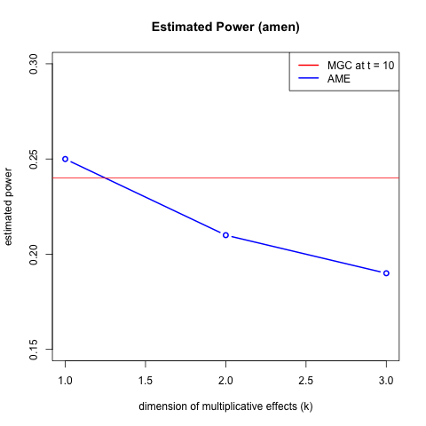
```


#### Two Block Case 2 


$$X \sim Bern(0.5)$$ 


$$Z  \sim  \left\{  \begin{array}{cc} Bern(0.6) & X = 0 \\ Bern(0.4) & X = 1  \end{array} \right.$$

$$A \sim Bern \left[  \begin{array}{cc} \color{red}{0.2} & 0.4  \\ 0.4 & \color{red}{0.2} \end{array}  \right]$$ 


```{r, out.width = 500, out.height = 400, echo = FALSE, fig.align='center', fig.show='hold'}
knitr::include_graphics("../figure/two224_ame.png")
```


#### Three Block Case 3 

$$X \sim Multi(1/3, 1/3, 1/3)$$

$$Z \sim  \left\{  \begin{array}{cc} Multi(\color{red}{0.5}, 0.25, 0.25 ) & X = 1 \\ Multi(0.25, \color{red}{0.5}, 0.25  ) & X = 2 \\ Multi(0.25, 0.25, \color{red}{0.5} ) & X = 3 \end{array} \right.$$

$$A \sim Bern \left[  \begin{array}{cc} \color{red}{0.5} & 0.2 & \color{pink}{0.3}  \\ 0.2 & \color{red}{0.5} & 0.2  \\ \color{pink}{0.3} & 0.2 & \color{red}{0.5}  \end{array}  \right]$$


This case is the one of the exemplary cases where local optimal is much better than the global. Optimal diffusion time which reaches the highest (estimated) power is about t = 10. Diffusion distance matrix and power heatmap at t = 10 are as follow : 

```{r, out.width = 400, out.height = 400, echo = FALSE, fig.align='center', fig.show='hold', out.extra='style="float:left"'}
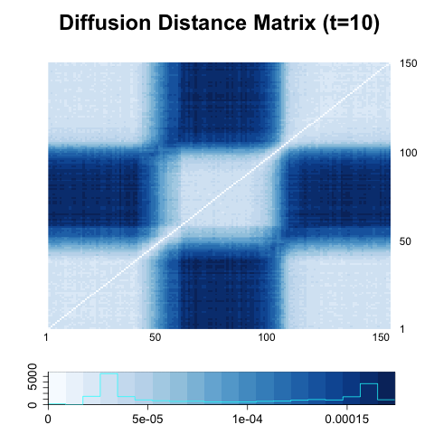
```
```{r, out.width = 400, out.height = 400, echo = FALSE, fig.align='center', fig.show='hold'}
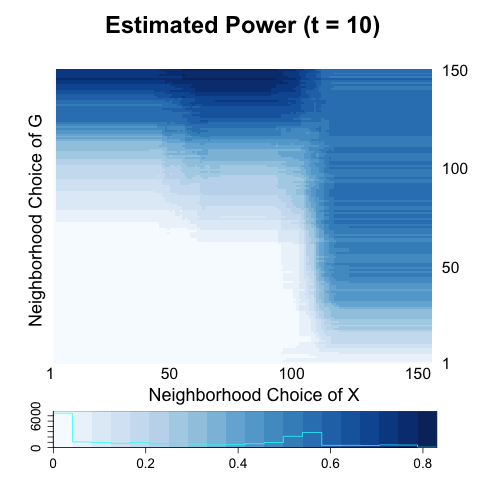
```


```{r, out.width = 500, out.height = 400, echo = FALSE, fig.align='center', fig.show='hold'}
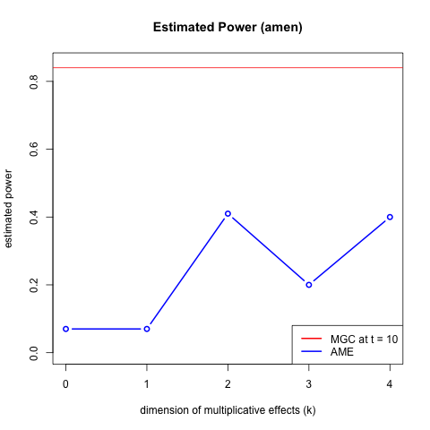
```


#### Binary relational data

Generate the data from R package ``amen``.

Consider the network model with one multiplicative effect $(\color{red}{k} = 1)$ and the attribute 


1. Generate jointly network covariates and node attributes.


$$(x_{i}, a_{i}, b_{i}, u_{i}, v_{i}) \overset{i.i.d}{\sim} N \left( \boldsymbol{0}, \color{red}{\Sigma}  \right), i = 1,... , 100$$

$$e_{ij} \overset{i.i.d}{\sim} N(0,1); i,j = 1,.., 100$$


2. Generate a binary $Y_{ij}$ through a probit model 

$$y_{ij} \sim \Phi(a_{i} + b_{j} + u_{i} \cdot v_{j} + e_{ij} )$$


3. Estimate the coefficients for additive and multiplicative(AME) effects using a binary probit AME model, so that we obtain $\hat{N} = \big\{ (\hat{a}_{i}, \hat{b}_{i}, \hat{u}_{i}, \hat{v}_{i} ); i =1,...,100  \big\}$


4. Test (linear) independence between $X$ and $N$.


<hr />

#### Binary Case 1

$$(x_{i}, a_{i}, b_{i}, u_{i}, v_{i}) \overset{i.i.d}{\sim} N \left( \boldsymbol{0}, \color{red}{\Sigma}  \right), i = 1,... , 100$$

$$\color{red}{\Sigma} = \begin{bmatrix} 1 & 0 & 0 & 0 & 0 \\ 0 & 1 & 0 & 0 & 0 \\ 0 & 0 & 1 & 0 & 0 \\ 0 & 0 & 0 & 1 & 0 \\ 0 & 0 & 0 & 0 & 1  \end{bmatrix}$$


- Estimated Power as a function of $\color{red}{k}:$


```{r, out.width = 400, out.height = 400, echo = FALSE, fig.align='center', fig.show='hold'}
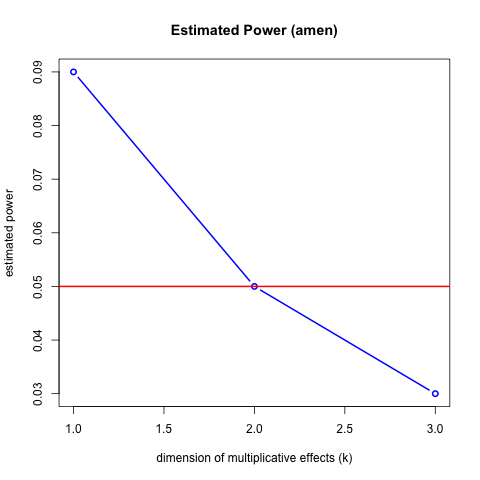
```


- Estimated Power using Multiscale distance correlation : 

```{r, out.width = 300, out.height = 400, echo = FALSE, fig.align='center', fig.show='hold', out.extra='style="float:left"'}
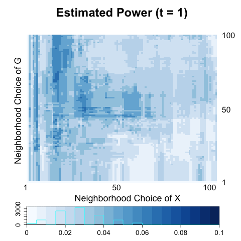
```
```{r, out.width = 300, out.height = 400, echo = FALSE, fig.align='center', fig.show='hold'}
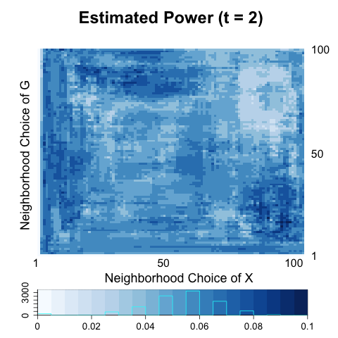
```
```{r, out.width = 300, out.height = 400, echo = FALSE, fig.align='center', fig.show='hold', out.extra='style="float:left"'}
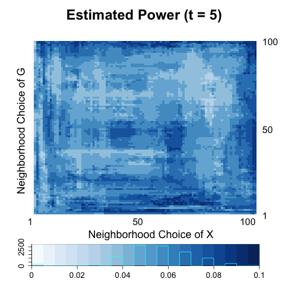
```
```{r, out.width = 300, out.height = 400, echo = FALSE, fig.align='center', fig.show='hold'}
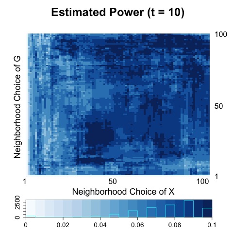
```


<hr />

### Binary Case 2

$$(x_{i}, a_{i}, b_{i}, u_{i}, v_{i}) \overset{i.i.d}{\sim} N \left( \boldsymbol{0}, \color{red}{\Sigma}  \right), i = 1,... , 100$$

$$\color{red}{\Sigma} = \begin{bmatrix} 1 & \color{blue}{0.5} & 0 & 0 & 0 \\ \color{blue}{0.5} & 1 & 0 & 0 & 0 \\ 0 & 0 & 1 & 0 & 0 \\ 0 & 0 & 0 & 1 & 0 \\ 0 & 0 & 0 & 0 & 1  \end{bmatrix}$$


- Estimated Power as a function of $\color{red}{k}:$


```{r, out.width = 400, out.height = 400, echo = FALSE, fig.align='center', fig.show='hold'}
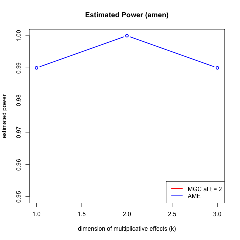
```


- Estimated Power using Multiscale distance correlation : 

```{r, out.width = 300, out.height = 400, echo = FALSE, fig.align='center', fig.show='hold', out.extra='style="float:left"'}
knitr::include_graphics("../figure/sim1_power1.png")
```
```{r, out.width = 300, out.height = 400, echo = FALSE, fig.align='center', fig.show='hold'}
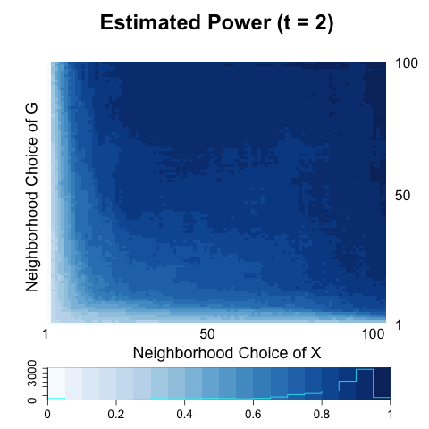
```
```{r, out.width = 300, out.height = 400, echo = FALSE, fig.align='center', fig.show='hold', out.extra='style="float:left"'}
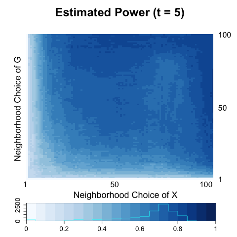
```
```{r, out.width = 300, out.height = 400, echo = FALSE, fig.align='center', fig.show='hold'}
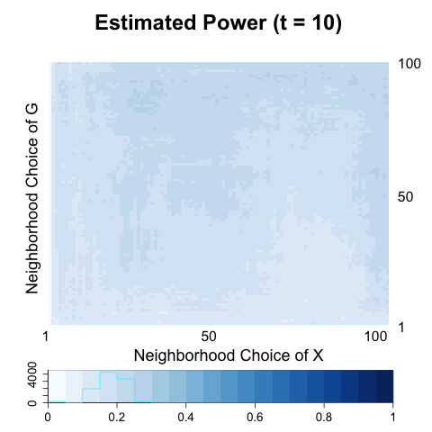
```


<hr />

### Binary Case 3

$$(x_{i}, a_{i}, b_{i}, u_{i}, v_{i}) \overset{i.i.d}{\sim} N \left( \boldsymbol{0}, \color{red}{\Sigma}  \right), i = 1,... , 100$$

$$\color{red}{\Sigma} = \begin{bmatrix} 1 & 0 & 0 & \color{blue}{0.5} & 0 \\ 0 & 1 & 0 & 0 & 0 \\ 0 & 0 & 1 & 0 & 0 \\  \color{blue}{0.5} & 0 & 0 & 1 & 0 \\ 0 & 0 & 0 & 0 & 1  \end{bmatrix}$$


- Estimated Power as a function of $\color{red}{k}:$


```{r, out.width = 400, out.height = 400, echo = FALSE, fig.align='center', fig.show='hold'}
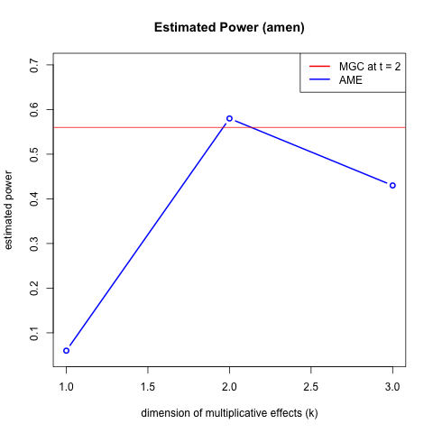
```


- Estimated Power using Multiscale distance correlation : 

```{r, out.width = 300, out.height = 400, echo = FALSE, fig.align='center', fig.show='hold', out.extra='style="float:left"'}
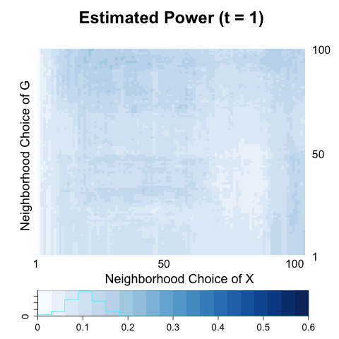
```
```{r, out.width = 300, out.height = 400, echo = FALSE, fig.align='center', fig.show='hold'}
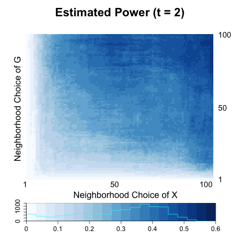
```
```{r, out.width = 300, out.height = 400, echo = FALSE, fig.align='center', fig.show='hold', out.extra='style="float:left"'}
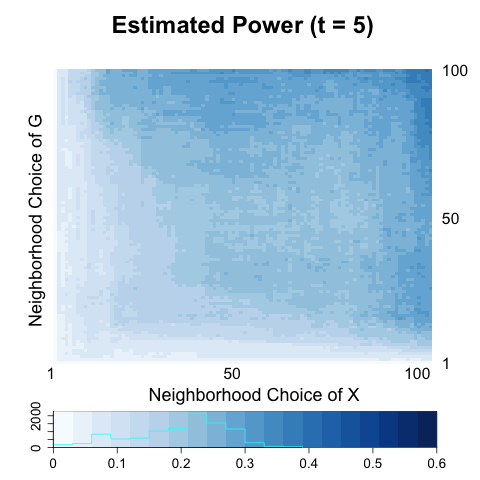
```
```{r, out.width = 300, out.height = 400, echo = FALSE, fig.align='center', fig.show='hold'}
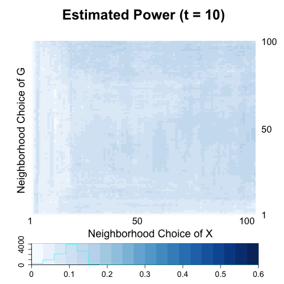
```


<hr />

### Binary Case 4

$$(x_{i}, a_{i}, b_{i}, u_{i}, v_{i}) \overset{i.i.d}{\sim} N \left( \boldsymbol{0}, \color{red}{\Sigma}  \right), i = 1,... , 100$$

$$\color{red}{\Sigma} = \begin{bmatrix} 1 & 0 & 0 & \color{blue}{0.3} & \color{red}{-0.3} \\ 0 & 1 & 0 & 0 & 0 \\ 0 & 0 & 1 & 0 & 0 \\  \color{blue}{0.3} & 0 & 0 & 1 & 0 \\ 
\color{red}{-0.3} & 0 & 0 & 0 & 1  \end{bmatrix}$$


- Estimated Power as a function of $\color{red}{k}:$


```{r, out.width = 400, out.height = 400, echo = FALSE, fig.align='center', fig.show='hold'}
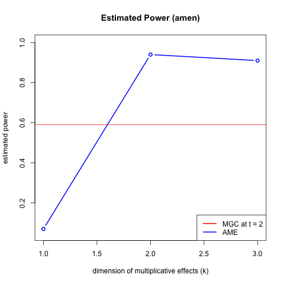
```


- Estimated Power using Multiscale distance correlation : 

```{r, out.width = 300, out.height = 400, echo = FALSE, fig.align='center', fig.show='hold', out.extra='style="float:left"'}
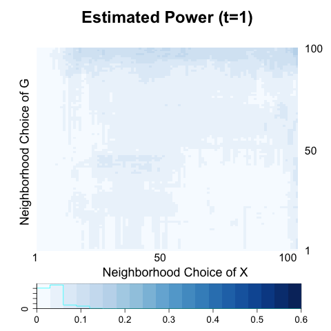
```
```{r, out.width = 300, out.height = 400, echo = FALSE, fig.align='center', fig.show='hold'}
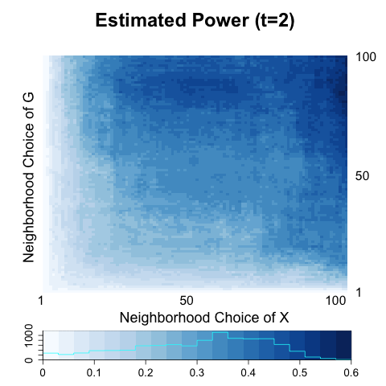
```
```{r, out.width = 300, out.height = 400, echo = FALSE, fig.align='center', fig.show='hold', out.extra='style="float:left"'}
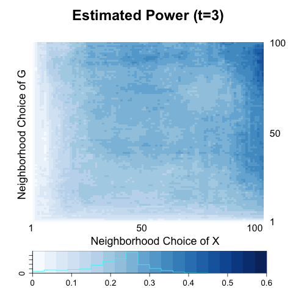
```
```{r, out.width = 300, out.height = 400, echo = FALSE, fig.align='center', fig.show='hold'}
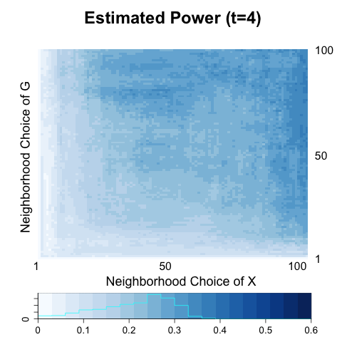
```


<hr />

### Binary Case 5

$$(x_{i}, a_{i}, b_{i}, u_{i}, v_{i}) \overset{i.i.d}{\sim} N \left( (0,0,0,0,0), \color{red}{\Sigma}  \right), i = 1,... , 50$$

$$(x_{i}, a_{i}, b_{i}, u_{i}, v_{i}) \overset{i.i.d}{\sim} N \left( (0,5,0,0,0), \color{red}{\Sigma}  \right), i = 50,... , 100$$


$$\color{red}{\Sigma} = \begin{bmatrix} 1 & \color{red}{0.5} & 0 & 0 & 0 \\ \color{red}{0.5} & 1 & 0 & 0 & 0 \\ 0 & 0 & 1 & 0 & 0 \\  0 & 0 & 0 & 1 & 0 \\ 
0 & 0 & 0 & 0 & 1  \end{bmatrix}$$


- Estimated Power as a function of $\color{red}{k}:$


```{r, out.width = 400, out.height = 400, echo = FALSE, fig.align='center', fig.show='hold'}
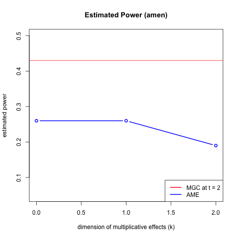
```


- Estimated Power using Multiscale distance correlation : 

```{r, out.width = 300, out.height = 400, echo = FALSE, fig.align='center', fig.show='hold', out.extra='style="float:left"'}
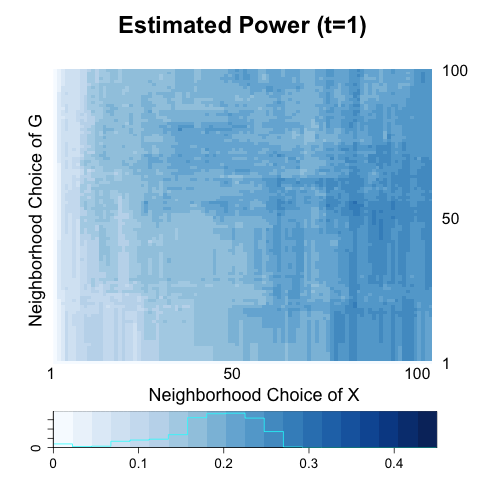
```
```{r, out.width = 300, out.height = 400, echo = FALSE, fig.align='center', fig.show='hold'}
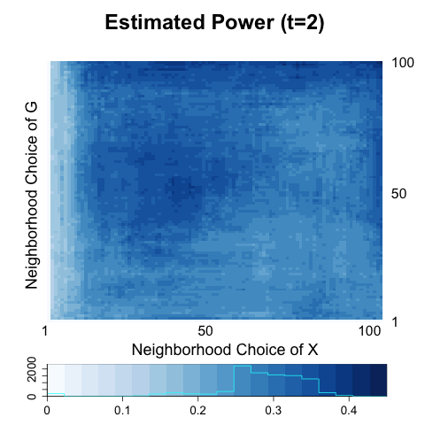
```
```{r, out.width = 300, out.height = 400, echo = FALSE, fig.align='center', fig.show='hold', out.extra='style="float:left"'}
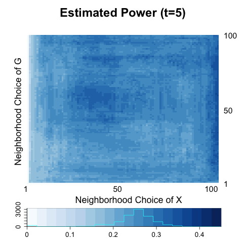
```
```{r, out.width = 300, out.height = 400, echo = FALSE, fig.align='center', fig.show='hold'}
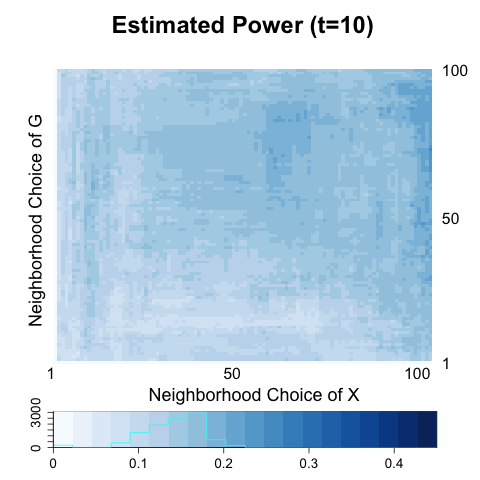
```


<hr />


## Computational Errors

Fit ``ame(Y, burn = 50, nscan = 500, odens = 1, ..)`` and $Y$ is not a sigular, adjacency matrix. Then it prints out the error message of ``Error in solve.default(diag(2) + crossprod(cbind(a, b))) : system is computationally singular: reciprocal condition number = 0 In addition: Warning messages: 1: In sqrt(Sab[1, 1] - Sab[1, 2]^2/Sab[2, 2]) : NaNs produced 2: In runif(nrow(Z), pnorm((lba - ea)/sa), pnorm((uba - ea)/sa))  : NAs produced``


