- [Data Descriptions](# data)
- [Statistics](# statistics)
- [Results (P-value)](# results)


```{r echo=FALSE, message =FALSE, warning = FALSE}
library(igraph)
library(RefManageR)
library(xtable)
library(grid)
library(ggplot2)
library(png)
library(grid)
library(knitr)
bib <- ReadBib(system.file("Bib", "biblatexExamples.bib", 
                           package = "RefManageR"), check = FALSE)
BibOptions(check.entries = FALSE, style = "markdown", bib.style = "alphabetic", cite.style = 'alphabetic')
```


## Data Descriptions
<a name=" data"/>

 We are given a connected, weighted and also directed network of C. elegans, which is comprised of 279 nodes and 3225 (directed) edges between them. The given network illustrates the network in the region of pharynx, and the weight imposed on each edge is equivalent to the number of corresponding synapses. For vertex attributes, we have (1) cell class, (2)  soma position, (3)neurotransmitters and (4) role. Values of some position are continuous. Vertex information of cell class, neurotransmitters and roles contains categorized values which we cannot directly apply Euclidean distance, so we are going to focus on the correlation between ($X$ = soma position) and ($G$ = Network topology). Average path length of $G$ is ``2.876221``. As an edge attribute, each $e \in E(G)$ has its own (a) weight and (b) synapse type. We are going to take an edge weight into account in constructing transition probability matrix.  


- Degree Distribution of $G$ : 

```{r, out.width = 400, out.height = 400, echo = FALSE, fig.align='center', fig.show='hold'}
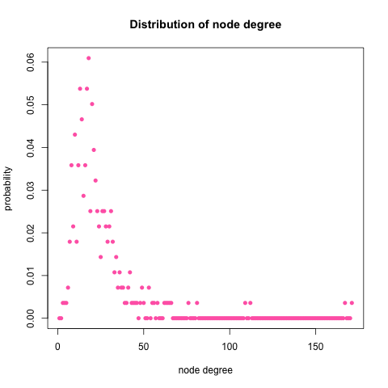
```

- Distribution of $X$ : 

```{r, out.width = 400, out.height = 400, echo = FALSE, fig.align='center', fig.show='hold'}
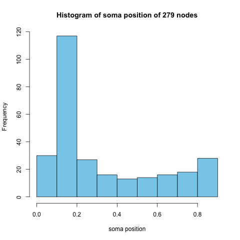
```


## Statistics
<a name=" statistics"/>

We are going to test independence between $G$: neuronal network and $X$: its nodes' soma position.

$$H_{0} : f_{G \cdot X} = f_{G} \cdot f_{X}$$

$$H_{1} : f_{G \cdot X} \neq f_{G} \cdot f_{X}$$


Let $C_{t}$ be a diffusion distance of $G$ at $t$ and $D$ be an Euclidean Distance of $X$. At each time point $t,$ we compute sample distance correlation for all local family ($k,l$), k,l =1, ... , 279. 

$$dCor_{kl}(G,X) = \frac{dCov_{kl}(G,X)}{\sqrt{dCov_{kk}(G,G) \cdot dCov_{ll}(X,X)}}$$


$$dCov_{kl}(G,X) = \frac{1}{n^2} \sum\limits_{i,j=1}^{n} C^{H}_{t,ij} D^{H}_{ij} I(r(C_{t,ij}) < \color{red}{k} ) I(r(D_{ij}) < \color{red}{l} )$$

$$dCov_{kk}(G,G) = \frac{1}{n^2} \sum\limits_{i,j=1}^{n} C^{H}_{t,ij} C^{H}_{t, ij} I(r(C_{t,ij}) < \color{red}{k} ) I(r(C_{t,ij}) < \color{red}{k} )$$

$$dCov_{ll}(X,X) = \frac{1}{n^2} \sum\limits_{i,j=1}^{n} D^{H}_{ij} D^{H}_{ij} I(r(D_{ij}) < \color{red}{l} ) I(r(D_{ij}) < \color{red}{l} )$$

In an undirected, unweighted graph, a transition matrix $P = (P[i,j])$ is defined as:

$$P[i,j] = \frac{\mbox{Number of edges between i and j}}{\mbox{Degree of node i}}$$

On the other hand, neuronal network of c.elegans is an directed and weighted graph, thus we are going to define a transition matrix as following :

$$P[i,j] = \frac{\mbox{Weight of edge } i \rightarrow j}{\mbox{Sum of node i's out-edge weights }}$$

About 96$\%$ of $\boldsymbol{P}$ is zero.

- Distribution of transition probability 

```{r, out.width = 400, out.height = 400, echo = FALSE, fig.align='center', fig.show='hold'}
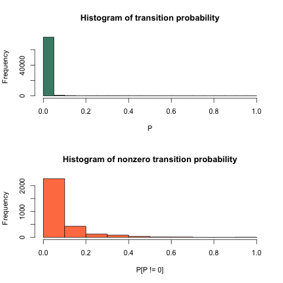
```


A stationary probability vector $\pi$ for Markov chain $\boldsymbol{P}$ is then computed through solving equation $\pi \boldsymbol{P} = \pi.$

Diffusion distance for directed graph at time $t$ is defined as:

$C^2_{t} = \kappa \big( \boldsymbol{P}^{t} \Pi^{-1} (\boldsymbol{P^{t}})^{T}    \big)$
,where $\kappa (A) = \boldsymbol{A_{dg} 1 1^{T} - A - A^{T} + 1 1^{T} A_{dg}}.$

We implement the test at $t = 1, 2, ..., 20.$

## Results (P-value)
<a name=" results"/>

Unlike the simulation data, we never know the (estimated) power. Instead we have p-value heatmap for every combination of neighborhood choice $(k,l)$ and diffusion time $t.$

### Euclidean Distance of nodal attribute X

```{r, out.width = 300, out.height = 400, echo = FALSE, fig.align='center', fig.show='hold'}
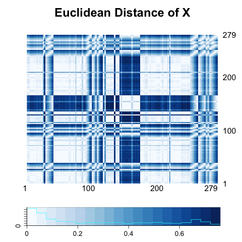
```


### Diffusion Distance as a function of t

```{r, out.width = 300, out.height = 400, echo = FALSE, fig.align='center', fig.show='hold', out.extra='style="float:left"'}
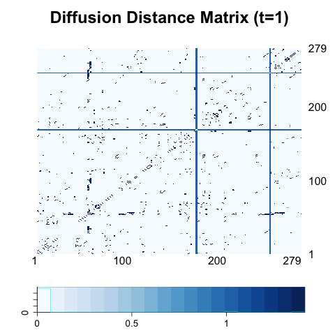
```
```{r, out.width = 300, out.height = 400, echo = FALSE, fig.align='center', fig.show='hold'}
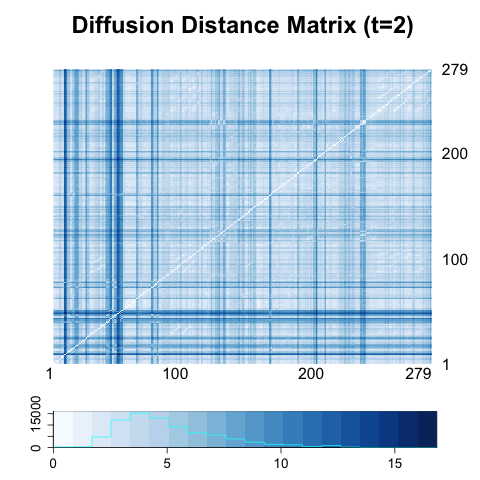
```
```{r, out.width = 300, out.height = 400, echo = FALSE, fig.align='center', fig.show='hold', out.extra='style="float:left"'}
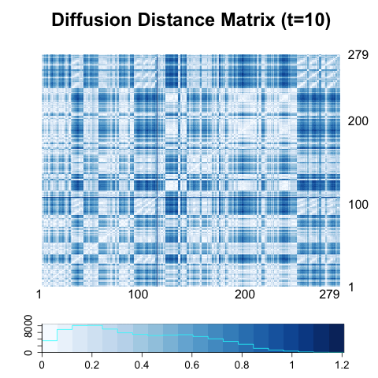
```
```{r, out.width = 300, out.height = 400, echo = FALSE, fig.align='center', fig.show='hold'}
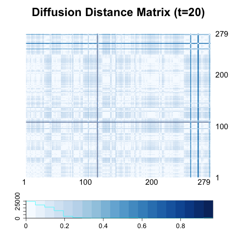
```


### P-value Heatmap


P-value based on 300 permutated random networks.

```{r, out.width = 300, out.height = 400, echo = FALSE, fig.align='center', fig.show='hold', out.extra='style="float:left"'}
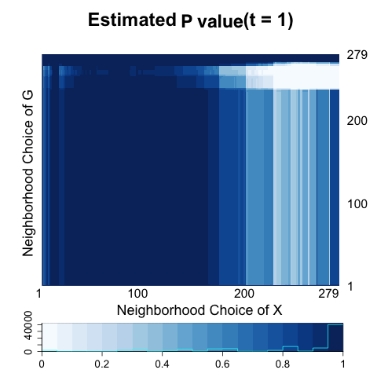
```
```{r, out.width = 300, out.height = 400, echo = FALSE, fig.align='center', fig.show='hold', out.extra='style="float:left"'}
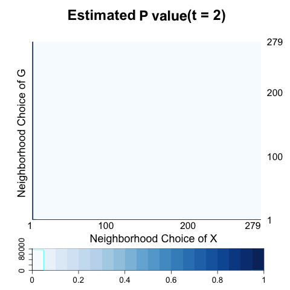
```
```{r, out.width = 300, out.height = 400, echo = FALSE, fig.align='center', fig.show='hold'}

```


### Other possible distance matrices

- Dissmilarity Matrix


$$C[i,j] = \left\{ \begin{array}{cc}  0 & \mbox{i and j are adjacent} \\ 1  & \mbox{o.w}   \end{array}\right.$$


```{r, out.width = 300, out.height = 400, echo = FALSE, fig.align='center', fig.show='hold', out.extra='style="float:left"'}
knitr::include_graphics("../figure/DisA.png")
```
```{r, out.width = 300, out.height = 400, echo = FALSE, fig.align='center', fig.show='hold'}
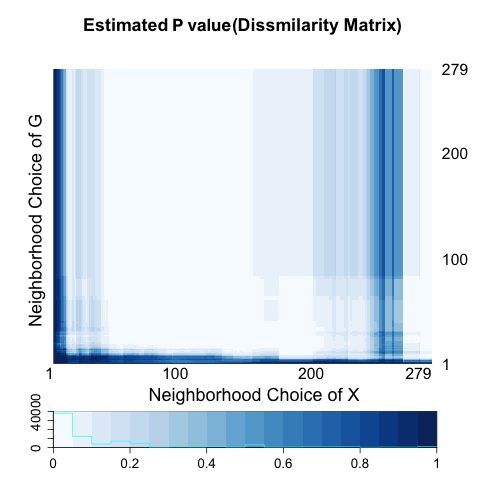
```


<hr />


- Euclidean Distance of Dissimilarity Matrix


```{r, out.width = 300, out.height = 400, echo = FALSE, fig.align='center', fig.show='hold', out.extra='style="float:left"'}
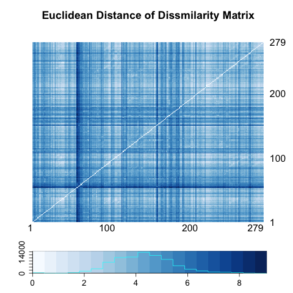
```
```{r, out.width = 300, out.height = 400, echo = FALSE, fig.align='center', fig.show='hold'}

```


