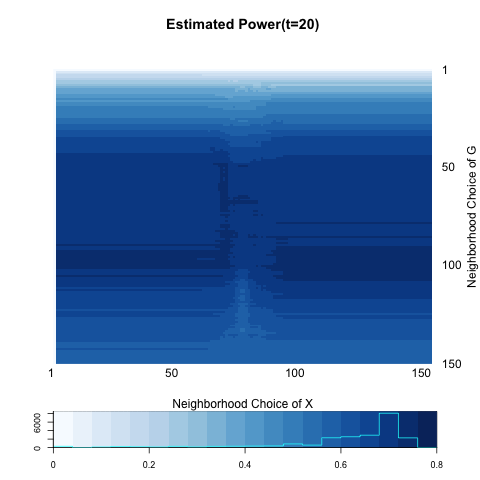
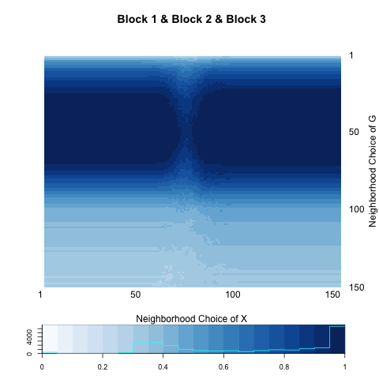
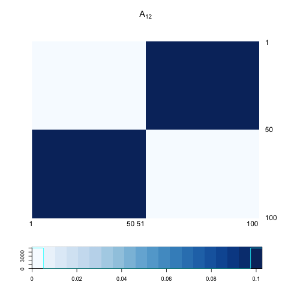

We are testing independence between network (graph) $G$ and its nodes' attributes $X$.

$$H_{0} : f_{GX} = f_{G} \cdot f_{X}$$

$$H_{A} : f_{GX} \neq f_{G} \cdot f_{X}$$

Test statistic which is used to measure the distances between two random variables $G \in \mathcal{G}(n; p,q)$ and $X \in \mathcal{R}$ is defined as follows for all pairs of $\{(k,l); k,l=1,..,n\}$:

$$dCorr_{kl}(G,X) = \frac{dCov_{kl}(G,X)}{\sqrt{dVar_{k}(G) \cdot dVar_{l}(X)}}$$
,where

$$dCov_{kl}(G,X) = \frac{1}{n^2} \sum\limits_{i,j}^{n} A^{H}_{ij} B^{H}_{ij} I(r(A_{ij}) < k) I(r(B_{ij}) < l )$$

$$dVar_{k}(G) = \frac{1}{n^2} \sum\limits_{i,j=1}^{n} A^{H}_{ij}A^{H}_{ij} I\big( r(A_{ij}) < k \big)$$

$$dVar_{k}(X) = \frac{1}{n^2} \sum\limits_{i,j=1}^{n} B^{H}_{ij}B^{H}_{ij} I\big( r(B_{ij}) < k \big)$$


where $A^{H} = HAH; A_{ij} = \parallel G_{i} - G_{j} \parallel ; H = I_{n} - J_{n} / n;$ $r(A_{ij}) = k$ if and only if $A_{ij}$ is the $k^{th}$ smallest distance in $\{ A_{ij} ; i,j=1,..,n , i \neq j \}.$


The critical value of the test is based on the prespecified Type-I error $\alpha = 0.05$. P-value for each iteration is obtained through permutation.

The testing power of local distance correlation equals to the best power among all of the local family. What we call global test refers to the test when $k=l=n,$ i.e. a test including all ranges of neighborhood. On the other hand, local optimal is a test of highest power.


```{r echo=FALSE, message =FALSE, warning = FALSE}
library(igraph)
library(RefManageR)
library(xtable)
library(grid)
library(ggplot2)
library(png)
library(grid)
library(knitr)
bib <- ReadBib(system.file("Bib", "biblatexExamples.bib", 
                           package = "RefManageR"), check = FALSE)
BibOptions(check.entries = FALSE, style = "markdown", bib.style = "alphabetic", cite.style = 'alphabetic')
```


- [Summary](# Summary)

- [Diffusion Process](# Diffusion Process)

- [Correlation between Matrics](# Correlation between Matrics)

- [Local Power Heatmap](# Power Heatmap)

- [Euclidean Distance of Network](# Euclidean Distance of Network)


## Summary
<a name=" Summary"/>

### Two block(B2.1)

```{r echo = FALSE, results='asis'}
a <- c(0.9133333, 0.8200000,  0.5933333)
b <- c(0.9566667,  0.8533333,  0.6333333)

table <- matrix(0, nrow = 2, ncol = 3)
rownames(table) <- c("global test", "local optimal")
colnames(table) <- c("t=1",  "t=5",  "t=20")
table[1,] <- a
table[2,] <- b
table <- as.data.frame(table)
kable(table, align = 'c', digits = 2)
```


### Three blocks(B3.1)


```{r echo = FALSE, results='asis'}
a <- c(0.7366667,  0.7400000,  0.7200000)
b <- c(0.7466667, 0.7666667,  0.7533333)

table <- matrix(0, nrow = 2, ncol = 3)
rownames(table) <- c("global test", "local optimal")
colnames(table) <- c("t=1", "t=5",  "t=20")
table[1,] <- a
table[2,] <- b
table <- as.data.frame(table)
kable(table, align = 'c', digits = 2)
```


### Three blocks(B3.2)

```{r echo = FALSE, results='asis'}
a <- c(0.6833333,  0.7666667,  0.6533333)
b <- c(0.7033333,  0.7666667,  0.7400000)

table <- matrix(0, nrow = 2, ncol = 3)
rownames(table) <- c("global test", "local optimal")
colnames(table) <- c("t=1",  "t=5",  "t=20")
table[1,] <- a
table[2,] <- b
table <- as.data.frame(table)
kable(table, align = 'c', digits = 2)
```

### Three blocks(B3.3)(*)

```{r echo = FALSE, results='asis'}
a <- c(0.6266667,  0.5933333,  0.5633333)
b <- c(0.6900000,  0.7600000,  0.7500000)

table <- matrix(0, nrow = 2, ncol = 3)
rownames(table) <- c("global test", "local optimal")
colnames(table) <- c("t=1",  "t=5",  "t=20")
table[1,] <- a
table[2,] <- b
table <- as.data.frame(table)
kable(table, align = 'c', digits = 2)
```


### Three blocks(B3.4)(*)

```{r echo = FALSE, results='asis'}
a <- c(0.5800000, 0.1733333,  0.02666667)
b <- c(0.6433333, 0.6233333,  0.37666667)

table <- matrix(0, nrow = 2, ncol = 3)
rownames(table) <- c("global test", "local optimal")
colnames(table) <- c("t=1",  "t=5", "t=20")
table[1,] <- a
table[2,] <- b
table <- as.data.frame(table)
kable(table, align = 'c', digits = 2)
```


You can see that superiority of local test is much more clear when the between-block probabilities are different between pairs of blocks, and the between-block probability is NOT proportional to the similarity in distribution between the blocks. For instance, in the case where the distributions of ``Block1`` and ``Block3`` is much more similar than those between ``Block1`` and ``Block2`` but probability of having relations (or having edges) between ``Block1`` and ``Block2`` is higher, power to test local dependence is higher than the global dependence. In this situation, not including ``Block3`` would be better.   


## Diffusion Process
<a name=" Diffusion Process"/>

Let us focus on the following simulations:

- (B3.3) : The discrepancy between the local and global is increasing, and the power does not decrease as time increase, at least. 

```{r, out.width = 300, out.height = 300, echo = FALSE, fig.align='center', fig.show='hold', out.extra='style="float:left"'}
knitr::include_graphics("../figure/local12_1.png")
```
```{r, out.width = 300, out.height = 300, echo = FALSE, fig.align='center', fig.show='hold', out.extra='style="float:left"'}
knitr::include_graphics("../figure/local12_5.png")
```
```{r, out.width = 300, out.height = 300, echo = FALSE, fig.align='center', fig.show='hold'}

```


- (B3.4) : The discrepancy between the local and global is increasing, and the power is systematically decreasing as time goes by. 

```{r, out.width = 300, out.height = 300, echo = FALSE, fig.align='center', fig.show='hold', out.extra='style="float:left"'}

```
```{r, out.width = 300, out.height = 300, echo = FALSE, fig.align='center', fig.show='hold', out.extra='style="float:left"'}
knitr::include_graphics("../figure/local25_5.png")
```
```{r, out.width = 300, out.height = 300, echo = FALSE, fig.align='center', fig.show='hold'}

```

<hr />

First of all, let us focus on increasing discrepancy betwen local and global in (B3.3). The following panels show the changes in distance matrix of $G$, $A$, across time points. At $t=1,$ difference between blocks is not noticeably distinct each other - diffusion process is not yet active. As time increase, you can notice the difference between each block while the absolute difference is shrinking. On the other hand, distance matrix $B$ of node attribute $X$ is free from diffusion process. You can notice that ``block3`` is "redundant" in a sense that it cannot tell any difference between other blocks. That might incicate that when you consider the neighborhood choice of $X,$ not including node 100 - 150 would be a better choice. Note that this node set is almost middle part of $X$($\sim Bern(0.5)$). This might be the reason why we have a "middle hole" of column in most of the heatmap. 


Let us focus on the distance matrix of $A.$ For ``Block1``, including the upto 100 neighborhood, i.e. including ``Block2`` but not including ``Block3``. For nodes in ``Block2``, they cannot differentiate between ``Block1`` and ``Block3`` in distance matrix $A$. In the case of ``Block3``, it seems that their network distance is independent of attribute distance. Therefore, in overall, including upto 100 neighbors looks the best choice in overall. 


```{r, out.width = 200, out.height = 300, echo = FALSE, fig.align='center', fig.show='hold', out.extra='style="float:left"'}
knitr::include_graphics("../figure/local12_A1.png")
```
```{r, out.width = 200, out.height = 300, echo = FALSE, fig.align='center', fig.show='hold', out.extra='style="float:left"'}
knitr::include_graphics("../figure/local12_A5.png")
```
```{r, out.width = 200, out.height = 300, echo = FALSE, fig.align='center', fig.show='hold', out.extra='style="float:left"', out.extra='style="float:left"'}

```
```{r, out.width = 200, out.height = 300, echo = FALSE, fig.align='center', fig.show='hold'}

```

<hr />

Consider the case of (B3.4). Most obvious pattern you can see here is that in distance matrix of $A,$ distance between ``Block1`` and ``Block2`` are almost zero, especially compared to the distance to the ``Block3``. Since the attribute distribution of $X$ is most different between these two, for both block ``Block1`` and ``Block2``, including individuals only in the same block woul be best. In case of ``Block3``, by the same argument from (B3.3), including neighbors upto 50 will be the best.  


```{r, out.width = 200, out.height = 300, echo = FALSE, fig.align='center', fig.show='hold', out.extra='style="float:left"'}

```
```{r, out.width = 200, out.height = 300, echo = FALSE, fig.align='center', fig.show='hold', out.extra='style="float:left"'}
knitr::include_graphics("../figure/local25_A5.png")
```
```{r, out.width = 200, out.height = 300, echo = FALSE, fig.align='center', fig.show='hold', out.extra='style="float:left"'}
knitr::include_graphics("../figure/local25_A20.png")
```
```{r, out.width = 200, out.height = 300, echo = FALSE, fig.align='center', fig.show='hold'}
knitr::include_graphics("../figure/local25_B.png")
```

Now let's think about why even the optimal one is decreasing. I discussed above that including only within-block membership is the best. As diffusion process progresses, distance between block is getting smaller. That might be the reason. 


## Correlation between Matrics
<a name=" Correlation between Matrics"/>


My next assumption is that the testing results may be related to the correlation between the columns of $A \cdot B$ and the columns of $\tilde{A} \cdot \tilde{B}.$ I have found that in the case where global test can be considered as a local maximum, heatmap of $A \cdot B$ looks similar to heatmap of $\tilde{A} \cdot \tilde{B}$ while it is not, these two are not proportional. 

- B3.1 (global $\approx$ local)


```{r echo = FALSE, results='asis', warning =FALSE}
globalcor <- c(0.58,0.95,0.99,0.99,0.97)
localcor1 <- c(0.20,0.62,0.88,0.89,0.89)
localcor2 <- c(0.24,0.61,0.85,0.86,0.86)
localcor3 <- c(0.18,0.35,0.61,0.62,0.63)
localcor12 <- c(0.73,0.98,0.99,0.99,0.98)
localcor13 <- c(0.58,0.93,0.98,0.97,0.93)
localcor23 <- c(0.43,0.91,0.98,0.98,0.98)

cor.summary <- matrix(0, ncol = 6, nrow = 7)
cor.summary <- as.data.frame(cor.summary)
cor.summary[1,] <- c("global1",globalcor)
cor.summary[2,] <- c("block1",localcor1)
cor.summary[3,] <- c("block2",localcor2)
cor.summary[4,] <- c("block3",localcor3)
cor.summary[5,] <- c("block1,2",localcor12)
cor.summary[6,] <- c("block1,3",localcor13)
cor.summary[7,] <- c("block2,3", localcor23)
kable(cor.summary, align = 'c', col.names =  c("time", "1", "2", "5", "10", "20"), row.names = NA)

```


- B3.3 (local optimal $\approx$ including 50-100 neighbors in graph $G$)

```{r echo = FALSE, results='asis'}
globalcor <- c(0.10, 0.15, 0.17, 0.16, 0.16)
localcor1 <- c(0.15, 0.34,0.67,0.67,0.66 )
localcor2 <- c(0.23, 0.50,0.81,0.82,0.82)
localcor3 <- c(0.17, 0.36,0.70,0.73,0.74)
localcor12 <- c(0.14, 0.21,0.22,0.20,0.20)
localcor13 <- c(0.38,0.86,0.96,0.96,0.96)
localcor23 <- c(-0.22,0.00,0.20,0.28,0.28)

cor.summary <- matrix(0, ncol = 6, nrow = 7)
cor.summary <- as.data.frame(cor.summary)
cor.summary[1,] <- c("global1",globalcor)
cor.summary[2,] <- c("block1",localcor1)
cor.summary[3,] <- c("block2",localcor2)
cor.summary[4,] <- c("block3",localcor3)
cor.summary[5,] <- c("block1,2",localcor12)
cor.summary[6,] <- c("block1,3",localcor13)
cor.summary[7,] <- c("block2,3", localcor23)
kable(cor.summary, align = 'c', col.names =  c("time", "1", "2", "5", "10", "20"), row.names = NA)

```


```{r echo = FALSE, results='asis'}
opt.summary <- matrix(0, ncol = 5, nrow = 3)
rownames(opt.summary) <- c("optimal scale", "correlation", "optimal power")
opt.summary[1,] <- c("(98,92)","(100,92)", "(98,92)", "(100,92)", "(98,92)")
opt.summary[2,] <- c(0.28, 0.37, 0.59, 0.55, 0.58)
opt.summary[3,] <- c(0.69, 0.76,  0.76,	0.77,	0.75)
kable(opt.summary, align = 'c', digits = 2, col.names =  c("1", "2", "5", "10", "20"), row.names = NA)
```

- B3.4 (local optimal $\approx$ including 50 neighbors in graph $G$)

```{r echo = FALSE, results='asis'}
globalcor <- c(0.06, 0.08, 0.05, 0.02, 0.02)
localcor1 <- c(0.17, 0.42, 0.73, 0.83, 0.86)
localcor2 <- c(0.23, 0.46, 0.71, 0.76, 0.78)
localcor3 <- c(0.16, 0.31, 0.61, 0.63, 0.63)
localcor12 <- c(0.56, 0.92, 0.96, 0.83, 0.79)
localcor13 <- c(-0.35, -0.32, -0.16, 0.14, 0.26)
localcor23 <- c(-0.38, -0.34, -0.18, 0.12, 0.23)

cor.summary <- matrix(0, ncol = 6, nrow = 7)
cor.summary <- as.data.frame(cor.summary)
cor.summary[1,] <- c("global1",globalcor)
cor.summary[2,] <- c("block1",localcor1)
cor.summary[3,] <- c("block2",localcor2)
cor.summary[4,] <- c("block3",localcor3)
cor.summary[5,] <- c("block1,2",localcor12)
cor.summary[6,] <- c("block1,3",localcor13)
cor.summary[7,] <- c("block2,3", localcor23)
kable(cor.summary, align = 'c', col.names =  c("time", "1", "2", "5", "10", "20"), row.names = NA)

```


```{r echo = FALSE, results='asis'}
opt.summary <- matrix(0, ncol = 5, nrow = 3)
rownames(opt.summary) <- c("optimal scale", "correlation", "optimal power")
colnames(opt.summary) <- c("t=1", "t=2", "t=5", "t=10", "t=20")
opt.summary[1,] <- c("(102,150)","(52,150)", "(50,150)", "(49,150)", "(47,150)")
opt.summary[2,] <- c(0.05, 0.43, 0.62, 0.30, 0.13)
opt.summary[3,] <- c(0.64,0.69, 0.62, 0.47,0.38)
kable(opt.summary, align = 'c', digits = 2, col.names =  c("1", "2", "5", "10", "20"), row.names = NA)
```


In this section, let's forget about diffusion process and only think about two distance matrices $A$ and $B$ and think about when and why the local test is better than the global test in three-block cases. For simplicity, let's fix distance distribution of $X$, and then consider the following three cases : (1) Including one block ($k^{*} \approx 50$) is the optimal; (2) Including one neighboring block ($k^{*} \approx 100$) is the optimal; (3) global test ($k^{*} \approx 150$) is the optimal.


By mimicking (B3.4), I generated two distance matrices $A$ and $B$ while keeping symmetry to figure out why and when the local test beats global one:

$$A = \left[  \begin{array}{c|c|c} N(0,0.01) & N(0.1, 0.01)  & N(1, 0.01) \\ \hline N(0.1, 0.01) & N(0, 0.01) & N(1, 0.01) \\ \hline N(1, 0.01) & N(1, 0.01) & N(0, 0.01) \end{array} \right]$$


$$B = \left[  \begin{array}{c|c|c} Bern(0.4) & Bern(0.6)  & Bern(0.5) \\ \hline Bern(0.6) & Bern(0.4) & Bern(0.5) \\ \hline Bern(0.5) & Bern(0.5) & Bern(0.5) \end{array} \right]$$


```{r, out.width = 300, out.height = 300, echo = FALSE, fig.align='center', fig.show='hold', out.extra='style="float:left"'}

```
```{r, out.width = 300, out.height = 300, echo = FALSE, fig.align='center', fig.show='hold', out.extra='style="float:left"'}

```
```{r, out.width = 300, out.height = 300, echo = FALSE, fig.align='center', fig.show='hold'}

```

Power heatmap suggests the optimal scale is most dependent on the neighborhood choice of $G$ and it prefers choosing almost 50 closest neighbors. Next I look through each pair of block. Between ``Block1`` and ``Block2``, it is quite obvious that both locally globally $A$ and $B$ are positively correlated each other. On the other hand, in the case of (``Block1``, ``Block3``) and (``Block2``,``Block3``), including 50 closest neighbors has equal (or higher) power than the global test(including whole 100 neighbors).   


```{r, out.width = 300, out.height = 300, echo = FALSE, fig.align='center', fig.show='hold', out.extra='style="float:left"'}

```
```{r, out.width = 300, out.height = 300, echo = FALSE, fig.align='center', fig.show='hold', out.extra='style="float:left"'}

```
```{r, out.width = 300, out.height = 300, echo = FALSE, fig.align='center', fig.show='hold'}
knitr::include_graphics("../figure/block23.png")
```
 

Let's make a comparison between "block1 & block2" and "block 1 & block 3" as below. 


```{r, out.width = 200, out.height = 300, echo = FALSE, fig.align='center', fig.show='hold', out.extra='style="float:left"'}

```
```{r, out.width = 200, out.height = 300, echo = FALSE, fig.align='center', fig.show='hold', out.extra='style="float:left"'}

```
```{r, out.width = 200, out.height = 300, echo = FALSE, fig.align='center', fig.show='hold', out.extra='style="float:left"'}

```
```{r, out.width = 200, out.height = 300, echo = FALSE, fig.align='center', fig.show='hold'}

```


Relative difference in matrix $A$ is similar: for each block, within-block difference is much smaller than between-block difference. In case of matrix $B_{12}$ matrix for ``block1`` and ``block2``, this relation still holds. In case of $B_{13}$ matrix for ``block1`` and ``block3``, this does not hold. For ``block3``, distance in $B$ is nearly independent of distance in $A$.   


```{r, out.width = 300, out.height = 300, echo = FALSE, fig.align='center', fig.show='hold', out.extra='style="float:left"'}

```
```{r, out.width = 300, out.height = 300, echo = FALSE, fig.align='center', fig.show='hold'}

```

In this block1 and block2 case, the correlation between $A_{12} \cdot B_{12}$ and $\tilde{A}_{12} \cdot \tilde{B}_{12}$ is 0.9994942 while in the correlation between $A_{13} \cdot B_{13}$ and $\tilde{A}_{13} \cdot \tilde{B}_{13}$ is 0.6446029.  


```{r, out.width = 300, out.height = 300, echo = FALSE, fig.align='center', fig.show='hold', out.extra='style="float:left"'}

```
```{r, out.width = 300, out.height = 300, echo = FALSE, fig.align='center', fig.show='hold'}

```

I am still looking for why this happens, connecting to the plots above. 


## Local Power Heatmap
<a name=" Local Power Heatmap"/>

Suppose that $1 \leq k^{*}, l^{*} \leq n$ is the optimal neighborhood choice for $G$ and $X,$ respectively.

$$A^{k^{*}}_{ij} = \left\{ \begin{array}{cc}  A_{ij} & rank_{i}(j) \leq k^{*} \\ 0 & rank_{i}(j) > k^{*} \end{array} \right.$$

$$B^{l^{*}}_{ij} = \left\{ \begin{array}{cc}  B_{ij} & rank_{i}(j) \leq l^{*} \\ 0 & rank_{i}(j) > l^{*} \end{array} \right.$$

Make sure test statistics having $A^{k^{*}}$ and $B^{l^{*}}$ would have global test as the optimal. (?)


## Euclidean Distance of Network
<a name=" Euclidean Distance of Network"/>

It is known that a distance correlation is consistent against all dependent alternatives when testing on Euclidean data. Here we simply think of distance between nodes on network space as an Euclidean distance of similarity matrix. Similarity matrix is defined based on and adjacency matrix. 

Let $Adj_{G} := E$ be an adjacency matrix of graph $G = (V , E)$, i.e. for each $i ,j \in V$

$$E_{ij} = \left\{ \begin{array}{cc} 1 &  e = (i,j) \in E \\ 0 & \mbox{ o.w } \end{array} \right.$$

Define a similarity matrix $S$ based on an adjacency matrix $E:$

$$S_{ij} = \left\{ \begin{array}{cc} 1 &  E_{ij} = 0 \\ 0 & E_{ij} = 1 \end{array} \right.$$

This implies that if node $i$ and node $j$ are adjacent each other, $S_{ij} = 0,$ and otherwise, $S_{ij} = 0.$ Distance matrix of $A$ is just a formal Euclidean distance from this similarity matrix $A:$

$$A_{ij} = \parallel S_{i \cdot} -  S_{j \cdot} \parallel$$

## Implications
<a name=" Implications"/>


