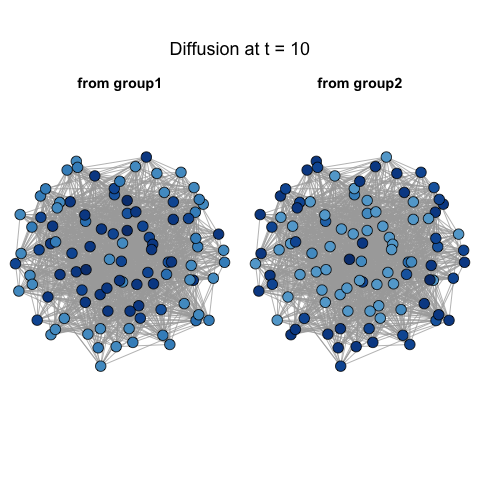
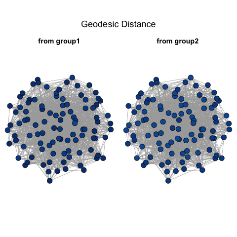

Diffusion distance provides the multiscale geometrics for nodes in network space. Especially, we want to show its sensitivity to local structures.

## Distance in Network Space

Adjacency matrix or geodesic distance (the length of shortest path connecting a pair of nodes) holds positive-definity, but adjacency matrix or similarity matrix disobeys identity of indiscernibles unless every pair of node is adjacent each other. Both adjacency and geodesic distance disobeys triangle identity. 

Suppose $G$ is a connected, undirected graph. On the other hand, diffusion distance at diffusion time $t$, $D_{t} : u \times v \rightarrow [0, \infty)$ satisfies the following conditions required for being a proper metric:

1. $D_{t}(u, v) \geq  0$

2. $D_{t}(u,v) = 0 \Leftrightarrow u = v$ (if and only if $G$ is connected.)

3. $D_{t}(u,v) = D_{t}(v,u)$ (if and only if $G$ is undirected.)

4. $D_{t}(u,v) \leq D_{t}(u,w) + D_{t}(w,v)$ [proof of triangle inequality](# Appendix)

[Coifman $\&$ Lafon](http://ac.els-cdn.com/S1063520306000546/1-s2.0-S1063520306000546-main.pdf?_tid=551a6f5e-33e3-11e6-aee2-00000aab0f6c&acdnat=1466096396_e605dca62dc945ba759fe647a407d02f) showed that the diffusion maps offer a representation of the data as a clude of points in a Euclidean space, by proving that the diffusion map embeds the data into the Euclidean space, so that in this space, the Euclidean distance is equal to the diffusion distance. 


## Comparison between distance metrics

### [sim] two.8 simulation

  $$X \sim Bern(0.5)$$
  
  $$Z  \sim  \left\{  \begin{array}{cc} Bern(0.6) & X = 0 \\ Bern(0.4) & X = 1  \end{array} \right.$$
  
 $$A \sim Bern \left[  \begin{array}{cc} \color{red}{0.3} & 0.05  \\ 0.05 & \color{blue}{0.2} \end{array}  \right]$$


#### Power

```{r, out.width = 500, out.height = 400, echo = FALSE, fig.align='center', fig.show='hold'}

```


#### Diffusion Process

- t = 1

```{r, out.width = 400, out.height = 400, echo = FALSE, fig.align='center', fig.show='hold', out.extra='style="float:left"'}

```
```{r, out.width = 400, out.height = 400, echo = FALSE, fig.align='center', fig.show='hold'}

```


- t = 5

```{r, out.width = 400, out.height = 400, echo = FALSE, fig.align='center', fig.show='hold', out.extra='style="float:left"'}

```
```{r, out.width = 400, out.height = 400, echo = FALSE, fig.align='center', fig.show='hold'}

```


- t = 30

```{r, out.width = 400, out.height = 400, echo = FALSE, fig.align='center', fig.show='hold', out.extra='style="float:left"'}

```
```{r, out.width = 400, out.height = 400, echo = FALSE, fig.align='center', fig.show='hold'}

```


#### Other distance measure


- Non-adjacency (dissimilarity) 

```{r, out.width = 400, out.height = 400, echo = FALSE, fig.align='center', fig.show='hold', out.extra='style="float:left"'}

```
```{r, out.width = 400, out.height = 400, echo = FALSE, fig.align='center', fig.show='hold'}

```


- Euclidean Distance of dissimilarity matrix

```{r, out.width = 400, out.height = 400, echo = FALSE, fig.align='center', fig.show='hold', out.extra='style="float:left"'}
knitr::include_graphics("../figure/Dtwo8_E.png")
```
```{r, out.width = 400, out.height = 400, echo = FALSE, fig.align='center', fig.show='hold'}

```


- Geodesic Distance

```{r, out.width = 400, out.height = 400, echo = FALSE, fig.align='center', fig.show='hold', out.extra='style="float:left"'}

```
```{r, out.width = 400, out.height = 400, echo = FALSE, fig.align='center', fig.show='hold'}

```


### [sim] two.9 simulation

  $$X \sim Bern(0.5)$$
  
  $$Z  \sim  \left\{  \begin{array}{cc} Bern(0.6) & X = 0 \\ Bern(0.4) & X = 1  \end{array} \right.$$
  
 $$A \sim Bern \left[  \begin{array}{cc} \color{red}{0.3} & 0.1  \\ 0.1 & 0.1 \end{array}  \right]$$


#### Power

```{r, out.width = 500, out.height = 400, echo = FALSE, fig.align='center', fig.show='hold'}

```


### [sim] two.10 simulation

  $$X \sim Bern(0.5)$$
  
  $$Z  \sim  \left\{  \begin{array}{cc} Bern(0.6) & X = 0 \\ Bern(0.4) & X = 1  \end{array} \right.$$
  
 $$A \sim Bern \left[  \begin{array}{cc} \color{red}{0.1} & 0.3  \\ 0.3 & 0.3 \end{array}  \right]$$

#### Power

```{r, out.width = 500, out.height = 400, echo = FALSE, fig.align='center', fig.show='hold'}

```


#### Diffusion Process

- t = 1

```{r, out.width = 400, out.height = 400, echo = FALSE, fig.align='center', fig.show='hold', out.extra='style="float:left"'}

```
```{r, out.width = 400, out.height = 400, echo = FALSE, fig.align='center', fig.show='hold'}

```


- t = 10

```{r, out.width = 400, out.height = 400, echo = FALSE, fig.align='center', fig.show='hold', out.extra='style="float:left"'}

```
```{r, out.width = 400, out.height = 400, echo = FALSE, fig.align='center', fig.show='hold'}

```


- t = 20

```{r, out.width = 400, out.height = 400, echo = FALSE, fig.align='center', fig.show='hold', out.extra='style="float:left"'}

```
```{r, out.width = 400, out.height = 400, echo = FALSE, fig.align='center', fig.show='hold'}

```


#### Other distance measure


- Non-adjacency (dissimilarity) 

```{r, out.width = 400, out.height = 400, echo = FALSE, fig.align='center', fig.show='hold', out.extra='style="float:left"'}

```
```{r, out.width = 400, out.height = 400, echo = FALSE, fig.align='center', fig.show='hold', out.extra='style="float:left"'}

```


- Euclidean Distance of dissimilarity matrix

```{r, out.width = 400, out.height = 400, echo = FALSE, fig.align='center', fig.show='hold', out.extra='style="float:left"'}

```
```{r, out.width = 400, out.height = 400, echo = FALSE, fig.align='center', fig.show='hold'}

```


- Geodesic Distance

```{r, out.width = 400, out.height = 400, echo = FALSE, fig.align='center', fig.show='hold', out.extra='style="float:left"'}

```
```{r, out.width = 400, out.height = 400, echo = FALSE, fig.align='center', fig.show='hold'}

```


### [sim] three.13 simulation

 $$X \sim Multinomial(1/3, 1/3, 1/3)$$

 $$Z  \sim  \left\{  \begin{array}{cc} Multinorm(\color{red}{0.5}, 0.25, 0.25 ) & X = 1 \\ Multinorm(0.25, \color{red}{0.5}, 0.25  ) & X = 2 \\ Multinorm(0.25, 0.25, \color{red}{0.5} ) & X = 3 \end{array} \right.$$
 
 $$A \sim Bern \left[  \begin{array}{cc} \color{red}{0.3} & 0.05 & 0.05 \\ 0.05 & \color{red}{0.1} & 0.05  \\ 0.05 & 0.05 & \color{red}{0.2}   \end{array}  \right]$$


#### Power

```{r, out.width = 500, out.height = 400, echo = FALSE, fig.align='center', fig.show='hold'}

```


#### Diffusion Process

- t = 1

```{r, out.width = 400, out.height = 400, echo = FALSE, fig.align='center', fig.show='hold', out.extra='style="float:left"'}

```
```{r, out.width = 400, out.height = 400, echo = FALSE, fig.align='center', fig.show='hold'}

```


- t = 10

```{r, out.width = 400, out.height = 400, echo = FALSE, fig.align='center', fig.show='hold', out.extra='style="float:left"'}

```
```{r, out.width = 400, out.height = 400, echo = FALSE, fig.align='center', fig.show='hold'}

```


- t = 20

```{r, out.width = 400, out.height = 400, echo = FALSE, fig.align='center', fig.show='hold', out.extra='style="float:left"'}

```
```{r, out.width = 400, out.height = 400, echo = FALSE, fig.align='center', fig.show='hold'}

```


#### Other distance measure


- Non-adjacency (dissimilarity) 

```{r, out.width = 400, out.height = 400, echo = FALSE, fig.align='center', fig.show='hold', out.extra='style="float:left"'}

```
```{r, out.width = 400, out.height = 400, echo = FALSE, fig.align='center', fig.show='hold', out.extra='style="float:left"'}

```


- Euclidean Distance of dissimilarity matrix

```{r, out.width = 400, out.height = 400, echo = FALSE, fig.align='center', fig.show='hold', out.extra='style="float:left"'}

```
```{r, out.width = 400, out.height = 400, echo = FALSE, fig.align='center', fig.show='hold'}

```


- Geodesic Distance

```{r, out.width = 400, out.height = 400, echo = FALSE, fig.align='center', fig.show='hold', out.extra='style="float:left"'}

```
```{r, out.width = 400, out.height = 400, echo = FALSE, fig.align='center', fig.show='hold'}
knitr::include_graphics("../figure/Dthree13_diffusionGeo.png")
```


### [sim] three.16 simulation

 $$X \sim Multinomial(1/3, 1/3, 1/3)$$

 $$Z  \sim  \left\{  \begin{array}{cc} Multinorm(\color{red}{0.5}, 0.25, 0.25 ) & X = 1 \\ Multinorm(0.25, \color{red}{0.5}, 0.25  ) & X = 2 \\ Multinorm(0.25, 0.25, \color{red}{0.5} ) & X = 3 \end{array} \right.$$
 
 $$A \sim Bern \left[  \begin{array}{cc} \color{red}{0.2} & 0.1 & 0.1 \\ 0.1 & \color{red}{0.05} & 0.1  \\ 0.1 & 0.1 & \color{red}{0.2}   \end{array}  \right]$$


#### Power

```{r, out.width = 500, out.height = 400, echo = FALSE, fig.align='center', fig.show='hold'}

```


## Appendix
<a name=" Appendix"/>

### Proof of triangle inequality

Let $x, y, z \in V(G).$

$$\begin{align*} D^{2}_{t}(x,z) & = \sum\limits_{w \in V(G)} \big( P^{t}(x,w) - P^{t}(z,w)   \big)^2 \frac{1}{\pi(w)}  \\ & = \sum\limits_{w \in V(G)} \big(P^{t}(x, w) - P^{t}(y,w) + P^{t}(y,w) - P^{t}(z,w) \big)^2 \frac{1}{\pi(w)} \\ & = \sum\limits_{w \in V(G)} \big( P^{t}(x,w) - P^{t}(y,w) \big)^2 \frac{1}{\pi(w)}  + \sum\limits_{w \in V(G)} \big( P^{t}(y,w) - P^{t}(z,w)  \big)^2 \frac{1}{\pi(w)} \\ & + 2 \sum\limits_{w \in V(G)} \big( P^{t}(x,w) - P^{t}(y,w)  \big) \big( P^{t}(y,w) - P^{t}(z,w)  \big)\frac{1}{\pi(w)} \\ &= D^{2}_{t}(x,y) + D^{2}_{t}(y,z) +  2 \sum\limits_{w \in V(G)} \big( P^{t}(x,w) - P^{t}(y,w)  \big) \big( P^{t}(y,w) - P^{t}(z,w)  \big)\frac{1}{\pi(w)}   \end{align*}.$$

Thus it suffices to show that 

$$\begin{align} 
\sum\limits_{w \in V(G)} \big( P^{t}(x,w) - P^{t}(y,w)  \big) \big( P^{t}(y,w) - P^{t}(z,w)  \big)\frac{1}{\pi(w)} \leq D_{t}(x,y) \cdot D_{t}(y,z). \end{align}$$

Let $a_{w} = \big(P^{t}(x,w) - P^{t}(y,w) \big) \sqrt{1 / \pi(w)}$ and $b_{w} = \big( P^{t}(y,w) - P^{t}(z,w) \big) \sqrt{1 / \pi(w)}$. Then the above inequality is equivalent to :

$$\begin{align} 
\sum\limits_{w \in V(G)} a_{w} \cdot b_{w} \leq \sqrt{\sum\limits_{w \in V(G)} a^2_{w} \cdot \sum\limits_{w \in V(G)} b^2_{w} } \end{align}$$

,which is true by Cauchy-Schwarz inequality.


