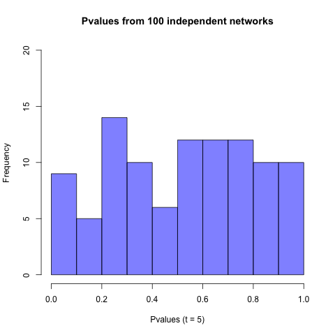

- [Main Theorem](#theorem)
- [Exchangeability of graph](#exchangeability1)
- [Exchangeability of Transition Probability](#exchangeability2)
- [Exchangeability of Sparse Graph](#sparse)
- [Proving consistency via latent position estimation](#latent)
- [Appendix](#Appendix)
- [Reference](#Reference)


  Throughout our paper, assume that we observe finite sub-network $\mathbf{G}$ and its $p$-variate node attributes $\mathbf{X}$. We only restrict the structure of the observed network to an "exchangeable" graph and test the following hypothesis:
  $$H_{0} : f_{A^{*} \cdot X} = f^{*}_{A} \cdot f_{X}$$
where $f^{*}_{A}$ is a characteristic function of $A$ conditional on some unobserved i.i.d. sequence and $f_{X}$ is a marginal characteristic function of $X$.
  


## Main Theorem for Both Dense & Sparse Graph
<a names="theorem"/>


### Theorem of iid diffusion maps (dense graph ver.)

<em>
Assume that a connected, undirected and unweigted graph $\mathbf{G}$ is a ``graphon``, i.e. exchangeable random graph from infinite graph. Then observed diffusion maps $\{ u_{i} ; i = 1,2,... , n\}$ derived from $\mathbf{G}$ are exchangeable, and also conditioning on iid latent variables, they are independent and identically distributed (i.i.d.).    
</em>

<b>Proof</b>

[Exchangeability of Transition Probability](#exchangeability2) proves exchangeability of diffusion maps, assuming exchangeable graph. Given $\{ W_{i} \}$, which are random generated from Uniform distribution, $\{ A_{ij} \}$ are i.i.d. and so $\{ P_{ij} \}$ are also asymptotically i.i.d.. This argument leads to the conclusion that the observed diffusion maps $\{ U_{i} : i = 1,2,... , n \}$ are i.i.d. conditional on the unobserved uniformly distributed $\{ W_{i} \}$.

<hr />
### Theorem of iid diffusion maps (sparse graph ver.)

<em>
Assume that a connected, undirected and unweigted graph $\mathbf{G}$ is a ``graphex``, i.e. exchangeable random graph from infinite graph. Then observed diffusion maps $\{ u_{i} ; i = 1,2,... , n\}$ derived from $\mathbf{G}$ are exchangeable, and also conditioning on iid latent variables, they are independent and identically distributed (i.i.d.).    
</em>

<b>Proof</b>

In terms of notations used in [Exchangeability of Sparse Graph](sparse), given $\{ \vartheta_{i} \}$, which are randomly generated from Poisson process, $\{ A_{ij} \}$ are i.i.d. and so thus transition probability $\{ P_{ij} \}$ are also i.i.d.. This argument leads to the conclusion that the observed diffusion maps $\{ U_{i} : i = 1,2,... , n \}$ are i.i.d. conditional on the unobserved i.i.d. $\{ \vartheta_{i} \}$.


### consistency of test statistics

Let us fix the diffusion time step $t \in \mathbb{N}$. Denote a conditional distribution of diffusion maps $U$ given i.i.d. latent variable by $f_{u}$ and a marginal distribution of $X$ by $f_{X}$. Assume that we are given $n$-pair of observations $\{ (u_{i}, x_{i}): i = 1,2,... , n  \}$ of $u_{i} \overset{i.i.d.}{\sim} f_{u}$ and $x_{j} \overset{i.i.d.}{\sim} f_{x}$. Then MGC applied to these pair of data is theoretically consistent against all dependent alternatives. 

(Proof by Cencheng at el.)


## Exchangeability of Graph
<a names="exchangeability1"/>

Formally speaking, an exchangeable sequence of random variables is a finite or infinite sequence $U_{1}, U_{2}, ...$ of random variables such that for any finite permutation $\sigma$ of the indices 1,2,3, ... , the joint probability distribution of the permutated sequence 
$U_{\sigma(1)}, U_{\sigma(2)}, U_{\sigma(3)}, ...$
is the same as the joint probability distribution of the original sequence. 

The propoerty of exchangeability is closely related to the use of independent and identically-distributed(i.i.d) random variable. A sequence of random variables that are i.i.d. conditional on some underlying distributional form is exchangeable. 
Moreover, the converse can be established for ``infinite sequence`` by [Bruno de Finetti](#Finetti)'s representation theorem. The extended versions of the theorem show that in any infinite sequence of exchangeable random variables, the random variables are conditionally i.i.d, given the underlying distributional form.

It is straightforward to check that $\mathbf{G}$ is an exchangeable graph if and only if its adjacency matix $\mathbf{A}$ is jointly exchangeable.  

A random 2-array $(A_{ij})$ is called $\mathbf{\mbox{jointly exchangeable}}$ if 
$$(A_{ij}) \stackrel{d}{=} (A_{\sigma(i) \sigma(j)})$$
for every permutation $\sigma$ of $n$,
and separately exchangeable if 
$$(A_{ij}) \stackrel{d}{=} (A_{\sigma(i) \sigma^{\prime}(j) })$$
for every pair of permutation $\sigma, \sigma^{\prime}$ of $n$.

$\mathbf{\mbox{Joint exchangeability}}$ of $A$ is what we need. 

The following arguments are refered to [Orbanz and Roy](http://ieeexplore.ieee.org/stamp/stamp.jsp?tp=&arnumber=6847223).
Assume that graph $\mathbf{G}$ is simple, undirected graph without self-loops.
The analogue of de Finetti's theorem for exchangeable arrays is the [Aldous-Hoover Theorem](Aldous). A random array $(A_{ij})$ is jointly exchangeable if and only if it can be represented as follows : There is a random function $F : [0,1]^3 \rightarrow \mathbf{A}$ such that

$$(A_{ij}) \stackrel{d}{=} \big( F( W_{i}, W_{j}, W_{i,j} )\big)$$

where $(W_{i})_{i = 1,2,... , n}$ and $(W_{i,j})_{i,j=1,2,.,,n}$ are, respectively, a sequence and an array of i.i.d. Uniform[0,1] random variables, which are independent of $F$. 

$$A[i,j] := \mathbb{P} \big[  F(W_{i},W_{j}, W_{ij}) = 1  \big| F \big]$$

The distribution of any exchangeable graph is characterized by a distribution on the space of functions $A$ from $[0,1]^2$ to [0,1]. 
It was proven that $\mathbf{G}$ is an exchangeable if and only if there exists a random function $f$ from $[0,1]^2$ to [0,1] such that 

$$(A_{ij}) \stackrel{d}{=} \big( \mathbb{1}\{ W_{i,j} < f(W_{i}, W_{j})   \}   \big)$$.


#### Example 1. Random Dot Product Graph

Assume that $f : [0,1]^2 \rightarrow [0,1]$ be a random function of $f(x,y) = <x,y>$. Let latent positions $W_{1}, W_{2}, ... , W_{n} \overset{i.i.d.}{\sim} Unif[0,1]$. Then the upper triangular entries of $\mathbf{A}$ are independent with $A_{ij} \sim Bern\big( \big< Z_{i}, Z_{j} \big>  \big), \forall i < j$.

#### Example 2. Stochastic Block Model 

Assume that the latent variable $Z_{1}, Z_{2}, ... , Z_{n} \overset{i.i.d.}{\sim} Multinomial\big( \pi_{1}, \pi_{2}, ... , \pi_{K} \big)$. Then the uppwer triangular entries of $\mathbf{A}$ are independent with 
$A_{ij} \overset{i.i.d.}{\sim} Bern\big( \sum\limits_{k,l=1}^{K} p_{kl} I\big( Z_{i} = k, Z_{j} = l  \big)    \big), \forall  i < j$.

Let $W_{1}, W_{2}, ... , W_{n} \overset{i.i.d.}{\sim} Unif[0,1]$. Then such $\mathbf{A}$ can be represented with repect to $\{ W_{i} \}$ as follows:

$$A_{ij} \overset{i.i.d.}{\sim} Bern \big( f(W_{i}, W_{j})  \big), \forall i < j$$
, where $f\big( W_{i}, W_{j} \big) = \sum\limits_{k,l=1}^{K} p_{kl} I \big( W_{i} \in [\sum\limits_{j=1}^{k-1} \pi_{j}, \sum\limits_{j=1}^{k} \pi_{j}   ] , W_{j} \in [\sum\limits_{j=1}^{l-1} \pi_{j}, \sum\limits_{j=1}^{l} \pi_{j}  ]  \big)$


## Exchangeability of Transition Probability
<a names="exchangeability2"/>

We have shown that for fixed time $t$, diffusion distance is defined as an Euclidean distance of diffusion maps. Diffusion maps is represented as follows :

$$\boldsymbol{U}_{t}(i) = \begin{pmatrix} \lambda^{t}_{1} \phi_{1}(i) & \lambda^{t}_{2} \phi_{2} (i)  & \cdots & \lambda^{t}_{q} \phi_{q}(i) \end{pmatrix} \in \mathbb{R}^{q}.$$

Recall that $\Phi = \Pi^{-1/2}\Psi$ and $\mathbf{Q}=\mathbf{\Psi}\mathbf{\Lambda}\mathbf{\Psi}^{T} = \mathbf{\Pi}^{1/2} \mathbf{P} \mathbf{\Pi}^{-1/2}$. 
Thus, $\mathbf{P \Pi^{-1/2} \Psi = \Pi^{-1/2} \Psi \Lambda}$. 


Then for any $r \in \{1,2, ... , q \}$ th row $(q \leq n)$, we can see that $P \phi_{r} = \lambda_{r} \phi_{r}$, where $\phi_{r} = \begin{pmatrix}  \frac{\psi_{r}(1)}{\sqrt{\pi(1)}} & \frac{\psi_{r}(2)}{\sqrt{\pi(2)}} & \cdots & \frac{\psi_{r}(n)}{\sqrt{\pi(n)}} \end{pmatrix}$.

Therefore for exchangeability (or i.i.d.) of $\mathbf{U}_{t}$, it suffices to show exchangeability (or i.i.d.) of $\mathbf{P}$.

Assume joint exchangeability of $\mathbf{G}$, i.e. $(A_{ij}) \stackrel{d}{=} \big( A_{\sigma(i) \sigma(j)} \big)$. 

Then $\frac{A_{ij}}{\sum\limits_{ij} A_{ij}} = \frac{A_{ij}}{ 1 + \sum\limits_{l \neq j} A_{il}}$ since $A_{ij}$ is binary. Moreover, $A_{ij}$ and $(1 + \sum\limits_{l \neq j} A_{il})$ are independent, and $A_{\sigma(i) \sigma(j)}$ and $(1 + \sum\limits_{l \neq j} A_{\sigma(i) \sigma(l)})$ are independent.

Then the following joint exchangeability of transition probability holds:

$$\big( P_{ij} \big) = \left(  \frac{A_{ij}}{1 - A_{ij} + \sum\limits_{j=1}^{n} A_{ij} } \right)  \stackrel{d}{=} \left( \frac{A_{\sigma(i) \sigma(j)} }{1 - A_{\sigma(i) \sigma(j)} + \sum\limits_{\sigma(j) = 1}^{n} A_{\sigma(i) \sigma(j)} } \right) = \big( P_{\sigma(i) \sigma(j)} \big)$$


Thus, transition probability is exchangeable. 
This results exchangeable eigenfunctions $\{ \Phi(1), \Phi(2), , ... , \Phi(n) \}$ where $\Phi_{i} := \begin{pmatrix} \phi_{1}(i) & \phi_{2}(i) & \cdots & \phi_{q}(i) \end{pmatrix}^{T}$. Thus diffusion maps at fixed $t$, $\mathbf{U}_{t} = \begin{pmatrix} \Lambda^{t} \Phi(1)  & \Lambda^{t} \Phi(2) & \cdots & \lambda^{t} \Phi(n)  \end{pmatrix}$ are exchangeable. 


## Exchangeability of Sparse Graph
<a name = "sparse"/>

Aldous-Hoover representation theorem applies and informs us that the graph is necessarily either dense or empty ([Caron and Fox, 2014](Caron)). Alternatively, Completely Random Measure (CRM) specifies sampling procedure for the weights and atom locations of the measure. A CRM $W$ on $\mathbb{R}_{+}$ is a random measure such that for any countable number of measurable sets $V_{1}, V_{2}, ... ,$ of $\mathbb{R}_{+}$, the random variables $W(V_{1}), W(V_{2}), ...$ are independent and 
$$W \big( \bigcup\limits_{j} V_{j} \big) = \sum\limits_{j} W \big( V_{j}  \big)$$
If one additionally assumes that the distribution of $W([t,s])$ only depends on $t-s$, then the CRM takes the following form:
$$W = \sum\limits_{i=1}^{\infty} w_{i} \delta_{{\theta}_{i}}$$
where weights $(w_{i})_{i \in \mathbb{N}}$, $(\theta_{i})_{i \in \mathbb{N}}$ are independent sequences of random variables on $\mathbb{R}_{+}$.


[Orbanz and Williamson](Orbanz) and many others have been studying CRM framework, especially in Bayesian non-parametric literature. 

Exchangeability for point process on $\mathbb{R}^{2}_{+}$ is formulated as follows :

Let $h > 0$ and consider intervals $V_{i} := \big[h(i-1), hi  \big]$, $i \in \mathbb{N}$. The joint process $\mathbf{A}$ is jointly exchangeable <em>if and only if</em> 
$$\left( A \big( V_{i} \times V_{j}  \big) \right) \stackrel{d}{=} \left( A \big( V_{\pi(i)} \times V_{\pi (j)}  \big)  \right) \mbox{ for } (i,j) \in \mathbb{N}^{2}$$ 
for any permutation $\pi$ of $\mathbb{N}$.One of the special cases of sparse and exchangeable undirected graphs can be generated from a <b>unit-rate Poisson processes and uniform random variables</b>. 

A point process is exchangeable <em>if and only if</em> it can be represented as a transformation of unit-rate Poisson process and uniform random variables (this is in direct analogy to the graphon transformation of uniform random variables in the Aldous-Hoover representation.). 


[Veitch and Roy, 2015](Veitch) introduce the concept of ``graphex``, also based on Kallenberg Exchangeable Graphs (KEG) frameworks. Graphexes are the analogues of graphons and the space of distributions on (sparse) graphs can be parametrized by the space of graphexes. 

$\left\{  \begin{array}{cc} \theta = \mathbb{R}_{+} & \mbox{ the space of labels of the graph} \\ \vartheta = \mathbb{R}_{+} & \mbox{ the space of latent parameters} \\ \Pi \sim Poisson(1)  & \mbox{ on } \theta \times \vartheta \end{array} \right.$


$$(\theta_{i}, \theta_{j}) \big| W, \Pi \overset{ind}{\sim} Bernoulli\big( W (\vartheta_{i}, \vartheta_{j}) \big)$$

Finite size graphs are given by restricting to only edges $(\theta_{i}, \theta_{j})$ such that $\theta_{i}, \theta_{j} < \nu$ and including vertices only if they participate in at least one such edge. Let $G_{\nu}$ be the random graph given by truncating the label space $\theta$ to $[0, \nu]$; we call the random graph model $(G_{\nu})_{\nu \in \mathbb{R}_{+}}$ the KEG associated with $W$. 


<b> Theorem </b> 

<em>
Let $G$ be Kallenberg exchangeable graph with graphex $W$. If $W$ is compactly supported, then $G$ is dense with probability 1. Conversely, if $W$ is integrable and not compactly supported, then $G$ is sparse with probability 1. 
</em>


#### Exchangeable Sparse Networks

I will present one of the exmaples of sparse graph with power-law degree distribution. Details of its properties are well explained in [Veitch and Roy, 2015](Veitch). 

1. Sample a (latent) unit rate Poisson process $\Pi$ on $\theta \times \vartheta \in [0, \nu] \times [0, c]$.

$$N_{\nu} \sim Poi( c \nu)$$
$$\{ \theta_{i} \} \big| N_{\nu} \overset{iid}{\sim} Uniform[0, \nu]$$
$$\{ \vartheta_{i} \} \big| N_{\nu} \overset{iid}{\sim} Uniform[0,1]$$
$$\{ X_{i}  \} | N_{\nu} \overset{ind}{\sim} Normal \big( \vartheta_{i}, \color{red}{\sigma} \big)$$
$$(\theta_{i}, \theta_{j}) \big| W, \vartheta_{i}, \vartheta_{j} \overset{ind}{\sim} Bernoulli \big( W\big( \vartheta_{i}, \vartheta_{j} \big) \big)$$


Set  $c = 1, {\nu} = 50$.


2. For each pair of points $(\theta_{i}, \vartheta_{i}), (\theta_{j}, \vartheta_{j}) \in \Pi$ include an edges $(\theta_{i}, \theta_{j})$ with probability $W(\vartheta_{i}, \vartheta{j})$ where

$$W(\vartheta_{i}, \vartheta_{j}) = \left\{ \begin{array}{cc} 0 & \vartheta_{i} = \vartheta_{j} \\ (\vartheta_{i} + 1)^{-2}  (\vartheta_{j} + 1)^{-2} & \mbox{ otherwise}   \end{array} \right.$$


Note that number of nodes $N_{\nu}$ differs every time. 

<em> Since the number of vertices is different, it is not straightforward to pick local optimal scale. Thus for now, I will just present global p-values from 100 randomly generated networks. Note that the size of networks is not the same. </em> 

<center> <b> $X_{i} \overset{i.i.d.}{\sim} Normal(0,1)$ </b> </center>


```{r, out.width = 300, out.height = 300, echo = FALSE, fig.align='center', fig.show='hold', out.extra='style="float:left"'}
knitr::include_graphics("../figure/Num_hist0.png")
```
```{r, out.width = 300, out.height = 300, echo = FALSE, fig.align='center', fig.show='hold'}
knitr::include_graphics("../figure/EdgeVertex0.png")
```


```{r, out.width = 300, out.height = 300, echo = FALSE, fig.align='center', fig.show='hold', out.extra='style="float:left"'}

```
```{r, out.width = 300, out.height = 300, echo = FALSE, fig.align='center', fig.show='hold'}

```
```{r, out.width = 300, out.height = 300, echo = FALSE, fig.align='center', fig.show='hold', out.extra='style="float:left"'}

```
```{r, out.width = 300, out.height = 300, echo = FALSE, fig.align='center', fig.show='hold'}

```


<center> <b> $X_{i} \overset{ind}{\sim} Normal( \vartheta_{i}, 0.1)$ </b> </center>

```{r, out.width = 300, out.height = 300, echo = FALSE, fig.align='center', fig.show='hold', out.extra='style="float:left"'}
knitr::include_graphics("../figure/Num_hist1.png")
```
```{r, out.width = 300, out.height = 300, echo = FALSE, fig.align='center', fig.show='hold'}

```


```{r, out.width = 300, out.height = 300, echo = FALSE, fig.align='center', fig.show='hold', out.extra='style="float:left"'}

```
```{r, out.width = 300, out.height = 300, echo = FALSE, fig.align='center', fig.show='hold'}

```
```{r, out.width = 300, out.height = 300, echo = FALSE, fig.align='center', fig.show='hold', out.extra='style="float:left"'}

```
```{r, out.width = 300, out.height = 300, echo = FALSE, fig.align='center', fig.show='hold'}

```


<center> <b> $X_{i} \overset{ind}{\sim} Normal(\vartheta_{i}, 1)$ </b> </center>


```{r, out.width = 300, out.height = 300, echo = FALSE, fig.align='center', fig.show='hold', out.extra='style="float:left"'}

```
```{r, out.width = 300, out.height = 300, echo = FALSE, fig.align='center', fig.show='hold'}
knitr::include_graphics("../figure/EdgeVertex2.png")
```


```{r, out.width = 300, out.height = 300, echo = FALSE, fig.align='center', fig.show='hold', out.extra='style="float:left"'}

```
```{r, out.width = 300, out.height = 300, echo = FALSE, fig.align='center', fig.show='hold'}

```
```{r, out.width = 300, out.height = 300, echo = FALSE, fig.align='center', fig.show='hold', out.extra='style="float:left"'}

```
```{r, out.width = 300, out.height = 300, echo = FALSE, fig.align='center', fig.show='hold'}

```


## Proving consistency via latent position estimation
<a name = "latent"/>


#### Theorem


Suppose we are testing independence between distributions of graph adjacency matrix $\mathbf{A}$ and node attributes $\mathbf{X}$:

$$f_{AX} = f_{A} \cdot f_{X}$$

Suppose such latent generative model via $Z$:

$$X_{i} \overset{i.i.d}{\sim} f_{X}$$
$$Z_{i} \big| X_{i} \overset{i.i.d}{\sim} f_{Z | X}$$
$$A_{ij} \big| (Z_{i}, Z_{j}) \overset{i.i.d}{\sim} f_{A | Z} \stackrel{d}{=} Bern\big( g (Z_{i}, Z_{j} )  \big)$$

for some link function of $g$.

Generally, conditional iid does not guarantee marginal iid so we cannot say $A_{i}$ are iid observations from its marginal distribution function. 

Instead marginal distribution of A, $f_{A} = \int_{z} f_{A|Z} \int_{x} f_{Z|X} f_{X} dx dz$ or $f_{A} = \int_{z} f_{A|Z} f_{Z} dz$. To make sure that $A_{ij}$ is iid sample from its marginal distribution, $A_{ij} \overset{i.i.d.}{\sim} f_{A}$ not from $f_{A | Z}$. 

On the other hand, it was proven that we can have consistent estimator for latent position for $Z$ of each vertex. Let us assume that $Z$ (or $\hat{Z}$) have two groups 0 or 1; thus there exists $p \in (0,1)$ such that $Z_{i} \overset{i.i.d.}{\sim} Bern(p) \equiv f_{Z}$. Then marginal probability density of $\mathbf{A}$ can be derived by integrating conditional distribution over $Z$:

$$\begin{align} P\big( A_{ij}  = a_{ij} \big) & = \sum\limits_{s_1 , s_{2} \in \{ 0,1\}} P\big( A_{ij} = a_{ij} \big|  Z_{i}, Z_{j}\big) P\big( Z_{i} = s_{1}  \big) P \big( Z_{j} = s_{2} \big) \\ & = q^{2} \cdot g(0,0)^{a_{ij}} \big( 1 - g(0,0)  \big)^{1-a_{ij}} +  pq  \cdot g(0,1)^{a_{ij}} \big( 1 - g(0,1)  \big)^{1-a_{ij}} \\ & + pq \cdot g(1,0)^{a_{ij}} \big( 1 - g(1,0)  \big)^{1-a_{ij}} + p^2 \cdot g(1,1)^{a_{ij}} \big( 1 - g(1,1)  \big)^{1-a_{ij}}  \end{align}$$

Since latent variable $Z$ is often unobservable, we use $\hat{p} = \sum\limits_{i=1}^{n} \hat{Z}_{i} / n$ as an estimate for $p$, where $\hat{Z}_{i}$ is a consistent estimator for vertex's latent position. Since $\{ \hat{Z}_{i} \}$ are consistent estimators, $\hat{p}$ and $\hat{q}$ are also consistent estimators for true $p$ and $q$. Under the assumption that $f_{A|Z}$ is correctly specified, $\hat{P}(A = a) = \sum\limits_{z} P(A = a|\hat{Z}) \hat{P}(Z = z)$ is a consistent estimator of $P(A = a)$ under some constaint to a link function $g$. Note that $P \big( A_{ij} = a_{ij}\big)$ does not depend on the index of a pair of vertices. Thus : 


$$a_{ij} \overset{i.i.d.}{\sim} P\big( A_{ij} = a_{ij} \big), i,j = 1,2,..., n$$

If we know that $f(A_{ij} = a_{ij} | Z) = g(z_{i}, z_{j})^{a_{ij}} \big( 1 - g(z_{i}, z_{j})  \big)^{1 - a_{ij}}$ for continuous function of $g$, 


$$a_{ij} \overset{i.i.d.}{\approx}  \hat{P}\big( A_{ij} = a_{ij} \big) \xrightarrow{p} P \big( A_{ij} = a_{ij} \big), i,j = 1,2,..., n$$


# Appendix
<a name = "Appendix"/>

### Aldous-Hoover Theorm
<a name="Aldous"/>

[Aldous, 1981](Al), [Hoover, 1979](Hoover)

Let $\mathbf{A} = \{A_{ij}\}, 1 \leq i,j \leq \infty$ be a jointly exchangeable binary array if and only if there exists a random measurable function $f : [0,1]^{3} \rightarrow \mathbf{A}$ such that 

$$\big(  A_{ij}  \big) \stackrel{d}{=} \left( f \big( U_{i}, U_{j}, U_{ij} \big)  \right)$$,
where $(U_{i})_{i \in \mathbb{N}}$ and $(U_{ij})_{i,j > i \in mathbb{N}}$ with $U_{ij} = U_{ji}$ are a sequence and matrix, respectively, of i.i.d. Uniform[0,1] random variables. 


# Reference
<a name="Reference"/>

<a name = "Szekely2"/> Székely, G. J., & Rizzo, M. L. (2013). The distance correlation t-test of independence in high dimension. Journal of Multivariate Analysis, 117, 193-213.

<a name = "Sussman"/> Sussman, D. L., Tang, M., & Priebe, C. E. (2012). Universally consistent latent position estimation and vertex classification for random dot product graphs. arXiv preprint arXiv:1207.6745.

<a name = "Orbanz"/> Orbanz, P., & Roy, D. M. (2015). Bayesian models of graphs, arrays and other exchangeable random structures. IEEE transactions on pattern analysis and machine intelligence, 37(2), 437-461.

<a name = "Caron"/> Caron, F., & Fox, E. B. (2014). Sparse graphs using exchangeable random measures. arXiv preprint arXiv:1401.1137.
 
<a name = "Veitch"/> Veitch, V., & Roy, D. M. (2015). The class of random graphs arising from exchangeable random measures. arXiv preprint arXiv:1512.03099. 
 
 
<a name = "Al"/> Aldous, D. J. (1981). Representations for partially exchangeable arrays of random variables. Journal of Multivariate Analysis 11 581–598.

<a name = "Hoover"/> Hoover, D. N. (1979). Relations on probability spaces and arrays of random variables. Preprint, Institute for Advanced Study, Princeton, NJ.
