- [Models](# Models)
- [three.1](# three.1)
- [three.2](# three.2)
- [three.3](# three.3)
- [three.4](# three.4)
- [three.5](# three.5)
- [Summary](# summary)

```{r echo=FALSE, message =FALSE, warning = FALSE}
library(igraph)
library(RefManageR)
library(xtable)
library(grid)
library(ggplot2)
library(png)
library(grid)
library(knitr)
bib <- ReadBib(system.file("Bib", "biblatexExamples.bib", 
                           package = "RefManageR"), check = FALSE)
BibOptions(check.entries = FALSE, style = "markdown", bib.style = "alphabetic", cite.style = 'alphabetic')
```


## Models
<a name=" Models"/>

Most of the structure of likelihood is same as that in [hierarhical models with binary latent variable](http://htmlpreview.github.io/?https://github.com/neurodata/youjin/blob/master/report/latent_two.html) except that Bernoulli distributions now turn into Multinomial distributions. Models are based on [model 2] $P(A, X, Z) = P( A | Z) P(Z | X) P(X)$. 

- Generate iid node attribute with a parameter $u = (u_{1}, u_{2})$

$$X_{i} \overset{i.i.d}{\sim} Multinomial(u_{1}, u_{2}, 1 - u_{1} - u_{2} ), i = 1,... , n$$

Note that $X$ should not be interpreted as a nominal, categorical variable since Euclidean distance was used to measure the distance of $X$. 

- Generate latent variables conditional on $X$ as a function of $\omega$

$$\begin{align} Z_{i}  | X_{i} &   \overset{i.i.d}{\sim} Multinomial( 1 ; \pi_{1}(X_{i}), \pi_{2}(X_{i}), \pi_{3}(X_{i}) ) = Multinomial(1; \pi_{k} = (1/3 + \omega) I(X_{i} = k ) + (2/3 - \omega )  I(X_{i} \neq k) /2   , k = 1,2,3 )   \\  &  \overset{i.i.d}{\sim}    \left\{  \begin{array}{cc} Multinomial(1; \color{red}{\frac{1}{3} + \omega}, \frac{2/3 - \omega}{2} , \frac{2/3 - \omega}{2} ) & X_{i} = 1 \\  Multinomial(1;  \frac{2/3 - \omega}{2}, \color{red}{\frac{1}{3} + \omega} , \frac{2/3 - \omega}{2} ) & X_{i} = 2 \\ Multinomial(1;  \frac{2/3 - \omega}{2}, \frac{2/3 - \omega}{2}, \color{red}{\frac{1}{3} + \omega} ) & X_{i} = 3        \end{array} \right. \end{align}$$

\bigskip

- Generate local dependent graph : $\phi = (p_{k}, q_{k,l}; k,l = 1,... , K, k < l)$ 

$$\begin{align} P_{\phi}(A = a | Z = z) & = \prod\limits_{k} P_{\phi}(A_{ij} = a_{ij} | Z = z) \times \prod\limits_{k < l} P_{\phi} (Y_{kl} = y_{kl} | Z = z) \\ & = \prod\limits_{Z_{i} = Z_{j} = 1}^{K} {p_{k}}^{a_{ij}}(1-p_{k})^{a_{ij}} \prod\limits_{Z_{i} \neq Z_{j}} {q_{kl}}^{a_{ij}}(1 - q_{kl})^{a_{ij}} \end{align}$$


- Joint likelihood of $(A_{ij}, X_{i}, Z_{i} ; i,j=1,... ,n)$ under $A \perp X \big| Z$ can be represented as :

$$P_{\theta}(A, X, Z)  = P_{\phi}(A | Z) P_{\omega}(Z | X) P_{u}(X)$$


### [sim] three.1
<a name=" three.1"/>


$$X_{i} \overset{i.i.d}{\sim} Multinorm(1/3, 1/3, 1/3), i = 1, ... ,n.$$

$$Z_{i} | X_{i}   = Z_{i} \overset{i.i.d}{\sim} Multinorm(1/3, 1/3, 1/3), i = 1,... , n.$$

$$A_{G} \sim Bern \left[  \begin{array}{c|c|c} \color{red}{0.5} & 0.1  & 0.1 \\ \hline 0.1 & \color{red}{0.5} & 0.1 \\ \hline 0.1 & 0.1 & \color{red}{0.5} \end{array} \right]$$


```{r echo = FALSE, results='asis'}
a <- c(1/3, 1/3 ,0.0, 0.5, 0.5, 0.5, 0.1, 0.1, 0.1)

table <- matrix(0, nrow = 1, ncol = 9)
colnames(table) <- c("u1", "u2", "w" , "p1", "p2", "p3", "q12", "q13", "q12")
table[1,] <- a
table <- as.data.frame(table)
kable(table, align = 'c', digits = 2)
```


```{r, out.width = 300, out.height = 400, echo = FALSE, fig.align='center', fig.show='hold', out.extra='style="float:left"'}
knitr::include_graphics("../figure/three1_power1.png")
```
```{r, out.width = 300, out.height = 400, echo = FALSE, fig.align='center', fig.show='hold', out.extra='style="float:left"'}

```
```{r, out.width = 300, out.height = 400, echo = FALSE, fig.align='center', fig.show='hold'}
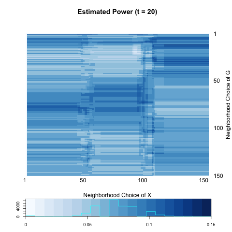
```


```{r echo = FALSE, results='asis'}
a <- c(0.08, 0.05, 0.06)
b <- c(0.11, 0.14, 0.13)

table <- matrix(0, nrow = 2, ncol = 3)
rownames(table) <- c("global test", "local optimal")
colnames(table) <- c("t=1",  "t=5", "t=20")
table[1,] <- a
table[2,] <- b
table <- as.data.frame(table)
kable(table, align = 'c', digits = 2)
```


```{r, out.width = 300, out.height = 400, echo = FALSE, fig.align='center'}

```

<hr />

### [sim] three.2
<a name=" three.2"/>

$$X_{i} \overset{i.i.d}{\sim} Multinorm(1/3, 1/3, 1/3), i = 1, ... ,n.$$

$$Z_{i} | X_{i} \overset{i.i.d}{\sim} \left\{  \begin{array}{cc} Multinorm(1/2, 1/4, 1/4) & X_{i} = 1 \\  Multinorm(1/4, 1/2, 1/4) & X_{i} = 2 \\ Multinorm(1/4, 1/4, 1/2) & X_{i} = 3   \end{array} \right.$$

$$A_{G} \sim Bern \left[  \begin{array}{c|c|c} \color{red}{0.5} & 0.1  & 0.1 \\ \hline 0.1 & \color{red}{0.5} & 0.1 \\ \hline 0.1 & 0.1 & \color{red}{0.5} \end{array} \right]$$


```{r echo = FALSE, results='asis'}
a <- c(1/3, 1/3 , 1/6,  0.5, 0.5, 0.5, 0.1, 0.1, 0.1)

table <- matrix(0, nrow = 1, ncol = 9)
colnames(table) <- c("u1", "u2", "w", "p1", "p2", "p3", "q12", "q13", "q23")
table[1,] <- a
table <- as.data.frame(table)
kable(table, align = 'c', digits = 2)
```


```{r, out.width = 300, out.height = 400, echo = FALSE, fig.align='center', fig.show='hold', out.extra='style="float:left"'}
knitr::include_graphics("../figure/three2_power1.png")
```
```{r, out.width = 300, out.height = 400, echo = FALSE, fig.align='center', fig.show='hold', out.extra='style="float:left"'}

```
```{r, out.width = 300, out.height = 400, echo = FALSE, fig.align='center', fig.show='hold'}
knitr::include_graphics("../figure/three2_power20.png")
```


```{r echo = FALSE, results='asis'}
a <- c(0.82, 0.87, 0.84)
b <- c(0.93, 0.96, 0.92)

table <- matrix(0, nrow = 2, ncol = 3)
rownames(table) <- c("global test", "local optimal")
colnames(table) <- c("t=1",  "t=5", "t=20")
table[1,] <- a
table[2,] <- b
table <- as.data.frame(table)
kable(table, align = 'c', digits = 2)
```


```{r, out.width = 300, out.height = 400, echo = FALSE, fig.align='center'}
knitr::include_graphics("../figure/three2_plot.png")
```

<hr />

### [sim] three.3
<a name=" three.3"/>

$$X_{i} \overset{i.i.d}{\sim} Multinorm(1/3, 1/3, 1/3), i = 1, ... ,n.$$

$$Z_{i} | X_{i} \overset{i.i.d}{\sim} \left\{  \begin{array}{cc} Multinorm(1/2, 1/4, 1/4) & X_{i} = 1 \\  Multinorm(1/4, 1/2, 1/4) & X_{i} = 2 \\ Multinorm(1/4, 1/4, 1/2) & X_{i} = 3   \end{array} \right.$$

$$A_{G} \sim Bern \left[  \begin{array}{c|c|c} 0.3 & 0.3  & 0.3 \\ \hline 0.3 & 0.3 & 0.3 \\ \hline 0.3 & 0.3 & 0.3 \end{array} \right]$$


```{r echo = FALSE, results='asis'}
a <- c(1/3, 1/3, 1/6 , 0.3, 0.3, 0.3, 0.3, 0.3, 0.3)

table <- matrix(0, nrow = 1, ncol = 9)
colnames(table) <- c("u1", "u2", "w", "p1", "p2", "p3", "q12", "q13", "q23")
table[1,] <- a
table <- as.data.frame(table)
kable(table, align = 'c', digits = 2)
```


```{r, out.width = 300, out.height = 400, echo = FALSE, fig.align='center', fig.show='hold', out.extra='style="float:left"'}
knitr::include_graphics("../figure/three3_power1.png")
```
```{r, out.width = 300, out.height = 400, echo = FALSE, fig.align='center', fig.show='hold', out.extra='style="float:left"'}

```
```{r, out.width = 300, out.height = 400, echo = FALSE, fig.align='center', fig.show='hold'}

```


```{r echo = FALSE, results='asis'}
a <- c(0.06, 0.06, 0.11)
b <- c(0.09, 0.16, 0.14)

table <- matrix(0, nrow = 2, ncol = 3)
rownames(table) <- c("global test", "local optimal")
colnames(table) <- c("t=1",  "t=5", "t=20")
table[1,] <- a
table[2,] <- b
table <- as.data.frame(table)
kable(table, align = 'c', digits = 2)
```


```{r, out.width = 300, out.height = 400, echo = FALSE, fig.align='center'}

```

<hr />

### [sim] three.4
<a name=" three.4"/>

$$X_{i} \overset{i.i.d}{\sim} Multinorm(1/3, 1/3, 1/3), i = 1, ... ,n.$$

$$Z_{i} | X_{i} \overset{i.i.d}{\sim} \left\{  \begin{array}{cc} Multinorm(1/2, 1/4, 1/4) & X_{i} = 1 \\  Multinorm(1/4, 1/2, 1/4) & X_{i} = 2 \\ Multinorm(1/4, 1/4, 1/2) & X_{i} = 3   \end{array} \right.$$

$$A_{G} \sim Bern \left[  \begin{array}{c|c|c} \color{red}{0.5} & 0.1  & 0.1 \\ \hline 0.1 & \color{red}{0.5} & 0.1 \\ \hline 0.1 & 0.1 & 0.1 \end{array} \right]$$


```{r echo = FALSE, results='asis'}
a <- c(1/3, 1/3 , 1/6, 0.5, 0.5, 0.1, 0.1, 0.1, 0.1)

table <- matrix(0, nrow = 1, ncol = 9)
colnames(table) <- c("u1", "u2", "w", "p1", "p2", "p3", "q12", "q13", "q23")
table[1,] <- a
table <- as.data.frame(table)
kable(table, align = 'c', digits = 2)
```


```{r, out.width = 300, out.height = 400, echo = FALSE, fig.align='center', fig.show='hold', out.extra='style="float:left"'}
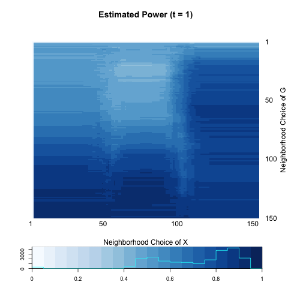
```
```{r, out.width = 300, out.height = 400, echo = FALSE, fig.align='center', fig.show='hold', out.extra='style="float:left"'}

```
```{r, out.width = 300, out.height = 400, echo = FALSE, fig.align='center', fig.show='hold'}

```


```{r echo = FALSE, results='asis'}
a <- c(0.89, 0.73, 0.75)
b <- c(0.93, 0.87, 0.89)

table <- matrix(0, nrow = 2, ncol = 3)
rownames(table) <- c("global test", "local optimal")
colnames(table) <- c("t=1",  "t=5", "t=20")
table[1,] <- a
table[2,] <- b
table <- as.data.frame(table)
kable(table, align = 'c', digits = 2)
```


```{r, out.width = 300, out.height = 400, echo = FALSE, fig.align='center'}
knitr::include_graphics("../figure/three4_plot.png")
```


<hr />

### [sim] three.5
<a name=" three.5"/>

$$X_{i} \overset{i.i.d}{\sim} Multinorm(1/3, 1/3, 1/3), i = 1, ... ,n.$$

$$Z_{i} | X_{i} \overset{i.i.d}{\sim} \left\{  \begin{array}{cc} Multinorm(1/2, 1/4, 1/4) & X_{i} = 1 \\  Multinorm(1/4, 1/2, 1/4) & X_{i} = 2 \\ Multinorm(1/4, 1/4, 1/2) & X_{i} = 3   \end{array} \right.$$

$$A_{G} \sim Bern \left[  \begin{array}{c|c|c} \color{red}{0.5} & 0.1  & 0.1 \\ \hline 0.1 & 0.1 & 0.1 \\ \hline 0.1 & 0.1 & 0.1 \end{array} \right]$$


```{r echo = FALSE, results='asis'}
a <- c(1/3, 1/3 , 1/6 , 0.5, 0.1, 0.1, 0.1, 0.1, 0.1)

table <- matrix(0, nrow = 1, ncol = 9)
colnames(table) <- c("u1", "u2", "w", "p1", "p2", "p3", "q12", "q13", "q23")
table[1,] <- a
table <- as.data.frame(table)
kable(table, align = 'c', digits = 2)
```


```{r, out.width = 300, out.height = 400, echo = FALSE, fig.align='center', fig.show='hold', out.extra='style="float:left"'}

```
```{r, out.width = 300, out.height = 400, echo = FALSE, fig.align='center', fig.show='hold', out.extra='style="float:left"'}

```
```{r, out.width = 300, out.height = 400, echo = FALSE, fig.align='center', fig.show='hold'}

```


```{r echo = FALSE, results='asis'}
a <- c(0.57, 0.66, 0.62)
b <- c(0.80, 0.75, 0.71)

table <- matrix(0, nrow = 2, ncol = 3)
rownames(table) <- c("global test", "local optimal")
colnames(table) <- c("t=1",  "t=5", "t=20")
table[1,] <- a
table[2,] <- b
table <- as.data.frame(table)
kable(table, align = 'c', digits = 2)
```


```{r, out.width = 300, out.height = 400, echo = FALSE, fig.align='center'}

```


<hr />

### [sim] three.6
<a name=" three.6"/>

$$X_{i} \overset{i.i.d}{\sim} Multinorm(1/3, 1/3, 1/3), i = 1, ... ,n.$$

$$Z_{i} | X_{i} \overset{i.i.d}{\sim} \left\{  \begin{array}{cc} Multinorm(1/2, 1/4, 1/4) & X_{i} = 1 \\  Multinorm(1/4, 1/2, 1/4) & X_{i} = 2 \\ Multinorm(1/4, 1/4, 1/2) & X_{i} = 3   \end{array} \right.$$

$$A_{G} \sim Bern \left[  \begin{array}{c|c|c} \color{red}{0.5} & 0.1  & 0.1 \\ \hline 0.1 & 0.1 & 0.1 \\ \hline 0.1 & 0.1 & \color{red}{0.5} \end{array} \right]$$


```{r echo = FALSE, results='asis'}
a <- c(1/3, 1/3 , 1/6 , 0.5, 0.1, 0.5, 0.1, 0.1, 0.1)

table <- matrix(0, nrow = 1, ncol = 9)
colnames(table) <- c("u1", "u2", "w", "p1", "p2", "p3", "q12", "q13", "q23")
table[1,] <- a
table <- as.data.frame(table)
kable(table, align = 'c', digits = 2)
```


```{r, out.width = 300, out.height = 400, echo = FALSE, fig.align='center', fig.show='hold', out.extra='style="float:left"'}

```
```{r, out.width = 300, out.height = 400, echo = FALSE, fig.align='center', fig.show='hold', out.extra='style="float:left"'}

```
```{r, out.width = 300, out.height = 400, echo = FALSE, fig.align='center', fig.show='hold'}

```


```{r echo = FALSE, results='asis'}
a <- c(0.82, 0.88, 0.89)
b <- c(0.98, 0.96, 0.95)

table <- matrix(0, nrow = 2, ncol = 3)
rownames(table) <- c("global test", "local optimal")
colnames(table) <- c("t=1",  "t=5", "t=20")
table[1,] <- a
table[2,] <- b
table <- as.data.frame(table)
kable(table, align = 'c', digits = 2)
```


```{r, out.width = 300, out.height = 400, echo = FALSE, fig.align='center'}
knitr::include_graphics("../figure/three6_plot.png")
```


## Summary
<a name=" summary"/>


## Summary 1

$$X_{i} \overset{i.i.d}{\sim} Multinorm(1/3, 1/3, 1/3), i = 1, ... ,n.$$

$$Z_{i} | X_{i} \overset{i.i.d}{\sim} \left\{  \begin{array}{cc} Multinorm(1/2, 1/4, 1/4) & X_{i} = 1 \\  Multinorm(1/4, 1/2, 1/4) & X_{i} = 2 \\ Multinorm(1/4, 1/4, 1/2) & X_{i} = 3   \end{array} \right.$$

$$A_{G} \sim Bern \left[  \begin{array}{c|c|c} \color{red}{p} & q  & q \\ \hline q & \color{red}{p} & q \\ \hline q & q & \color{red}{p} \end{array} \right]$$


### Power heatmaps

- Global Power

```{r, out.width = 200, out.height = 300, echo = FALSE, fig.align='center', fig.show='hold', out.extra='style="float:left"'}
knitr::include_graphics("../figure/three_same_glot1.png")
```
```{r, out.width = 200, out.height = 300, echo = FALSE, fig.align='center', fig.show='hold', out.extra='style="float:left"'}

```
```{r, out.width = 200, out.height = 400, echo = FALSE, fig.align='center', fig.show='hold', out.extra='style="float:left"'}
knitr::include_graphics("../figure/three_same_glot10.png")
```
```{r, out.width = 200, out.height = 400, echo = FALSE, fig.align='center', fig.show='hold'}

```

- Optimal Power

```{r, out.width = 200, out.height = 300, echo = FALSE, fig.align='center', fig.show='hold', out.extra='style="float:left"'}

```
```{r, out.width = 200, out.height = 300, echo = FALSE, fig.align='center', fig.show='hold', out.extra='style="float:left"'}

```
```{r, out.width = 200, out.height = 400, echo = FALSE, fig.align='center', fig.show='hold', out.extra='style="float:left"'}

```
```{r, out.width = 200, out.height = 400, echo = FALSE, fig.align='center', fig.show='hold'}

```

### Optimal power 

```{r, out.width = 400, out.height = 400, echo = FALSE, fig.align='center', fig.show='hold'}

```

### Discrepancy between local and global scale

```{r, out.width = 300, out.height = 400, echo = FALSE, fig.align='center', fig.show='hold', out.extra='style="float:left"'}

```
```{r, out.width = 300, out.height = 400, echo = FALSE, fig.align='center', fig.show='hold'}
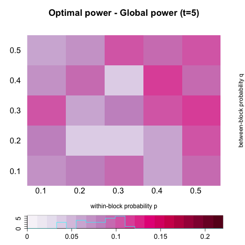
```
```{r, out.width = 300, out.height = 400, echo = FALSE, fig.align='center', fig.show='hold', out.extra='style="float:left"'}

```
```{r, out.width = 300, out.height = 400, echo = FALSE, fig.align='center', fig.show='hold'}

```

### Diffusion Process


```{r, out.width = 300, out.height = 400, echo = FALSE, fig.align='center', fig.show='hold', out.extra='style="float:left"'}

```
```{r, out.width = 300, out.height = 400, echo = FALSE, fig.align='center', fig.show='hold', out.extra='style="float:left"'}

```
```{r, out.width = 300, out.height = 400, echo = FALSE, fig.align='center', fig.show='hold'}

```


```{r, out.width = 500, out.height = 500, echo = FALSE, fig.align='center', fig.show='hold'}
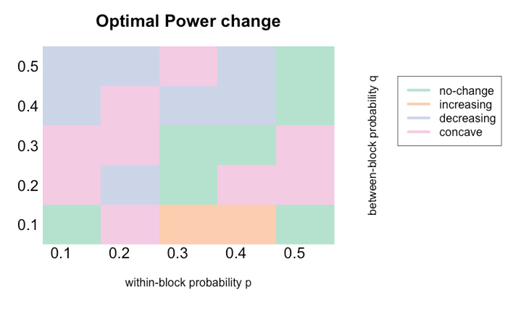
```


<hr/>
<hr/>

## Summary 2

$$X_{i} \overset{i.i.d}{\sim} Multinorm(1/3, 1/3, 1/3), i = 1, ... ,n.$$

$$Z_{i} | X_{i} \overset{i.i.d}{\sim} \left\{  \begin{array}{cc} Multinorm(1/2, 1/4, 1/4) & X_{i} = 1 \\  Multinorm(1/4, 1/2, 1/4) & X_{i} = 2 \\ Multinorm(1/4, 1/4, 1/2) & X_{i} = 3   \end{array} \right.$$

$$A_{G} \sim Bern \left[  \begin{array}{c|c|c} \color{red}{p} & r  & r \\ \hline r & \color{red}{p} & r \\ \hline r & r & r \end{array} \right]$$


### Power heatmaps

- Global Power

```{r, out.width = 200, out.height = 300, echo = FALSE, fig.align='center', fig.show='hold', out.extra='style="float:left"'}

```
```{r, out.width = 200, out.height = 300, echo = FALSE, fig.align='center', fig.show='hold', out.extra='style="float:left"'}

```
```{r, out.width = 200, out.height = 400, echo = FALSE, fig.align='center', fig.show='hold', out.extra='style="float:left"'}

```
```{r, out.width = 200, out.height = 400, echo = FALSE, fig.align='center', fig.show='hold'}

```

- Optimal Power

```{r, out.width = 200, out.height = 300, echo = FALSE, fig.align='center', fig.show='hold', out.extra='style="float:left"'}

```
```{r, out.width = 200, out.height = 300, echo = FALSE, fig.align='center', fig.show='hold', out.extra='style="float:left"'}

```
```{r, out.width = 200, out.height = 400, echo = FALSE, fig.align='center', fig.show='hold', out.extra='style="float:left"'}

```
```{r, out.width = 200, out.height = 400, echo = FALSE, fig.align='center', fig.show='hold'}

```

### Optimal power 

```{r, out.width = 400, out.height = 400, echo = FALSE, fig.align='center', fig.show='hold'}
knitr::include_graphics("../figure/three_part_optimal.png")
```

### Discrepancy between local and global scale

```{r, out.width = 300, out.height = 400, echo = FALSE, fig.align='center', fig.show='hold', out.extra='style="float:left"'}

```
```{r, out.width = 300, out.height = 400, echo = FALSE, fig.align='center', fig.show='hold'}

```
```{r, out.width = 300, out.height = 400, echo = FALSE, fig.align='center', fig.show='hold', out.extra='style="float:left"'}

```
```{r, out.width = 300, out.height = 400, echo = FALSE, fig.align='center', fig.show='hold'}

```

### Diffusion Process


```{r, out.width = 300, out.height = 400, echo = FALSE, fig.align='center', fig.show='hold', out.extra='style="float:left"'}

```
```{r, out.width = 300, out.height = 400, echo = FALSE, fig.align='center', fig.show='hold', out.extra='style="float:left"'}

```
```{r, out.width = 300, out.height = 400, echo = FALSE, fig.align='center', fig.show='hold'}

```


```{r, out.width = 500, out.height = 500, echo = FALSE, fig.align='center', fig.show='hold'}

```


<hr/>
<hr/>

## Summary 3

$$X_{i} \overset{i.i.d}{\sim} Multinorm(1/3, 1/3, 1/3), i = 1, ... ,n.$$

$$Z_{i} | X_{i} \overset{i.i.d}{\sim} \left\{  \begin{array}{cc} Multinorm(1/2, 1/4, 1/4) & X_{i} = 1 \\  Multinorm(1/4, 1/2, 1/4) & X_{i} = 2 \\ Multinorm(1/4, 1/4, 1/2) & X_{i} = 3   \end{array} \right.$$

$$A_{G} \sim Bern \left[  \begin{array}{c|c|c} \color{red}{p} & q  & \color{blue}{r} \\ \hline q & \color{red}{p} & q \\ \hline \color{blue}{r} & q & \color{red}{p} \end{array} \right]$$


Since block 1 ($Z_{i} = 1$) and block 3 ($Z_{i} = 3$) are most different, if $q < r,$ local scale is more likely to be better than the global scale. Thus I on purpose consider the case where $q < r.$ 


<hr/>
### r  =  q + 0.1


### Power heatmaps

- Global Power

```{r, out.width = 200, out.height = 300, echo = FALSE, fig.align='center', fig.show='hold', out.extra='style="float:left"'}
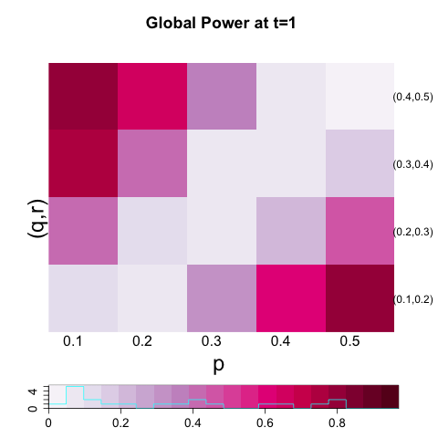
```
```{r, out.width = 200, out.height = 300, echo = FALSE, fig.align='center', fig.show='hold', out.extra='style="float:left"'}

```
```{r, out.width = 200, out.height = 400, echo = FALSE, fig.align='center', fig.show='hold', out.extra='style="float:left"'}

```
```{r, out.width = 200, out.height = 400, echo = FALSE, fig.align='center', fig.show='hold'}

```

- Optimal Power

```{r, out.width = 200, out.height = 300, echo = FALSE, fig.align='center', fig.show='hold', out.extra='style="float:left"'}

```
```{r, out.width = 200, out.height = 300, echo = FALSE, fig.align='center', fig.show='hold', out.extra='style="float:left"'}

```
```{r, out.width = 200, out.height = 400, echo = FALSE, fig.align='center', fig.show='hold', out.extra='style="float:left"'}

```
```{r, out.width = 200, out.height = 400, echo = FALSE, fig.align='center', fig.show='hold'}
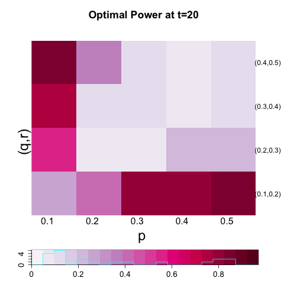
```

### Optimal power 

```{r, out.width = 400, out.height = 400, echo = FALSE, fig.align='center', fig.show='hold'}

```

### Discrepancy between local and global scale

```{r, out.width = 300, out.height = 400, echo = FALSE, fig.align='center', fig.show='hold', out.extra='style="float:left"'}

```
```{r, out.width = 300, out.height = 400, echo = FALSE, fig.align='center', fig.show='hold'}
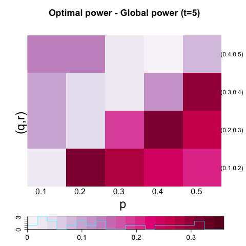
```
```{r, out.width = 300, out.height = 400, echo = FALSE, fig.align='center', fig.show='hold', out.extra='style="float:left"'}
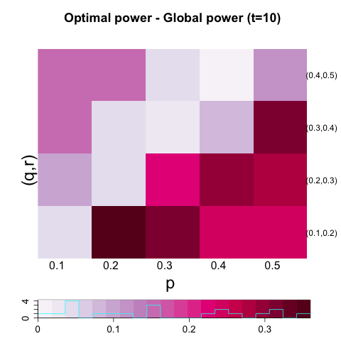
```
```{r, out.width = 300, out.height = 400, echo = FALSE, fig.align='center', fig.show='hold'}
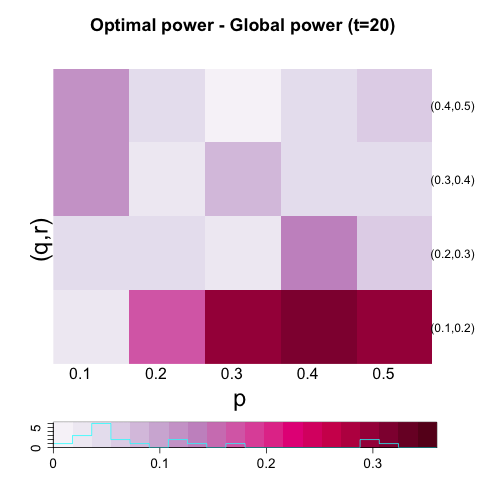
```

### Diffusion Process


```{r, out.width = 300, out.height = 400, echo = FALSE, fig.align='center', fig.show='hold', out.extra='style="float:left"'}
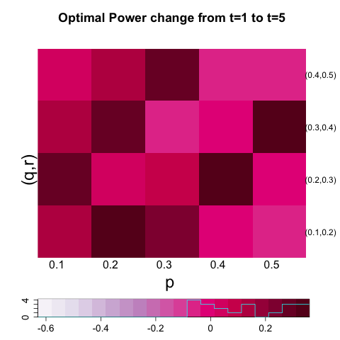
```
```{r, out.width = 300, out.height = 400, echo = FALSE, fig.align='center', fig.show='hold', out.extra='style="float:left"'}

```
```{r, out.width = 300, out.height = 400, echo = FALSE, fig.align='center', fig.show='hold'}

```


```{r, out.width = 500, out.height = 500, echo = FALSE, fig.align='center', fig.show='hold'}

```


<hr />
### r = q + 0.2


### Power heatmaps

- Global Power

```{r, out.width = 400, out.height = 300, echo = FALSE, fig.align='center', fig.show='hold', out.extra='style="float:left"', fig.env = 'marginfigure' }
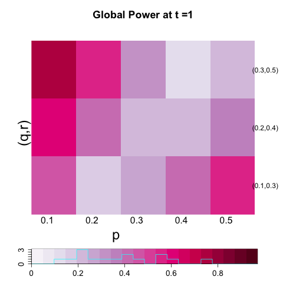
```
```{r, out.width = 400, out.height = 300, echo = FALSE, fig.align='center', fig.show='hold'}
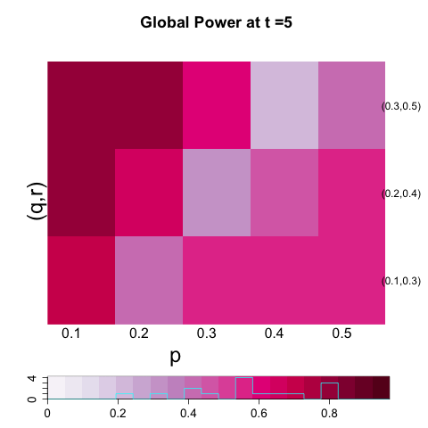
```
```{r, out.width = 400, out.height = 300, echo = FALSE, fig.align='center', fig.show='hold', out.extra='style="float:left"'}
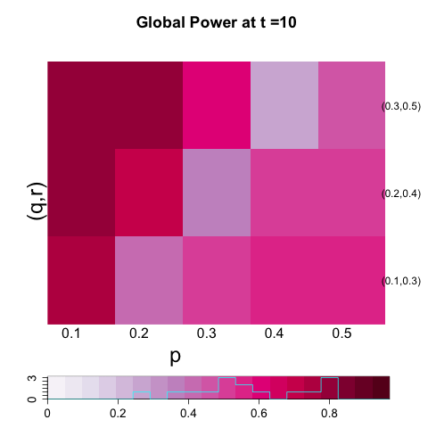
```
```{r, out.width = 400, out.height = 300, echo = FALSE, fig.align='center', fig.show='hold'}
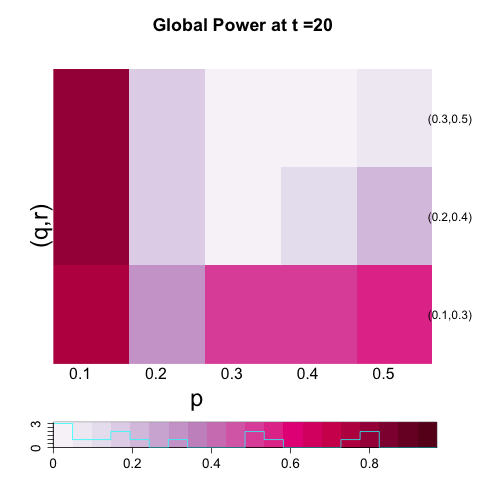
```

- Optimal Power

```{r, out.width = 400, out.height = 300, echo = FALSE, fig.align='center', fig.show='hold', out.extra='style="float:left"'}

```
```{r, out.width = 400, out.height = 300, echo = FALSE, fig.align='center', fig.show='hold'}
knitr::include_graphics("../figure/three_triple2_optt5.png")
```
```{r, out.width = 400, out.height = 300, echo = FALSE, fig.align='center', fig.show='hold', out.extra='style="float:left"'}

```
```{r, out.width = 400, out.height = 300, echo = FALSE, fig.align='center', fig.show='hold'}

```

### Optimal power 

```{r, out.width = 400, out.height = 400, echo = FALSE, fig.align='center', fig.show='hold'}
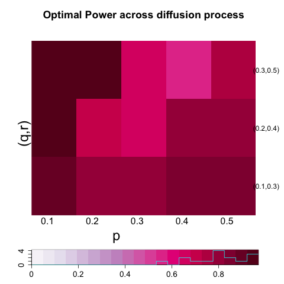
```

### Discrepancy between local and global scale

```{r, out.width = 400, out.height = 400, echo = FALSE, fig.align='center', fig.show='hold', out.extra='style="float:left"'}

```
```{r, out.width = 400, out.height = 400, echo = FALSE, fig.align='center', fig.show='hold'}
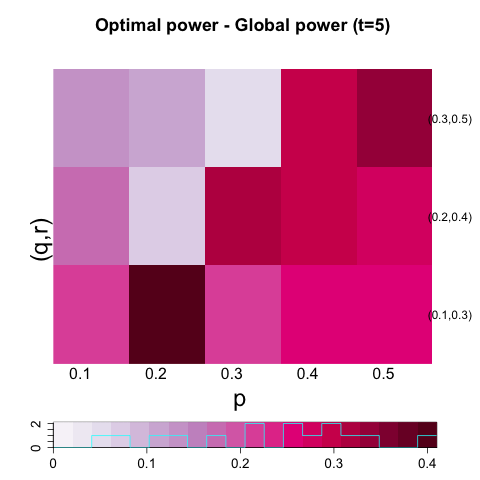
```
```{r, out.width = 400, out.height = 400, echo = FALSE, fig.align='center', fig.show='hold', out.extra='style="float:left"'}

```
```{r, out.width = 400, out.height = 400, echo = FALSE, fig.align='center', fig.show='hold'}
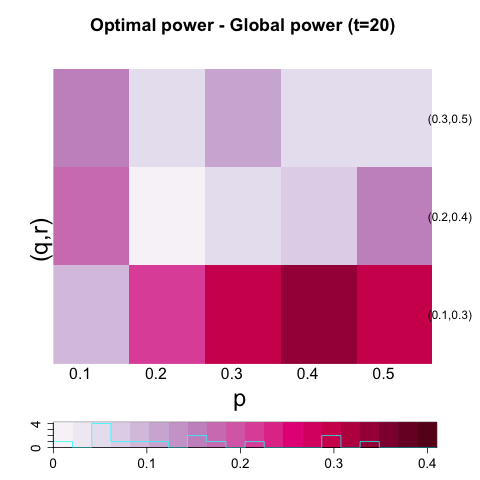
```

### Diffusion Process


```{r, out.width = 300, out.height = 400, echo = FALSE, fig.align='center', fig.show='hold', out.extra='style="float:left"'}
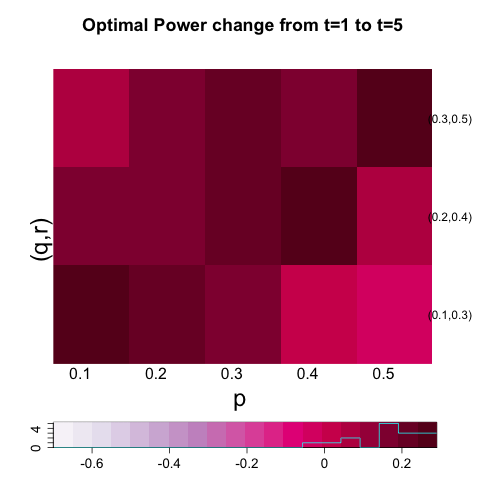
```
```{r, out.width = 300, out.height = 400, echo = FALSE, fig.align='center', fig.show='hold', out.extra='style="float:left"'}
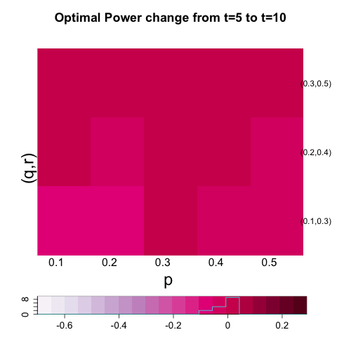
```
```{r, out.width = 300, out.height = 400, echo = FALSE, fig.align='center', fig.show='hold'}

```


```{r, out.width = 500, out.height = 500, echo = FALSE, fig.align='center', fig.show='hold'}

```


