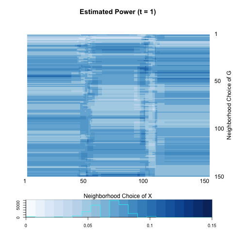
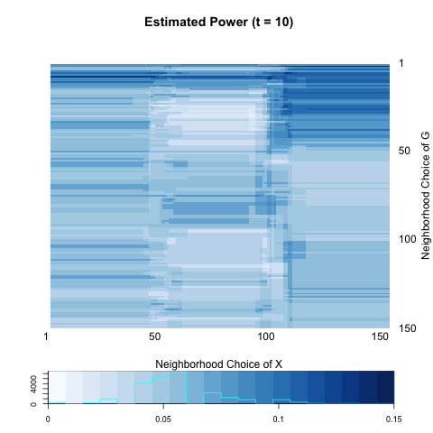
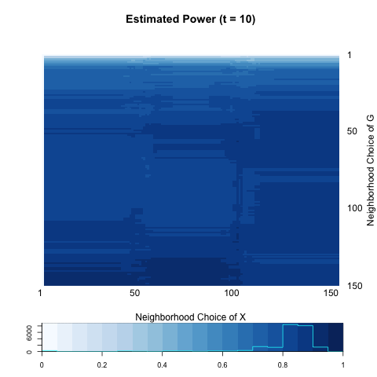
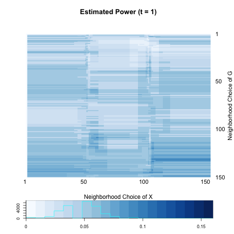

- [Models](# Models)
- [three.1](# three.1)
- [three.2](# three.2)
- [three.3](# three.3)
- [three.4](# three.4)
- [three.5](# three.5)

```{r echo=FALSE, message =FALSE, warning = FALSE}
library(igraph)
library(RefManageR)
library(xtable)
library(grid)
library(ggplot2)
library(png)
library(grid)
library(knitr)
bib <- ReadBib(system.file("Bib", "biblatexExamples.bib", 
                           package = "RefManageR"), check = FALSE)
BibOptions(check.entries = FALSE, style = "markdown", bib.style = "alphabetic", cite.style = 'alphabetic')
```


## Models
<a name=" Models"/>


### [sim] three.1
<a name=" three.1"/>


```{r, out.width = 300, out.height = 400, echo = FALSE, fig.align='center', fig.show='hold', out.extra='style="float:left"'}

```
```{r, out.width = 300, out.height = 400, echo = FALSE, fig.align='center', fig.show='hold', out.extra='style="float:left"'}

```
```{r, out.width = 300, out.height = 400, echo = FALSE, fig.align='center', fig.show='hold'}
knitr::include_graphics("../figure/three1_power20.png")
```


```{r echo = FALSE, results='asis'}
a <- c(0.08, 0.05, 0.06)
b <- c(0.11, 0.14, 0.13)

table <- matrix(0, nrow = 2, ncol = 3)
rownames(table) <- c("global test", "local optimal")
colnames(table) <- c("t=1",  "t=5", "t=20")
table[1,] <- a
table[2,] <- b
table <- as.data.frame(table)
kable(table, align = 'c', digits = 2)
```


### [sim] three.2
<a name=" three.2"/>


```{r, out.width = 300, out.height = 400, echo = FALSE, fig.align='center', fig.show='hold', out.extra='style="float:left"'}

```
```{r, out.width = 300, out.height = 400, echo = FALSE, fig.align='center', fig.show='hold', out.extra='style="float:left"'}

```
```{r, out.width = 300, out.height = 400, echo = FALSE, fig.align='center', fig.show='hold'}

```


```{r echo = FALSE, results='asis'}
a <- c(0.82, 0.87, 0.84)
b <- c(0.93, 0.96, 0.92)

table <- matrix(0, nrow = 2, ncol = 3)
rownames(table) <- c("global test", "local optimal")
colnames(table) <- c("t=1",  "t=5", "t=20")
table[1,] <- a
table[2,] <- b
table <- as.data.frame(table)
kable(table, align = 'c', digits = 2)
```


### [sim] three.3
<a name=" three.3"/>


```{r, out.width = 300, out.height = 400, echo = FALSE, fig.align='center', fig.show='hold', out.extra='style="float:left"'}

```
```{r, out.width = 300, out.height = 400, echo = FALSE, fig.align='center', fig.show='hold', out.extra='style="float:left"'}

```
```{r, out.width = 300, out.height = 400, echo = FALSE, fig.align='center', fig.show='hold'}
knitr::include_graphics("../figure/three3_power20.png")
```


```{r echo = FALSE, results='asis'}
a <- c(0.06, 0.06, 0.11)
b <- c(0.09, 0.16, 0.14)

table <- matrix(0, nrow = 2, ncol = 3)
rownames(table) <- c("global test", "local optimal")
colnames(table) <- c("t=1",  "t=5", "t=20")
table[1,] <- a
table[2,] <- b
table <- as.data.frame(table)
kable(table, align = 'c', digits = 2)
```


### [sim] three.4
<a name=" three.4"/>


```{r, out.width = 300, out.height = 400, echo = FALSE, fig.align='center', fig.show='hold', out.extra='style="float:left"'}
knitr::include_graphics("../figure/three4_power1.png")
```
```{r, out.width = 300, out.height = 400, echo = FALSE, fig.align='center', fig.show='hold', out.extra='style="float:left"'}

```
```{r, out.width = 300, out.height = 400, echo = FALSE, fig.align='center', fig.show='hold'}
knitr::include_graphics("../figure/three4_power20.png")
```


```{r echo = FALSE, results='asis'}
a <- c(0.89, 0.73, 0.75)
b <- c(0.93, 0.87, 0.89)

table <- matrix(0, nrow = 2, ncol = 3)
rownames(table) <- c("global test", "local optimal")
colnames(table) <- c("t=1",  "t=5", "t=20")
table[1,] <- a
table[2,] <- b
table <- as.data.frame(table)
kable(table, align = 'c', digits = 2)
```


### [sim] three.5
<a name=" three.5"/>


```{r, out.width = 300, out.height = 400, echo = FALSE, fig.align='center', fig.show='hold', out.extra='style="float:left"'}
knitr::include_graphics("../figure/three5_power1.png")
```
```{r, out.width = 300, out.height = 400, echo = FALSE, fig.align='center', fig.show='hold', out.extra='style="float:left"'}

```
```{r, out.width = 300, out.height = 400, echo = FALSE, fig.align='center', fig.show='hold'}
knitr::include_graphics("../figure/three5_power20.png")
```


```{r echo = FALSE, results='asis'}
a <- c(0.57, 0.66, 0.62)
b <- c(0.80, 0.75, 0.71)

table <- matrix(0, nrow = 2, ncol = 3)
rownames(table) <- c("global test", "local optimal")
colnames(table) <- c("t=1",  "t=5", "t=20")
table[1,] <- a
table[2,] <- b
table <- as.data.frame(table)
kable(table, align = 'c', digits = 2)
```


