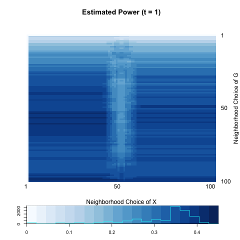
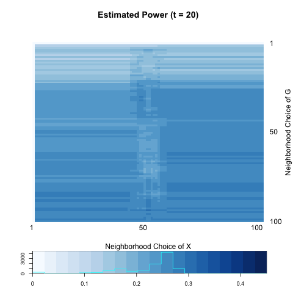
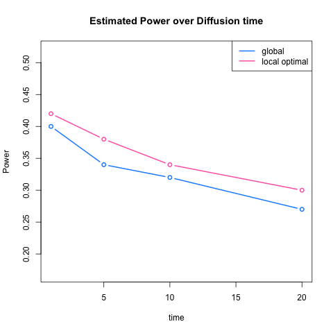

- [Models](# Models)
- [two.1](# two.1)
- [two.2](# two.2)
- [two.3](# two.3)
- [two.4](# two.4)

```{r echo=FALSE, message =FALSE, warning = FALSE}
library(igraph)
library(RefManageR)
library(xtable)
library(grid)
library(ggplot2)
library(png)
library(grid)
library(knitr)
library(tikzDevice)
library(Matrix)
bib <- ReadBib(system.file("Bib", "biblatexExamples.bib", 
                           package = "RefManageR"), check = FALSE)
BibOptions(check.entries = FALSE, style = "markdown", bib.style = "alphabetic", cite.style = 'alphabetic')
```


## Models
<a name=" Models"/>

### Notations

- $A_{ij}$ = indicator variable of having edges between node $i$ and node $j$ on graph $G$.($i,j = 1,... , n$)

- $Z_{i}$ = $\{ k ; \mbox{ latent variable of block membership of node } i,  k = 1, ... , K \}$

- $X_{i}$ = Node attribute variable. 

Recall that what we want to test is independence between $A$ and $X$; since $A$ directly relates to the structure of network (graph) $G$, we assume that we are testing independence between $G$ and $X$.


### Two possible representations

  We have suggested two models as data generation schemes. 
  
  - [model 1] : $P(A, X, Z) = P( A | Z) P(X | Z) P(Z)$
  
  - [model 2] : $P(A, X, Z) = P( A | Z) P(Z | X) P(X)$ 
  

[model 1] implies that a latent variable has an effect on both network structure $A$ and attribute variable $X$; while in [model 2], node attribute $X$ has its influence on $Z$ and $Z$ affects structure $A$. 

To show the exchangeability between [model 1] and [model 2], it suffices to show that $P(X | Z)P(Z) = P(Z | X)P(X).$ Suppose $Z$ and $X | Z$ both follow Bernoulli distributon. 

$$Z \sim Bern(p)$$

$$X | Z \sim \left\{  \begin{array}{cc} Bern(q) & Z = 0  \\ Bern(r) & Z = 1 \end{array} \right.$$

Then the joint model of $(X,Z)$, marginal distribution of $X$, and conditional distribution of $Z | X$ are the following:

$$P(X | Z)P(Z) = \left( q^{x}(1-q)^{1-x} \right)^{1- z} \left( r^{x}(1-r)^{1-x} \right)^{z} p^{z}(1 - p)^{1-z}$$


$$\begin{align} P(X) & = \sum\limits_{z=0,1}P(X | Z = z)P(Z = z) \\ & = q^{x}(1 - q)^{x} (1-p) + r^{x}(1-r)^{1-x}p \\ & = \left( q (1-p)  + rp  \right)^{x} \left( (1-q)(1-p) + (1-r)p  \right)^{1-x} \end{align}$$

$$\begin{align} P(Z | X) & = \frac{\left( q^{x}(1-q)^{1-x} \right)^{1- z} \left( r^{x}(1-r)^{1-x} \right)^{z} p^{z}(1 - p)^{1-z}}{\left( q (1-p)  + rp  \right)^{x} \left( (1-q)(1-p) + (1-r)p  \right)^{1-x}} \\  & = \left( \frac{1}{q(1-p) + rp} \big( q(1-p)   \big)^{1-z} \big( rp \big)^{z}   \right)^{x} \left(\frac{1}{(1-q)(1-p) + (1-r)p} \big( (1-q)(1-p)  \big)^{1-z} \big( (1-r)p  \big)^{z}  \right)^{1-x}  \end{align}$$

Thus, we can conclude that :


$$X \sim Bern(q(1-p) + rp)$$

$$Z | X \sim \left\{  \begin{array}{cc} Bern(\frac{(1-r)p}{(1-q)(1-p) + (1-r)p } ) & X = 0  \\ Bern(\frac{rp}{q(1-p) + rp}) & X = 1 \end{array} \right.$$

For example if $(p,q,r) = (0.5, 0.6, 0.4),$

$$Z \sim Bern(0.5)$$

$$X | Z \sim \left\{  \begin{array}{cc} Bern(0.6) & Z = 0  \\ Bern(0.4) & Z = 1 \end{array} \right.$$

is equivalent to 

$$X \sim Bern(0.5)$$

$$Z | X \sim \left\{  \begin{array}{cc} Bern(0.6) & X = 0  \\ Bern(0.4) & X = 1 \end{array} \right.$$


I suggest [model 2] instead of [model 1] because I don't want double-dependence in [model 1]. In [model 1], the way $X$ and $A$ are correlated each other depends on $Z \rightarrow A$ and $Z \rightarrow X.$ If these two relations are same direction, we can observe some correlation between $X$ and $A$. However, that is not all the case. On the other hand, the relation between $X$ and $A$ is much clear in [model 2], which is only through $Z$. If $Z$ becomes nuisance, i.e. $X \rightarrow Z \rightarrow A$ is equivalent to $X \rightarrow A$, global test will beat any other local tests.  


### Simulation Model

Assume that group (block) membership is a function of $X$, i.e. $Z \sim f(X).$
Suppose that nodes having similar value of $x_{i}$ are more likely to be in the same membership $z_{i}.$ 

- Generate iid node attribute with a parameter $u$

$$X_{i} \overset{i.i.d}{\sim} Bern(u), i = 1,... , n$$

- Generate latent variables conditional on $X$ as a function of $\omega$

$$Z_{i}  | X_{i}  \overset{i.i.d}{\sim} Bern(0.5 - \omega (2 X_{i} - 1) )   =    \left\{  \begin{array}{cc} Bern(0.5 + \omega) & X_{i} = 0 \\ Bern(0.5 - \omega) & X_{i} = 1 \end{array} \right.$$

- Generate local dependent graph : $\phi = (p, q, K)$ 

$$\begin{align} P_{\phi}(A = a | Z = z) & = \prod\limits_{k} P_{\theta}(A_{ij} = a_{ij} | Z = z) \times \prod\limits_{k < l} P_{\theta} (Y_{kl} = y_{kl} | Z = z) \\ & = \prod\limits_{Z_{i} = Z_{j} = 1}^{K} p^{a_{ij}}(1-p)^{a_{ij}} \prod\limits_{Z_{i} \neq Z_{j}, \\ Z_{i} = Z_{j} \notin \{1 ,... , K \}} q^{a_{ij}}(1 - q)^{a_{ij}} \end{align}$$.


For simplicity, $Z = g(X)$ is a monotonically increasing function of $X.$ That is, nodes having smaller value of $X$ are more likely to be in small level of $Z.$ Under global dependence, we can expect that between-block probability $P_{\theta}(Y_{(kk)} = y_{(kk)} | Z = z)$ is strongest and off-diagonal probability $P_{\theta} (Y_{kl} = y_{kl} | Z = z)$ is non-increasing as distance between blocks increase. \color{red}{In two-block case, it is not difficult to find an example of global dependence}. 


Joint likelihood of $(A_{ij}, X_{i}, Z_{i} ; i,j=1,... ,n)$ can be illustrated:

$$\begin{align} P_{\theta}(A, X, Z) & = P_{\phi}(A | Z) P_{\omega}(Z | X) P_{u}(X) \\ & = \prod\limits_{Z_{i} = Z_{j} = 0}^{K-1} p^{a_{ij}}(1-p)^{a_{ij}} \prod\limits_{Z_{i} \neq Z_{j}, \\ Z_{i} = Z_{j} \notin \{0 ,... , K-1 \}} q^{a_{ij}}(1 - q)^{a_{ij}} \prod\limits_{i=1}^{n} \left[ (0.5 - \omega(2X_{i} - 1))^{z_{i}} \big( 1 -  (0.5 - \omega(2X_{i} - 1))  \big)^{1 - z_{i}} u^{x_{i}} (1-u)^{1 - x_{i}} \right]  \end{align}$$


### [sim] two.1
<a name=" two.1"/>

```{r echo = FALSE, results='asis'}
a <- c(0.5, 0.0, 2, 0.5, 0.1)

table <- matrix(0, nrow = 1, ncol = 5)
colnames(table) <- c("u", "w" , "K", "p", "q")
table[1,] <- a
table <- as.data.frame(table)
kable(table, align = 'c', digits = 2)
```


$$\begin{align} P_{\theta}(A, X, Z) & = P_{\phi}(A | Z) P_{\omega}(Z | X) P_{u}(X) \\ & = P_{\phi}( A | Z) P_{\omega}(Z) P_{u} (X) \\ & = \prod\limits_{Z_{i} = Z_{j} = 0}^{1} 0.5^{a_{ij}}(1-0.5)^{a_{ij}} \prod\limits_{Z_{i} \neq Z_{j} } 0.1^{a_{ij}}(1 - 0.1)^{a_{ij}} \prod\limits_{i=1}^{n} \left[ (0.5)^{z_{i}} \big( 1 -  0.5)  \big)^{1 - z_{i}} 0.5^{x_{i}} (1-0.5)^{1 - x_{i}} \right]  \end{align}$$


```{r, out.width = 300, out.height = 400, echo = FALSE, fig.align='center', fig.show='hold', out.extra='style="float:left"'}
knitr::include_graphics("../figure/two1_power1.png")
```
```{r, out.width = 300, out.height = 400, echo = FALSE, fig.align='center', fig.show='hold', out.extra='style="float:left"'}
knitr::include_graphics("../figure/two1_power10.png")
```
```{r, out.width = 300, out.height = 400, echo = FALSE, fig.align='center', fig.show='hold'}

```


```{r echo = FALSE, results='asis'}
a <- c(0.05, 0.03, 0.06)
b <- c(0.10, 0.09, 0.10)

table <- matrix(0, nrow = 2, ncol = 3)
rownames(table) <- c("global test", "local optimal")
colnames(table) <- c("t=1",  "t=5", "t=20")
table[1,] <- a
table[2,] <- b
table <- as.data.frame(table)
kable(table, align = 'c', digits = 2)
```


```{r, out.width = 300, out.height = 400, echo = FALSE, fig.align='center'}
knitr::include_graphics("../figure/two1_plot.png")
```


### [sim] two.2
<a name=" two.2"/>


```{r echo = FALSE, results='asis'}
a <- c(0.5, 0.1, 2, 0.5, 0.1)

table <- matrix(0, nrow = 1, ncol = 5)
colnames(table) <- c("u", "w" , "K", "p", "q")
table[1,] <- a
table <- as.data.frame(table)
kable(table, align = 'c', digits = 2)
```


$$\begin{align} P_{\theta}(A, X, Z) & = P_{\phi}(A | Z) P_{\omega}(Z | X) P_{u}(X) \\ & = \prod\limits_{Z_{i} = Z_{j} = 0}^{1} 0.5^{a_{ij}}(1-0.5)^{a_{ij}} \prod\limits_{Z_{i} \neq Z_{j} } 0.1^{a_{ij}}(1 - 0.1)^{a_{ij}}  \\ & \times  \prod\limits_{i=1}^{n} \left[ (0.6)^{z_{i}} ( 1 -  0.6)^{1 - z_{i}} I(x_{i} = 0) +  (0.4)^{z_{i}} \big( 1 -  0.4  \big)^{1 - z_{i}} I(x_{i} = 1) \right] \prod\limits_{i=1}^{n} 0.5^{x_{i}} (1-0.5)^{1 - x_{i}}   \end{align}$$


```{r, out.width = 300, out.height = 400, echo = FALSE, fig.align='center', fig.show='hold', out.extra='style="float:left"'}
knitr::include_graphics("../figure/two2_power1.png")
```
```{r, out.width = 300, out.height = 400, echo = FALSE, fig.align='center', fig.show='hold', out.extra='style="float:left"'}
knitr::include_graphics("../figure/two2_power10.png")
```
```{r, out.width = 300, out.height = 400, echo = FALSE, fig.align='center', fig.show='hold'}
knitr::include_graphics("../figure/two2_power20.png")
```


```{r echo = FALSE, results='asis'}
a <- c(0.53, 0.54, 0.56)
b <- c(0.58, 0.59, 0.60)

table <- matrix(0, nrow = 2, ncol = 3)
rownames(table) <- c("global test", "local optimal")
colnames(table) <- c("t=1",  "t=5", "t=20")
table[1,] <- a
table[2,] <- b
table <- as.data.frame(table)
kable(table, align = 'c', digits = 2)
```


```{r, out.width = 300, out.height = 400, echo = FALSE, fig.align='center'}
knitr::include_graphics("../figure/two2_plot.png")
```


### [sim] two.3
<a name=" two.3"/>


```{r echo = FALSE, results='asis'}
a <- c(0.5, 0.1, 2, 0.3, 0.3)

table <- matrix(0, nrow = 1, ncol = 5)
colnames(table) <- c("u", "w" , "K", "p", "q")
table[1,] <- a
table <- as.data.frame(table)
kable(table, align = 'c', digits = 2)
```


$$\begin{align} P_{\theta}(A, X, Z) & = P_{\phi}(A | Z) P_{\omega}(Z | X) P_{u}(X) \\ & =  P_{\phi}(A) P_{\omega}(Z | X) P_{u}(X) \\ & = \prod\limits_{i,j=1}^{n} 0.3^{a_{ij}}(1-0.3)^{a_{ij}} \prod\limits_{i=1}^{n} \left[ (0.6)^{z_{i}} ( 1 -  0.6)^{1 - z_{i}} I(x_{i} = 0) +  (0.4)^{z_{i}} \big( 1 -  0.4  \big)^{1 - z_{i}} I(x_{i} = 1) \right] \prod\limits_{i=1}^{n} 0.5^{x_{i}} (1-0.5)^{1 - x_{i}}   \end{align}$$


```{r, out.width = 300, out.height = 400, echo = FALSE, fig.align='center', fig.show='hold', out.extra='style="float:left"'}
knitr::include_graphics("../figure/two3_power1.png")
```
```{r, out.width = 300, out.height = 400, echo = FALSE, fig.align='center', fig.show='hold', out.extra='style="float:left"'}
knitr::include_graphics("../figure/two3_power10.png")
```
```{r, out.width = 300, out.height = 400, echo = FALSE, fig.align='center', fig.show='hold'}
knitr::include_graphics("../figure/two3_power20.png")
```


```{r echo = FALSE, results='asis'}
a <- c(0.05, 0.05, 0.02)
b <- c(0.11, 0.12, 0.12)

table <- matrix(0, nrow = 2, ncol = 3)
rownames(table) <- c("global test", "local optimal")
colnames(table) <- c("t=1",  "t=5", "t=20")
table[1,] <- a
table[2,] <- b
table <- as.data.frame(table)
kable(table, align = 'c', digits = 2)
```


```{r, out.width = 300, out.height = 400, echo = FALSE, fig.align='center'}
knitr::include_graphics("../figure/two3_plot.png")
```


### [sim] two.4
<a name=" two.4"/>


```{r echo = FALSE, results='asis'}
a <- c(0.5, 0.1, 1, 0.5, 0.1)

table <- matrix(0, nrow = 1, ncol = 5)
colnames(table) <- c("u", "w" , "K", "p", "q")
table[1,] <- a
table <- as.data.frame(table)
kable(table, align = 'c', digits = 2)
```


$$\begin{align} P_{\theta}(A, X, Z) & = P_{\phi}(A | Z) P_{\omega}(Z | X) P_{u}(X) \\ & = \prod\limits_{Z_{i} = Z_{j} = 0} 0.5^{a_{ij}}(1-0.5)^{a_{ij}} \prod\limits_{Z_{i} \neq Z_{j}, Z_{i} = Z_{j} = 1 } 0.1^{a_{ij}}(1 - 0.1)^{a_{ij}}  \\ & \times  \prod\limits_{i=1}^{n} \left[ (0.6)^{z_{i}} ( 1 -  0.6)^{1 - z_{i}} I(x_{i} = 0) +  (0.4)^{z_{i}} \big( 1 -  0.4  \big)^{1 - z_{i}} I(x_{i} = 1) \right] \prod\limits_{i=1}^{n} 0.5^{x_{i}} (1-0.5)^{1 - x_{i}}   \end{align}$$


```{r, out.width = 300, out.height = 400, echo = FALSE, fig.align='center', fig.show='hold', out.extra='style="float:left"'}

```
```{r, out.width = 300, out.height = 400, echo = FALSE, fig.align='center', fig.show='hold', out.extra='style="float:left"'}
knitr::include_graphics("../figure/two4_power10.png")
```
```{r, out.width = 300, out.height = 400, echo = FALSE, fig.align='center', fig.show='hold'}

```


```{r echo = FALSE, results='asis'}
a <- c(0.40, 0.34, 0.27)
b <- c(0.42, 0.38, 0.30)

table <- matrix(0, nrow = 2, ncol = 3)
rownames(table) <- c("global test", "local optimal")
colnames(table) <- c("t=1",  "t=5", "t=20")
table[1,] <- a
table[2,] <- b
table <- as.data.frame(table)
kable(table, align = 'c', digits = 2)
```


```{r, out.width = 300, out.height = 400, echo = FALSE, fig.align='center'}

```
