- [Models](# Models)
- [two.1](# two.1)
- [two.2](# two.2)
- [two.3](# two.3)
- [two.4](# two.4)
- [summary](# summary)

```{r echo=FALSE, message =FALSE, warning = FALSE}
library(igraph)
library(RefManageR)
library(xtable)
library(grid)
library(ggplot2)
library(png)
library(grid)
library(knitr)
library(tikzDevice)
library(Matrix)
bib <- ReadBib(system.file("Bib", "biblatexExamples.bib", 
                           package = "RefManageR"), check = FALSE)
BibOptions(check.entries = FALSE, style = "markdown", bib.style = "alphabetic", cite.style = 'alphabetic')
```


## Models
<a name=" Models"/>

### Notations

- $A_{ij}$ = indicator variable of having edges between node $i$ and node $j$ on graph $G$.($i,j = 1,... , n$)

- $Z_{i}$ = $\{ k ; \mbox{ latent variable of block membership of node } i,  k = 1, ... , K \}$

- $X_{i}$ = Node attribute variable. 

Recall that what we want to test is independence between $A$ and $X$; since $A$ directly relates to the structure of network (graph) $G$, we assume that we are testing independence between $G$ and $X$.


### Two possible representations

  We have suggested two models as data generation schemes. 
  
  - [model 1] : $P( A | \color{red}{Z}) P(X | \color{red}{Z} ) P(Z)$
  
  - [model 2] : $P( A | \color{red}{Z}) P(\color{red}{Z} | X) P(X)$ 
  

[model 1] implies that a latent variable has an effect on both network structure $A$ and attribute variable $X$; while in [model 2], node attribute $X$ has its influence on $Z$ and $Z$ affects structure $A$. 


```{r, out.width = 300, out.height = 200, echo = FALSE, fig.align='center', fig.show='hold', out.extra='style="float:left"'}
knitr::include_graphics("../figure/model1.png")
```
```{r, out.width = 300, out.height = 500, echo = FALSE, fig.align='center', fig.show='hold'}
knitr::include_graphics("../figure/model2.png")
```

\bigskip
Actually, under the assumption below, two models are exactly equivalent to joint distribution of $(A, Z, X)$.

$$\mbox{Assumption 1 : A is independent of X conditional on Z}, i.e. A \perp X \big| Z.$$

[Figure 1] and [Figure 2] above illustrates causal diagram of both models. I assume that diagram of [Figure 2] would be more appropriate to schematize the assumption - conditional independence - above. In [Figure 2], a latent variable $Z$ can also be interpreted as an effect modifier or mediator between $X$ and $A$; while in [Figure 1],a latent variable $Z$ acts like a confounder. For both models, $X$ and $A$ are associated with $Z$, and we sometimes adjust for $Z$ to see the effect of $X$ on $A$. If $Z$ is a mediator, it is on the causal pathway from $X$ to $A$, and if $Z$ is an effect modifier, the association/correlation between $X$ and $A$ varies by levels of $Z$; while if $Z$ is a confounder, relationship between $X$ and $A$ is in part or wholly explained by the relationship between $Z$ and $A$. Contextually, even though we are never sure about causal relationship of node attribute and graph(network), we are more interested in explaining association between $X$ and $A$ stratified to $Z$ or fixing $Z$, rather than getting rid of the effect of $Z$ to explain relationship of $X$ and $A$. 


- $Lemma$ : Both [Model 1] and [Model 2] are equivalent to joint distribution of $(A, Z, X)$ if $A \perp X \big| Z.$

Proof ) Under the assumption of $A \perp X \big| Z,$ 

$$\begin{align} P(A | Z, X) & = \frac{P(A, Z, X)}{P(Z,X)} \\ & = \frac{P(A, X | Z)P(Z) }{ P(Z,X)} \\ & = \frac{P(A | Z) P(X | Z) P(Z) }{ P(X | Z) P(Z) } \\ & = P(A |Z)   \end{align}$$

Thus, we can show the equivalence between $P(A | Z) P(X | Z) P(Z)$ and $P(A | Z) P(Z | X) P(X)$, and their equivalence to $P(A, Z, X).$

$$\begin{align} P(A | Z) P(X | Z) P(Z) & = P(A | Z) P(X , Z) = P(A | Z) P(Z | X) P(X) \\ & = P(A | Z , X) P(X , Z) \because A \perp X \big| Z \\ & = P(A, Z, X)   \end{align} \blacksquare.$$


For example, in binary latent case, it suffices to show that $P(X | Z)P(Z) = P(Z | X)P(X).$ Suppose $Z$ and $X | Z$ both follow Bernoulli distributon. 

$$Z \sim Bern(p)$$

$$X | Z \sim \left\{  \begin{array}{cc} Bern(q) & Z = 0  \\ Bern(r) & Z = 1 \end{array} \right.$$

Then the joint model of $(X,Z)$, marginal distribution of $X$, and conditional distribution of $Z | X$ are the following:

$$P(X | Z)P(Z) = \left( q^{x}(1-q)^{1-x} \right)^{1- z} \left( r^{x}(1-r)^{1-x} \right)^{z} p^{z}(1 - p)^{1-z}$$


$$\begin{align} P(X) & = \sum\limits_{z=0,1}P(X | Z = z)P(Z = z) \\ & = q^{x}(1 - q)^{x} (1-p) + r^{x}(1-r)^{1-x}p \\ & = \left( q (1-p)  + rp  \right)^{x} \left( (1-q)(1-p) + (1-r)p  \right)^{1-x} \end{align}$$

$$\begin{align} P(Z | X) & = \frac{\left( q^{x}(1-q)^{1-x} \right)^{1- z} \left( r^{x}(1-r)^{1-x} \right)^{z} p^{z}(1 - p)^{1-z}}{\left( q (1-p)  + rp  \right)^{x} \left( (1-q)(1-p) + (1-r)p  \right)^{1-x}} \\  & = \left( \frac{1}{q(1-p) + rp} \big( q(1-p)   \big)^{1-z} \big( rp \big)^{z}   \right)^{x} \left(\frac{1}{(1-q)(1-p) + (1-r)p} \big( (1-q)(1-p)  \big)^{1-z} \big( (1-r)p  \big)^{z}  \right)^{1-x}  \end{align}$$

Thus, we can conclude that :


$$X \sim Bern(q(1-p) + rp)$$

$$Z | X \sim \left\{  \begin{array}{cc} Bern(\frac{(1-r)p}{(1-q)(1-p) + (1-r)p } ) & X = 0  \\ Bern(\frac{rp}{q(1-p) + rp}) & X = 1 \end{array} \right.$$

For example if $(p,q,r) = (0.5, 0.6, 0.4),$

$$Z \sim Bern(0.5)$$

$$X | Z \sim \left\{  \begin{array}{cc} Bern(0.6) & Z = 0  \\ Bern(0.4) & Z = 1 \end{array} \right.$$

is equivalent to 

$$X \sim Bern(0.5)$$

$$Z | X \sim \left\{  \begin{array}{cc} Bern(0.6) & X = 0  \\ Bern(0.4) & X = 1 \end{array} \right.$$


 If $Z$ becomes nuisance, i.e., $X \rightarrow Z \rightarrow A$ is equivalent to $X \rightarrow A$, global test will beat any other local tests.  


### Simulation Model

Assume that group (block) membership is a function of $X$, i.e. $Z \sim f(X).$
Suppose that nodes having similar value of $x_{i}$ are more likely to be in the same membership $z_{i}.$ 

- Generate iid node attribute with a parameter $u$

$$X_{i} \overset{i.i.d}{\sim} Bern(u), i = 1,... , n$$

- Generate latent variables conditional on $X$ as a function of $\omega$

$$Z_{i}  | X_{i}  \overset{i.i.d}{\sim} Bern(0.5 - \omega (2 X_{i} - 1) )   =    \left\{  \begin{array}{cc} Bern(0.5 + \omega) & X_{i} = 0 \\ Bern(0.5 - \omega) & X_{i} = 1 \end{array} \right.$$

- Let $Z^{*}_{i} = Z_{i} + 1$ in binary case. Generate local dependent graph of $\phi = (p_{k}, q_{kl}; k,l = 1,...,K, k < l)$ : 

$$\begin{align} P_{\phi}(A = a | Z^{*} = z^{*}) & = \prod\limits_{k} P_{\phi}(A_{ij} = a_{ij} | Z^{*} = z^{*}) \times \prod\limits_{k < l} P_{\phi} (A_{kl} = a_{kl} | Z^{*} = z^{*}) \\ & = \prod\limits_{Z^{*}_{i} =  Z^{*}_{j} = k} {p_{k}}^{a_{ij}}(1-p_{k})^{a_{ij}} \prod\limits_{Z^{*}_{i} =k , Z^{*}_{j} = l} {q_{kl}}^{a_{ij}}(1 - q_{kl})^{a_{ij}} \end{align}$$.


Joint likelihood of $(A_{ij}, X_{i}, Z_{i} ; i,j=1,... ,n)$ can be illustrated:

$$\begin{align} P_{\theta}(A, X, Z) & = P_{\phi}(A | Z^{*}) P_{\omega}(Z | X) P_{u}(X) \\ & = \prod\limits_{Z^{*}_{i} = Z^{*}_{j} = k; k = 1}^{K} {p_{k}}^{a_{ij}}(1-p_{k})^{a_{ij}} \prod\limits_{Z^{*}_{i} =k,  Z^{*}_{j} = l ; k,l = 1, k < l}^{K} {q_{kl}}^{a_{ij}}(1 - q_{kl})^{a_{ij}} \\ & \times \prod\limits_{i=1}^{n} \left[ (0.5 - \omega(2X_{i} - 1))^{z_{i}} \big( 1 -  (0.5 - \omega(2X_{i} - 1))  \big)^{1 - z_{i}} u^{x_{i}} (1-u)^{1 - x_{i}} \right]  \end{align}$$


### [sim] two.1
<a name=" two.1"/>

$K = 2$; $n_{1} = n_{2} = 50$ ; $n = n_{1} + n_{2} = 100.$

```{r echo = FALSE, results='asis'}
a <- c(0.5, 0.0, 0.5, 0.5,  0.1)

table <- matrix(0, nrow = 1, ncol = 5)
colnames(table) <- c("u", "w" ,  "p1", "p1", "q12")
table[1,] <- a
table <- as.data.frame(table)
kable(table, align = 'c', digits = 2)
```


$$\begin{align} P_{\theta}(A, X, Z) & = P_{\phi}(A | Z) P_{\omega}(Z | X) P_{u}(X) \\ & = P_{\phi}( A | Z) P_{\omega}(Z) P_{u} (X) \\ & = \prod\limits_{Z_{i} = Z_{j} = 0}^{1} 0.5^{a_{ij}}(1-0.5)^{a_{ij}} \prod\limits_{Z_{i} \neq Z_{j} } 0.1^{a_{ij}}(1 - 0.1)^{a_{ij}} \prod\limits_{i=1}^{n}  (0.5)^{z_{i}} \big( 1 -  0.5)  \big)^{1 - z_{i}}  \prod\limits_{i=1}^{n} 0.5^{x_{i}} (1-0.5)^{1 - x_{i}} \end{align}$$

Since $X \perp Z$ and $X$ is correlated to $A$ only through $Z,$ $X \perp A.$

In this case, it is easy to show that $P(A, X) = P(X) P(A),$ i.e. $X \perp A.$

$$\begin{align} P(A, X) & = \sum\limits_{z} P(A, X | Z)P(Z) \\ &= \sum\limits_{z} P(A | Z) p(X | Z) P(Z) (\because A \perp X | Z)  \\ & = \sum\limits_{z} P(A | Z )P(Z | X) P(X) \\ & = \sum\limits_{z} P(A | Z)P(Z) P(X) (\because P(Z | X) = P(Z)) \\ & = P(X) \sum\limits_{z} P(A | Z)P(Z) \\ & = P(X)P(A) \end{align}$$


```{r, out.width = 300, out.height = 400, echo = FALSE, fig.align='center', fig.show='hold', out.extra='style="float:left"'}
knitr::include_graphics("../figure/two1_power1.png")
```
```{r, out.width = 300, out.height = 400, echo = FALSE, fig.align='center', fig.show='hold', out.extra='style="float:left"'}

```
```{r, out.width = 300, out.height = 400, echo = FALSE, fig.align='center', fig.show='hold'}
knitr::include_graphics("../figure/two1_power20.png")
```


```{r echo = FALSE, results='asis'}
a <- c(0.05, 0.03, 0.06)
b <- c(0.10, 0.09, 0.10)

table <- matrix(0, nrow = 2, ncol = 3)
rownames(table) <- c("global test", "local optimal")
colnames(table) <- c("t=1",  "t=5", "t=20")
table[1,] <- a
table[2,] <- b
table <- as.data.frame(table)
kable(table, align = 'c', digits = 2)
```

```{r, out.width = 300, out.height = 400, echo = FALSE, fig.align='center'}

```


```{r echo = FALSE, results='asis'}
sum.table1 <- matrix(0, ncol = 4, nrow = 9)
rownames(sum.table1) <- c("A1", "A5", "A10", "A20",
                          "B", "HA1BH", "HA5BH", "HA10BH", "HA20BH")
colnames(sum.table1) <- c("(Z1, Z1)", "(Z1,Z2)", "(Z2, Z1)", "(Z2, Z2)")
sum.table1[1,] <- c(1.986489, 2.427601, 2.427601, 1.983865)
sum.table1[2,] <- c(0.03124338, 0.28586782, 0.28586782, 0.03071402)
sum.table1[3,] <- c( 0.004354298, 0.041272626, 0.041272626, 0.004285956)
sum.table1[4,] <- c(9.355806e-05, 8.932768e-04, 8.932768e-04, 9.255985e-05)
sum.table1[5,] <- c(0.4883659, 0.4998996, 0.4998996, 0.4906921)
sum.table1[6,] <- c(0.1188885, -0.1142778, -0.1142778,  0.1149243)
sum.table1[7,] <- c(0.06790292, -0.06532578, -0.06532578,  0.06561218)
sum.table1[8,] <- c(0.009850410, -0.009491952, -0.009491952,  0.009538712)
sum.table1[9,] <- c(0.0002112152, -0.0002043059, -0.0002043059,  0.0002056179)
#kable(sum.table1, align = 'c')
```


### [sim] two.2
<a name=" two.2"/>

$K = 2$; $n_{1} = n_{2} = 50$ ; $n = n_{1} + n_{2} = 100.$

```{r echo = FALSE, results='asis'}
a <- c(0.5, 0.1, 0.5, 0.5,  0.1)

table <- matrix(0, nrow = 1, ncol = 5)
colnames(table) <- c("u", "w", "p1", "p2", "q12")
table[1,] <- a
table <- as.data.frame(table)
kable(table, align = 'c', digits = 2)
```


$$\begin{align} P_{\theta}(A, X, Z) & = P_{\phi}(A | Z) P_{\omega}(Z | X) P_{u}(X) \\ & = \prod\limits_{Z_{i} = Z_{j} = 0}^{1} 0.5^{a_{ij}}(1-0.5)^{a_{ij}} \prod\limits_{Z_{i} \neq Z_{j} } 0.1^{a_{ij}}(1 - 0.1)^{a_{ij}}  \\ & \times  \prod\limits_{i=1}^{n} \left[ (0.6)^{z_{i}} ( 1 -  0.6)^{1 - z_{i}} I(x_{i} = 0) +  (0.4)^{z_{i}} \big( 1 -  0.4  \big)^{1 - z_{i}} I(x_{i} = 1) \right] \prod\limits_{i=1}^{n} 0.5^{x_{i}} (1-0.5)^{1 - x_{i}}   \end{align}$$

Now $\omega \neq 0,$ so $Z$ has correlation with $X.$ 


```{r, out.width = 300, out.height = 400, echo = FALSE, fig.align='center', fig.show='hold', out.extra='style="float:left"'}
knitr::include_graphics("../figure/two2_power1.png")
```
```{r, out.width = 300, out.height = 400, echo = FALSE, fig.align='center', fig.show='hold', out.extra='style="float:left"'}

```
```{r, out.width = 300, out.height = 400, echo = FALSE, fig.align='center', fig.show='hold'}
knitr::include_graphics("../figure/two2_power20.png")
```


```{r echo = FALSE, results='asis'}
a <- c(0.53, 0.54, 0.56)
b <- c(0.58, 0.59, 0.60)

table <- matrix(0, nrow = 2, ncol = 3)
rownames(table) <- c("global test", "local optimal")
colnames(table) <- c("t=1",  "t=5", "t=20")
table[1,] <- a
table[2,] <- b
table <- as.data.frame(table)
kable(table, align = 'c', digits = 2)
```


```{r, out.width = 300, out.height = 400, echo = FALSE, fig.align='center'}
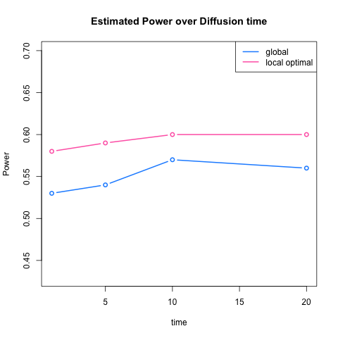
```


```{r echo = FALSE, results='asis'}
sum.table2 <- matrix(0, ncol = 3, nrow = 9)
rownames(sum.table2) <- c("A1", "A5", "A10", "A20",
                          "B", "HA1BH", "HA5BH", "HA10BH", "HA20BH")
colnames(sum.table2) <- c("(Z1, Z1)", "(Z1,Z2)", "(Z2, Z2)")
sum.table2[1,] <- c(2.009659, 2.429425, 1.962192)
sum.table2[2,] <- c(0.03144978, 0.28609389, 0.03046810)
sum.table2[3,] <- c(0.004390610, 0.041307195, 0.004227921)
sum.table2[4,] <- c(9.518467e-05, 8.970297e-04, 9.060265e-05)
sum.table2[5,] <- c(0.4659864, 0.5184164, 0.4735461)
sum.table2[6,] <- c(0.5556933, -0.5295170,  0.5266180)
sum.table2[7,] <- c(0.3222089, -0.3066353,  0.3035341)
sum.table2[8,] <- c( 0.04716910, -0.04481220,  0.04414113)
sum.table2[9,] <- c(0.0010453429, -0.0009916747,  0.0009700060)
#kable(sum.table2, align = 'c')
```


### [sim] two.3
<a name=" two.3"/>

$K = 2$; $n_{1} = n_{2} = 50$ ; $n = n_{1} + n_{2} = 100.$

```{r echo = FALSE, results='asis'}
a <- c(0.5, 0.1, 0.3, 0.3, 0.3)

table <- matrix(0, nrow = 1, ncol = 5)
colnames(table) <- c("u", "w" , "p1", "p2", "q12")
table[1,] <- a
table <- as.data.frame(table)
#kable(table, align = 'c', digits = 2)
```


$$\begin{align} P_{\theta}(A, X, Z) & = P_{\phi}(A | Z) P_{\omega}(Z | X) P_{u}(X) \\ & =  P_{\phi}(A) P_{\omega}(Z | X) P_{u}(X) \\ & = \prod\limits_{i,j=1}^{n} 0.3^{a_{ij}}(1-0.3)^{a_{ij}} \prod\limits_{i=1}^{n} \left[ (0.6)^{z_{i}} ( 1 -  0.6)^{1 - z_{i}} I(x_{i} = 0) +  (0.4)^{z_{i}} \big( 1 -  0.4  \big)^{1 - z_{i}} I(x_{i} = 1) \right] \prod\limits_{i=1}^{n} 0.5^{x_{i}} (1-0.5)^{1 - x_{i}}   \end{align}$$


Now we set $A \perp Z.$ Since $X$ can be related to $A$ only through $Z,$ $X \perp A.$ You can also show the independence, i.e. $P(A, X) = P(X) P(A)$ through the following equations: 

$$\begin{align} P(A, X) & = \sum\limits_{z} P(A, X | Z)P(Z) \\ &= \sum\limits_{z} P(A | Z) P(X | Z) P(X) (\because A \perp X | Z) \\ & = \sum\limits_{z} P(A)P(X | Z) P(Z) (\because A \perp Z) \\ & = P(A) \sum\limits_{z} P(X | Z)P(Z) \\ & = P(A) P(X)  \end{align}$$


```{r, out.width = 300, out.height = 400, echo = FALSE, fig.align='center', fig.show='hold', out.extra='style="float:left"'}
knitr::include_graphics("../figure/two3_power1.png")
```
```{r, out.width = 300, out.height = 400, echo = FALSE, fig.align='center', fig.show='hold', out.extra='style="float:left"'}

```
```{r, out.width = 300, out.height = 400, echo = FALSE, fig.align='center', fig.show='hold'}
knitr::include_graphics("../figure/two3_power20.png")
```


```{r echo = FALSE, results='asis'}
a <- c(0.05, 0.05, 0.02)
b <- c(0.11, 0.12, 0.12)

table <- matrix(0, nrow = 2, ncol = 3)
rownames(table) <- c("global test", "local optimal")
colnames(table) <- c("t=1",  "t=5", "t=20")
table[1,] <- a
table[2,] <- b
table <- as.data.frame(table)
kable(table, align = 'c', digits = 2)
```


```{r, out.width = 300, out.height = 400, echo = FALSE, fig.align='center'}
knitr::include_graphics("../figure/two3_plot.png")
```


```{r echo = FALSE, results='asis', results = FALSE}
sum.table3 <- matrix(0, ncol = 4, nrow = 9)
rownames(sum.table3) <- c("A1", "A5", "A10", "A20",
                          "B", "HA1BH", "HA5BH", "HA10BH", "HA20BH")
colnames(sum.table3) <- c("(Z1, Z1)", "(Z1,Z2)", "(Z2, Z1)", "(Z2, Z2)")
sum.table3[1,] <- c(2.164019, 2.209740, 2.209740, 2.167230)
sum.table3[2,] <- c(0.007966218, 0.008134024, 0.008134024, 0.007980015)
sum.table3[3,] <- c(1.440155e-05, 1.470527e-05, 1.470527e-05, 1.443841e-05)
sum.table3[4,] <- c( 1.213732e-07, 1.239579e-07, 1.239623e-07, 1.214982e-07)
sum.table3[5,] <- c(0.4730927, 0.5204621, 0.5204621, 0.4672487)
sum.table3[6,] <- c(0.05914563, -0.05478446, -0.05478446,  0.05253818)
sum.table3[7,] <- c(0.0002030969, -0.0001823708, -0.0001823708,  0.0001702130)
sum.table3[8,] <- c(3.345489e-07, -2.939790e-07, -2.939790e-07,  2.687838e-07)
sum.table3[9,] <- c( 3.332084e-09, -3.126440e-09, -3.126440e-09, 3.043859e-09)
#kable(sum.table3, align = 'c')
```


### [sim] two.4
<a name=" two.4"/>

$K = 2$; $n_{1} = n_{2} = 50$ ; $n = n_{1} + n_{2} = 100.$

```{r echo = FALSE, results='asis'}
a <- c(0.5, 0.1, 0.5, 0.1, 0.1)

table <- matrix(0, nrow = 1, ncol = 5)
colnames(table) <- c("u", "w" , "p1", "p2", "q12")
table[1,] <- a
table <- as.data.frame(table)
kable(table, align = 'c', digits = 2)
```


$$\begin{align} P_{\theta}(A, X, Z) & = P_{\phi}(A | Z) P_{\omega}(Z | X) P_{u}(X) \\ & = \prod\limits_{Z_{i} = Z_{j} = 0} 0.5^{a_{ij}}(1-0.5)^{a_{ij}} \prod\limits_{Z_{i} = Z_{j} = 1} 0.1^{a_{ij}}(1-0.1)^{a_{ij}} \prod\limits_{Z_{i} \neq Z_{j}} 0.1^{a_{ij}}(1 - 0.1)^{a_{ij}}  \\ & \times  \prod\limits_{i=1}^{n} \left[ (0.6)^{z_{i}} ( 1 -  0.6)^{1 - z_{i}} I(x_{i} = 0) +  (0.4)^{z_{i}} \big( 1 -  0.4  \big)^{1 - z_{i}} I(x_{i} = 1) \right] \prod\limits_{i=1}^{n} 0.5^{x_{i}} (1-0.5)^{1 - x_{i}}   \end{align}$$

Now let $p_{2} = q_{12} < p_{1}$ so that only one block (about 50 $\%$ of tatal sample) has a higher probability. 


```{r, out.width = 300, out.height = 400, echo = FALSE, fig.align='center', fig.show='hold', out.extra='style="float:left"'}
knitr::include_graphics("../figure/two4_power1.png")
```
```{r, out.width = 300, out.height = 400, echo = FALSE, fig.align='center', fig.show='hold', out.extra='style="float:left"'}

```
```{r, out.width = 300, out.height = 400, echo = FALSE, fig.align='center', fig.show='hold'}
knitr::include_graphics("../figure/two4_power20.png")
```


```{r echo = FALSE, results='asis'}
a <- c(0.40, 0.34, 0.27)
b <- c(0.42, 0.38, 0.30)

table <- matrix(0, nrow = 2, ncol = 3)
rownames(table) <- c("global test", "local optimal")
colnames(table) <- c("t=1",  "t=5", "t=20")
table[1,] <- a
table[2,] <- b
table <- as.data.frame(table)
kable(table, align = 'c', digits = 2)
```


```{r, out.width = 300, out.height = 400, echo = FALSE, fig.align='center'}
knitr::include_graphics("../figure/two4_plot.png")
```


### [sim] two.5
<a name=" two.5"/>

$K = 2$; $n_{1} = n_{2} = 50$ ; $n = n_{1} + n_{2} = 100.$

```{r echo = FALSE, results='asis'}
a <- c(0.5, 0.1, 0.5, 0.3, 0.1)

table <- matrix(0, nrow = 1, ncol = 5)
colnames(table) <- c("u", "w" , "p1", "p2", "q12")
table[1,] <- a
table <- as.data.frame(table)
kable(table, align = 'c', digits = 2)
```


$$\begin{align} P_{\theta}(A, X, Z) & = P_{\phi}(A | Z) P_{\omega}(Z | X) P_{u}(X) \\ & = \prod\limits_{Z_{i} = Z_{j} = 0} 0.5^{a_{ij}}(1-0.5)^{a_{ij}} \prod\limits_{Z_{i} = Z_{j} = 1} 0.3^{a_{ij}}(1-0.3)^{a_{ij}} \prod\limits_{Z_{i} \neq Z_{j}} 0.1^{a_{ij}}(1 - 0.1)^{a_{ij}}  \\ & \times  \prod\limits_{i=1}^{n} \left[ (0.6)^{z_{i}} ( 1 -  0.6)^{1 - z_{i}} I(x_{i} = 0) +  (0.4)^{z_{i}} \big( 1 -  0.4  \big)^{1 - z_{i}} I(x_{i} = 1) \right] \prod\limits_{i=1}^{n} 0.5^{x_{i}} (1-0.5)^{1 - x_{i}}   \end{align}$$

Now let $q_{12} < p_{2} < p_{1}$.


```{r, out.width = 300, out.height = 400, echo = FALSE, fig.align='center', fig.show='hold', out.extra='style="float:left"'}
knitr::include_graphics("../figure/two5_power1.png")
```
```{r, out.width = 300, out.height = 400, echo = FALSE, fig.align='center', fig.show='hold', out.extra='style="float:left"'}

```
```{r, out.width = 300, out.height = 400, echo = FALSE, fig.align='center', fig.show='hold'}

```


```{r echo = FALSE, results='asis'}
a <- c(0.50, 0.54, 0.56)
b <- c(0.54, 0.58, 0.60)

table <- matrix(0, nrow = 2, ncol = 3)
rownames(table) <- c("global test", "local optimal")
colnames(table) <- c("t=1",  "t=5", "t=20")
table[1,] <- a
table[2,] <- b
table <- as.data.frame(table)
kable(table, align = 'c', digits = 2)
```


```{r, out.width = 300, out.height = 400, echo = FALSE, fig.align='center'}
knitr::include_graphics("../figure/two5_plot.png")
```


### [sim] two.6
<a name=" two.6"/>

$K = 2$; $n_{1} = n_{2} = 50$ ; $n = n_{1} + n_{2} = 100.$

```{r echo = FALSE, results='asis'}
a <- c(0.5, 0.1, 0.5, 0.1, 0.3)

table <- matrix(0, nrow = 1, ncol = 5)
colnames(table) <- c("u", "w" , "p1", "p2", "q12")
table[1,] <- a
table <- as.data.frame(table)
kable(table, align = 'c', digits = 2)
```


$$\begin{align} P_{\theta}(A, X, Z) & = P_{\phi}(A | Z) P_{\omega}(Z | X) P_{u}(X) \\ & = \prod\limits_{Z_{i} = Z_{j} = 0} 0.5^{a_{ij}}(1-0.5)^{a_{ij}} \prod\limits_{Z_{i} = Z_{j} = 1} 0.1^{a_{ij}}(1-0.1)^{a_{ij}} \prod\limits_{Z_{i} \neq Z_{j}} 0.3^{a_{ij}}(1 - 0.3)^{a_{ij}}  \\ & \times  \prod\limits_{i=1}^{n} \left[ (0.6)^{z_{i}} ( 1 -  0.6)^{1 - z_{i}} I(x_{i} = 0) +  (0.4)^{z_{i}} \big( 1 -  0.4  \big)^{1 - z_{i}} I(x_{i} = 1) \right] \prod\limits_{i=1}^{n} 0.5^{x_{i}} (1-0.5)^{1 - x_{i}}   \end{align}$$

Now let $p_{2} < q_{12} < p_{1}$.


```{r, out.width = 300, out.height = 400, echo = FALSE, fig.align='center', fig.show='hold', out.extra='style="float:left"'}
knitr::include_graphics("../figure/two6_power1.png")
```
```{r, out.width = 300, out.height = 400, echo = FALSE, fig.align='center', fig.show='hold', out.extra='style="float:left"'}

```
```{r, out.width = 300, out.height = 400, echo = FALSE, fig.align='center', fig.show='hold'}
knitr::include_graphics("../figure/two6_power20.png")
```


```{r echo = FALSE, results='asis'}
a <- c(0.23, 0.14, 0.05)
b <- c(0.37, 0.25, 0.12)

table <- matrix(0, nrow = 2, ncol = 3)
rownames(table) <- c("global test", "local optimal")
colnames(table) <- c("t=1",  "t=5", "t=20")
table[1,] <- a
table[2,] <- b
table <- as.data.frame(table)
kable(table, align = 'c', digits = 2)
```


```{r, out.width = 300, out.height = 400, echo = FALSE, fig.align='center'}
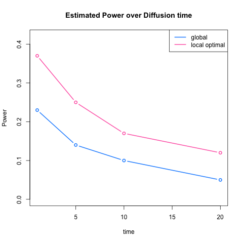
```


## Summary
<a name=" Summary"/>

 Since we now have two types of multiscale - diffusion distance $(t)$, local family $(k,l)$ of test statistics, we summarize the change in optimal power and its change over diffusion process.  


### With-block probability p vs. between-block probability q

  First, for simplicity, we set the within-block probabilities are homogeneous for two blocks so that we can control two hyper parameters $p$ and $q$:
  
  $$X \sim Bern(0.5)$$
  
  $$Z  \sim  \left\{  \begin{array}{cc} Bern(0.6) & X = 0 \\ Bern(0.4) & X = 1  \end{array} \right.$$
  
 $$A \sim Bern \left[  \begin{array}{cc} \color{red}{p} & \color{blue}{q}  \\ \color{blue}{q} & \color{red}{p} \end{array}  \right]$$


### Optimal power 

```{r, out.width = 400, out.height = 400, echo = FALSE, fig.align='center', fig.show='hold'}

```

### Discrepancy between local and global scale

```{r, out.width = 300, out.height = 400, echo = FALSE, fig.align='center', fig.show='hold', out.extra='style="float:left"'}

```
```{r, out.width = 300, out.height = 400, echo = FALSE, fig.align='center', fig.show='hold'}
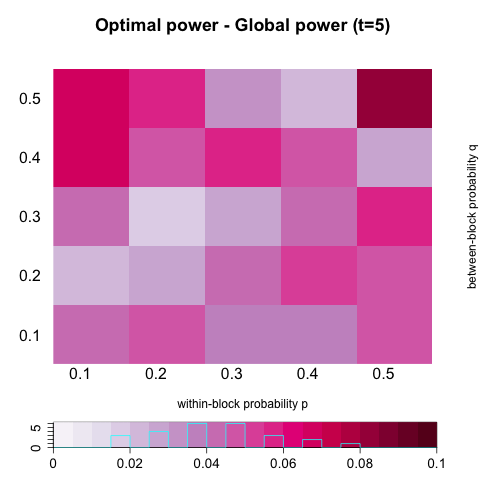
```
```{r, out.width = 300, out.height = 400, echo = FALSE, fig.align='center', fig.show='hold', out.extra='style="float:left"'}

```
```{r, out.width = 300, out.height = 400, echo = FALSE, fig.align='center', fig.show='hold'}

```

### Diffusion Process


```{r, out.width = 300, out.height = 400, echo = FALSE, fig.align='center', fig.show='hold', out.extra='style="float:left"'}
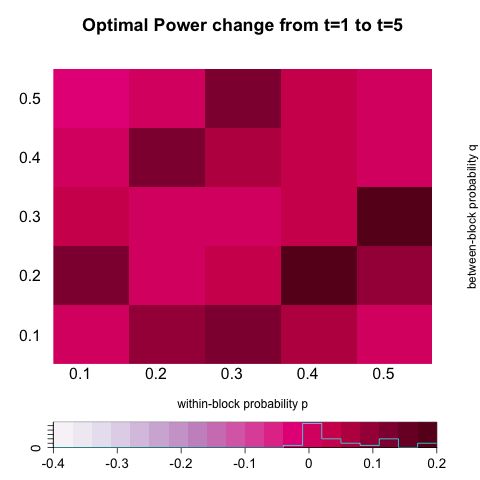
```
```{r, out.width = 300, out.height = 400, echo = FALSE, fig.align='center', fig.show='hold', out.extra='style="float:left"'}
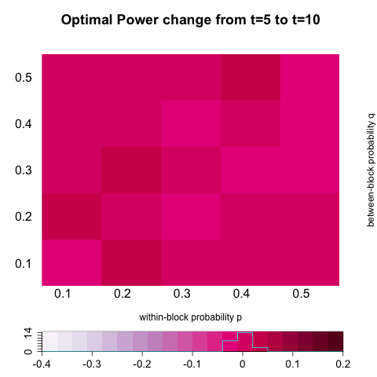
```
```{r, out.width = 300, out.height = 400, echo = FALSE, fig.align='center', fig.show='hold'}
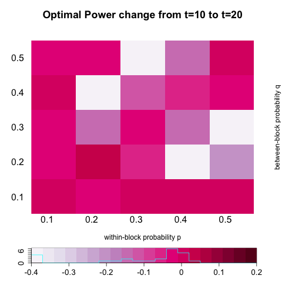
```


```{r, out.width = 500, out.height = 500, echo = FALSE, fig.align='center', fig.show='hold'}
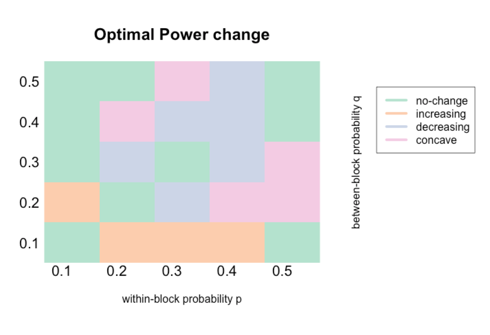
```


### One with-block probability p vs. Others r

  It is also plausible that probability of having edges differs for only one block and for other parts they are the same. 
  
  $$X \sim Bern(0.5)$$
  
  $$Z  \sim  \left\{  \begin{array}{cc} Bern(0.6) & X = 0 \\ Bern(0.4) & X = 1  \end{array} \right.$$
  
 $$A \sim Bern \left[  \begin{array}{cc} \color{red}{p} & \color{blue}{r}  \\ \color{blue}{r} & \color{blue}{r} \end{array}  \right]$$


### Optimal power 

```{r, out.width = 400, out.height = 400, echo = FALSE, fig.align='center', fig.show='hold'}

```

### Discrepancy between local and global scale

```{r, out.width = 300, out.height = 400, echo = FALSE, fig.align='center', fig.show='hold', out.extra='style="float:left"'}
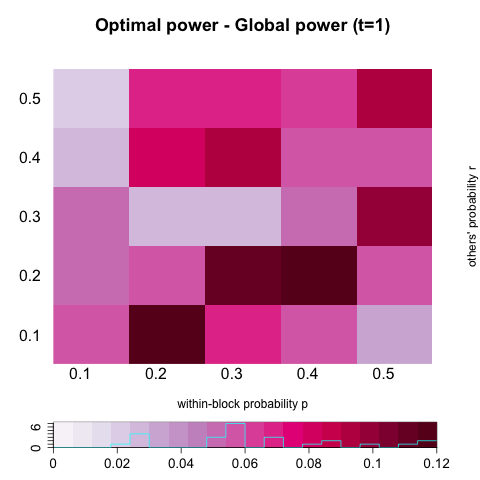
```
```{r, out.width = 300, out.height = 400, echo = FALSE, fig.align='center', fig.show='hold'}
knitr::include_graphics("../figure/two_part_diff2.png")
```
```{r, out.width = 300, out.height = 400, echo = FALSE, fig.align='center', fig.show='hold', out.extra='style="float:left"'}

```
```{r, out.width = 300, out.height = 400, echo = FALSE, fig.align='center', fig.show='hold'}

```

### Diffusion Process


```{r, out.width = 300, out.height = 400, echo = FALSE, fig.align='center', fig.show='hold', out.extra='style="float:left"'}
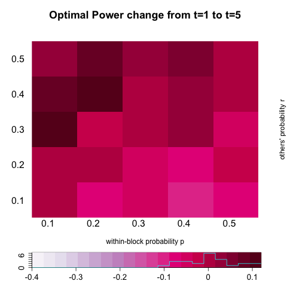
```
```{r, out.width = 300, out.height = 400, echo = FALSE, fig.align='center', fig.show='hold', out.extra='style="float:left"'}
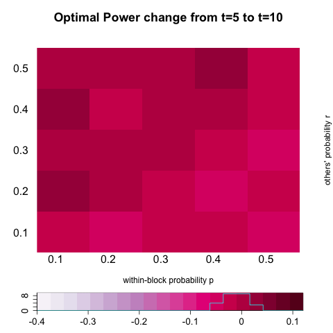
```
```{r, out.width = 300, out.height = 400, echo = FALSE, fig.align='center', fig.show='hold'}
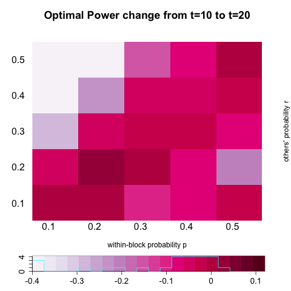
```


```{r, out.width = 500, out.height = 500, echo = FALSE, fig.align='center', fig.show='hold'}

```


