```{r echo=FALSE, message =FALSE, warning = FALSE}
library(igraph)
library(RefManageR)
library(xtable)
library(grid)
library(ggplot2)
library(png)
library(grid)
library(knitr)
bib <- ReadBib(system.file("Bib", "biblatexExamples.bib", 
                           package = "RefManageR"), check = FALSE)
BibOptions(check.entries = FALSE, style = "markdown", bib.style = "alphabetic", cite.style = 'alphabetic')
```

- [Local Dependence](# Local Dependence)

- [Network vs. Attributes](# Network vs. Attributes)

- [Simple Block Models](# Simple Block Models)

- [Three Blocks Models](# Three Blocks Models)

- [Five Blocks Models](# Five Blocks Models)


## Local Dependence
<a name=" Local Dependence"/>

  The dependence induced by a probability measure $\textbf{P}$ is call local if there exists a partition of the set of nodes $\mathcal{A}$ into $K \geq 2$ non-empty, finite subsets $\mathcal{A}_{1}, ... , \mathcal{A}_{k}$, called neighborhoods, such that within- and between-neighborhoold subgraphs $\textbf{Y}_{k,l}$ within domains $\mathcal{A}_{k} \times \mathcal{A}_{l}$ and sample spaces $Y_{k,l}$ satisfy, for all $y_{k,l}:$
  
  $$\textbf{P}_{K}(Y) = \prod\limits_{k=1}^{K} P_{k,k}(Y_{k,k}) \prod\limits_{l=1}^{k-1} P_{k,l}(Y_{k,l}, Y_{l,k})$$

and a suitable neighborhood structure is needed. Let $Z = (Z_{1}, ... , Z_{n})$ be memebership indicators, where $Z_{i} = (z_{i1}, z_{i2},...,z_{iK})$ and $z_{ik} = 1$ if node $i$ is member of neighborghood $\mathcal{A}_{k}$ and $z_{ik} = 0$ otherwise. We assume that the conditional probability mass function (PMF) of a random graph $Y$ given neighborhood structure $Z = z$ can be written as:

$$P(Y=y|Z=z) = \prod\limits_{k=1}^{K} P(Y_{k,k} = y_{k,k} | Z_{z}) \times \prod\limits_{l=1}^{k-1}P(Y_{k,l} = y_{k,l}, Y_{l,k} = y_{l,k} | Z = z)$$


Assume that a pair of nodes with similar values is more likely to be in the same neighborhood (same membership), and the probability of having an edge within the block is larger than the probability between the blocks. I start with simple model:

- Distribution of Attributes

$$Y_{i} \overset{i.i.d}{\sim} N(0,1), i = 1,...,n.$$

- Create $K$ neighborhood :

$$Z_{i} \sim Multinomial(\textbf{p} =p_{1}, .. , p_{k}), i = 1,... ,n$$
and make sure that $\textbf{P} = f(Y_{i})$

- Within block probability

Suppose $X_{ij} \sim Bernoulli(g(X_{ij}))$ such that $X_{ij} = 1$ iff there exists an edge between node $i$ and node $j$, and $X_{ij} = 0$ otherwise.

$$g(X_{ij}) = \left\{ \begin{array}{ll} w_{i} & i = j\mbox{ (within block)} \\ b_{ij} = b_{ji} & i \neq j\mbox{ (between blocks)}    \end{array} \right.$$


## Network vs. Attributes
<a name=" Network vs. Attributes"/>

* $K = 3$ blocks 


$$Z_{i} \sim \left\{  \begin{array}{ll} Multinom(0.5, 0.25, 0.25) & Y_{i} <= -1 \\ Multinom(0.25, 0.5, 0.25) & -1 < Y_{i} \leq 1 \\ Multinom(0.25, 0.25, 0.5) & Y_{i} > 1 \end{array} \right.$$


$$\left\{ \begin{array}{lll} w_{1} = 0.8 & w_{2} = 0.6 & w_{3} = 0.4 \\ b_{ij} = 0  & \forall i \neq j  \end{array} \right.$$


```{r, out.width = 500, out.height = 500, echo = FALSE, fig.align='center'}
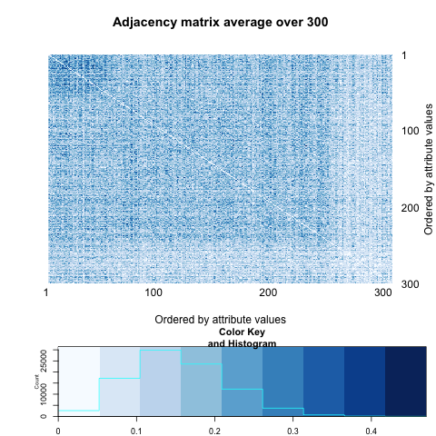
```


```{r, out.width = 400, out.height = 400, echo = FALSE, fig.align='center', fig.show='hold', out.extra='style="float:left"'}
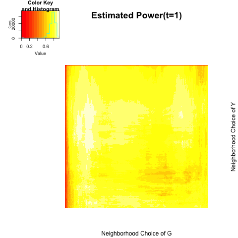
```
```{r, out.width = 400, out.height = 400, echo = FALSE, fig.align='center', fig.show='hold', out.extra='style="float:left"'}
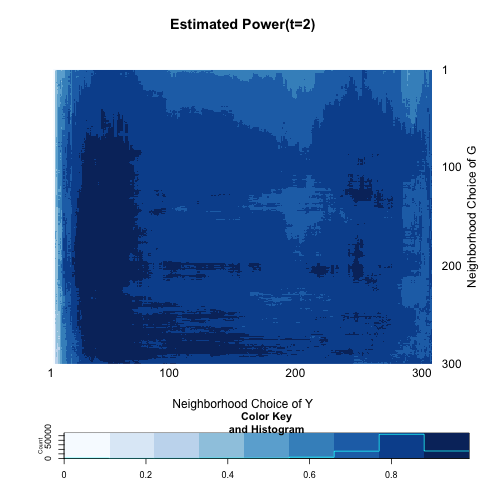
```
```{r, out.width = 400, out.height = 400, echo = FALSE, fig.align='center', fig.show='hold', out.extra='style="float:left"'}
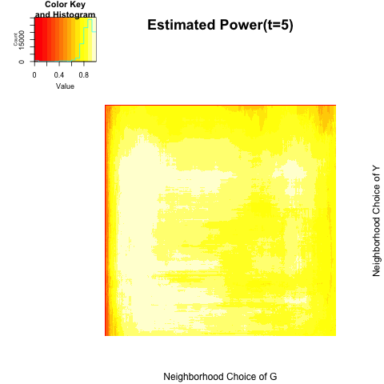
```
```{r, out.width = 400, out.height = 400, echo = FALSE, fig.align='center', fig.show='hold'}
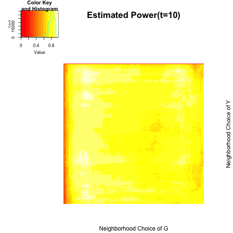
```


```{r echo = FALSE, results='asis'}
a <- c(0.7400000, 0.7833333, 0.7533333, 0.7400000)
b <- c(0.9400000, 0.9900000, 0.9966667, 0.9800000)

table <- matrix(0, nrow = 2, ncol = 4)
rownames(table) <- c("global test", "local optimal")
colnames(table) <- c("t=1", "t=2", "t=5", "t=10")
table[1,] <- a
table[2,] <- b
table <- as.data.frame(table)
kable(table, align = 'c', digits = 2)
```


* $K = 5$ blocks according to quantile on $Y$(attribute variable).


$$\left\{ \begin{array}{lll} w_{i} = 0.3 & \forall{i} \\ b_{ij} = 0  & \forall i \neq j  \end{array} \right.$$


```{r, out.width = 500, out.height = 500, echo = FALSE, fig.align='center'}
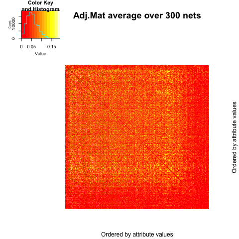
```


```{r, out.width = 400, out.height = 400, echo = FALSE, fig.align='center', fig.show='hold', out.extra='style="float:left"'}
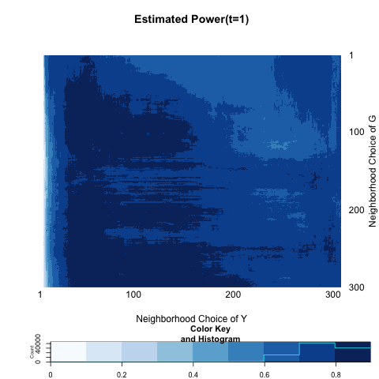
```
```{r, out.width = 400, out.height = 400, echo = FALSE, fig.align='center', fig.show='hold', out.extra='style="float:left"'}
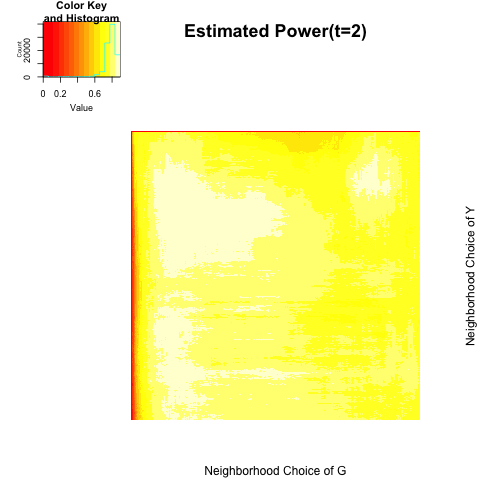
```
```{r, out.width = 400, out.height = 400, echo = FALSE, fig.align='center', fig.show='hold', out.extra='style="float:left"'}
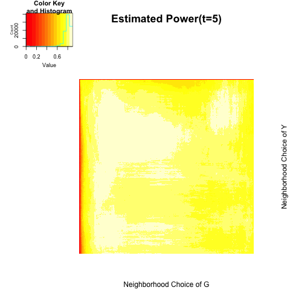
```
```{r, out.width = 400, out.height = 400, echo = FALSE, fig.align='center', fig.show='hold'}
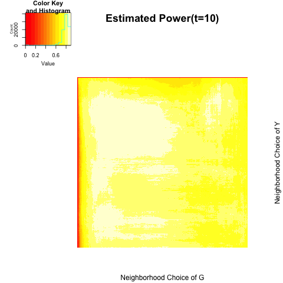
```


```{r echo = FALSE, results='asis'}
a <- c(0.7533333, 0.7600000, 0.7466667, 0.7600000)
b <- c(0.8966667, 0.8933333, 0.8933333, 0.8933333)

table <- matrix(0, nrow = 2, ncol = 4)
rownames(table) <- c("global test", "local optimal")
colnames(table) <- c("t=1", "t=2", "t=5", "t=10")
table[1,] <- a
table[2,] <- b
table <- as.data.frame(table)
kable(table, align = 'c', digits = 2)
```


## Simple Block Models
<a name=" Simple Block Models"/>

We can think of two-block models which divide the observations into two neighborhood, or blocks. We will introduce a variable $Z$ which indicate block membership.


$$Z_{i} = \left\{ \begin{array}{ll}  -1 & i \in \mbox{ block 1 } \\ 1 & i \in \mbox{ block 2} \end{array} \right.$$

Generate a Bernoulli random variable which depends on block membership and a parameter $\omega.$


$$X_{i} \overset{i.i.d}{\sim} Bern(0.5 + z_{i} \omega)$$

Note that larger value of $\omega$ implies much discrepency between blocks. The probability of having an edge also depends on the block membership.

$$A = \left[  \begin{array}{c|c} p & q \\ \hline q & p \end{array} \right]$$

First I sepecify $n=100$ ; $p = 0.3$ ; $q = 0.05.$

* $\omega =0$


```{r, out.width = 200, out.height = 300, echo = FALSE, fig.align='center', fig.show='hold', out.extra='style="float:left"'}
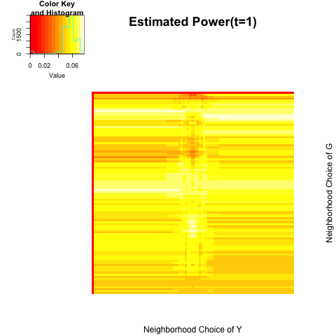
```
```{r, out.width = 200, out.height = 300, echo = FALSE, fig.align='center', fig.show='hold', out.extra='style="float:left"'}
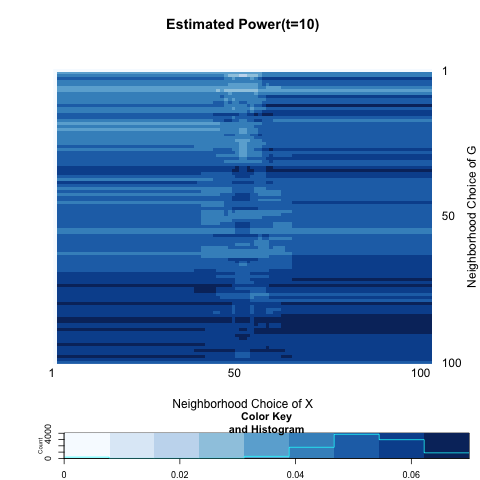
```
```{r, out.width = 200, out.height = 300, echo = FALSE, fig.align='center', fig.show='hold', out.extra='style="float:left"'}
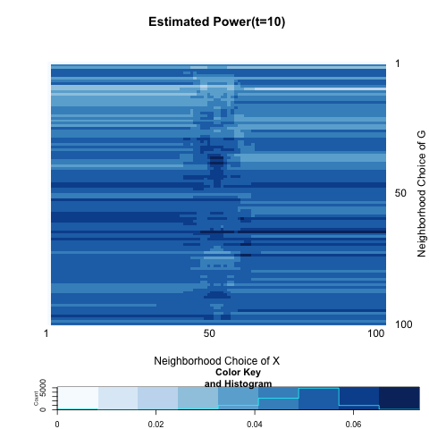
```
```{r, out.width = 200, out.height = 300, echo = FALSE, fig.align='center', fig.show='hold'}
knitr::include_graphics("../figure/local7_10.png")
```


```{r echo = FALSE, results='asis'}
a <- c(0.05000000, 0.05333333, 0.05000000, 0.06000000)
b <- c(0.07666667, 0.07000000, 0.07333333, 0.07333333)

table <- matrix(0, nrow = 2, ncol = 4)
rownames(table) <- c("global test", "local optimal")
colnames(table) <- c("t=1", "t=2", "t=5", "t=10")
table[1,] <- a
table[2,] <- b
table <- as.data.frame(table)
kable(table, align = 'c', digits = 2)
```


* $\omega = 0.10$


```{r, out.width = 200, out.height = 300, echo = FALSE, fig.align='center', fig.show='hold', out.extra='style="float:left"'}
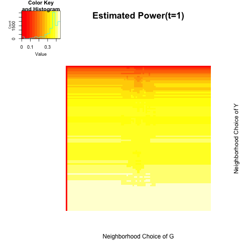
```
```{r, out.width = 200, out.height = 300, echo = FALSE, fig.align='center', fig.show='hold', out.extra='style="float:left"'}

```
```{r, out.width = 200, out.height = 300, echo = FALSE, fig.align='center', fig.show='hold', out.extra='style="float:left"'}
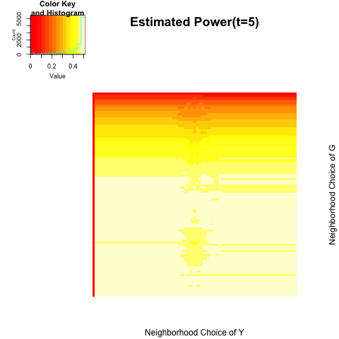
```
```{r, out.width = 200, out.height = 300, echo = FALSE, fig.align='center', fig.show='hold'}
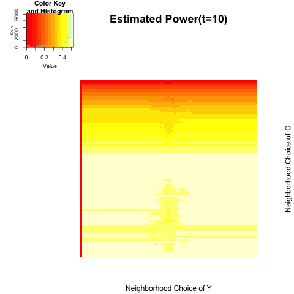
```


```{r echo = FALSE, results='asis'}
a <- c( 0.4400000, 0.4833333, 0.4966667, 0.5166667)
b <- c(0.4466667, 0.5000000, 0.5100000, 0.5233333)

table <- matrix(0, nrow = 2, ncol = 4)
rownames(table) <- c("global test", "local optimal")
colnames(table) <- c("t=1", "t=2", "t=5", "t=10")
table[1,] <- a
table[2,] <- b
table <- as.data.frame(table)
kable(table, align = 'c', digits = 2)
```


* $\omega = 0.20$


```{r, out.width = 200, out.height = 300, echo = FALSE, fig.align='center', fig.show='hold', out.extra='style="float:left"'}
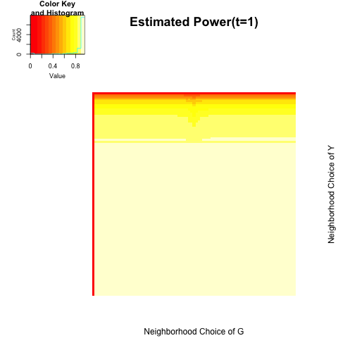
```
```{r, out.width = 200, out.height = 300, echo = FALSE, fig.align='center', fig.show='hold', out.extra='style="float:left"'}
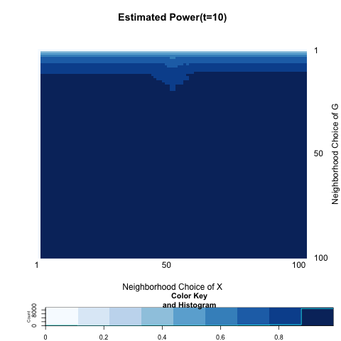
```
```{r, out.width = 200, out.height = 300, echo = FALSE, fig.align='center', fig.show='hold', out.extra='style="float:left"'}
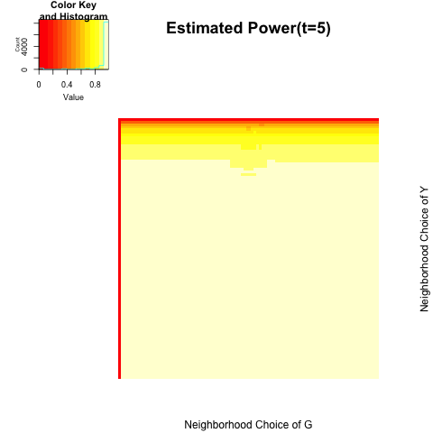
```
```{r, out.width = 200, out.height = 300, echo = FALSE, fig.align='center', fig.show='hold'}
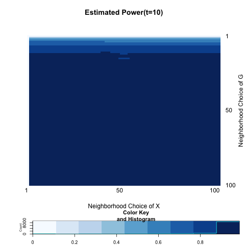
```


```{r echo = FALSE, results='asis'}
a <- c( 0.96, 0.98, 0.98, 0.98)
b <- c(0.9600000, 0.9866667, 0.9866667, 0.9866667)

table <- matrix(0, nrow = 2, ncol = 4)
rownames(table) <- c("global test", "local optimal")
colnames(table) <- c("t=1", "t=2", "t=5", "t=10")
table[1,] <- a
table[2,] <- b
table <- as.data.frame(table)
kable(table, align = 'c', digits = 2)
```


## Three Blocks Models
<a name=" Three Blocks Models"/>

We can think of two-block models which divide the observations into two neighborhood, or blocks. We will introduce a variable $Z$ which indicate block membership.


$$Z_{i} = \left\{ \begin{array}{ll}  -1 & i \in \mbox{ block 1 } \\ 1 & i \in \mbox{ block 2} \\ 0 &   i \in \mbox{ block 3} \end{array} \right.$$

Generate a Bernoulli random variable which depends on block membership and a parameter $\omega.$


$$X_{i} \overset{i.i.d}{\sim} Bern(0.5 + z_{i} \omega)$$

Note that larger value of $\omega$ implies much discrepency between blocks. The probability of having an edge also depends on the block membership.

$$A = \left[  \begin{array}{c|c | c} p & q  & q \\ \hline q  & p & q \\ \hline q & q & p \end{array} \right]$$

Set $n=150$ ; $p = 0.3$ ; $q = 0.05;$ $\omega = 0.15$. In other words, the probability of having edges between or within block is:

$$A = \left[  \begin{array}{c|c| c} 0.3 & 0.05 & 0.05 \\ \hline 0.05 & 0.3 & 0.05 \\ \hline 0.05 & 0.05 & 0.3 \end{array} \right]$$

```{r, out.width = 500, out.height = 500, echo = FALSE, fig.align='center'}
knitr::include_graphics("../figure/local12_net.png")
```


and corresponding nodes' attributes are following such Bernoulli models :


$$X = \left[  \begin{array}{c|c|c} Bern(0.35 ) &  &  \\ \hline  & Bern(0.65) &  \\ \hline  &  & Bern(0.50) \end{array} \right]$$


```{r, out.width = 400, out.height = 400, echo = FALSE, fig.align='center', fig.show='hold', out.extra='style="float:left"'}
knitr::include_graphics("../figure/local12_1.png")
```
```{r, out.width = 400, out.height = 400, echo = FALSE, fig.align='center', fig.show='hold', out.extra='style="float:left"'}
knitr::include_graphics("../figure/local12_2.png")
```
```{r, out.width = 400, out.height = 400, echo = FALSE, fig.align='center', fig.show='hold', out.extra='style="float:left"'}
knitr::include_graphics("../figure/local12_5.png")
```
```{r, out.width = 400, out.height = 400, echo = FALSE, fig.align='center', fig.show='hold', out.extra='style="float:left"'}
knitr::include_graphics("../figure/local12_10.png")
```


```{r echo = FALSE, results='asis'}
a <- c(0.6300000, 0.6133333, 0.5566667, 0.5433333)
b <- c(0.6466667, 0.7200000, 0.7300000, 0.7433333)

table <- matrix(0, nrow = 2, ncol = 4)
rownames(table) <- c("global test", "local optimal")
colnames(table) <- c("t=1", "t=2", "t=5", "t=10")
table[1,] <- a
table[2,] <- b
table <- as.data.frame(table)
kable(table, align = 'c', digits = 2)
```


As diffusion time increases, estimated power from global test is decreasing while that from the local optimal increases. This does not work when the number of block is two, if $p > q$, global test achieves highest power because the distance between blocks is always proportion to the discrepancy in distributions.

Note that the local scale in (double-centered) $G$ (graph) is stuck in between 50-100. That means including the one neighboring block is okay while two neighboring blocks, which would be equivalent to global scale does not provide the most powerful test statistics. It makes sense in that for each block, two other block is equally likely to be diffuse but the distribution is different. In the case of the ``block1`` and ``block2``, including two other blocks supports diffusion distance means increasing disrepancy in distribution. On the other hand, for ``block3``, two other neighboring blocks are correlated in opposite directions.  

<hr />

The probability of having edges between or within block is:

$$A = \left[  \begin{array}{c|c| c} 0.30 & 0.20 & 0.05 \\ \hline 0.20 & 0.30 & 0.10 \\ \hline 0.05 & 0.10 & 0.30 \end{array} \right]$$


```{r, out.width = 500, out.height = 500, echo = FALSE, fig.align='center'}
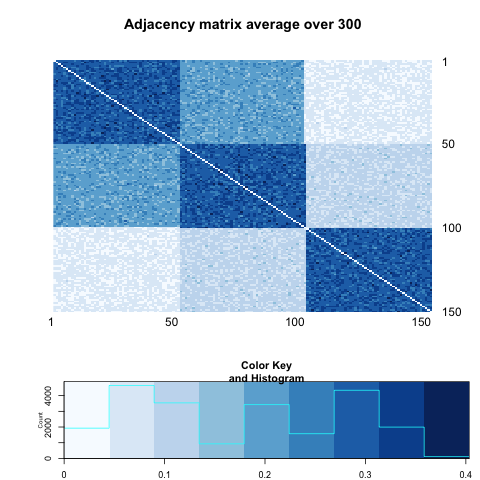
```


and corresponding nodes' attributes are following such Bernoulli models :


$$X = \left[  \begin{array}{c|c|c} Bern(0.35) &  &  \\ \hline  & Bern(0.65) &  \\ \hline  &  & Bern(0.50) \end{array} \right]$$


```{r, out.width = 400, out.height = 400, echo = FALSE, fig.align='center', fig.show='hold', out.extra='style="float:left"'}
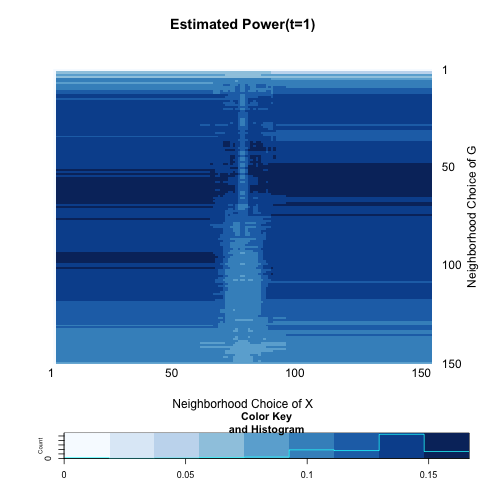
```
```{r, out.width = 400, out.height = 400, echo = FALSE, fig.align='center', fig.show='hold', out.extra='style="float:left"'}
knitr::include_graphics("../figure/local13_2.png")
```
```{r, out.width = 400, out.height = 400, echo = FALSE, fig.align='center', fig.show='hold', out.extra='style="float:left"'}
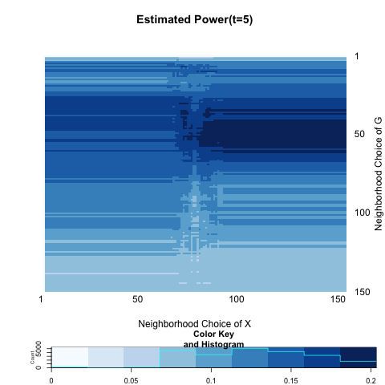
```
```{r, out.width = 400, out.height = 400, echo = FALSE, fig.align='center', fig.show='hold', out.extra='style="float:left"'}
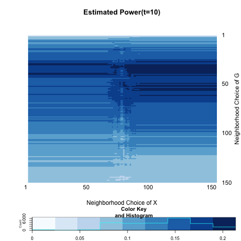
```


```{r echo = FALSE, results='asis'}
a <- c(0.08666667, 0.06333333, 0.08000000, 0.07666667)
b <- c(0.1666667, 0.1466667, 0.2033333, 0.2133333)

table <- matrix(0, nrow = 2, ncol = 4)
rownames(table) <- c("global test", "local optimal")
colnames(table) <- c("t=1", "t=2", "t=5", "t=10")
table[1,] <- a
table[2,] <- b
table <- as.data.frame(table)
kable(table, align = 'c', digits = 2)
```


## Five Blocks Models
<a name=" Five Blocks Models"/>

We imitate the previous block model with more number of blocks, expecting that the local optimal scale is stuck much ealier.

$$A = \left[  \begin{array}{c|c|c|c|c} \color{red}{0.30} & 0.05 & 0.05 & 0.05 & 0.05 \\ \hline 0.05 & \color{red}{0.30} & 0.05 & 0.05 & 0.05 \\ \hline 0.05 & 0.05 & \color{red}{0.30} & 0.05 & 0.05 \\ \hline 0.05 & 0.05 & 0.05 & \color{red}{0.30} & 0.05 \\ \hline 0.05 & 0.05 & 0.05 & 0.05 & \color{red}{0.30} \end{array} \right]$$


```{r, out.width = 500, out.height = 500, echo = FALSE, fig.align='center'}
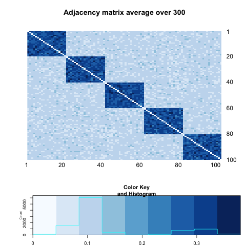
```


and corresponding nodes' attributes are following such Bernoulli models :


$$X = \left[  \begin{array}{c|c|c|c|c} Bern(0.35) &  &  & & \\ \hline  & Bern(0.65) & & &  \\ \hline  &  & Bern(0.50) & & \\ \hline & & & Bern(0.65) & \\ \hline & & & & Bern(0.35) \end{array} \right]$$


```{r, out.width = 400, out.height = 400, echo = FALSE, fig.align='center', fig.show='hold', out.extra='style="float:left"'}
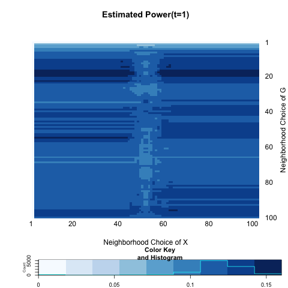
```
```{r, out.width = 400, out.height = 400, echo = FALSE, fig.align='center', fig.show='hold', out.extra='style="float:left"'}
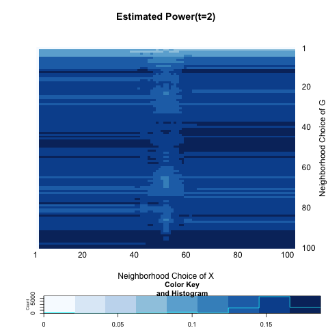
```
```{r, out.width = 400, out.height = 400, echo = FALSE, fig.align='center', fig.show='hold', out.extra='style="float:left"'}
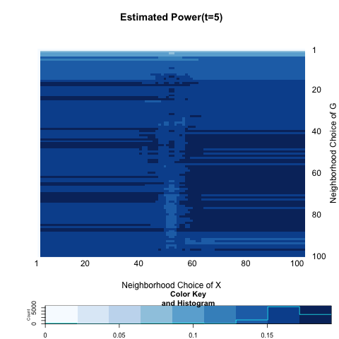
```
```{r, out.width = 400, out.height = 400, echo = FALSE, fig.align='center', fig.show='hold', out.extra='style="float:left"'}
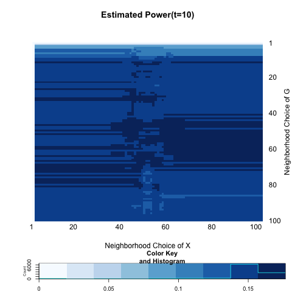
```


```{r echo = FALSE, results='asis'}
a <- c(0.1233333, 0.1700000, 0.1566667, 0.1466667)
b <- c(0.1600000, 0.1866667, 0.1933333, 0.1766667)

table <- matrix(0, nrow = 2, ncol = 4)
rownames(table) <- c("global test", "local optimal")
colnames(table) <- c("t=1", "t=2", "t=5", "t=10")
table[1,] <- a
table[2,] <- b
table <- as.data.frame(table)
kable(table, align = 'c', digits = 2)
```


It looks like the estimated power deceases as the number of blocks increases and the number of individuals within the block decreases. 


<hr />

Now increase the probability of having edges within the blocks to make sure the power is large enough. (and it was not enough, so) Also increase the discrepancy in distribution. 


$$X = \left[  \begin{array}{c|c|c|c|c} Bern(0.35) &  &  & & \\ \hline  & Bern(0.65) & & &  \\ \hline  &  & Bern(0.50) & & \\ \hline & & & Bern(0.65) & \\ \hline & & & & Bern(0.35) \end{array} \right]$$

$$A = \left[  \begin{array}{c|c|c|c|c} \color{red}{0.50} & 0.05 & 0.05 & 0.05 & 0.05 \\ \hline 0.05 & \color{red}{0.50} & 0.05 & 0.05 & 0.05 \\ \hline 0.05 & 0.05 & \color{red}{0.50} & 0.05 & 0.05 \\ \hline 0.05 & 0.05 & 0.05 & \color{red}{0.50} & 0.05 \\ \hline 0.05 & 0.05 & 0.05 & 0.05 & \color{red}{0.50} \end{array} \right]$$


```{r, out.width = 400, out.height = 400, echo = FALSE, fig.align='center', fig.show='hold', out.extra='style="float:left"'}
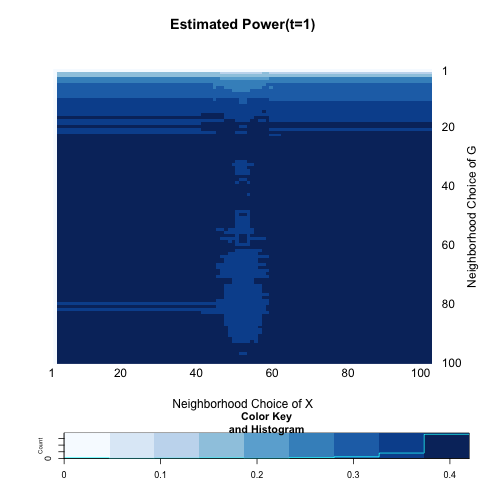
```
```{r, out.width = 400, out.height = 400, echo = FALSE, fig.align='center', fig.show='hold', out.extra='style="float:left"'}
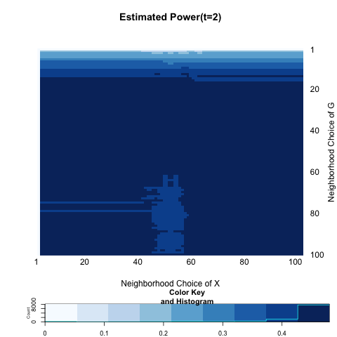
```
```{r, out.width = 400, out.height = 400, echo = FALSE, fig.align='center', fig.show='hold', out.extra='style="float:left"'}
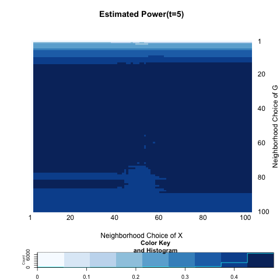
```
```{r, out.width = 400, out.height = 400, echo = FALSE, fig.align='center', fig.show='hold', out.extra='style="float:left"'}
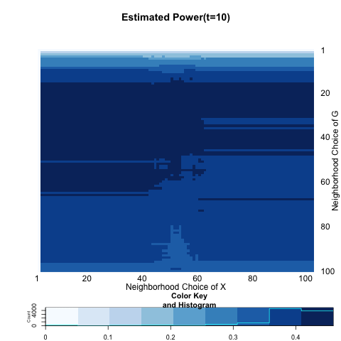
```


```{r echo = FALSE, results='asis'}
a <- c(0.4033333, 0.4266667, 0.3866667, 0.3300000)
b <- c(0.42, 0.48, 0.48, 0.46)

table <- matrix(0, nrow = 2, ncol = 4)
rownames(table) <- c("global test", "local optimal")
colnames(table) <- c("t=1", "t=2", "t=5", "t=10")
table[1,] <- a
table[2,] <- b
table <- as.data.frame(table)
kable(table, align = 'c', digits = 2)
```


