```{r echo=FALSE, message =FALSE, warning = FALSE}
library(igraph)
library(RefManageR)
library(xtable)
library(grid)
library(ggplot2)
library(png)
library(grid)
library(knitr)
bib <- ReadBib(system.file("Bib", "biblatexExamples.bib", 
                           package = "RefManageR"), check = FALSE)
BibOptions(check.entries = FALSE, style = "markdown", bib.style = "alphabetic", cite.style = 'alphabetic')
```

- [Local Dependence](# Local Dependence)

- [Network vs. Attributes](# Network vs. Attributes)

- [Simple Block Models](# Simple Block Models)

## Local Dependence
<a name=" Local Dependence"/>

  The dependence induced by a probability measure $\textbf{P}$ is call local if there exists a partition of the set of nodes $\mathcal{A}$ into $K \geq 2$ non-empty, finite subsets $\mathcal{A}_{1}, ... , \mathcal{A}_{k}$, called neighborhoods, such that within- and between-neighborhoold subgraphs $\textbf{Y}_{k,l}$ within domains $\mathcal{A}_{k} \times \mathcal{A}_{l}$ and sample spaces $Y_{k,l}$ satisfy, for all $y_{k,l}:$
  
  $$\textbf{P}_{K}(Y) = \prod\limits_{k=1}^{K} P_{k,k}(Y_{k,k}) \prod\limits_{l=1}^{k-1} P_{k,l}(Y_{k,l}, Y_{l,k})$$

and a suitable neighborhood structure is needed. Let $Z = (Z_{1}, ... , Z_{n})$ be memebership indicators, where $Z_{i} = (z_{i1}, z_{i2},...,z_{iK})$ and $z_{ik} = 1$ if node $i$ is member of neighborghood $\mathcal{A}_{k}$ and $z_{ik} = 0$ otherwise. We assume that the conditional probability mass function (PMF) of a random graph $Y$ given neighborhood structure $Z = z$ can be written as:

$$P(Y=y|Z=z) = \prod\limits_{k=1}^{K} P(Y_{k,k} = y_{k,k} | Z_{z}) \times \prod\limits_{l=1}^{k-1}P(Y_{k,l} = y_{k,l}, Y_{l,k} = y_{l,k} | Z = z)$$


Assume that a pair of nodes with similar values is more likely to be in a same neighborhood (same membership), and the probability of having an edge within the block is larger than the probability between the blocks. I start with simple model:

- Distribution of Attributes

$$Y_{i} \overset{i.i.d}{\sim} N(0,1), i = 1,...,n.$$

- Create $K$ neighborhood :

$$Z_{i} \sim Multinomial(\textbf{p} =p_{1}, .. , p_{k}), i = 1,... ,n$$
and make sure that $\textbf{P} = f(Y_{i})$

- Within block probability

Suppose $X_{ij} \sim Bernoulli(g(X_{ij}))$ such that $X_{ij} = 1$ iff there exists an edge between node $i$ and node $j$, and $X_{ij} = 0$ otherwise.

$$g(X_{ij}) = \left\{ \begin{array}{ll} w_{i} & i = j \\ b_{ij} = b_{ji} & i \neq j    \end{array} \right.$$


## Network vs. Attributes
<a name=" Network vs. Attributes"/>

(1) $K = 3$ blocks. 

$$Z_{i} \sim \left\{  \begin{array}{ll} Multinom(0.6, 0.2, 0.2) & Y_{i} <= -1 \\ Multinom(0.2, 0.6, 0.2) & -1 < Y_{i} \leq 1 \\ Multinom(0.2, 0.2, 0.6) & Y_{i} > 1 \end{array} \right.$$


$$\left\{ \begin{array}{lll} w_{1} = 0.5 & w_{2} = 0.4 & w_{3} = 0.3 \\ b_{ij} = 0 & \forall i \neq j  \end{array} \right.$$

At last, put an arbitrary edge between different connected components to make sure $G$ connected.


```{r, out.width = 500, out.height = 500, echo = FALSE, fig.align='center'}

```


```{r, out.width = 200, out.height = 300, echo = FALSE, fig.align='center', fig.show='hold', out.extra='style="float:left"'}

```
```{r, out.width = 200, out.height = 300, echo = FALSE, fig.align='center', fig.show='hold', out.extra='style="float:left"'}

```
```{r, out.width = 200, out.height = 300, echo = FALSE, fig.align='center', fig.show='hold', out.extra='style="float:left"'}

```
```{r, out.width = 200, out.height = 300, echo = FALSE, fig.align='center', fig.show='hold'}
knitr::include_graphics("../figure/local1_10.png")
```


```{r echo = FALSE, results='asis'}
a <- c(1,1,1,1)
b <- c(1,1,1,1)

table <- matrix(0, nrow = 2, ncol = 4)
rownames(table) <- c("global test", "local optimal")
colnames(table) <- c("t=1", "t=2", "t=5", "t=10")
table[1,] <- a
table[2,] <- b
table <- as.data.frame(table)
kable(table, align = 'c', digits = 2)
```


Oops, it is too extreme.


<hr />

(2) $K = 3$ blocks 


$$Z_{i} \sim \left\{  \begin{array}{ll} Multinom(0.5, 0.25, 0.25) & Y_{i} <= -1 \\ Multinom(0.25, 0.5, 0.25) & -1 < Y_{i} \leq 1 \\ Multinom(0.25, 0.25, 0.5) & Y_{i} > 1 \end{array} \right.$$


$$\left\{ \begin{array}{lll} w_{1} = 0.8 & w_{2} = 0.6 & w_{3} = 0.4 \\ b_{ij} = 0  & \forall i \neq j  \end{array} \right.$$


```{r, out.width = 500, out.height = 500, echo = FALSE, fig.align='center'}

```


```{r, out.width = 200, out.height = 300, echo = FALSE, fig.align='center', fig.show='hold', out.extra='style="float:left"'}
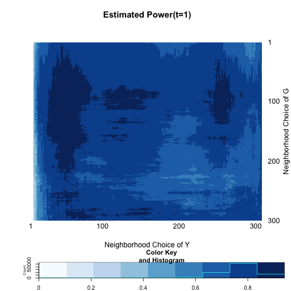
```
```{r, out.width = 200, out.height = 300, echo = FALSE, fig.align='center', fig.show='hold', out.extra='style="float:left"'}

```
```{r, out.width = 200, out.height = 300, echo = FALSE, fig.align='center', fig.show='hold', out.extra='style="float:left"'}
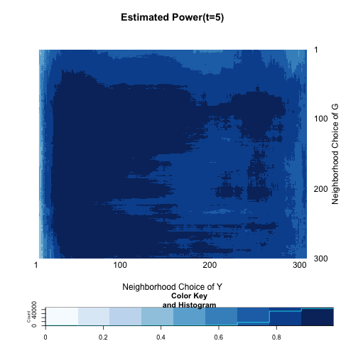
```
```{r, out.width = 200, out.height = 300, echo = FALSE, fig.align='center', fig.show='hold'}
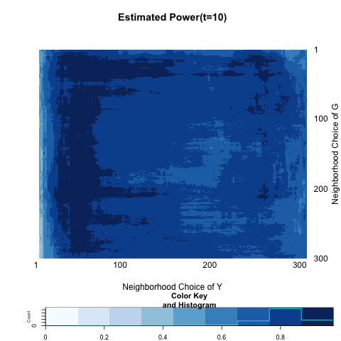
```


```{r echo = FALSE, results='asis'}
a <- c(0.7400000, 0.7833333, 0.7533333, 0.7400000)
b <- c(0.9400000, 0.9900000, 0.9966667, 0.9800000)

table <- matrix(0, nrow = 2, ncol = 4)
rownames(table) <- c("global test", "local optimal")
colnames(table) <- c("t=1", "t=2", "t=5", "t=10")
table[1,] <- a
table[2,] <- b
table <- as.data.frame(table)
kable(table, align = 'c', digits = 2)
```


(3) $K = 5$ blocks according to quantile on $Y$(attribute variable).


$$\left\{ \begin{array}{lll} w_{i} = 0.3 & \forall{i} \\ b_{ij} = 0  & \forall i \neq j  \end{array} \right.$$


```{r, out.width = 500, out.height = 500, echo = FALSE, fig.align='center'}
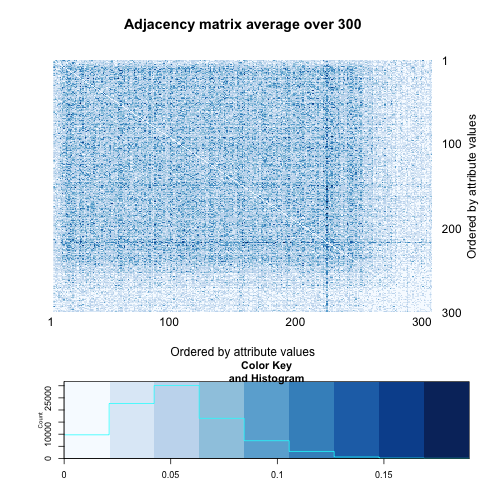
```


```{r, out.width = 200, out.height = 300, echo = FALSE, fig.align='center', fig.show='hold', out.extra='style="float:left"'}

```
```{r, out.width = 200, out.height = 300, echo = FALSE, fig.align='center', fig.show='hold', out.extra='style="float:left"'}
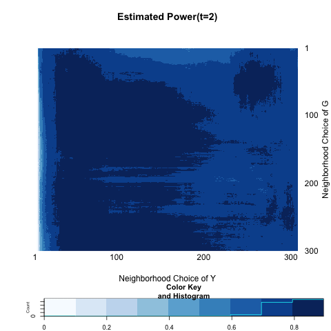
```
```{r, out.width = 200, out.height = 300, echo = FALSE, fig.align='center', fig.show='hold', out.extra='style="float:left"'}
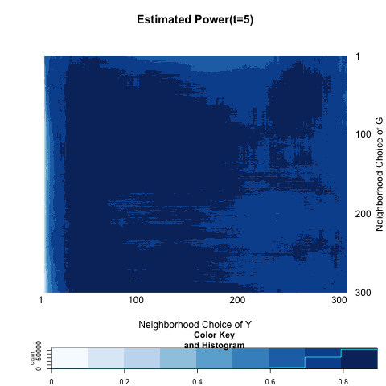
```
```{r, out.width = 200, out.height = 300, echo = FALSE, fig.align='center', fig.show='hold'}
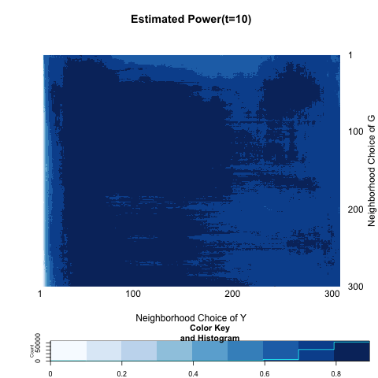
```


```{r echo = FALSE, results='asis'}
a <- c(0.7533333, 0.7600000, 0.7466667, 0.7600000)
b <- c(0.8966667, 0.8933333, 0.8933333, 0.8933333)

table <- matrix(0, nrow = 2, ncol = 4)
rownames(table) <- c("global test", "local optimal")
colnames(table) <- c("t=1", "t=2", "t=5", "t=10")
table[1,] <- a
table[2,] <- b
table <- as.data.frame(table)
kable(table, align = 'c', digits = 2)
```


## Simple Block Models
<a name=" Simple Block Models"/>

We can think of two-block models which divide the observations into two neighborhood, or blocks. We will introduce a variable $Z$ which indicate block membership.


$$Z_{i} = \left\{ \begin{array}{ll}  -1 & i \in \mbox{ block 1 } \\ 1 & i \in \mbox{ block 2} \end{array} \right.$$

Generate a Bernoulli random variable which depends on block membership and a parameter $\omega.$


$$X_{i} \overset{i.i.d}{\sim} Bern(0.5 + z_{i} \omega)$$

Note that larger value of $\omega$ implies much discrepency between blocks. The probability of having an edge also depends on the block membership.

$$A = \left[  \begin{array}{c|c} p & q \\ \hline q & p \end{array} \right]$$

First I sepecify $n=100$ ; $p = 0.3$ ; $q = 0.05.$

(1) $\omega =0$


```{r, out.width = 200, out.height = 300, echo = FALSE, fig.align='center', fig.show='hold', out.extra='style="float:left"'}
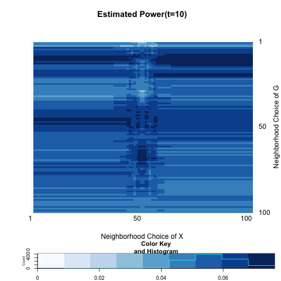
```
```{r, out.width = 200, out.height = 300, echo = FALSE, fig.align='center', fig.show='hold', out.extra='style="float:left"'}

```
```{r, out.width = 200, out.height = 300, echo = FALSE, fig.align='center', fig.show='hold', out.extra='style="float:left"'}

```
```{r, out.width = 200, out.height = 300, echo = FALSE, fig.align='center', fig.show='hold'}
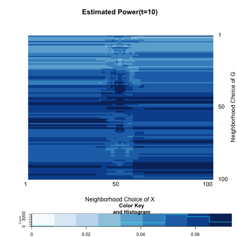
```


```{r echo = FALSE, results='asis'}
a <- c(0.05000000, 0.05333333, 0.05000000, 0.06000000)
b <- c(0.07666667, 0.07000000, 0.07333333, 0.07333333)

table <- matrix(0, nrow = 2, ncol = 4)
rownames(table) <- c("global test", "local optimal")
colnames(table) <- c("t=1", "t=2", "t=5", "t=10")
table[1,] <- a
table[2,] <- b
table <- as.data.frame(table)
kable(table, align = 'c', digits = 2)
```


(2) $\omega = 0.05$


```{r, out.width = 200, out.height = 300, echo = FALSE, fig.align='center', fig.show='hold', out.extra='style="float:left"'}
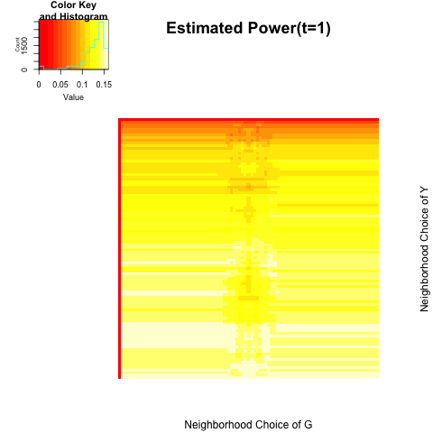
```
```{r, out.width = 200, out.height = 300, echo = FALSE, fig.align='center', fig.show='hold', out.extra='style="float:left"'}
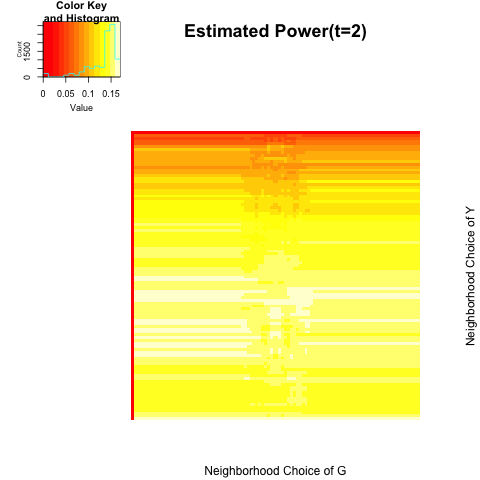
```
```{r, out.width = 200, out.height = 300, echo = FALSE, fig.align='center', fig.show='hold', out.extra='style="float:left"'}

```
```{r, out.width = 200, out.height = 300, echo = FALSE, fig.align='center', fig.show='hold'}
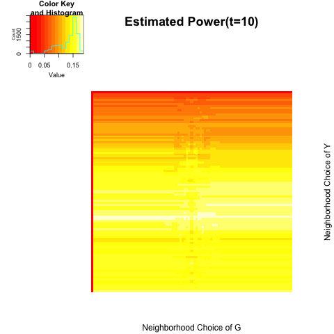
```


```{r echo = FALSE, results='asis'}
a <- c( 0.1566667, 0.1600000, 0.1633333, 0.1666667)
b <- c(0.1600000, 0.1700000, 0.1800000, 0.1866667)

table <- matrix(0, nrow = 2, ncol = 4)
rownames(table) <- c("global test", "local optimal")
colnames(table) <- c("t=1", "t=2", "t=5", "t=10")
table[1,] <- a
table[2,] <- b
table <- as.data.frame(table)
kable(table, align = 'c', digits = 2)
```


(3) $\omega = 0.10$


```{r, out.width = 200, out.height = 300, echo = FALSE, fig.align='center', fig.show='hold', out.extra='style="float:left"'}
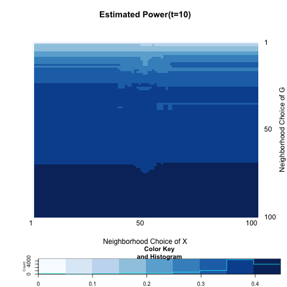
```
```{r, out.width = 200, out.height = 300, echo = FALSE, fig.align='center', fig.show='hold', out.extra='style="float:left"'}

```
```{r, out.width = 200, out.height = 300, echo = FALSE, fig.align='center', fig.show='hold', out.extra='style="float:left"'}
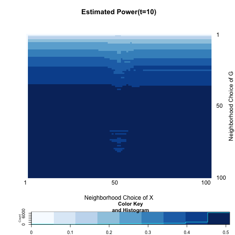
```
```{r, out.width = 200, out.height = 300, echo = FALSE, fig.align='center', fig.show='hold'}
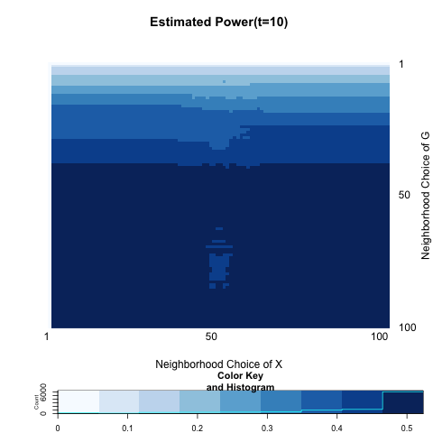
```


```{r echo = FALSE, results='asis'}
a <- c( 0.4400000, 0.4833333, 0.4966667, 0.5166667)
b <- c(0.4466667, 0.5000000, 0.5100000, 0.5233333)

table <- matrix(0, nrow = 2, ncol = 4)
rownames(table) <- c("global test", "local optimal")
colnames(table) <- c("t=1", "t=2", "t=5", "t=10")
table[1,] <- a
table[2,] <- b
table <- as.data.frame(table)
kable(table, align = 'c', digits = 2)
```


(4) $\omega = 0.20$


```{r, out.width = 200, out.height = 300, echo = FALSE, fig.align='center', fig.show='hold', out.extra='style="float:left"'}
knitr::include_graphics("../figure/local9_1.png")
```
```{r, out.width = 200, out.height = 300, echo = FALSE, fig.align='center', fig.show='hold', out.extra='style="float:left"'}

```
```{r, out.width = 200, out.height = 300, echo = FALSE, fig.align='center', fig.show='hold', out.extra='style="float:left"'}

```
```{r, out.width = 200, out.height = 300, echo = FALSE, fig.align='center', fig.show='hold'}

```


```{r echo = FALSE, results='asis'}
a <- c( 0.96, 0.98, 0.98, 0.98)
b <- c(0.9600000, 0.9866667, 0.9866667, 0.9866667)

table <- matrix(0, nrow = 2, ncol = 4)
rownames(table) <- c("global test", "local optimal")
colnames(table) <- c("t=1", "t=2", "t=5", "t=10")
table[1,] <- a
table[2,] <- b
table <- as.data.frame(table)
kable(table, align = 'c', digits = 2)
```


