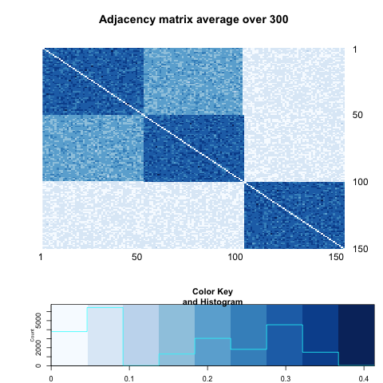

Throughout all the simulations, we are testing independence between network (graph) and its nodes' attributes.

$$H_{0} : f_{GX} = f_{G} \cdot f_{X}$$


```{r echo=FALSE, message =FALSE, warning = FALSE}
library(igraph)
library(RefManageR)
library(xtable)
library(grid)
library(ggplot2)
library(png)
library(grid)
library(knitr)
bib <- ReadBib(system.file("Bib", "biblatexExamples.bib", 
                           package = "RefManageR"), check = FALSE)
BibOptions(check.entries = FALSE, style = "markdown", bib.style = "alphabetic", cite.style = 'alphabetic')
```

- [Diffusion Distance](# Diffusion Distance)

- [Three Blocks Models](# Three Blocks Models)


## Diffusion Distance
<a name=" Diffusion Distance"/>

Diffusion distance between node $x$ and $y$ at time $t$, denoted by $D_{t}(x,y)$ involves summing over all paths of length $t$ connecting $x$ to $y$ and $y$ to $x$. As a consequence, this number is very robust to noise perturbation, unlike the geodesic distance. To observe not monotonically increasing power in diffusion distance, therefore, we must introduce the block of observations which hinders obtaining higher power when the diffusion process progresses.

Let's consider two cases where we assume possibly result not increasing power as time progresses. 

(1) Negative Correlations

Two blocks having the most different distributions are more likely to be adjacent each other than other pairs of blocks, and this probability is not that different from between-block probability so that in the end, as diffusion progresses, we are very likely to observe diffusion between these two blocks. 


(2) Similar probability of between- and within blocks probability 

This is the case where between-block probability and within-block probability is similar each other and also not strong. Thus, as time goes by, the interaction between block and within block would be similar. 


## Three Blocks Models
<a name=" Three Blocks Models"/>


$$A = \left[  \begin{array}{c|c|c} 0.30 & 0.20 & 0.05 \\ \hline 0.20 & 0.30 & 0.05 \\ \hline 0.05 & 0.05 & 0.30 \end{array} \right]$$

```{r, out.width = 500, out.height = 500, echo = FALSE, fig.align='center'}

```


and corresponding nodes' attributes are following such Bernoulli models :


$$X = \left[  \begin{array}{c|c|c} Bern(0.1) &  &  \\ \hline  & Bern(0.90) &  \\ \hline  &  & Bern(0.50) \end{array} \right]$$


```{r, out.width = 300, out.height = 300, echo = FALSE, fig.align='center', fig.show='hold', out.extra='style="float:left"'}

```
```{r, out.width = 300, out.height = 300, echo = FALSE, fig.align='center', fig.show='hold', out.extra='style="float:left"'}

```
```{r, out.width = 300, out.height = 300, echo = FALSE, fig.align='center', fig.show='hold', out.extra='style="float:left"'}

```
```{r, out.width = 400, out.height = 400, echo = FALSE, fig.align='center', fig.show='hold', out.extra='style="float:left"'}

```
```{r, out.width = 400, out.height = 400, echo = FALSE, fig.align='center', fig.show='hold', out.extra='style="float:left"'}

```


```{r echo = FALSE, results='asis'}
a <- c(0.57666667, 0.10000000, 0.03000000, 0.03333333, 0.03333333)
b <- c(0.82666667, 0.53333333, 0.18666667, 0.07666667, 0.07000000)

table <- matrix(0, nrow = 2, ncol = 5)
rownames(table) <- c("global test", "local optimal")
colnames(table) <- c("t=1", "t=2", "t=5", "t=10", "t=20")
table[1,] <- a
table[2,] <- b
table <- as.data.frame(table)
kable(table, align = 'c', digits = 2)
```

In the above case, local dependence and decreasing power are both observed.


<hr />


$$A = \left[  \begin{array}{c|c|c} 0.10 & 0.05 & 0.05 \\ \hline 0.05 & 0.10 & 0.05 \\ \hline 0.05 & 0.05 & 0.10 \end{array} \right]$$

```{r, out.width = 500, out.height = 500, echo = FALSE, fig.align='center'}

```


and corresponding nodes' attributes are following such Bernoulli models :


$$X = \left[  \begin{array}{c|c|c} Bern(0.10) &  &  \\ \hline  & Bern(0.90) &  \\ \hline  &  & Bern(0.50) \end{array} \right]$$


```{r, out.width = 300, out.height = 300, echo = FALSE, fig.align='center', fig.show='hold', out.extra='style="float:left"'}

```
```{r, out.width = 300, out.height = 300, echo = FALSE, fig.align='center', fig.show='hold', out.extra='style="float:left"'}

```
```{r, out.width = 300, out.height = 300, echo = FALSE, fig.align='center', fig.show='hold', out.extra='style="float:left"'}

```
```{r, out.width = 400, out.height = 400, echo = FALSE, fig.align='center', fig.show='hold', out.extra='style="float:left"'}

```
```{r, out.width = 400, out.height = 400, echo = FALSE, fig.align='center', fig.show='hold', out.extra='style="float:left"'}

```


```{r echo = FALSE, results='asis'}
a <- c(0.5466667, 0.5766667, 0.5233333, 0.4300000, 0.3366667)
b <- c(0.6033333, 0.6033333, 0.5600000, 0.4666667, 0.3633333)

table <- matrix(0, nrow = 2, ncol = 5)
rownames(table) <- c("global test", "local optimal")
colnames(table) <- c("t=1", "t=2", "t=5", "t=10", "t=20")
table[1,] <- a
table[2,] <- b
table <- as.data.frame(table)
kable(table, align = 'c', digits = 2)
```

Decreasing rate is much slower than the first case and the global test and local test are similar each other.

However, these two possible scenarios are very sensitive to the distribution of attributes $X$ or graph $G$, that is, we might not get the results we want if we change the value of parameter slightly.

$$A = \left[  \begin{array}{c|c|c} \color{red}{0.15} & 0.05 & 0.05 \\ \hline 0.05 & \color{red}{0.15} & 0.05 \\ \hline 0.05 & 0.05 & \color{red}{0.15} \end{array} \right]$$

$$X = \left[  \begin{array}{c|c|c} Bern(0.10) &  &  \\ \hline  & Bern(0.90) &  \\ \hline  &  & Bern(0.50) \end{array} \right]$$

```{r, out.width = 200, out.height = 300, echo = FALSE, fig.align='center', fig.show='hold', out.extra='style="float:left"'}

```
```{r, out.width = 200, out.height = 300, echo = FALSE, fig.align='center', fig.show='hold', out.extra='style="float:left"'}

```
```{r, out.width = 200, out.height = 300, echo = FALSE, fig.align='center', fig.show='hold', out.extra='style="float:left"'}

```
```{r, out.width = 200, out.height = 300, echo = FALSE, fig.align='center', fig.show='hold', out.extra='style="float:left"'}

```


