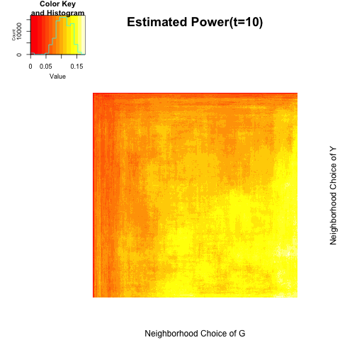

```{r echo=FALSE, message =FALSE, warning = FALSE}
library(igraph)
library(RefManageR)
library(xtable)
library(grid)
library(ggplot2)
library(png)
library(grid)
library(knitr)
bib <- ReadBib(system.file("Bib", "biblatexExamples.bib", 
                           package = "RefManageR"), check = FALSE)
BibOptions(check.entries = FALSE, style = "markdown", bib.style = "alphabetic", cite.style = 'alphabetic')
```

- [Networks vs. Attributes](# Networks vs. Attributes)

- [Networks vs. Networks](# Networks vs. Networks)

## Networks vs. Attributes
<a name=" Networks vs. Attributes"/>

Suppose we have $N$ measures of same networks, e.g. $N$ individuals' brain connectivity, and suppose we are interested in dependence between brain connectivity and person's personality factors. Using all $N$ measures of networks and also $N$ measures of person's personality would reduce the measurement errors so that it better tests independence between network and attibutes. Suppose $(G_{z}, Y_{z})$ is a pair of $i$th individual's observations. ($z=1,.., N$), and let $(G_{z}, Y_{z}) \sim^{iid} (\textbf{G}, \textbf{Y})$  $z =1,...,N.$


$$H_{0} : f_{\textbf{GY}} = f_{\textbf{G}} f_{\textbf{Y}}$$

Each observations $z$ follows such latnet variable dependent models.

$$(X^{z}_{1}, Y^{z}_{1}), (X^{z}_{2}, Y^{z}_{2}) , ... , (X^{z}_{n}, Y^{z}_{n})  \overset{i.i.d}{\sim} N \left( \begin{bmatrix} 0 \\ 0 \end{bmatrix}, \begin{bmatrix}1 & \rho_{z} \\ \rho_{z} & 1 \end{bmatrix}  \right)$$


$$\log \left( \frac{P\big( T^{z}_{ij} \big) }{1 - P\big( T^{z}_{ij}    \big) } \big| X_i, X_j \right) = f \big( | X^{z}_i - X^{z}_j |  \big)$$


$$f\big( |X^{z}_i - X^{z}_j| \big) = \left\{ \begin{array}{cc}  |X^{z}_i - X^{z}_j| & \max(0.01, |X^{z}_i - X^{z}_j| ) < 0.10 \\ -20 |X^{z}_{i} - X^{z}_{j}| & \mbox{ o.w.} \end{array}  \right.$$


(1) $N=10$ independent observations; $\rho_{z} = 0.1 \forall z$ ; $n=300$ ; $M=500$


<hr />

(2) $N=3$; 3 Blocks; $\rho_{1} = (0, 0.1) \sim (50\%, 50\%) ; \rho_{2} = (0.1, 0) \sim (50\%, 50\%); \rho_{3} = (0, 0.1, 0.2) \sim (33\%, 33\%, 33\%); n =300; M=300$

```{r, out.width = 200, out.height = 300, echo = FALSE, fig.align='center', fig.show='hold', out.extra='style="float:left"'}
knitr::include_graphics("../figure/multinet2_1.png")
```
```{r, out.width = 200, out.height = 300, echo = FALSE, fig.align='center', fig.show='hold', out.extra='style="float:left"'}

```
```{r, out.width = 200, out.height = 300, echo = FALSE, fig.align='center', fig.show='hold', out.extra='style="float:left"'}

```
```{r, out.width = 200, out.height = 300, echo = FALSE, fig.align='center', fig.show='hold'}

```


```{r echo = FALSE, results='asis'}
a <- c(0.07333333, 0.09666667, 0.12333333, 0.15333333)
b <- c(0.1000000, 0.1266667, 0.1600000, 0.1766667)

table <- matrix(0, nrow = 2, ncol = 4)
rownames(table) <- c("global test", "local optimal")
colnames(table) <- c("t=1", "t=2", "t=5", "t=10")
table[1,] <- a
table[2,] <- b
table <- as.data.frame(table)
kable(table, align = 'c', digits = 2)
```


(3) $N=10$ ; $(\rho_{1} ,... ,\rho_{5}) = 0.2; (\rho_{5}, ... , \rho_{10}) = 0.0$


## Networks vs. Networks
<a name=" Networks vs. Networks"/>


