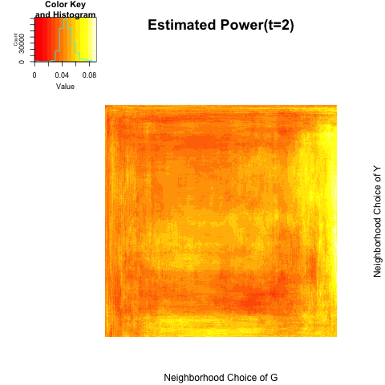
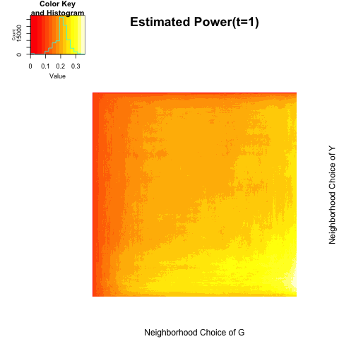
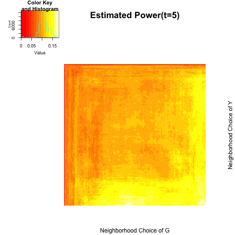
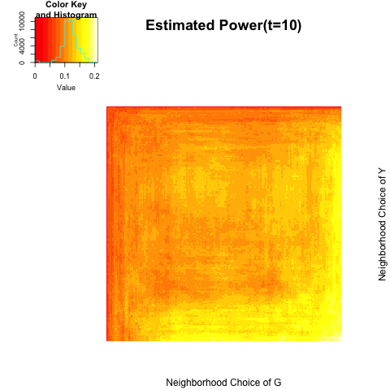
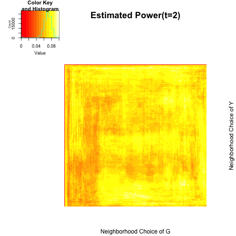

```{r echo=FALSE, message =FALSE, warning = FALSE}
library(igraph)
library(xtable)
library(grid)
library(png)
library(knitr)
```


- [Local Distance Correlation](# Local Distance Correlation)
- [Diffusion Distance](# Diffusion Distance)
- [Univariate Attributes](# Univariate Attributes)
- [Multivariate Attributes](# Multivariate Attributes)
- [Locally Dependent Model](# Locally Dependent Model)


## Univariate Attributes
<a name=" Univariate Attributes"/>

Simulation data mimics a latent network model where existing an edge between two nodes is a function of latent characteristics between two.


$$(X_1, Y_1), (X_2, Y_2) , ... , (X_N, Y_N)  \overset{i.i.d}{\sim} N \left( \begin{bmatrix} 0 \\ 0 \end{bmatrix}, \begin{bmatrix}1 & \rho \\ \rho & 1 \end{bmatrix}  \right)$$

$$\log \left( \frac{P\big( T_{ij} \big) }{1 - P\big( T_{ij}    \big) } \big| X_i, X_j \right) = f \big( | X_i - X_j |  \big)$$


(1) $\rho = 0.0$


```{r, out.width = 200, out.height = 300, echo = FALSE, fig.align='center', fig.show='hold', out.extra='style="float:left"'}

```
```{r, out.width = 200, out.height = 300, echo = FALSE, fig.align='center', fig.show='hold', out.extra='style="float:left"'}

```
```{r, out.width = 200, out.height = 300, echo = FALSE, fig.align='center', fig.show='hold', out.extra='style="float:left"'}

```
```{r, out.width = 200, out.height = 300, echo = FALSE, fig.align='center', fig.show='hold'}

```


```{r echo = FALSE, results='asis'}
dpower0 <- c(0.052, 0.062, 0.062, 0.056)
maxipower0 <- c(0.076, 0.090, 0.086, 0.086)

sim0.table <- matrix(0, nrow = 2, ncol = 4)
rownames(sim0.table) <- c("global test", "local optimal")
colnames(sim0.table) <- c("t=1", "t=2", "t=5", "t=10")
sim0.table[1,] <- dpower0
sim0.table[2,] <- maxipower0
sim0.table <- as.data.frame(sim0.table)
kable(sim0.table, align = 'c')
```


<hr />

(2) $\rho = 0.1$


```{r, out.width = 200, out.height = 300, echo = FALSE, fig.align='center', fig.show='hold', out.extra='style="float:left"'}
knitr::include_graphics("../figure/power1_1.png")
```
```{r, out.width = 200, out.height = 300, echo = FALSE, fig.align='center', fig.show='hold', out.extra='style="float:left"'}

```
```{r, out.width = 200, out.height = 300, echo = FALSE, fig.align='center', fig.show='hold', out.extra='style="float:left"'}

```
```{r, out.width = 200, out.height = 300, echo = FALSE, fig.align='center', fig.show='hold'}

```


```{r echo = FALSE, results='asis'}
dpower1 <- c(0.376, 0.520, 0.564, 0.574)
maxipower1 <- c(0.426, 0.522, 0.570, 0.580)

sim1.table <- matrix(0, nrow = 2, ncol = 4)
rownames(sim1.table) <- c("global test", "local optimal")
colnames(sim1.table) <- c("t=1", "t=2", "t=5", "t=10")
sim1.table[1,] <- dpower1
sim1.table[2,] <- maxipower1
sim1.table <- as.data.frame(sim1.table)
kable(sim1.table, align = 'c')
```


<hr />

(3) $\rho = 0.2$


```{r, out.width = 200, out.height = 300, echo = FALSE, fig.align='center', fig.show='hold', out.extra='style="float:left"'}

```
```{r, out.width = 200, out.height = 300, echo = FALSE, fig.align='center', fig.show='hold', out.extra='style="float:left"'}

```
```{r, out.width = 200, out.height = 300, echo = FALSE, fig.align='center', fig.show='hold', out.extra='style="float:left"'}

```
```{r, out.width = 200, out.height = 300, echo = FALSE, fig.align='center', fig.show='hold'}

```


```{r echo = FALSE, results='asis'}
dpower2 <- c(0.954, 0.984, 0.992, 0.992)
maxipower2 <- c(0.974, 0.988, 0.994, 0.996)

sim2.table <- matrix(0, nrow = 2, ncol = 4)
rownames(sim2.table) <- c("global test", "local optimal")
colnames(sim2.table) <- c("t=1", "t=2", "t=5", "t=10")
sim2.table[1,] <- dpower2
sim2.table[2,] <- maxipower2
sim2.table <- as.data.frame(sim2.table)
kable(sim2.table, align = 'c')
```


<hr />
<hr />

## Multivariate Attributes
<a name=" Multivariate Attributes"/>

$$(X_1, Y_{11}, Y_{12}, Y_{13}), ... , (X_N, Y_{1N}, Y_{2N}, Y_{3N})  \overset{i.i.d}{\sim} N \left( \begin{bmatrix} 0 \\ 0 \\ 0 \\ 0 \end{bmatrix}, \begin{bmatrix}1 & \rho_{1} & \rho_{2}&  \rho_{3} \\ \rho_{1} & 1 & 0 & 0 \\ \rho_{2} & 0 & 1 & 0 \\ \rho_{3} & 0 & 0 & 1  \end{bmatrix}  \right)$$


(1) $\rho = (\rho_{1}, \rho_{2}, \rho_{3}) = (0.0, 0.0, 0.0)$


```{r, out.width = 200, out.height = 300, echo = FALSE, fig.align='center', fig.show='hold', out.extra='style="float:left"'}

```
```{r, out.width = 200, out.height = 300, echo = FALSE, fig.align='center', fig.show='hold', out.extra='style="float:left"'}

```
```{r, out.width = 200, out.height = 300, echo = FALSE, fig.align='center', fig.show='hold', out.extra='style="float:left"'}

```
```{r, out.width = 200, out.height = 300, echo = FALSE, fig.align='center', fig.show='hold'}

```


```{r echo = FALSE, results='asis'}
dmulti0 <- c(0.040, 0.056, 0.054, 0.062)
maximulti0 <- c(0.076, 0.086, 0.096, 0.088)

multi0.table <- matrix(0, nrow = 2, ncol = 4)
rownames(multi0.table) <- c("global test", "local optimal")
colnames(multi0.table) <- c("t=1", "t=2", "t=5", "t=10")
multi0.table[1,] <- dmulti0
multi0.table[2,] <- maximulti0
multi0.table <- as.data.frame(multi0.table)
kable(multi0.table, align = 'c')
```


<hr />

(2) $\rho = (\rho_{1}, \rho_{2}, \rho_{3}) = (0.1, 0.1, 0.1)$


```{r, out.width = 200, out.height = 300, echo = FALSE, fig.align='center', fig.show='hold', out.extra='style="float:left"'}

```
```{r, out.width = 200, out.height = 300, echo = FALSE, fig.align='center', fig.show='hold', out.extra='style="float:left"'}

```
```{r, out.width = 200, out.height = 300, echo = FALSE, fig.align='center', fig.show='hold', out.extra='style="float:left"'}

```
```{r, out.width = 200, out.height = 300, echo = FALSE, fig.align='center', fig.show='hold'}

```


```{r echo = FALSE, results='asis'}
dmulti1 <- c(0.664, 0.822, 0.870, 0.872)
maximulti1 <- c(0.718, 0.826, 0.872, 0.872)

multi1.table <- matrix(0, nrow = 2, ncol = 4)
rownames(multi1.table) <- c("global test", "local optimal")
colnames(multi1.table) <- c("t=1", "t=2", "t=5", "t=10")
multi1.table[1,] <- dmulti1
multi1.table[2,] <- maximulti1
multi1.table <- as.data.frame(multi1.table)
kable(multi1.table, align = 'c')
```

<hr />

(3) $\rho = (\rho_{1}, \rho_{2}, \rho_{3}) = (0.2, 0.2, 0.2)$


```{r, out.width = 200, out.height = 300, echo = FALSE, fig.align='center', fig.show='hold', out.extra='style="float:left"'}

```
```{r, out.width = 200, out.height = 300, echo = FALSE, fig.align='center', fig.show='hold', out.extra='style="float:left"'}

```
```{r, out.width = 200, out.height = 300, echo = FALSE, fig.align='center', fig.show='hold', out.extra='style="float:left"'}
knitr::include_graphics("../figure/multi2_5.png")
```
```{r, out.width = 200, out.height = 300, echo = FALSE, fig.align='center', fig.show='hold'}

```


```{r echo = FALSE, results='asis'}
dmulti2 <- c(0.998, 1.000, 1.000, 1.000)
maximulti2 <- c(1.000, 1.000, 1.000, 1.000)

multi2.table <- matrix(0, nrow = 2, ncol = 4)
rownames(multi2.table) <- c("global test", "local optimal")
colnames(multi2.table) <- c("t=1", "t=2", "t=5", "t=10")
multi2.table[1,] <- dmulti2
multi2.table[2,] <- maximulti2
multi2.table <- as.data.frame(multi2.table)
kable(multi2.table, align = 'c')
```

<hr />

(4) $\rho = (\rho_{1}, \rho_{2}, \rho_{3}) = (0.2, -0.2, 0.0)$


```{r, out.width = 200, out.height = 300, echo = FALSE, fig.align='center', fig.show='hold', out.extra='style="float:left"'}
knitr::include_graphics("../figure/multi5_1.png")
```
```{r, out.width = 200, out.height = 300, echo = FALSE, fig.align='center', fig.show='hold', out.extra='style="float:left"'}
knitr::include_graphics("../figure/multi5_2.png")
```
```{r, out.width = 200, out.height = 300, echo = FALSE, fig.align='center', fig.show='hold', out.extra='style="float:left"'}

```
```{r, out.width = 200, out.height = 300, echo = FALSE, fig.align='center', fig.show='hold'}
knitr::include_graphics("../figure/multi5_10.png")
```


```{r echo = FALSE, results='asis'}
dmulti5 <- c(0.984, 0.998, 1.000, 0.998)
maximulti5 <- c( 0.992, 0.998, 1.000, 1.000)

multi5.table <- matrix(0, nrow = 2, ncol = 4)
rownames(multi5.table) <- c("global test", "local optimal")
colnames(multi5.table) <- c("t=1", "t=2", "t=5", "t=10")
multi5.table[1,] <- dmulti5
multi5.table[2,] <- maximulti5
multi5.table <- as.data.frame(multi5.table)
kable(multi5.table, align = 'c')
```


<hr />
<hr />

#Locally Dependent Model
<a name=" Locally Dependent Model"/>

For each block $i = 1,... , B:$

$$(X_{i,1}, Y_{i,1}), (X_{i,2}, Y_{i,2}) , ... , (X_{i, n_{i}}, Y_{i, n_{i}})  \overset{i.i.d}{\sim} N \left( \begin{bmatrix} 0 \\ 0 \end{bmatrix}, \begin{bmatrix}1 & \rho_{i} \\ \rho_{i} & 1 \end{bmatrix}  \right)$$

Let $(\textbf{X}, \textbf{Y}) = \{ (X_{i,j}, Y_{i,j}) ;  j = 1,..., n_{i}, i = 1,...,B \}$ ; $N = \sum\limits_{i=1}^{B} n_{i}.$ Same as before $T_{ij}$ is a Bernoulli random variable of having an edge between node $i$ and node $j$.


$$\log \left( \frac{P\big( T_{ij} \big) }{1 - P\big( T_{ij}    \big) } \big| X_i, X_j \right) = f \big( | X_i - X_j |  \big)$$


$$f\big( |X_i - X_j| \big) = \left\{ \begin{array}{cc}  |X_i - X_j| & \max(0.01, |X_i - X_j| ) < 0.10 \\ -20 |X_{i} - X_{j}| & \mbox{ o.w.} \end{array}  \right.$$


(1) $B = 2;$ $\rho = (0.0, 0.1)$; ratio = (1,1); $n=300$ ; $M=500$


```{r, out.width = 200, out.height = 300, echo = FALSE, fig.align='center', fig.show='hold', out.extra='style="float:left"'}
knitr::include_graphics("../figure/block1_1.png")
```
```{r, out.width = 200, out.height = 300, echo = FALSE, fig.align='center', fig.show='hold', out.extra='style="float:left"'}

```
```{r, out.width = 200, out.height = 300, echo = FALSE, fig.align='center', fig.show='hold', out.extra='style="float:left"'}

```
```{r, out.width = 200, out.height = 300, echo = FALSE, fig.align='center', fig.show='hold'}

```


```{r echo = FALSE, results='asis'}
dblock1 <- c(0.068, 0.098, 0.110, 0.116)
maxiblock1 <- c(0.106, 0.120, 0.132, 0.130)

block1.table <- matrix(0, nrow = 2, ncol = 4)
rownames(block1.table) <- c("global test", "local optimal")
colnames(block1.table) <- c("t=1", "t=2", "t=5", "t=10")
block1.table[1,] <- dblock1
block1.table[2,] <- maxiblock1
block1.table <- as.data.frame(block1.table)
kable(block1.table, align = 'c', digits = 4)
```


<hr />

(2) $B =2;$ $\rho = (0.1, 0.2);$ raio = (1,1); $n=300$; $M=500$

```{r, out.width = 200, out.height = 300, echo = FALSE, fig.align='center', fig.show='hold', out.extra='style="float:left"'}

```
```{r, out.width = 200, out.height = 300, echo = FALSE, fig.align='center', fig.show='hold', out.extra='style="float:left"'}

```
```{r, out.width = 200, out.height = 300, echo = FALSE, fig.align='center', fig.show='hold', out.extra='style="float:left"'}

```
```{r, out.width = 200, out.height = 300, echo = FALSE, fig.align='center', fig.show='hold'}

```


```{r echo = FALSE, results='asis'}
dblock2 <- c(0.254, 0.446, 0.548, 0.590)
maxiblock2 <- c(0.360, 0.496, 0.560, 0.602)

block2.table <- matrix(0, nrow = 2, ncol = 4)
rownames(block2.table) <- c("global test", "local optimal")
colnames(block2.table) <- c("t=1", "t=2", "t=5", "t=10")
block2.table[1,] <- dblock2
block2.table[2,] <- maxiblock2
block2.table <- as.data.frame(block2.table)
kable(block2.table, align = 'c')
```


<hr />

(3) $B = 2;$ $\rho = (0.0, 0.2)$; ratio = (1,1); $n=300$ ; $M=500$


<hr />

(4) $B = 3;$ $\rho = (0.0, 0.1, 0.2)$ ;  ratio = (1,1,1); $n = 200$ ; $M = 300$; 


```{r, out.width = 200, out.height = 300, echo = FALSE, fig.align='center', fig.show='hold', out.extra='style="float:left"'}

```
```{r, out.width = 200, out.height = 300, echo = FALSE, fig.align='center', fig.show='hold', out.extra='style="float:left"'}

```
```{r, out.width = 200, out.height = 300, echo = FALSE, fig.align='center', fig.show='hold', out.extra='style="float:left"'}

```
```{r, out.width = 200, out.height = 300, echo = FALSE, fig.align='center', fig.show='hold'}

```


```{r echo = FALSE, results='asis'}
dblock4 <- c( 0.1000000, 0.1133333, 0.1633333, 0.2100000)
maxiblock4 <- c(0.1166667, 0.1400000, 0.1800000, 0.2100000)

block4.table <- matrix(0, nrow = 2, ncol = 4)
rownames(block4.table) <- c("global test", "local optimal")
colnames(block4.table) <- c("t=1", "t=2", "t=5", "t=10")
block4.table[1,] <- dblock4
block4.table[2,] <- maxiblock4
block4.table <- as.data.frame(block4.table)
kable(block4.table, align = 'c', digits = 4)
```


<hr />

(5) $B = 2;$ $\rho = (0.2, 0.0)$ ;  ratio = (1,3); $n = 300$ ; $M = 300$; 

Only 25$\%$ of observations are dependent on their underlying network structures.


```{r, out.width = 200, out.height = 300, echo = FALSE, fig.align='center', fig.show='hold', out.extra='style="float:left"'}

```
```{r, out.width = 200, out.height = 300, echo = FALSE, fig.align='center', fig.show='hold', out.extra='style="float:left"'}

```
```{r, out.width = 200, out.height = 300, echo = FALSE, fig.align='center', fig.show='hold', out.extra='style="float:left"'}
knitr::include_graphics("../figure/block5_5.png")
```
```{r, out.width = 200, out.height = 300, echo = FALSE, fig.align='center', fig.show='hold'}

```


```{r echo = FALSE, results='asis'}
dblock5 <- c(0.05333333, 0.05666667, 0.08000000, 0.09333333)
maxiblock5 <- c(0.1000000, 0.1000000, 0.1033333, 0.1166667)

block5.table <- matrix(0, nrow = 2, ncol = 4)
rownames(block5.table) <- c("global test", "local optimal")
colnames(block5.table) <- c("t=1", "t=2", "t=5", "t=10")
block5.table[1,] <- dblock5
block5.table[2,] <- maxiblock5
block5.table <- as.data.frame(block5.table)
kable(block5.table, align = 'c', digits = 4)
```


<hr />
(6) $B = 2;$ $\rho = (0.5, 0.0)$ ;  ratio = (1,3); $n = 300$ ; $M = 300$; 

```{r, out.width = 200, out.height = 300, echo = FALSE, fig.align='center', fig.show='hold', out.extra='style="float:left"'}

```
```{r, out.width = 200, out.height = 300, echo = FALSE, fig.align='center', fig.show='hold', out.extra='style="float:left"'}

```
```{r, out.width = 200, out.height = 300, echo = FALSE, fig.align='center', fig.show='hold', out.extra='style="float:left"'}
knitr::include_graphics("../figure/block6_5.png")
```
```{r, out.width = 200, out.height = 300, echo = FALSE, fig.align='center', fig.show='hold'}

```


```{r echo = FALSE, results='asis'}
dblock6 <- c(0.2600000, 0.3833333, 0.4633333, 0.4766667)
maxiblock6 <- c(0.3633333, 0.4400000, 0.4766667, 0.4866667)

block6.table <- matrix(0, nrow = 2, ncol = 4)
rownames(block6.table) <- c("global test", "local optimal")
colnames(block6.table) <- c("t=1", "t=2", "t=5", "t=10")
block6.table[1,] <- dblock6
block6.table[2,] <- maxiblock6
block6.table <- as.data.frame(block6.table)
kable(block6.table, align = 'c', digits = 4)
```


