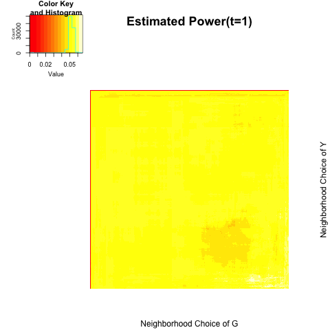
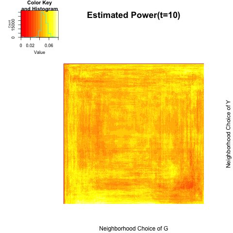
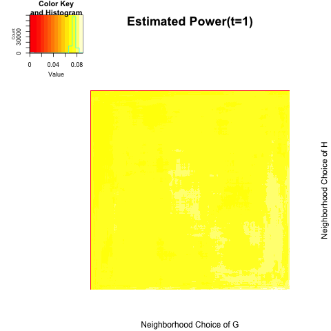
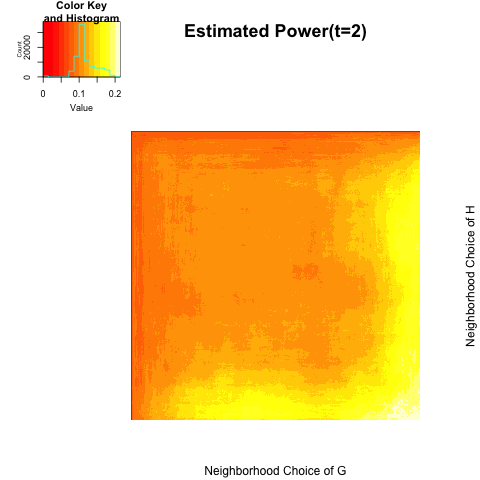
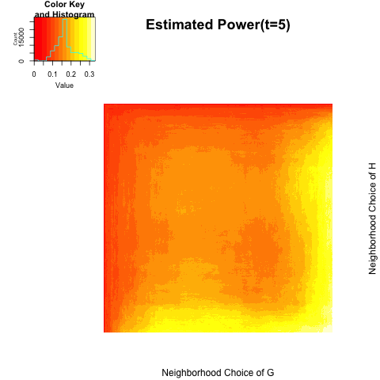
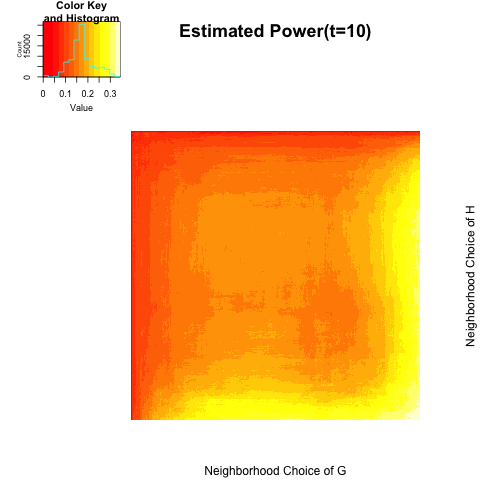
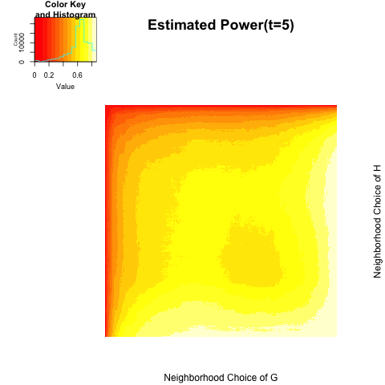

```{r echo=FALSE, message =FALSE, warning = FALSE}
library(igraph)
library(RefManageR)
library(xtable)
library(grid)
library(ggplot2)
library(png)
library(grid)
library(knitr)
bib <- ReadBib(system.file("Bib", "biblatexExamples.bib", 
                           package = "RefManageR"), check = FALSE)
BibOptions(check.entries = FALSE, style = "markdown", bib.style = "alphabetic", cite.style = 'alphabetic')
```

- [Network vs. Network](# Network vs. Network)
- [Locally Dependent Model](# Locally Dependent Model)


## Network vs. Network
<a name=" Network vs. Network"/>

Assume a network $G$ and $H$ have same node index - maybe they are all considering same individuals but different networks. Someone might be interested in testing independence between online friendship and offline friendship; independence between physical connections and functional relationship, etc. 

$$H_{0}: f_{GH}  = f_{G} f_{H}$$

For all nodes $i \neq j$ in a graph $G$, and all nodes $u \neq v$ in a graph $H$, suppose the following latent variable model:


$$(X_1, W_1), (X_2, W_2) , ... , (X_N, W_N)  \overset{i.i.d}{\sim} N \left( \begin{bmatrix} 0 \\ 0 \end{bmatrix}, \begin{bmatrix}1 & \rho \\ \rho & 1 \end{bmatrix}  \right)$$


$$\log \left( \frac{P\big( T_{ij} \big) }{1 - P\big( T_{ij}    \big) } \big| X_i, X_j \right) = f \big( | X_i - X_j |  \big) = \log \left( \frac{P\big( T_{uv} \big) }{1 - P\big( T_{uv}    \big) } \big|W_i, W_j   \right)$$


All the simulations below are based on $M = 500$ iterations $n=300$ nodes

(1) $\rho = 0.0$


```{r, out.width = 200, out.height = 300, echo = FALSE, fig.align='center', fig.show='hold', out.extra='style="float:left"'}

```
```{r, out.width = 200, out.height = 300, echo = FALSE, fig.align='center', fig.show='hold', out.extra='style="float:left"'}

```
```{r, out.width = 200, out.height = 300, echo = FALSE, fig.align='center', fig.show='hold', out.extra='style="float:left"'}

```
```{r, out.width = 200, out.height = 300, echo = FALSE, fig.align='center', fig.show='hold'}

```


```{r echo = FALSE, results='asis'}
dgh1 <- c(0.054, 0.056, 0.052, 0.058)
maxigh1 <- c(0.066, 0.070, 0.082, 0.080)

gh1.table <- matrix(0, nrow = 2, ncol = 4)
rownames(gh1.table) <- c("global test", "local optimal")
colnames(gh1.table) <- c("t=1", "t=2", "t=5", "t=10")
gh1.table[1,] <- dgh1
gh1.table[2,] <- maxigh1
gh1.table <- as.data.frame(gh1.table)
kable(gh1.table, align = 'c')
```

<hr />

(2) $\rho = 0.1$

```{r, out.width = 200, out.height = 300, echo = FALSE, fig.align='center', fig.show='hold', out.extra='style="float:left"'}

```
```{r, out.width = 200, out.height = 300, echo = FALSE, fig.align='center', fig.show='hold', out.extra='style="float:left"'}

```
```{r, out.width = 200, out.height = 300, echo = FALSE, fig.align='center', fig.show='hold', out.extra='style="float:left"'}

```
```{r, out.width = 200, out.height = 300, echo = FALSE, fig.align='center', fig.show='hold'}

```


```{r echo = FALSE, results='asis'}
dgh2 <- c(0.088, 0.206, 0.330, 0.336)
maxigh2 <- c( 0.090, 0.214, 0.330, 0.344)

gh2.table <- matrix(0, nrow = 2, ncol = 4)
rownames(gh2.table) <- c("global test", "local optimal")
colnames(gh2.table) <- c("t=1", "t=2", "t=5", "t=10")
gh2.table[1,] <- dgh2
gh2.table[2,] <- maxigh2
gh2.table <- as.data.frame(gh2.table)
kable(gh2.table, align = 'c')
```

<hr />

(3) $\rho = 0.2$


```{r, out.width = 200, out.height = 300, echo = FALSE, fig.align='center', fig.show='hold', out.extra='style="float:left"'}

```
```{r, out.width = 200, out.height = 300, echo = FALSE, fig.align='center', fig.show='hold', out.extra='style="float:left"'}

```
```{r, out.width = 200, out.height = 300, echo = FALSE, fig.align='center', fig.show='hold', out.extra='style="float:left"'}

```
```{r, out.width = 200, out.height = 300, echo = FALSE, fig.align='center', fig.show='hold'}

```


```{r echo = FALSE, results='asis'}
dgh3 <- c(0.212, 0.738, 0.860, 0.868)
maxigh3 <- c(0.220, 0.746, 0.862, 0.870)

gh3.table <- matrix(0, nrow = 2, ncol = 4)
rownames(gh3.table) <- c("global test", "local optimal")
colnames(gh3.table) <- c("t=1", "t=2", "t=5", "t=10")
gh3.table[1,] <- dgh3
gh3.table[2,] <- maxigh3
gh3.table <- as.data.frame(gh3.table)
kable(gh3.table, align = 'c')
```


## Locally Dependent Model
<a name=" Locally Dependent Model"/>

For each block $i = 1,... , B:$

$$(X_{i,1}, W_{i,1}), (X_{i,2}, W_{i,2}) , ... , (X_{i, n_{i}}, W_{i, n_{i}})  \overset{i.i.d}{\sim} N \left( \begin{bmatrix} 0 \\ 0 \end{bmatrix}, \begin{bmatrix}1 & \rho_{i} \\ \rho_{i} & 1 \end{bmatrix}  \right)$$


$$\log \left( \frac{P\big( T_{ij} \big) }{1 - P\big( T_{ij}    \big) } \big| X_i, X_j \right) = f \big( | X_i - X_j |  \big) = \log \left( \frac{P\big( T_{uv} \big) }{1 - P\big( T_{uv}    \big) } \big|W_i, W_j   \right)$$


(1) $B = 2$; ratio = c(1,3); $\rho =(0.3, 0.0);$ $N=300;$ $M =300$


