- [ED.1](# ED.1)

- [LD.1](# LD.1)

- [LD.2](# LD.2)

- [LD.3](# LD.3)

- [LD.4](# LD.4)

- [Hypothesis](# Hypothesis)


```{r echo=FALSE, message =FALSE, warning = FALSE}
library(igraph)
library(RefManageR)
library(xtable)
library(grid)
library(ggplot2)
library(png)
library(grid)
library(knitr)
bib <- ReadBib(system.file("Bib", "biblatexExamples.bib", 
                           package = "RefManageR"), check = FALSE)
BibOptions(check.entries = FALSE, style = "markdown", bib.style = "alphabetic", cite.style = 'alphabetic')
```

Let's thick about the relationship between network $G$ and its nodes' attributes $X$ in a "modellable" way. Throughout all the simulations, we are testing independence between network (graph) $G$ and its nodes' attributes $X$.

$$H_{0} : f_{GX} = f_{G} \cdot f_{X}$$

$$H_{A} : f_{GX} \neq f_{G} \cdot f_{X}$$

Test statistic which is used to measure the distance correlation between two random variables $G \in \mathcal{G}(n; \theta)$ and $X \in \mathcal{R}$ is defined as follows for all pairs of neighborhood pairs $\{(k,l); k,l=1,..,n\}$:

$$dCorr_{kl}(G,X) = \frac{dCov_{kl}(G,X)}{\sqrt{dVar_{k}(G) \cdot dVar_{l}(X)}}$$
,where

$$dCov_{kl}(G,X) = \frac{1}{n^2} \sum\limits_{i,j}^{n} A^{H}_{ij} B^{H}_{ij} I(r(A_{ij}) < k) I(r(B_{ij}) < l )$$

$$dVar_{k}(G) = \frac{1}{n^2} \sum\limits_{i,j=1}^{n} A^{H}_{ij}A^{H}_{ij} I\big( r(A_{ij}) < k \big)$$

$$dVar_{k}(X) = \frac{1}{n^2} \sum\limits_{i,j=1}^{n} B^{H}_{ij}B^{H}_{ij} I\big( r(B_{ij}) < k \big)$$

where $A^{H} = HAH; A_{ij} = \parallel G_{i} - G_{j} \parallel ; H = I_{n} - J_{n} / n;$ $r(A_{ij}) = k$ if and only if $A_{ij}$ is the $k^{th}$ smallest distance in $\{ A_{ij} ; i,j=1,..,n , i \neq j \}.$


The critical value of the test is based on the prespecified Type-I error $\alpha = 0.05$. P-value for each iteration is obtained through permutation.

The testing power of local distance correlation equals to the highest power among all of the local family. What we call \color{blue}{global test} refers to the test when $k=l=n,$ i.e. a test including all ranges of neighborhood. On the other hand, \color{blue}{local optimal} is a test of highest power.


# Hierarchical Models with local dependence (Schweiberger $\&$ Handcock)

[Schweiberger $\&$ Handcock 's paper](http://www.stat.rice.edu/%7Ems88/publications/h.ergm.pdf) : \texttt{local dependence refers to the situations where units which are close in a well-defined sense are dependent. They discuss how random graph models with local dependence can be contructed by exploting either observed or unobserved neighborhood structure.} 


- Assumption 1: latent, local structure : The set of nodes $\mathcal{N}$ is partitioned into $K$ subsets $\mathcal{N}_{1}, ... , \mathcal{N}_{K}:$

$$Z_{i} | \pi_{1}, ... , \pi_{K} \overset{i.i.d}{\sim} Multinomial(1; \pi_{1}, ... ,\pi_{K}), i = 1,... , n$$


- Assumption 2: Local dyad-dependence, global-independence: The conditional PMF of random graph $Y$ given local structure $X$ can be factorized into within- and between-block PMFs:

$$P_{\theta}(Y = y | Z = z) = \prod\limits_{k} P_{\theta}(Y_{(kk)} = y_{(kk)} | Z = z) \times \prod\limits_{k < l} P_{\theta} (Y_{kl} = y_{kl} | Z = z)$$

where between-block PMFs are assumed to be factorizable while within-block PMFs are not assumed to be factorized. 

## Hierachical Models with Edge Variable Dependent on Node Attributes

Suppose that the probability of having edges within block is a non-increasing function of (Euclidean) distance of attribute $X$; while the probability of having edges between the blocks is not a function of $X$, so that factorizable.  

- Within-block probability dependent on $X$: $P_{\theta}(Y_{(k_{i}k_{j})} = y_{(k_{i}k_{j})} | X = x, Z = z) = f(|x_{i} - x_{j}| | Z = z)$

- Between-block probability independent on $X$ : $P_{\theta}(Y_{(kl)} = y_{(kl)} | X = x, Z = z) = P_{\theta}(Y_{(kl)} = y_{(kl)} | Z = z)$


### [sim] ED.1
<a name=" ED.1"/>

For simplicity, suppose $Z$ is deterministic here. The first 50 nodes are in $Z = 1$ and the other 50 are in $Z = 2.$

$$Z_{i} = \left\{  \begin{array}{cc} 1 & i = 1,.., 50 \\ 2 & i = 51,...,100 \end{array} \right.$$

$$X_{i} \overset{i.i.d}{\sim} Bern(0.5), i = 1,... ,100.$$

$$P_{\theta}(Y = y | X = x, Z = z) \sim Bern \left[  \begin{array}{c|c} \color{red}{0.2 I(x_{i} = x_{j}) + 0.3} &  unif(0.0, 0.3)   \\ \hline unif(0.0, 0.3) & \color{red}{0.2 I(x_{i} = x_{j}) + 0.3}    \end{array} \right]$$

```{r, out.width = 400, out.height = 400, echo = FALSE, fig.align='center', fig.show='hold', out.extra='style="float:left"'}
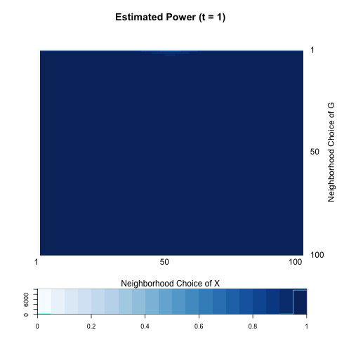
```
```{r, out.width = 400, out.height = 400, echo = FALSE, fig.align='center', fig.show='hold', out.extra='style="float:left"'}
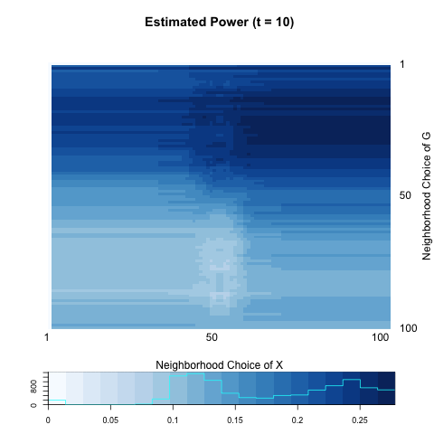
```
```{r, out.width = 400, out.height = 400, echo = FALSE, fig.align='center', fig.show='hold', out.extra='style="float:left"'}
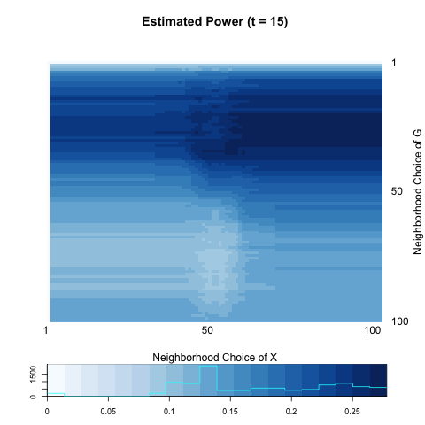
```
```{r, out.width = 400, out.height = 400, echo = FALSE, fig.align='center', fig.show='hold', out.extra='style="float:left"'}
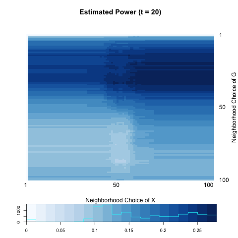
```


```{r echo = FALSE, results='asis'}
a <- c(0.992, 0.124, 0.126, 0.124)
b <- c(1.000, 0.278, 0.282, 0.284)

table <- matrix(0, nrow = 2, ncol = 4)
rownames(table) <- c("global test", "local optimal")
colnames(table) <- c("t=1",  "t=10", "t=15", "t=20")
table[1,] <- a
table[2,] <- b
table <- as.data.frame(table)
kable(table, align = 'c', digits = 2)
```


## Hierarhical Models with Latent Variable Dependent on Node Attributes

Now include node attributes $X$ into a latent model.

Assume that group (block) membership is a function of $X$, i.e. $Z \sim f(X).$
Suppose that nodes having similar value of $x_{i}$ are more likely to be in the same membership $z_{i}.$ 

- Generate iid node attribute.

$$X_{i} \overset{i.i.d}{\sim} f(X), i = 1,... , n$$

- Generate latent variables conditional on $X$.

$$Z_{i} | X_{i}  \overset{i.i.d}{\sim} Multinomial(1, \pi_{i1}, ... , \pi_{iK}), i = 1,... , n.$$

- Generate local dependent graph. 

$$P_{\theta}(Y = y | Z = z) = \prod\limits_{k} P_{\theta}(Y_{(kk)} = y_{(kk)} | Z = z) \times \prod\limits_{k < l} P_{\theta} (Y_{kl} = y_{kl} | Z = z)$$.


For simplicity, $Z = g(X)$ is a monotonically increasing function of $X.$ That is, nodes having smaller value of $X$ are more likely to be in small level of $Z.$ Under global dependence, we can expect that between-block probability $P_{\theta}(Y_{(kk)} = y_{(kk)} | Z = z)$ is strongest and off-diagonal probability $P_{\theta} (Y_{kl} = y_{kl} | Z = z)$ is non-increasing as distance between blocks increase. \color{red}{In two-block case, it is not difficult to find an example of global dependence}. 


$$P_{\theta}(Y = y | Z = z) \sim Bern \left[  \begin{array}{c|c} \color{red}{p} & q  \\ \hline q & \color{red}{p}  \end{array} \right]$$

As far as the distance $p > q,$ nodes having similar value in $X$ always have higher probability of edges between them. 

### [sim] LD.1
<a name=" LD.1"/>

$$X_{i} \overset{i.i.d}{\sim} N(0, 1), i = 1,... , 100$$

$$Z_{i} \sim  \left\{ \begin{array}{cc} Multinom(0.7, 0.3) & X_{i} \leq 0 \\ Multinom(0.3, 0.7) & X_{i} > 0 \end{array} \right.$$


$$P_{\theta}(Y = y | Z = z) \sim Bern \left[  \begin{array}{c|c} \color{red}{0.5} & 0.0  \\ \hline 0.0 & \color{red}{0.5}  \end{array} \right]$$


```{r, out.width = 400, out.height = 400, echo = FALSE, fig.align='center', fig.show='hold', out.extra='style="float:left"'}
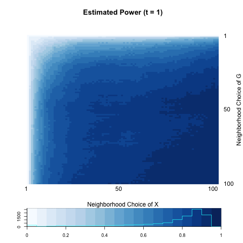
```
```{r, out.width = 400, out.height = 400, echo = FALSE, fig.align='center', fig.show='hold'}

```
```{r, out.width = 400, out.height = 400, echo = FALSE, fig.align='center', fig.show='hold', out.extra='style="float:left"'}
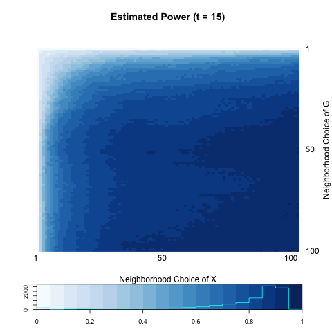
```
```{r, out.width = 400, out.height = 400, echo = FALSE, fig.align='center', fig.show='hold'}

```


```{r echo = FALSE, results='asis'}
a <- c(0.9400000, 0.9466667, 0.9566667, 0.9433333)
b <- c(0.9466667, 0.9566667, 0.9566667, 0.9566667)

table <- matrix(0, nrow = 2, ncol = 4)
rownames(table) <- c("global test", "local optimal")
colnames(table) <- c("t=1",  "t=10", "t=15", "t=20")
table[1,] <- a
table[2,] <- b
table <- as.data.frame(table)
kable(table, align = 'c', digits = 2)
```


On the other hand, in the case that the number of block lager than two, e.g. $K = 3:$


$$P_{\theta}(Y = y | Z = z) \sim Bern \left[  \begin{array}{c|c|c} \color{red}{p} & q & q  \\ \hline q & \color{red}{p} & q \\ \hline q & q & \color{red}{p}  \end{array} \right]$$

, even if $p > q,$ the probability of having edges between blocks is not proportional to the distance of group membership $|z_{i} - z_{j}|$, i.e. not proportional to the distribution of $X.$ 


### [sim] LD.2
<a name=" LD.2"/>

$$X_{i} \overset{i.i.d}{\sim} N(0, 1), i = 1,... , 150$$

$$Z_{i} \sim  \left\{ \begin{array}{cc} Multinom(\color{red}{0.5}, 0.25, 0.25) & X_{i} \leq -1 \\ Multinom(0.25, \color{red}{0.5}, 0.25) & -1< X_{i} \leq 1 \\ Multinom(0.25,0.25, \color{red}{0.5}) & X_{i} > 1 \end{array} \right.$$

$$P_{\theta}(Y = y | Z = z) \sim Bern \left[  \begin{array}{c|c|c} \color{red}{0.5} & 0.0 & 0.0  \\ \hline 0.0 & \color{red}{0.5} & 0.0 \\ \hline 0.0 & 0.0 & \color{red}{0.5}  \end{array} \right]$$


```{r, out.width = 400, out.height = 400, echo = FALSE, fig.align='center', fig.show='hold', out.extra='style="float:left"'}
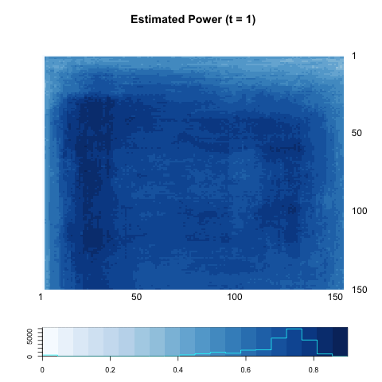
```
```{r, out.width = 400, out.height = 400, echo = FALSE, fig.align='center', fig.show='hold'}
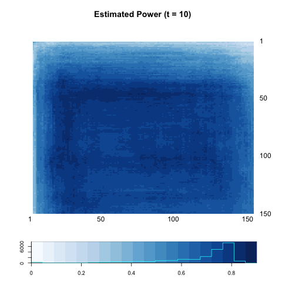
```
```{r, out.width = 400, out.height = 400, echo = FALSE, fig.align='center', fig.show='hold', out.extra='style="float:left"'}
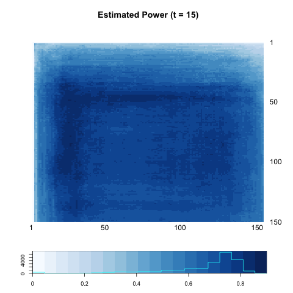
```
```{r, out.width = 400, out.height = 400, echo = FALSE, fig.align='center', fig.show='hold'}
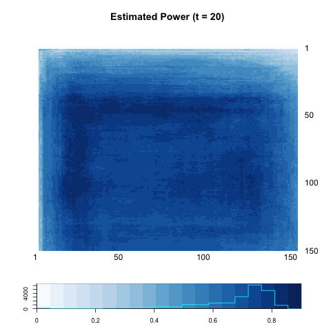
```


```{r echo = FALSE, results='asis'}
a <- c(0.58, 0.59, 0.56, 0.55)
b <- c(0.87, 0.86, 0.86, 0.86)

table <- matrix(0, nrow = 2, ncol = 4)
rownames(table) <- c("global test", "local optimal")
colnames(table) <- c("t=1",  "t=10", "t=15", "t=20")
table[1,] <- a
table[2,] <- b
table <- as.data.frame(table)
kable(table, align = 'c', digits = 2)
```

<hr />

Now fixing the between block probability as $q,$ we can still control the within probability. It is very likely that across different blocks, the probability of having edges may differ even though it is still higher than probability between blocks.

$$P_{\theta}(Y = y | Z = z) \sim Bern \left[  \begin{array}{c|c|c} \color{red}{p} & q & q  \\ \hline q & \color{blue}{r} & q \\ \hline q & q & \color{red}{p}  \end{array} \right]$$


### [sim] LD.3
<a name=" LD.3"/>

$$X_{i} \overset{i.i.d}{\sim} N(0, 1), i = 1,... , 150$$

$$Z_{i} \sim  \left\{ \begin{array}{cc} Multinom(\color{red}{0.5}, 0.25, 0.25) & X_{i} \leq -1 \\ Multinom(0.25, \color{red}{0.5}, 0.25) & -1< X_{i} \leq 1 \\ Multinom(0.25,0.25, \color{red}{0.5}) & X_{i} > 1 \end{array} \right.$$

$$P_{\theta}(Y = y | Z = z) \sim Bern \left[  \begin{array}{c|c|c} \color{red}{0.5} & 0.0 & 0.0  \\ \hline 0.0 & \color{blue}{0.2} & 0.0 \\ \hline 0.0 & 0.0 & \color{red}{0.5}  \end{array} \right]$$


```{r, out.width = 400, out.height = 400, echo = FALSE, fig.align='center', fig.show='hold', out.extra='style="float:left"'}
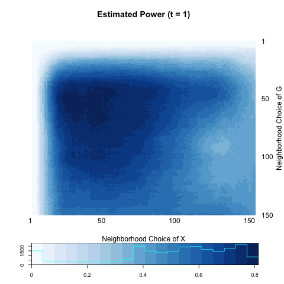
```
```{r, out.width = 400, out.height = 400, echo = FALSE, fig.align='center', fig.show='hold'}

```
```{r, out.width = 400, out.height = 400, echo = FALSE, fig.align='center', fig.show='hold', out.extra='style="float:left"'}
knitr::include_graphics("../figure/latent4_power15.png")
```
```{r, out.width = 400, out.height = 400, echo = FALSE, fig.align='center', fig.show='hold'}
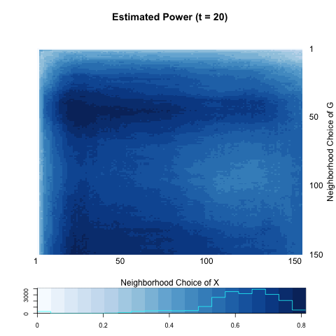
```


```{r echo = FALSE, results='asis'}
a <- c(0.4300000, 0.5966667, 0.5866667, 0.5800000)
b <- c(0.8133333, 0.8200000, 0.8100000, 0.8233333)

table <- matrix(0, nrow = 2, ncol = 4)
rownames(table) <- c("global test", "local optimal")
colnames(table) <- c("t=1",  "t=10", "t=15", "t=20")
table[1,] <- a
table[2,] <- b
table <- as.data.frame(table)
kable(table, align = 'c', digits = 2)
```


<hr />

Assume that between block probability differ between each pair of blocks, but still less than any other within-block probabilities. Consider the case where $p > r > q$. The probability of having edges between blocks is NOT monotonic to distribution of $X$.:

$$P_{\theta}(Y = y | Z = z) \sim Bern \left[  \begin{array}{c|c|c} \color{red}{p} & q & \color{blue}{r}  \\ \hline q & \color{red}{p} & q \\ \hline \color{blue}{r} & q & \color{red}{p}  \end{array} \right]$$

### [sim] LD.4
<a name=" LD.4"/>

$$X_{i} \overset{i.i.d}{\sim} N(0, 1), i = 1,... , 150$$

$$Z_{i} \sim  \left\{ \begin{array}{cc} Multinom(\color{red}{0.5}, 0.25, 0.25) & X_{i} \leq -1 \\ Multinom(0.25, \color{red}{0.5}, 0.25) & -1< X_{i} \leq 1 \\ Multinom(0.25,0.25, \color{red}{0.5}) & X_{i} > 1 \end{array} \right.$$

$$P_{\theta}(Y = y | Z = z) \sim Bern \left[  \begin{array}{c|c|c} \color{red}{0.5} & 0.0 & \color{blue}{0.2}  \\ \hline 0.0 & \color{red}{0.5} & 0.0 \\ \hline \color{blue}{0.2} & 0.0 & \color{red}{0.5}  \end{array} \right]$$


```{r, out.width = 400, out.height = 400, echo = FALSE, fig.align='center', fig.show='hold', out.extra='style="float:left"'}
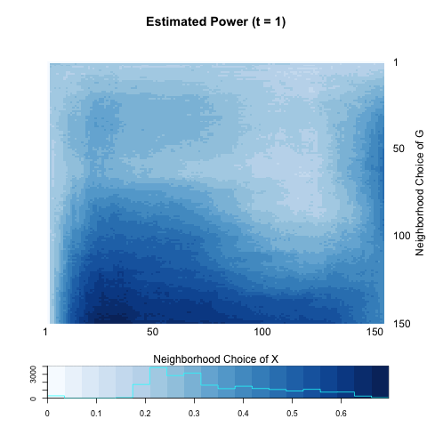
```
```{r, out.width = 400, out.height = 400, echo = FALSE, fig.align='center', fig.show='hold'}
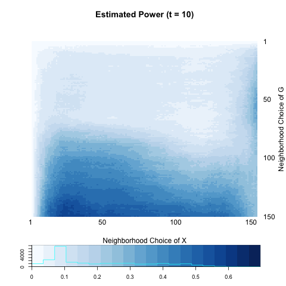
```
```{r, out.width = 400, out.height = 400, echo = FALSE, fig.align='center', fig.show='hold', out.extra='style="float:left"'}
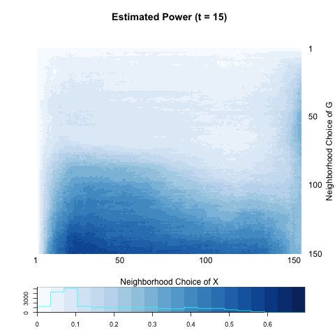
```
```{r, out.width = 400, out.height = 400, echo = FALSE, fig.align='center', fig.show='hold'}
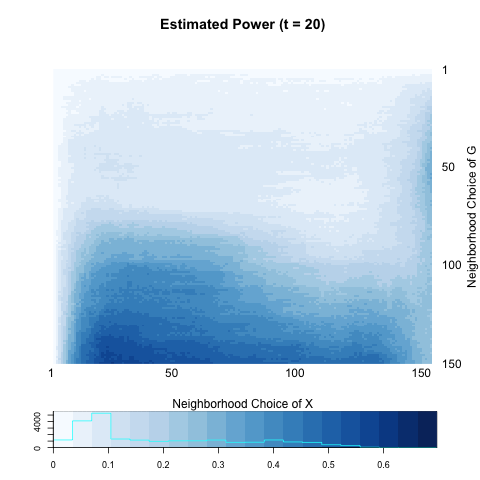
```


```{r echo = FALSE, results='asis'}
a <- c(0.4066667, 0.2500000, 0.2733333, 0.2500000)
b <- c(0.6966667, 0.5933333, 0.6000000, 0.5966667)

table <- matrix(0, nrow = 2, ncol = 4)
rownames(table) <- c("global test", "local optimal")
colnames(table) <- c("t=1",  "t=10", "t=15", "t=20")
table[1,] <- a
table[2,] <- b
table <- as.data.frame(table)
kable(table, align = 'c', digits = 2)
```


# Hypothesis
<a name=" Hypothesis"/>


For now I am assuming two big hypothesis.

## Local Dependence and Diffusion Distance

When the local dependence is strong, i.e. locally $X$ and $G$ are dependent each other in a way that $X$ and $G$ are only dependent wihtin the cluster, diffusion process is very likely to be stuck in dependent cluster. When the time spent on diffusion process is short, since distance measure does not measure distances outside of cluster, global testing is nearly the optimal. However, as time goes by, testing statistic which incorporates distance outside of clusters, has its optimal at local scale. This might imply that simple Euclidean distance, which resembles diffusion distance in short time, is likely to fail to detect the local dependence. 


## Local Dependence and Local Distance Correlation

When not all of individuals in the network is dependent on node attribute $X$, forming clusters, testing only small number of neighborhood would be beneficial. We can also consider a hierarchial, latent model where a latent variable, which determines block membership, is a function of node attributes $X$. Since the probability of having edges within-block is greater than that between-block, $G$ and $X$ are dependent through a latent variable $Z$. Optimality depends on the number of blocks and monotonicty of between-block probabilities (needs more clear explanation). 

