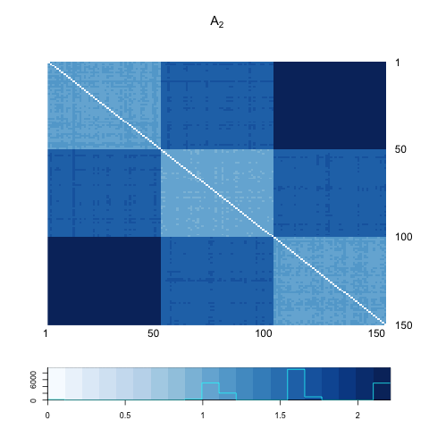
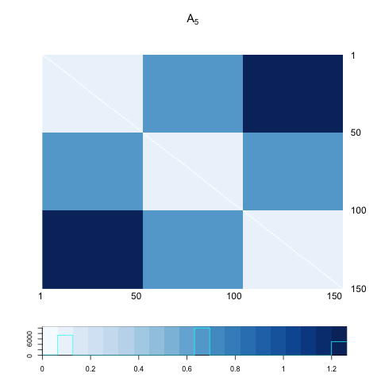
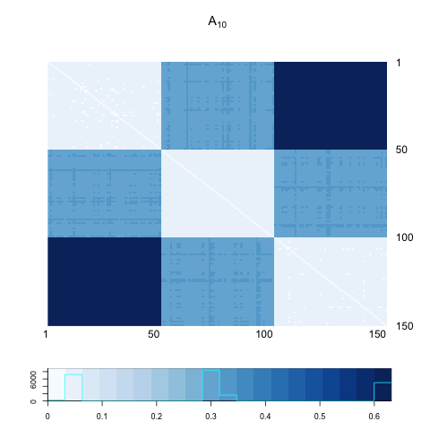
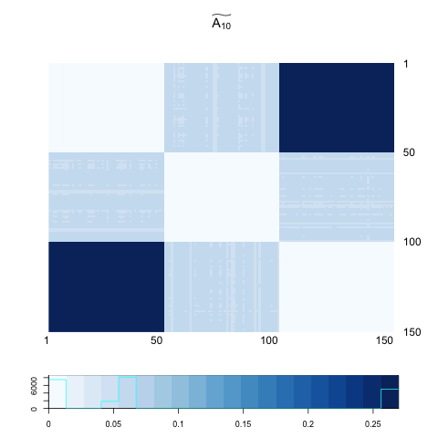
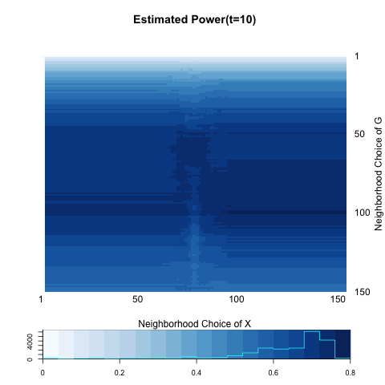

We are testing independence between network (graph) $G$ and its nodes' attributes $X$.

$$H_{0} : f_{GX} = f_{G} \cdot f_{X}$$

$$H_{A} : f_{GX} \neq f_{G} \cdot f_{X}$$

, where distribution of $G$ and $X$ depends on block membership $Z.$

$$Z_{i} = \left\{ \begin{array}{ll}  -1 & i \in \mbox{ block 1 } \\ 1 & i \in \mbox{ block 2} \\ 0 &   i \in \mbox{ block 3} \end{array} \right.$$

Generate a Bernoulli random variable which depends on block membership and a parameter $\omega.$

$$X_{i} \overset{i.i.d}{\sim} Bern(0.5 + z_{i} \omega)$$

An adjacency matrix of a graph $G \in \mathcal{G}(n ; p,q,r)$ is following:

$$Adj_{G} = \left[  \begin{array}{c|c|c} p & q  & r \\ \hline q & p & q \\ \hline r & q & p \end{array} \right]$$
Generate simple, undirected network $G \sim Adj_{G}.$ 

Test statistic which is used to measure the distances between two random variables $G \in \mathcal{G}(n; p,q,r)$ and $X \in \mathcal{R}$ is defined as follows for all pairs of $\{(k,l); k,l=1,..,n\}$:

$$dCorr_{kl}(G,X) = \frac{dCov_{kl}(G,X)}{\sqrt{dVar_{k}(G) \cdot dVar_{l}(X)}}$$
,where

$$dCov_{kl}(G,X) = \frac{1}{n^2} \sum\limits_{i,j}^{n} A^{H}_{ij} B^{H}_{ij} I(r(A_{ij}) < k) I(r(B_{ij}) < l )$$

$$dVar_{k}(G) = \frac{1}{n^2} \sum\limits_{i,j=1}^{n} A^{H}_{ij}A^{H}_{ij} I\big( r(A_{ij}) < k \big)$$

$$dVar_{k}(X) = \frac{1}{n^2} \sum\limits_{i,j=1}^{n} B^{H}_{ij}B^{H}_{ij} I\big( r(B_{ij}) < k \big)$$

where $A^{H} = HAH; A_{ij} = \parallel G_{i} - G_{j} \parallel ; H = I_{n} - J_{n} / n;$ $r(A_{ij}) = k$ if and only if $A_{ij}$ is the $k^{th}$ smallest distance in $\{ A_{ij} ; i,j=1,..,n , i \neq j \}.$


The critical value of the test is based on the prespecified Type-I error $\alpha = 0.05$. P-value for each iteration is obtained through permutation.

The testing power of local distance correlation equals to the best power among all of the local family. What we call \color{red}{global test} refers to the test when $k=l=n,$ i.e. a test including all ranges of neighborhood. On the other hand, \color{red}{local optimal} is a test of highest power.


```{r echo=FALSE, message =FALSE, warning = FALSE}
library(igraph)
library(RefManageR)
library(xtable)
library(grid)
library(ggplot2)
library(png)
library(grid)
library(knitr)
bib <- ReadBib(system.file("Bib", "biblatexExamples.bib", 
                           package = "RefManageR"), check = FALSE)
BibOptions(check.entries = FALSE, style = "markdown", bib.style = "alphabetic", cite.style = 'alphabetic')
```


- [Graph Generation](# Graph Generation)

- [Flow Chart](# Flow Chart)

- [Power Heatmap](# Power Heatmap)

- [Interpretaion](# Interpretation)

## Graph Generation
<a name=" Graph Generation"/>

Set $n=150$ ; $p = 0.30$ ; $q = 0.05; \omega= 0.15.$

$$X_{i} = \left\{ \begin{array}{ll}  Bern(0.35) & i \in \mbox{ block 1 } \\ Bern(0.65) & i \in \mbox{ block 2} \\ Bern(0.50) &   i \in \mbox{ block 3} \end{array} \right.$$


$$Adj_{G} = \left[  \begin{array}{c|c|c} 0.30 & 0.05  & 0^{*} \\ \hline 0.05 & 0.30 & 0.05 \\ \hline 0^{*} & 0.05 & 0.30 \end{array} \right]$$

To make sure $G$ is connected, $0^{*}$ could be very slightly larger than 0.


```{r, out.width = 400, out.height = 400, echo = FALSE, fig.align='center', fig.show='hold', out.extra='style="float:left"'}

```
```{r, out.width = 400, out.height = 400, echo = FALSE, fig.align='center', fig.show='hold'}

```


## Flow Chart
<a name=" Flow Chart"/>

### t = 1

```{r, out.width = 200, out.height = 200, echo = FALSE, fig.align='center', fig.show='hold', out.extra='style="float:left"'}
knitr::include_graphics("../figure/local12_A1.png")
```
```{r, out.width = 200, out.height = 200, echo = FALSE, fig.align='center', fig.show='hold', out.extra='style="float:left"'}

```
```{r, out.width = 200, out.height = 200, echo = FALSE, fig.align='center', fig.show='hold', out.extra='style="float:left"'}
knitr::include_graphics("../figure/local12_B.png")
```
```{r, out.width = 200, out.height = 200, echo = FALSE, fig.align='center', fig.show='hold', out.extra='style="float:left"'}
knitr::include_graphics("../figure/local12_HBH.png")
```


```{r, out.width = 300, out.height = 300, echo = FALSE, fig.align='center', fig.show='hold', out.extra='style="float:left"'}

```
```{r, out.width = 300, out.height = 300, echo = FALSE, fig.align='center', fig.show='hold'}

```

<hr />

```{r, out.width = 300, out.height = 300, echo = FALSE, fig.align='center', fig.show='hold', out.extra='style="float:left"'}

```
```{r, out.width = 300, out.height = 300, echo = FALSE, fig.align='center', fig.show='hold'}
knitr::include_graphics("../figure/local12_1.png")
```


### t = 2

```{r, out.width = 200, out.height = 200, echo = FALSE, fig.align='center', fig.show='hold', out.extra='style="float:left"'}

```
```{r, out.width = 200, out.height = 200, echo = FALSE, fig.align='center', fig.show='hold', out.extra='style="float:left"'}

```

```{r, out.width = 200, out.height = 200, echo = FALSE, fig.align='center', fig.show='hold', out.extra='style="float:left"'}
knitr::include_graphics("../figure/local12_B.png")
```
```{r, out.width = 200, out.height = 200, echo = FALSE, fig.align='center', fig.show='hold', out.extra='style="float:left"'}
knitr::include_graphics("../figure/local12_HBH.png")
```


<hr />

```{r, out.width = 300, out.height = 300, echo = FALSE, fig.align='center', fig.show='hold', out.extra='style="float:left"'}

```
```{r, out.width = 300, out.height = 300, echo = FALSE, fig.align='center', fig.show='hold'}

```

<hr />

```{r, out.width = 300, out.height = 300, echo = FALSE, fig.align='center', fig.show='hold', out.extra='style="float:left"'}

```
```{r, out.width = 300, out.height = 300, echo = FALSE, fig.align='center', fig.show='hold'}
knitr::include_graphics("../figure/local12_2.png")
```


### t = 5

```{r, out.width = 200, out.height = 200, echo = FALSE, fig.align='center', fig.show='hold', out.extra='style="float:left"'}

```
```{r, out.width = 200, out.height = 200, echo = FALSE, fig.align='center', fig.show='hold', out.extra='style="float:left"'}

```

```{r, out.width = 200, out.height = 200, echo = FALSE, fig.align='center', fig.show='hold', out.extra='style="float:left"'}
knitr::include_graphics("../figure/local12_B.png")
```
```{r, out.width = 200, out.height = 200, echo = FALSE, fig.align='center', fig.show='hold', out.extra='style="float:left"'}
knitr::include_graphics("../figure/local12_HBH.png")
```


<hr />

```{r, out.width = 300, out.height = 300, echo = FALSE, fig.align='center', fig.show='hold', out.extra='style="float:left"'}

```
```{r, out.width = 300, out.height = 300, echo = FALSE, fig.align='center', fig.show='hold'}

```

<hr />

```{r, out.width = 300, out.height = 300, echo = FALSE, fig.align='center', fig.show='hold', out.extra='style="float:left"'}

```
```{r, out.width = 300, out.height = 300, echo = FALSE, fig.align='center', fig.show='hold'}
knitr::include_graphics("../figure/local12_5.png")
```


### t = 10

```{r, out.width = 200, out.height = 200, echo = FALSE, fig.align='center', fig.show='hold', out.extra='style="float:left"'}

```
```{r, out.width = 200, out.height = 200, echo = FALSE, fig.align='center', fig.show='hold', out.extra='style="float:left"'}

```

```{r, out.width = 200, out.height = 200, echo = FALSE, fig.align='center', fig.show='hold', out.extra='style="float:left"'}
knitr::include_graphics("../figure/local12_B.png")
```
```{r, out.width = 200, out.height = 200, echo = FALSE, fig.align='center', fig.show='hold', out.extra='style="float:left"'}
knitr::include_graphics("../figure/local12_HBH.png")
```


<hr />

```{r, out.width = 300, out.height = 300, echo = FALSE, fig.align='center', fig.show='hold', out.extra='style="float:left"'}

```
```{r, out.width = 300, out.height = 300, echo = FALSE, fig.align='center', fig.show='hold'}

```

<hr />

```{r, out.width = 300, out.height = 300, echo = FALSE, fig.align='center', fig.show='hold', out.extra='style="float:left"'}

```
```{r, out.width = 300, out.height = 300, echo = FALSE, fig.align='center', fig.show='hold'}

```


### t = 20

```{r, out.width = 200, out.height = 200, echo = FALSE, fig.align='center', fig.show='hold', out.extra='style="float:left"'}
knitr::include_graphics("../figure/local12_A20.png")
```
```{r, out.width = 200, out.height = 200, echo = FALSE, fig.align='center', fig.show='hold', out.extra='style="float:left"'}

```

```{r, out.width = 200, out.height = 200, echo = FALSE, fig.align='center', fig.show='hold', out.extra='style="float:left"'}
knitr::include_graphics("../figure/local12_B.png")
```
```{r, out.width = 200, out.height = 200, echo = FALSE, fig.align='center', fig.show='hold', out.extra='style="float:left"'}
knitr::include_graphics("../figure/local12_HBH.png")
```


<hr />

```{r, out.width = 300, out.height = 300, echo = FALSE, fig.align='center', fig.show='hold', out.extra='style="float:left"'}

```
```{r, out.width = 300, out.height = 300, echo = FALSE, fig.align='center', fig.show='hold'}

```

<hr />

```{r, out.width = 300, out.height = 300, echo = FALSE, fig.align='center', fig.show='hold', out.extra='style="float:left"'}

```
```{r, out.width = 300, out.height = 300, echo = FALSE, fig.align='center', fig.show='hold'}
knitr::include_graphics("../figure/local12_20.png")
```


## Power Heatmap
<a name=" Power Heatmap"/>


```{r, out.width = 300, out.height = 300, echo = FALSE, fig.align='center', fig.show='hold', out.extra='style="float:left"'}
knitr::include_graphics("../figure/local12_1.png")
```
```{r, out.width = 300, out.height = 300, echo = FALSE, fig.align='center', fig.show='hold', out.extra='style="float:left"'}
knitr::include_graphics("../figure/local12_2.png")
```
```{r, out.width = 300, out.height = 300, echo = FALSE, fig.align='center', fig.show='hold'}
knitr::include_graphics("../figure/local12_5.png")
```

```{r, out.width = 300, out.height = 300, echo = FALSE, fig.align='center', fig.show='hold', out.extra='style="float:left"'}

```
```{r, out.width = 300, out.height = 300, echo = FALSE, fig.align='center', fig.show='hold'}
knitr::include_graphics("../figure/local12_20.png")
```


```{r echo = FALSE, results='asis'}
a <- c(0.6266667, 0.6166667, 0.5933333, 0.5433333, 0.5633333)
b <- c(0.6900000, 0.7566667, 0.7600000, 0.7700000, 0.7500000)

table <- matrix(0, nrow = 2, ncol = 5)
rownames(table) <- c("global test", "local optimal")
colnames(table) <- c("t=1", "t=2", "t=5", "t=10", "t=20")
table[1,] <- a
table[2,] <- b
table <- as.data.frame(table)
kable(table, align = 'c', digits = 2)
```

## Interpretation
<a name=" Interpretation"/>

- Change in diffusion distance matrix $A:$


```{r, out.width = 300, out.height = 300, echo = FALSE, fig.align='center', fig.show='hold', out.extra='style="float:left"'}
knitr::include_graphics("../figure/local12_A1.png")
```
```{r, out.width = 300, out.height = 300, echo = FALSE, fig.align='center', fig.show='hold', out.extra='style="float:left"'}

```
```{r, out.width = 300, out.height = 300, echo = FALSE, fig.align='center', fig.show='hold', out.extra='style="float:left"'}

```
```{r, out.width = 300, out.height = 300, echo = FALSE, fig.align='center', fig.show='hold', out.extra='style="float:left"'}

```
```{r, out.width = 300, out.height = 300, echo = FALSE, fig.align='center', fig.show='hold'}
knitr::include_graphics("../figure/local12_A20.png")
```


- Change in double-centered diffusion distance matrix $\tilde{A}:$


```{r, out.width = 300, out.height = 300, echo = FALSE, fig.align='center', fig.show='hold', out.extra='style="float:left"'}

```
```{r, out.width = 300, out.height = 300, echo = FALSE, fig.align='center', fig.show='hold', out.extra='style="float:left"'}

```
```{r, out.width = 300, out.height = 300, echo = FALSE, fig.align='center', fig.show='hold', out.extra='style="float:left"'}

```
```{r, out.width = 300, out.height = 300, echo = FALSE, fig.align='center', fig.show='hold', out.extra='style="float:left"'}

```
```{r, out.width = 300, out.height = 300, echo = FALSE, fig.align='center', fig.show='hold'}

```


```{r echo = FALSE, results='asis'}
a <- c(98, 100, 100, 100, 101)
b <- c("92-150", "92-150", "92-150", "92,93", "92,93")

table <- matrix(0, nrow = 2, ncol = 5)
rownames(table) <- c("k*","l*")
colnames(table) <- c("t=1", "t=2", "t=5", "t=10", "t=20")
table[1,] <- a
table[2,] <- b
table <- as.data.frame(table)
kable(table, align = 'c')
```


