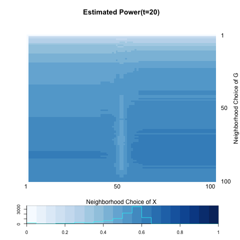

Throughout all the simulations, we are testing independence between network (graph) $G$ and its nodes' attributes $X$.

$$H_{0} : f_{GX} = f_{G} \cdot f_{X}$$

$$H_{A} : f_{GX} \neq f_{G} \cdot f_{X}$$

, where distribution of $G$ and $X$ depends on block membership $Z.$

$$Z_{i} = \left\{ \begin{array}{ll}  -1 & i \in \mbox{ block 1 } \\ 1 & i \in \mbox{ block 2} \end{array} \right.$$

Then node attribute $X$ follows such Bernoulli distribution:

$$X_{i} \overset{i.i.d}{\sim} Bern(0.5 + z_{i} \omega)$$

Note that larger value of $\omega$ implies much discrepency between blocks. The probability of having an edge also depends on the block membership.

$$Adj_{G} = \left[  \begin{array}{c|c} p & q \\ \hline q & q \end{array} \right]$$

Generate simple, undirected network $G \sim Adj.$ 

Test statistic which is used to measure the distances between two random variables $G \in \mathcal{G}(n; p,q)$ and $X \in \mathcal{R}$ is defined as follows for all pairs of $\{(k,l); k,l=1,..,n\}$:

$$dCorr_{kl}(G,X) = \frac{dCov_{kl}(G,X)}{\sqrt{dVar_{k}(G) \cdot dVar_{l}(X)}}$$
,where

$$dCov_{kl}(G,X) = \frac{1}{n^2} \sum\limits_{i,j}^{n} A^{H}_{ij} B^{H}_{ij} I(r(A_{ij}) < k) I(r(B_{ij}) < l )$$

$$dVar_{k}(G) = \frac{1}{n^2} \sum\limits_{i,j=1}^{n} A^{H}_{ij}A^{H}_{ij} I\big( r(A_{ij}) < k \big)$$

$$dVar_{k}(X) = \frac{1}{n^2} \sum\limits_{i,j=1}^{n} B^{H}_{ij}B^{H}_{ij} I\big( r(B_{ij}) < k \big)$$


where $A^{H} = HAH; A_{ij} = \parallel G_{i} - G_{j} \parallel ; H = I_{n} - J_{n} / n;$ $r(A_{ij}) = k$ if and only if $A_{ij}$ is the $k^{th}$ smallest distance in $\{ A_{ij} ; i,j=1,..,n , i \neq j \}.$


The critical value of the test is based on the prespecified Type-I error $\alpha = 0.05$. P-value for each iteration is obtained through permutation.

The testing power of local distance correlation equals to the best power among all of the local family. What we call \color{red}{global test} refers to the test when $k=l=n,$ i.e. a test including all ranges of neighborhood. On the other hand, \color{red}{local optimal} is a test of highest power.


```{r echo=FALSE, message =FALSE, warning = FALSE}
library(igraph)
library(RefManageR)
library(xtable)
library(grid)
library(ggplot2)
library(png)
library(grid)
library(knitr)
bib <- ReadBib(system.file("Bib", "biblatexExamples.bib", 
                           package = "RefManageR"), check = FALSE)
BibOptions(check.entries = FALSE, style = "markdown", bib.style = "alphabetic", cite.style = 'alphabetic')
```


- [Graph Generation](# Graph Generation)

- [Flow Chart](# Flow Chart)

- [Power Heatmap](# Power Heatmap)

- [Interpretation](# Interpretation)

## Graph Generation
<a name=" Graph Generation"/>

Set $n=100$ ; $p = 0.3$ ; $q = 0.05; \omega= 0.20.$

$$X_{i} \sim \left\{ \begin{array}{ll}  Bern(0.3) & i \in \mbox{ block 1 } \\ Bern(0.7) & i \in \mbox{ block 2} \end{array} \right.$$


$$Adj_{G} = \left[  \begin{array}{c|c} 0.3 & 0.05 \\ \hline 0.05 & 0.05 \end{array} \right]$$


```{r, out.width = 400, out.height = 400, echo = FALSE, fig.align='center', fig.show='hold', out.extra='style="float:left"'}
knitr::include_graphics("../figure/tblock1_net.png")
```
```{r, out.width = 400, out.height = 400, echo = FALSE, fig.align='center', fig.show='hold'}
knitr::include_graphics("../figure/tblock1_att.png")
```


## Flow Chart
<a name=" Flow Chart"/>

### t = 1

```{r, out.width = 200, out.height = 200, echo = FALSE, fig.align='center', fig.show='hold', out.extra='style="float:left"'}
knitr::include_graphics("../figure/tblock1_A1.png")
```
```{r, out.width = 200, out.height = 200, echo = FALSE, fig.align='center', fig.show='hold', out.extra='style="float:left"'}
knitr::include_graphics("../figure/tblock1_HA1H.png")
```
```{r, out.width = 200, out.height = 200, echo = FALSE, fig.align='center', fig.show='hold', out.extra='style="float:left"'}

```
```{r, out.width = 200, out.height = 200, echo = FALSE, fig.align='center', fig.show='hold', out.extra='style="float:left"'}

```


```{r, out.width = 300, out.height = 300, echo = FALSE, fig.align='center', fig.show='hold', out.extra='style="float:left"'}

```
```{r, out.width = 300, out.height = 300, echo = FALSE, fig.align='center', fig.show='hold'}

```

<hr />

```{r, out.width = 300, out.height = 300, echo = FALSE, fig.align='center', fig.show='hold', out.extra='style="float:left"'}
knitr::include_graphics("../figure/tblock1_P1.png")
```
```{r, out.width = 300, out.height = 300, echo = FALSE, fig.align='center', fig.show='hold'}

```


### t = 2

```{r, out.width = 200, out.height = 200, echo = FALSE, fig.align='center', fig.show='hold', out.extra='style="float:left"'}

```
```{r, out.width = 200, out.height = 200, echo = FALSE, fig.align='center', fig.show='hold', out.extra='style="float:left"'}

```

```{r, out.width = 200, out.height = 200, echo = FALSE, fig.align='center', fig.show='hold', out.extra='style="float:left"'}

```
```{r, out.width = 200, out.height = 200, echo = FALSE, fig.align='center', fig.show='hold', out.extra='style="float:left"'}

```


<hr />

```{r, out.width = 300, out.height = 300, echo = FALSE, fig.align='center', fig.show='hold', out.extra='style="float:left"'}

```
```{r, out.width = 300, out.height = 300, echo = FALSE, fig.align='center', fig.show='hold'}

```

<hr />

```{r, out.width = 300, out.height = 300, echo = FALSE, fig.align='center', fig.show='hold', out.extra='style="float:left"'}

```
```{r, out.width = 300, out.height = 300, echo = FALSE, fig.align='center', fig.show='hold'}

```


### t = 5

```{r, out.width = 200, out.height = 200, echo = FALSE, fig.align='center', fig.show='hold', out.extra='style="float:left"'}

```
```{r, out.width = 200, out.height = 200, echo = FALSE, fig.align='center', fig.show='hold', out.extra='style="float:left"'}

```

```{r, out.width = 200, out.height = 200, echo = FALSE, fig.align='center', fig.show='hold', out.extra='style="float:left"'}

```
```{r, out.width = 200, out.height = 200, echo = FALSE, fig.align='center', fig.show='hold', out.extra='style="float:left"'}

```


<hr />

```{r, out.width = 300, out.height = 300, echo = FALSE, fig.align='center', fig.show='hold', out.extra='style="float:left"'}

```
```{r, out.width = 300, out.height = 300, echo = FALSE, fig.align='center', fig.show='hold'}

```

<hr />

```{r, out.width = 300, out.height = 300, echo = FALSE, fig.align='center', fig.show='hold', out.extra='style="float:left"'}

```
```{r, out.width = 300, out.height = 300, echo = FALSE, fig.align='center', fig.show='hold'}

```


### t = 10

```{r, out.width = 200, out.height = 200, echo = FALSE, fig.align='center', fig.show='hold', out.extra='style="float:left"'}

```
```{r, out.width = 200, out.height = 200, echo = FALSE, fig.align='center', fig.show='hold', out.extra='style="float:left"'}

```

```{r, out.width = 200, out.height = 200, echo = FALSE, fig.align='center', fig.show='hold', out.extra='style="float:left"'}

```
```{r, out.width = 200, out.height = 200, echo = FALSE, fig.align='center', fig.show='hold', out.extra='style="float:left"'}

```


<hr />

```{r, out.width = 300, out.height = 300, echo = FALSE, fig.align='center', fig.show='hold', out.extra='style="float:left"'}

```
```{r, out.width = 300, out.height = 300, echo = FALSE, fig.align='center', fig.show='hold'}

```

<hr />

```{r, out.width = 300, out.height = 300, echo = FALSE, fig.align='center', fig.show='hold', out.extra='style="float:left"'}

```
```{r, out.width = 300, out.height = 300, echo = FALSE, fig.align='center', fig.show='hold'}

```


### t = 20

```{r, out.width = 200, out.height = 200, echo = FALSE, fig.align='center', fig.show='hold', out.extra='style="float:left"'}
knitr::include_graphics("../figure/tblock1_A20.png")
```
```{r, out.width = 200, out.height = 200, echo = FALSE, fig.align='center', fig.show='hold', out.extra='style="float:left"'}

```

```{r, out.width = 200, out.height = 200, echo = FALSE, fig.align='center', fig.show='hold', out.extra='style="float:left"'}

```
```{r, out.width = 200, out.height = 200, echo = FALSE, fig.align='center', fig.show='hold', out.extra='style="float:left"'}

```


<hr />

```{r, out.width = 300, out.height = 300, echo = FALSE, fig.align='center', fig.show='hold', out.extra='style="float:left"'}

```
```{r, out.width = 300, out.height = 300, echo = FALSE, fig.align='center', fig.show='hold'}

```

<hr />

```{r, out.width = 300, out.height = 300, echo = FALSE, fig.align='center', fig.show='hold', out.extra='style="float:left"'}

```
```{r, out.width = 300, out.height = 300, echo = FALSE, fig.align='center', fig.show='hold'}

```


## Power Heatmap
<a name=" Power Heatmap"/>


```{r, out.width = 300, out.height = 300, echo = FALSE, fig.align='center', fig.show='hold', out.extra='style="float:left"'}

```
```{r, out.width = 300, out.height = 300, echo = FALSE, fig.align='center', fig.show='hold', out.extra='style="float:left"'}

```
```{r, out.width = 300, out.height = 300, echo = FALSE, fig.align='center', fig.show='hold'}

```

```{r, out.width = 300, out.height = 300, echo = FALSE, fig.align='center', fig.show='hold', out.extra='style="float:left"'}

```
```{r, out.width = 300, out.height = 300, echo = FALSE, fig.align='center', fig.show='hold'}

```


```{r echo = FALSE, results='asis'}
a <- c(0.9133333, 0.9166667, 0.8200000, 0.6866667, 0.5933333)
b <- c(0.9566667, 0.9300000, 0.8533333, 0.7200000, 0.6333333)

table <- matrix(0, nrow = 2, ncol = 5)
rownames(table) <- c("global test", "local optimal")
colnames(table) <- c("t=1", "t=2", "t=5", "t=10", "t=20")
table[1,] <- a
table[2,] <- b
table <- as.data.frame(table)
kable(table, align = 'c', digits = 2)
```

## Interpretation
<a name=" Interpretation"/>

